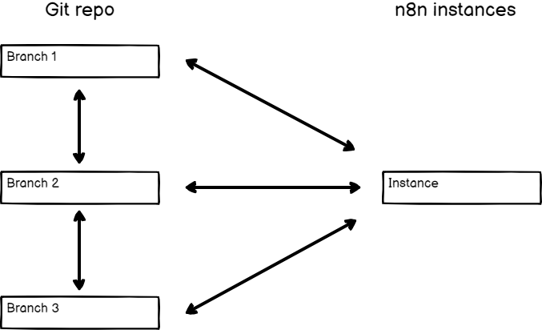
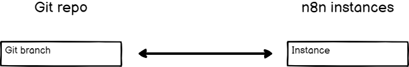

# Branch patterns 

The relationship between n8n instances and Git branches is flexible. You can create different setups depending on your needs. 



## Multiple instances, multiple branches 

This pattern involves having multiple n8n instances, each one linked to its own branch. 

You can use this pattern for environments. For example, create two n8n instances, development and production. Link them to their own branches. Push work from your development instance to its branch, do a pull request to move work to the production branch, then pull to the production instance.



## Multiple instances, one branch 

Use this pattern if you want the same workflows, tags, and variables everywhere, but want to use them in different n8n instances. 

You can use this pattern for environments. For example, create two n8n instances, development and production. Link them both to the same branch. Push work from development, and pull it into production.

This pattern is also useful when testing a new version of n8n: you can create a new n8n instance with the new version, connect it to the Git branch and test it, while your production instance remains on the older version until you're confident it's safe to upgrade.



## One instance, multiple branches 

The instance owner can change which Git branch connects to the instance. The full setup in this case is likely to be a [Multiple instances, multiple branches](#multiple-instances-multiple-branches) pattern, but with one instance switching between branches.

This is useful to review work. For example, different users could work on their own instance and push to their own branch. The reviewer could work in a review instance, and switch between branches to load work from different users.


**No cleanup**

n8n doesn't clean up the existing contents of an instance when changing branches. Switching branches in this pattern results in all the workflows from each branch being in your instance.


## One instance, one branch 

This is the simplest pattern.

