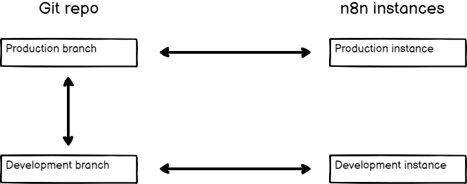
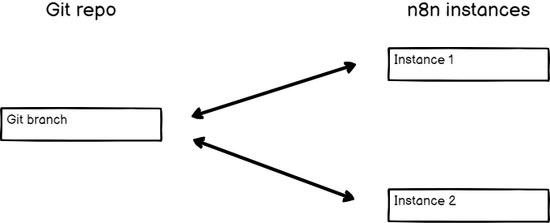

# Tutorial: Create environments with source control 



This tutorial walks through the process of setting up environments end-to-end. You'll create two environments: development and production. It uses GitHub as the Git provider. The process is similar for other providers. 

n8n has built its environments feature on top of Git, a version control software. You link an n8n instance to a Git branch, and use a push-pull pattern to move work between environments. You should have some understanding of environments and Git. If you need more information on these topics, refer to:

* [Environments in n8n](work-with-environments.md): the purpose of environments, and how they work in n8n. 
* [Git and n8n](use-git-in-n8n.md): Git concepts and source control in n8n.

## Choose your source control pattern 

Before setting up source control and environments, you need to plan your environments, and how they relate to Git branches. n8n supports different [Branch patterns](choose-branching-patterns.md). For environments, you need to choose between two patterns: multi-instance, multi-branch, or multi-instance, single-branch. This tutorial covers both patterns.



### Multiple instances, multiple branches 



### Multiple instances, one branch 



## Set up your repository 

Once you've chosen your pattern, you need to set up your GitHub repository.



1. [Create a new repository](https://docs.github.com/en/repositories/creating-and-managing-repositories/creating-a-new-repository). 
    * Make sure the repository is private, unless you want your workflows, tags, and variable and credential stubs exposed to the internet.
    * Create the new repository with a README so you can immediately create branches. 
1. Create one branch named `production` and another named `development`. Refer to [Creating and deleting branches within your repository](https://docs.github.com/en/pull-requests/collaborating-with-pull-requests/proposing-changes-to-your-work-with-pull-requests/creating-and-deleting-branches-within-your-repository) for guidance.



[Create a new repository](https://docs.github.com/en/repositories/creating-and-managing-repositories/creating-a-new-repository). 

  * Make sure the repository is private, unless you want your workflows, tags, and variable and credential stubs exposed to the internet.  
  * Create the new repository with a README. This creates the `main` branch, which you'll connect to. 		



## Connect your n8n instances to your repository 

Create two n8n instances, one for development, one for production. 

### Configure Git in n8n 



### Set up a deploy key 

Set up SSH access by creating a deploy key for the repository using the SSH key from n8n. The key must have write access. Refer to [GitHub | Managing deploy keys](https://docs.github.com/en/authentication/connecting-to-github-with-ssh/managing-deploy-keys) for guidance.

### Connect n8n and configure your instance 



1. In **Settings** > **Environments** in n8n, select **Connect**. n8n connects to your Git repository.
1. Under **Instance settings**, choose which branch you want to use for the current n8n instance. Connect the production branch to the production instance, and the development branch to the development instance.
1. Production instance only: select **Protected instance** to prevent users editing workflows in this instance.
1. Select **Save settings**.



1. In **Settings** > **Environments** in n8n, select **Connect**. 
  1. Under **Instance settings**, select the main branch.
1. Production instance only: select **Protected instance** to prevent users editing workflows in this instance.
1. Select **Save settings**.



## Push work from development 

In your development instance, create a few workflows, tags, variables, and credentials.



## Pull work to production 

Your work is now in GitHub. If you're using a multi-branch setup, it's on the development branch. If you chose the single-branch setup, it's on main.



1. In GitHub, create a pull request to merge development into production.
1. Merge the pull request.
1. In your production instance, select **Pull**  in the main menu.



In your production instance, select **Pull**  in the main menu.





### Optional: Use a GitHub Action to automate pulls 

If you want to avoid logging in to your production instance to pull, you can use a [GitHub Action](https://docs.github.com/en/actions/creating-actions/about-custom-actions) and the [n8n API](https://app.gitbook.com/s/r7wKI4I1BgdBCuq5Cvcx/n8n-api) to automatically pull every time you push new work to your production or main branch.



## Next steps 

Learn more about:

* [Environments in n8n](work-with-environments.md) and [Git and n8n](use-git-in-n8n.md)
* [Source control patterns](choose-branching-patterns.md)
