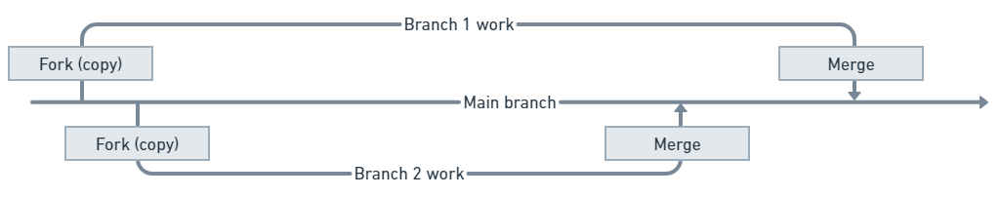

# Git and n8n 

n8n uses Git to provide source control. To use this feature, it helps to have some knowledge of basic Git concepts. n8n doesn't implement all Git functionality: you shouldn't view n8n's source control as full version control.


**New to Git and source control?**

If you're new to Git, don't panic. You don't need to learn Git to use n8n. This document explains the concepts you need. You do need some Git knowledge to set up the source control, as this involves work in your Git provider.


**Familiar with Git and source control?**

If you're familiar with Git, don't rely on behaviors matching exactly. In particular, be aware that source control in n8n doesn't support a pull request-style review and merge process, unless you do this outside n8n in your Git provider.


This page introduces the Git concepts and terminology used in n8n. It doesn't cover everything you need to set up and manage a repository. The person doing the [Setup](set-up-source-control.md) should have some familiarity with Git and with their Git hosting provider.


**This is a brief introduction**

Git is a complex topic. This section provides a brief introduction to the key terms you need when using environments in n8n. If you want to learn about Git in depth, refer to [GitHub | Git and GitHub learning resources](https://docs.github.com/en/get-started/quickstart/git-and-github-learning-resources).

## Git overview 

[Git](https://git-scm.com/) is a tool for managing, tracking, and collaborating on multiple versions of documents. It's the basis for widely used platforms such as [GitHub](https://github.com/) and [GitLab](https://about.gitlab.com/).

## Branches: Multiple copies of a project 

Git uses branches to maintain multiple copies of a document alongside each other. Every branch has its own version. A common pattern is to have a main branch, and then everyone who wants to contribute to the project works on their own branch (copy). When they finish their work, their branch is merged back into the main branch.

## Local and remote: Moving work between your machine and a Git provider 

A common pattern when using Git is to install Git on your own computer, and use a Git provider such as GitHub to work with Git in the cloud. In effect, you have a Git repository (project) on GitHub, and work with copies of it on your local machine.

n8n uses this pattern for source control: you'll work with your workflows on your n8n instance, but send them to your Git provider to store them.

## Push, pull, and commit 

n8n uses three key Git processes:

* **Push**: send work from your instance to Git. This saves a copy of your workflows and tags, as well as credential and variable stubs, to Git. You can choose which workflows you want to save.
* **Pull**: get the workflows, tags, and variables from Git and load it into n8n. You will need to populate any credentials or variable stubs included in the refreshed items. 

    

<strong>Pulling overwrites your work</strong>

If you have made changes to a workflow in n8n, you must push the changes to Git before pulling. When you pull, it overwrites any changes you've made if they aren't stored in Git.

		
* **Commit**: a commit in n8n is a single occurrence of pushing work to Git. In n8n, commit and push happen at the same time.

Refer to [Push and pull](push-and-pull-changes.md) for detailed information about how n8n interacts with Git.
