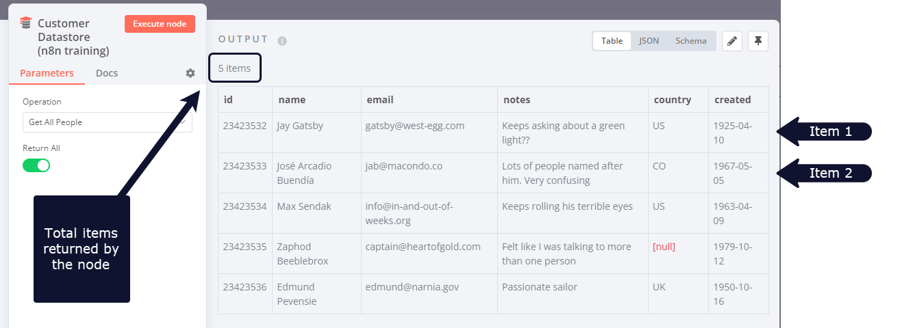
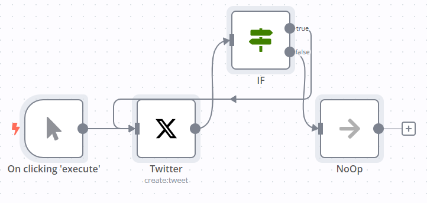

# Looping in n8n 

Looping is useful when you want to process multiple items or perform an action repeatedly, such as sending a message to every contact in your address book. n8n handles this repetitive processing automatically, meaning you don't need to specifically build loops into your workflows. There are [some nodes](#node-exceptions) where this isn't true.

## Using loops in n8n 

n8n nodes take any number of items as input, process these items, and output the results. You can think of each item as a single data point, or a single row in the output table of a node.

Nodes usually run once for each item. For example, if you wanted to send the name and notes of the customers in the Customer Datastore node as a message on Slack, you would:

1. Connect the Slack node to the Customer Datastore node.
2. Configure the parameters.
3. Execute the node. 

You would receive five messages: one for each item.

This is how you can process multiple items without having to explicitly connect nodes in a loop.

### Executing nodes once 

For situations where you don't want a node to process all received items, for example sending a Slack message only to the first customer, you can do so by toggling the **Execute Once** parameter in the **Settings** tab of that node This setting is helpful when the incoming data contains multiple items and you want to only process the first one. 

## Creating loops 

n8n typically handles the iteration for all incoming items. However, there are certain scenarios where you will have to create a loop to iterate through all items. Refer to [Node exceptions](#node-exceptions) for a list of nodes that don't automatically iterate over all incoming items.

### Loop until a condition is met 

To create a loop in an n8n workflow, connect the output of one node to the input of a previous node. Add an [IF](https://app.gitbook.com/s/BKcbOzIWja8NfqKDcqHc/builtin/core-nodes/n8n-nodes-base.if) node to check when to stop the loop. 

Here is an [example workflow](https://n8n.io/workflows/1130) that implements a loop with an `IF` node:

### Loop until all items are processed 

Use the [Loop Over Items](https://app.gitbook.com/s/BKcbOzIWja8NfqKDcqHc/builtin/core-nodes/n8n-nodes-base.splitinbatches) node when you want to loop until all items are processed. To process each item individually, set **Batch Size** to `1`.

You can batch the data in groups and process these batches. This approach is useful for avoiding API rate limits when processing large incoming data or when you want to process a specific group of returned items.

The Loop Over Items node stops executing after all the incoming items get divided into batches and passed on to the next node in the workflow so it's not necessary to add an IF node to stop the loop.

## Node exceptions 

Nodes and operations where you need to design a loop into your workflow:

* [CrateDB](https://app.gitbook.com/s/BKcbOzIWja8NfqKDcqHc/builtin/app-nodes/n8n-nodes-base.cratedb) executes once for `insert` and `update`.
* [Code](https://app.gitbook.com/s/BKcbOzIWja8NfqKDcqHc/builtin/core-nodes/n8n-nodes-base.code) node in **Run Once for All Items** mode: processes all the items based on the entered code snippet.
* [Execute Workflow](https://app.gitbook.com/s/BKcbOzIWja8NfqKDcqHc/builtin/core-nodes/n8n-nodes-base.executeworkflow) node in **Run Once for All Items** mode.
* [HTTP Request](https://app.gitbook.com/s/BKcbOzIWja8NfqKDcqHc/builtin/core-nodes/n8n-nodes-base.httprequest): you must handle pagination yourself. If your API call returns paginated results you must create a loop to fetch one page at a time.
* [Microsoft SQL](https://app.gitbook.com/s/BKcbOzIWja8NfqKDcqHc/builtin/app-nodes/n8n-nodes-base.microsoftsql) executes once for `insert`, `update`, and `delete`.
* [MongoDB](https://app.gitbook.com/s/BKcbOzIWja8NfqKDcqHc/builtin/app-nodes/n8n-nodes-base.mongodb) executes once for `insert` and `update`.
* [QuestDB](https://app.gitbook.com/s/BKcbOzIWja8NfqKDcqHc/builtin/app-nodes/n8n-nodes-base.questdb) executes once for `insert`.
* [Redis](https://app.gitbook.com/s/BKcbOzIWja8NfqKDcqHc/builtin/app-nodes/n8n-nodes-base.redis):
	* Info: this operation executes only once, regardless of the number of items in the incoming data.
* [RSS Read](https://app.gitbook.com/s/BKcbOzIWja8NfqKDcqHc/builtin/core-nodes/n8n-nodes-base.rssfeedread) executes once for the requested URL.
* [TimescaleDB](https://app.gitbook.com/s/BKcbOzIWja8NfqKDcqHc/builtin/app-nodes/n8n-nodes-base.timescaledb) executes once for `insert` and `update`.
