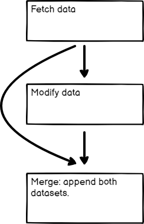

# Merging data 

Merging brings multiple data streams together. You can achieve this using different nodes depending on your workflow requirements.

- Merge data from different data streams or nodes: Use the [Merge](https://app.gitbook.com/s/BKcbOzIWja8NfqKDcqHc/builtin/core-nodes/n8n-nodes-base.merge) node to combine data from various sources into one.
- Merge data from multiple node executions: Use the [Code](https://app.gitbook.com/s/BKcbOzIWja8NfqKDcqHc/builtin/core-nodes/n8n-nodes-base.code) node for complex scenarios where you need to merge data from multiple executions of a node or multiple nodes. 
- Compare and merge data: Use the [Compare Datasets](https://app.gitbook.com/s/BKcbOzIWja8NfqKDcqHc/builtin/core-nodes/n8n-nodes-base.comparedatasets) node to compare, merge, and output data streams based on the comparison.

Explore each method in more detail in the sections below.

## Merge data from different data streams 

If your workflow [splits](split-with-conditionals.md), you combine the separate streams back into one stream.

Here's an [example workflow](https://n8n.io/workflows/1747-joining-different-datasets/) showing different types of merging: appending data sets, keeping only new items, and keeping only existing items. The [Merge node](https://app.gitbook.com/s/BKcbOzIWja8NfqKDcqHc/builtin/core-nodes/n8n-nodes-base.merge) documentation contains details on each of the merge operations.



## Merge data from different nodes 

You can use the Merge node to combine data from two previous nodes, even if the workflow hasn't split into separate data streams. This can be useful if you want to generate a single dataset from the data generated by multiple nodes.

<figure>

<figcaption>Merging data from two previous nodes</figcaption>
</figure>

## Merge data from multiple node executions 

Use the Code node to merge data from multiple node executions. This is useful in some [Looping](loop.md) scenarios.


**Node executions and workflow executions**

This section describes merging data from multiple node executions. This is when a node executes multiple times during a single workflow execution.

Refer to this [example workflow](https://n8n.io/workflows/1814-merge-multiple-runs-into-one/) using Loop Over Items and Wait to artificially create multiple executions.



## Compare, merge, and split again 

The [Compare Datasets](https://app.gitbook.com/s/BKcbOzIWja8NfqKDcqHc/builtin/core-nodes/n8n-nodes-base.comparedatasets) node compares data streams before merging them. It outputs up to four different data streams.

Refer to this [example workflow](https://n8n.io/workflows/1943-comparing-data-with-the-compare-datasets-node/) for an example.


