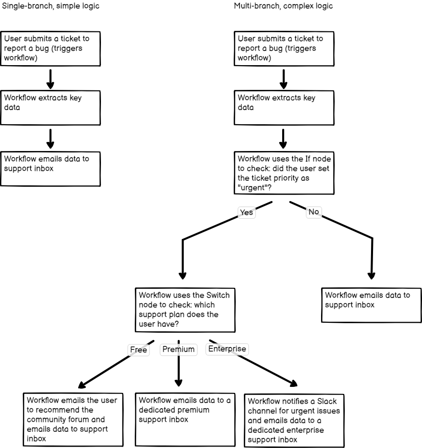

# Splitting workflows with conditional nodes 

Splitting uses the [IF](https://app.gitbook.com/s/BKcbOzIWja8NfqKDcqHc/builtin/core-nodes/n8n-nodes-base.if) or [Switch](https://app.gitbook.com/s/BKcbOzIWja8NfqKDcqHc/builtin/core-nodes/n8n-nodes-base.switch) nodes. It turns a single-branch workflow into a multi-branch workflow. This is a key piece of representing complex logic in n8n.

Compare these workflows:

The first workflow is linear: a user submits a bug and the workflow emails support. The second workflow starts the same way but splits depending on whether the user marked the issue urgent, then splits again by the user's support plan.

This is the power of splitting and conditional nodes in n8n.

Refer to the [IF](https://app.gitbook.com/s/BKcbOzIWja8NfqKDcqHc/builtin/core-nodes/n8n-nodes-base.if) or [Switch](https://app.gitbook.com/s/BKcbOzIWja8NfqKDcqHc/builtin/core-nodes/n8n-nodes-base.switch) documentation for usage details.
