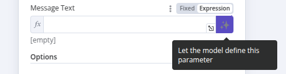

# Let AI specify the tool parameters <a href="#let-ai-specify-the-tool-parameters" id="let-ai-specify-the-tool-parameters"></a>

When configuring [tools](https://app.gitbook.com/s/CxSeOtVxqqhfxMSac0AV/key-concept-glossary#ai-tool) connected to the Tools Agent, many parameters can be filled in by the AI model itself. The AI model will use the context from the task and information from other connected tools to fill in the appropriate details.

There are two ways to do this, and you can switch between them.

## Let the model fill in the parameter <a href="#let-the-model-fill-in-the-parameter" id="let-the-model-fill-in-the-parameter"></a>

Each appropriate parameter field in the tool's editing dialog has an extra button at the end:



On activating this button, the [AI Agent](https://app.gitbook.com/s/CxSeOtVxqqhfxMSac0AV/key-concept-glossary#ai-agent) will fill in the expression for you, with no need for any further user input.
The field itself is filled in with a message indicating that the parameter has been defined automatically by the model.

If you want to define the parameter yourself, click on the 'X' in this box to revert to user-defined values. Note that the 'expression' field will now contain the expression generated by this feature, though you can now edit it further to add extra details as described in the following section.


Activating this feature will overwrite any manual definition you may have already added.


## Use the `$fromAI()` function <a href="#use-the-dollarfromai-function" id="use-the-dollarfromai-function"></a>

The `$fromAI()` function uses AI to dynamically fill in parameters for tools connected to the [Tools AI agent](https://app.gitbook.com/s/BKcbOzIWja8NfqKDcqHc/builtin/cluster-nodes/root-nodes/n8n-nodes-langchain.agent/tools-agent).


**Only for tools**

The `$fromAI()` function is only available for tools connected to the AI Agent node. The `$fromAI()` function doesn't work with the [Code](https://app.gitbook.com/s/BKcbOzIWja8NfqKDcqHc/builtin/cluster-nodes/sub-nodes/n8n-nodes-langchain.toolcode) tool or with [other non-tool cluster sub-nodes](https://app.gitbook.com/s/BKcbOzIWja8NfqKDcqHc/builtin/cluster-nodes/sub-nodes).


To use the `$fromAI()` function, call it with the required `key` parameter:

```javascript
{{ $fromAI('email') }}
```

The `key` parameter and other arguments to the `$fromAI()` function aren't references to existing values. Instead, think of these arguments as hints that the AI model will use to populate the right data.

For instance, if you choose a key called `email`, the AI Model will look for an email address in its context, other tools, and input data. In chat workflows, it may ask the user for an email address if it can't find one elsewhere. You can optionally pass other parameters like `description` to give extra context to the AI model.

### Parameters <a href="#parameters" id="parameters"></a>

The `$fromAI()` function accepts the following parameters:


| Parameter | Type | Required? | Description |
| --------- | ---- | --------- | ----------- |
| `key` | string | ✅ | A string representing the key or name of the argument. This must be between 1 and 64 characters in length and can only contain lowercase letters, uppercase letters, numbers, underscores, and hyphens. |
| `description` | string | ❌ | A string describing the argument. |
| `type` | string | ❌ | A string specifying the data type. Can be string, number, boolean, or json (defaults to string). |
| `defaultValue` | any | ❌ | The default value to use for the argument. |


### Examples <a href="#examples" id="examples"></a>

As an example, you could use the following `$fromAI()` expression to dynamically populate a field with a name:

```javascript
$fromAI("name", "The commenter's name", "string", "Jane Doe")
```

If you don't need the optional parameters, you could simplify this as:

```javascript
$fromAI("name")
```

To dynamically populate the number of items you have in stock, you could use a `$fromAI()` expression like this:

```javascript
$fromAI("numItemsInStock", "Number of items in stock", "number", 5)
```

If you only want to fill in parts of a field with a dynamic value from the model, you can use it in a normal expression as well. For example, if you want the model to fill out the `subject` parameter for an e-mail, but always pre-fix the generated value with the string 'Generated by AI:', you could use the following expression:

```javascript
Generated by AI: {{ $fromAI("subject") }}
```

### Templates <a href="#templates" id="templates"></a>

You can see the `$fromAI()` function in action in the following [templates](https://app.gitbook.com/s/CxSeOtVxqqhfxMSac0AV/key-concept-glossary#template-n8n):

* [Angie, Personal AI Assistant with Telegram Voice and Text](https://n8n.io/workflows/2462-angie-personal-ai-assistant-with-telegram-voice-and-text/)
* [Automate Customer Support Issue Resolution using AI Text Classifier](https://n8n.io/workflows/2468-automate-customer-support-issue-resolution-using-ai-text-classifier/)
* [Scale Deal Flow with a Pitch Deck AI Vision, Chatbot and QDrant Vector Store](https://n8n.io/workflows/2464-scale-deal-flow-with-a-pitch-deck-ai-vision-chatbot-and-qdrant-vector-store/)
