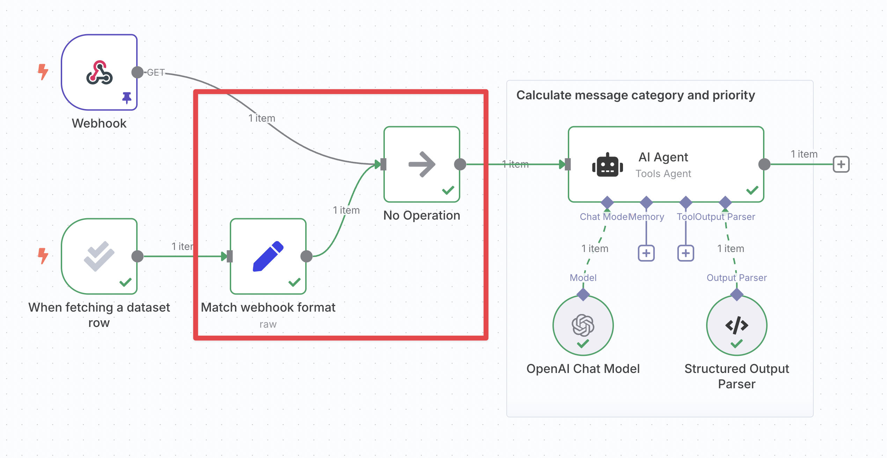
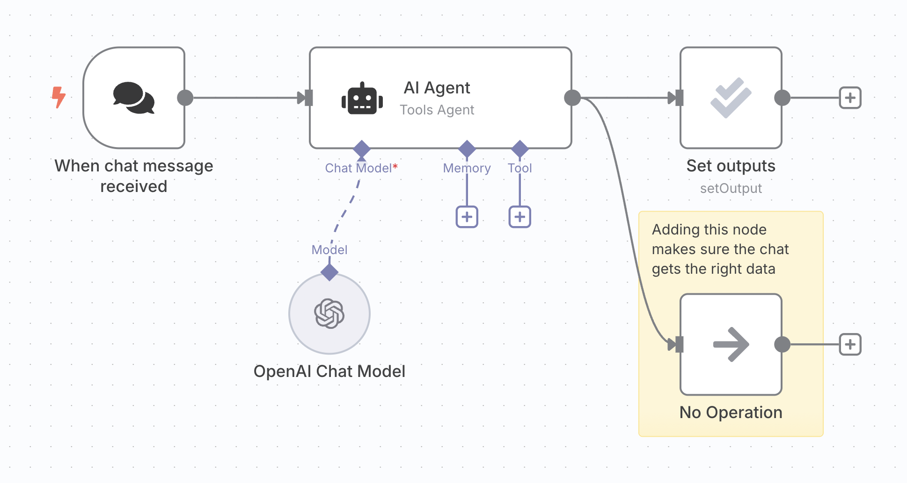
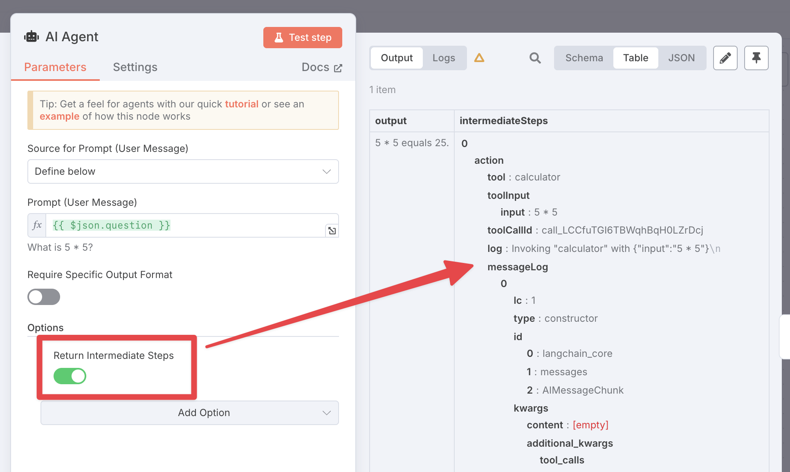

# Tips and common issues 

## Combining multiple triggers 

If you have another trigger in the workflow already, you have two potential starting points: that trigger and the [evaluation trigger](https://app.gitbook.com/s/BKcbOzIWja8NfqKDcqHc/builtin/core-nodes/n8n-nodes-base.evaluationtrigger). To make sure your workflow works as expected no matter which trigger executes, you will need to merge these branches together.

<figure>

<figcaption>Logic to merge two trigger branches together so that they have the same data format and can be referenced from a single node.</figcaption>
</figure>

To do so:

1. **Get the data format of the other trigger**:
	* Execute the other trigger.
    * Open it and navigate to the JSON view of its output pane.
    * Click the **copy** button on the right.
2. **Re-shape the evaluation trigger data to match**:
    * Insert an [Edit Fields (Set) node](https://app.gitbook.com/s/BKcbOzIWja8NfqKDcqHc/builtin/core-nodes/n8n-nodes-base.set) after the evaluation trigger and connect them together.
    * Change its mode to **JSON**.
    * Paste your data into the 'JSON' field, removing the `[` and `]` on the first and last lines.
    * Switch the field type to **Expression**.
    * Map in the data from the trigger by dragging it from the input pane.
    * For strings, make sure to replace the entire value (including the quotes) and add `.toJsonString()` to the end of the expression.
3. **Merge the branches using a 'No-op' node**: Insert a [No-op node](https://app.gitbook.com/s/BKcbOzIWja8NfqKDcqHc/builtin/core-nodes/n8n-nodes-base.noop) and wire both the other trigger and the Set node up to it. The 'No-op' node just outputs whatever input it receives.
4. **Reference the 'No-op' node outputs in the rest of the workflow**: Since both paths will flow through this node with the same format, you can be sure that your input data will always be there.

## Avoiding evaluation breaking the chat 

n8n's internal chat reads the output data of the last executed node in the workflow. After adding an evaluation node with the ['set outputs' operation](https://app.gitbook.com/s/BKcbOzIWja8NfqKDcqHc/builtin/core-nodes/n8n-nodes-base.evaluation#set-outputs), this data may not be in the expected format, or even contain the chat response.

The solution is to add an extra branch coming out of your agent. [Lower branches execute later](../../flow-logic/understand-execution-order.md) in n8n, which means any node you attach to this branch will execute last. You can use a no-op node here since it only needs to pass the agent output through.

## Accessing tool data when calculating metrics 

Sometimes you need to know what happened in executed sub-nodes of an agent, for example to check whether it executed a tool. You can't reference these nodes directly with expressions, but you can enable the **Return intermediate steps** option in the agent. This will add an extra output field called `intermediateSteps` which you can use in later nodes:

## Multiple evaluations in the same workflow 

You can only have one evaluation set up per workflow. In other words, you can only have one evaluation trigger per workflow.

Even so, you can still test different parts of your workflow with different evaluations by putting those parts in [sub-workflows](../../flow-logic/break-workflows-into-smaller-parts.md) and evaluating each sub-workflow.

## Dealing with inconsistent results 

Metrics can often have noise: they may be different across evaluation runs of the exact same workflow. This is because the workflow itself may return different results, or any LLM-based metrics might have natural variation in them.

You can compensate for this by duplicating the rows of your dataset, so that each row appears more than once in the dataset. Since this means that each input will effectively be running multiple times, it will smooth out any variations.
