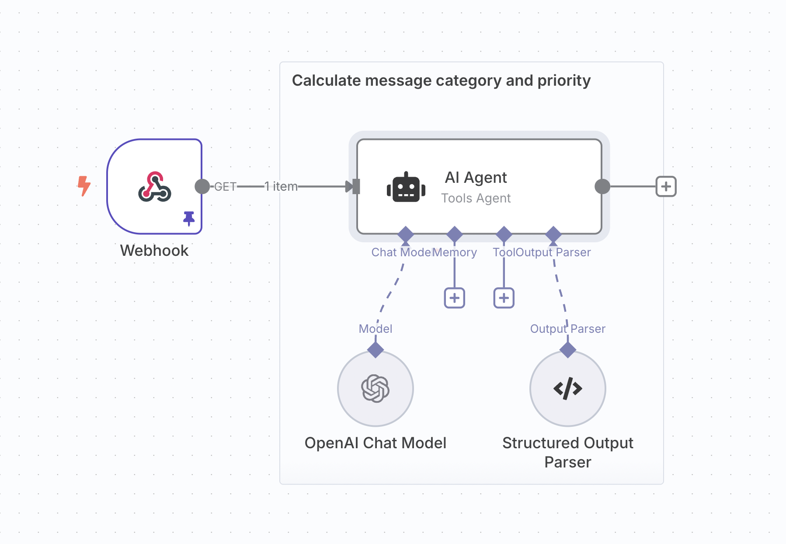
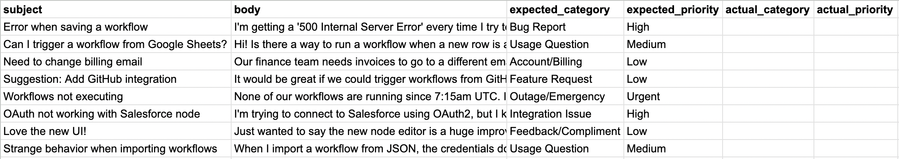
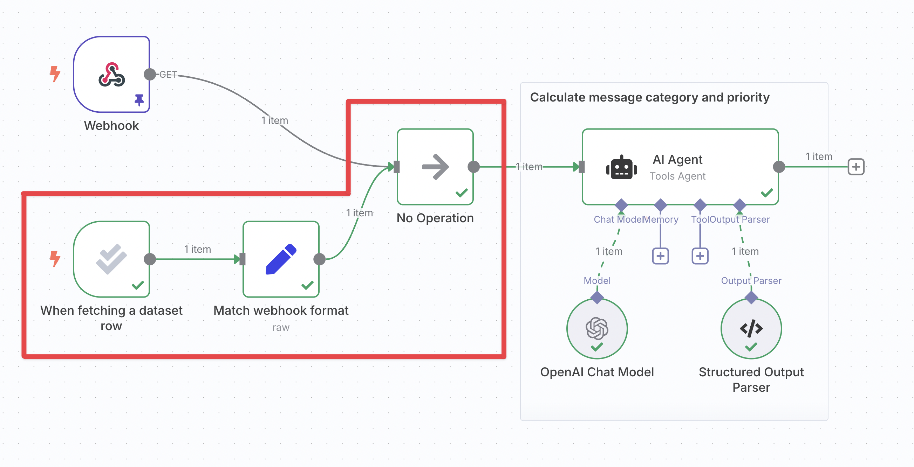
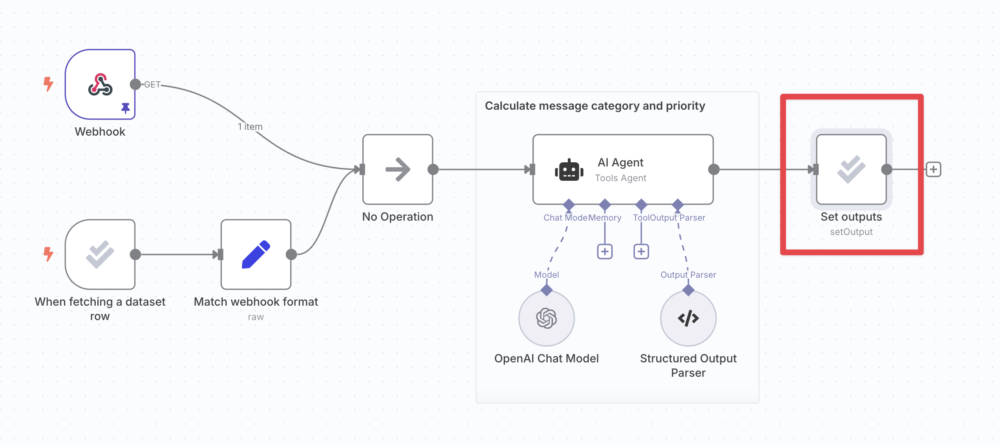
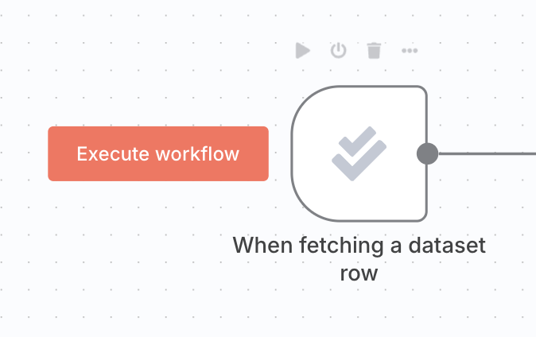

# Light evaluations 


**Available on registered community and paid plans**

Light evaluations are available to registered community users and on all paid plans.


## What are light evaluations? 

When building your workflow, you often want to test it with a handful of examples to get a sense of how it performs and make improvements. At this stage of workflow development, looking over workflow outputs for each example is often enough. The benefits of setting up more [formal scoring or metrics](use-metrics-to-measure-quality.md) don't yet justify the effort.

Light evaluation allows you to run the examples in a test dataset through your workflow one-by-one, writing the outputs back to your dataset. You can then examine those outputs next to each other, and visually compare them to the expected outputs (if you have them).

## How it works 


**Credentials for Google Sheets**

Evaluations use data tables or Google Sheets to store the test dataset. To use Google Sheets as a dataset source, configure a [Google Sheets credential](https://app.gitbook.com/s/BKcbOzIWja8NfqKDcqHc/builtin/credentials/google).


Light evaluations take place in the 'Editor' tab of your workflow, although you’ll find instructions on how to set it up in the 'Evaluations' tab.

Steps:

1. Create a dataset
2. Wire the dataset up to the workflow
3. Write workflow outputs back to dataset
4. Run evaluation

The following explanation will use a sample workflow that assigns a category and priority to incoming support tickets.

### 1. Create a dataset 

Create a data table or Google Sheet with a handful of examples for your workflow. Your dataset should contain columns for:

- The workflow input
- (Optional) The expected or correct workflow output
- The actual output

Leave the actual output column or columns blank, since you'll be filling them during the evaluation.

<figure>

<figcaption>A <a href="https://docs.google.com/spreadsheets/d/1uuPS5cHtSNZ6HNLOi75A2m8nVWZrdBZ_Ivf58osDAS8/edit?gid=294497137#gid=294497137">sample dataset</a> for the support ticket classification workflow.</figcaption>
</figure>

### 2. Wire the dataset up to your workflow 

#### Insert an evaluation trigger to pull in your dataset 

Each time the [evaluation trigger](https://app.gitbook.com/s/BKcbOzIWja8NfqKDcqHc/builtin/core-nodes/n8n-nodes-base.evaluationtrigger) runs, it will output a single item representing one row of your dataset.

Clicking the 'Evaluate all' button to the left of the evaluation trigger will run your workflow multiple times in sequence, once for each row in your dataset. This is a special behavior of the evaluation trigger.

While wiring the trigger up, you often only want to run it once. You can do this by either:

- Setting the trigger's 'Max rows to process' to 1
- Clicking on the 'Execute node' button on the trigger (rather than the 'Evaluate all' button)

#### Wire the trigger up to your workflow 

You can now connect the evaluation trigger to the rest of your workflow and reference the data that it outputs. At a minimum, you need to use the dataset’s input column(s) later in the workflow.

If you have multiple triggers in your workflow you will need to [merge their branches together](fix-common-issues.md#combining-multiple-triggers).

<figure>

<figcaption>The support ticket classification workflow with the evaluation trigger added in and wired up.</figcaption>
</figure>

### 3. Write workflow outputs back to dataset 

To populate the output column(s) of your dataset when the evaluation runs:

- Insert the 'Set outputs' action of the [evaluation node](https://app.gitbook.com/s/BKcbOzIWja8NfqKDcqHc/builtin/core-nodes/n8n-nodes-base.evaluation)
- Wire it up to your workflow at a point after it has produced the outputs you're evaluating
- In the node's parameters, map the workflow outputs into the correct dataset column

<figure>

<figcaption>The support ticket classification workflow with the 'set outputs' node added in and wired up.</figcaption>
</figure>

### 4. Run evaluation 

Click on the **Execute workflow** button to the left of the evaluation trigger. The workflow will execute multiple times, once for each row of the dataset:

Review the outputs of each execution in the data table or Google Sheet, and examine the execution details using the workflow's 'executions' tab if you need to.

Once your dataset grows past a handful of examples, consider [metric-based evaluation](use-metrics-to-measure-quality.md) to get a numerical view of performance. See also [tips and common issues](fix-common-issues.md).
