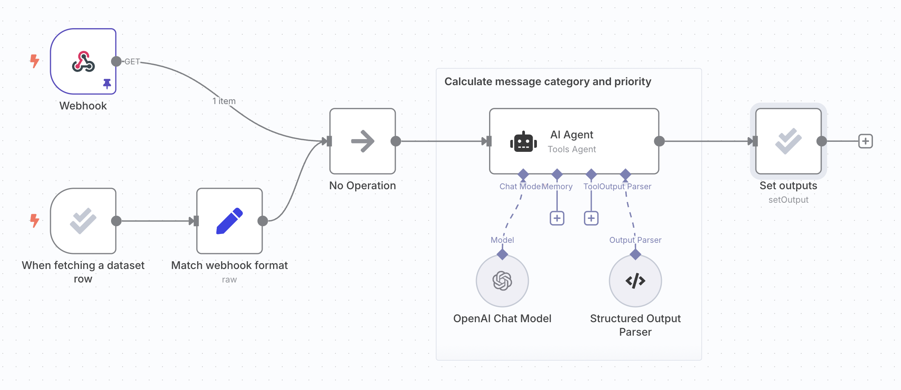
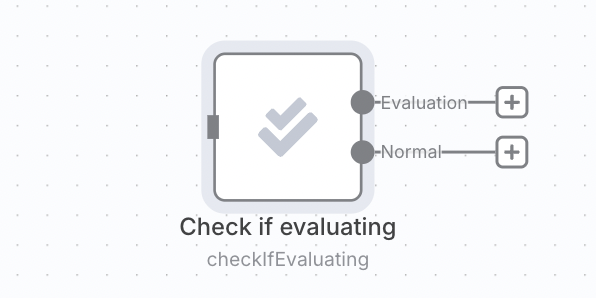
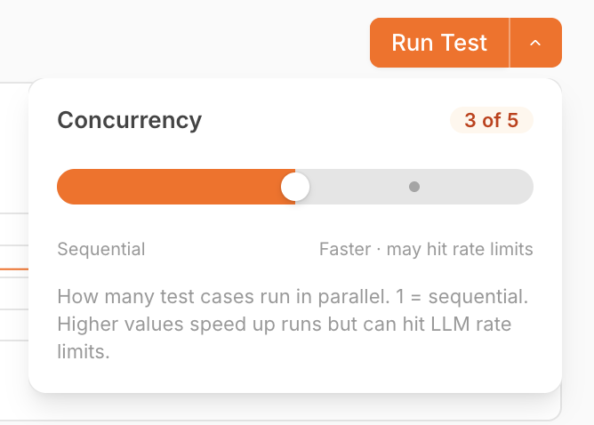

# Metric-based evaluations 


**Available on Pro and Enterprise plans**

Metric-based evaluation is available on Pro and Enterprise plans. Registered community and Starter plan users can also use it for a single workflow.


### What are metric-based evaluations? 

Once your workflow is ready for deployment, you often want to test it on more examples than [when you were building it](run-quick-evaluations.md).

For example, when production executions start to turn up edge cases, you want to add them to your test dataset so that you can make sure they're covered.

For large datasets like the ones built from production data, it can be hard to get a sense of performance just by eyeballing the results. Instead, you must measure performance. Metric-based evaluations can assign one or more scores to each test run, which you can compare to previous runs. Individual scores get rolled up to measure performance on the whole dataset. 

This feature allows you to run evaluations that calculate metrics, track how those metrics change between runs and drill down into the reasons for those changes.

Metrics can be deterministic functions (such as the distance between two strings) or you can calculate them using AI. Metrics often involve checking how far away the output is from a *reference output* (also called ground truth). To do so, the dataset must contain that reference output. Some evaluations don't need this reference output though (for example, checking text for sentiment or toxicity).

## How it works 


**Credentials for Google Sheets**

Evaluations use data tables or Google Sheets to store the test dataset. To use Google Sheets as a dataset source, configure a [Google Sheets credential](https://app.gitbook.com/s/BKcbOzIWja8NfqKDcqHc/builtin/credentials/google).


1. Set up [light evaluation](run-quick-evaluations.md)
2. Add metrics to workflow
3. Run evaluation and view results

### 1. Set up light evaluation 

Follow the [setup instructions](run-quick-evaluations.md) to create a dataset and wire it up to your workflow, writing outputs back to the dataset.

The following steps use the same support ticket classification workflow from the light evaluation docs:

### 2. Add metrics to workflow 

Metrics are dimensions used to score the output of your workflow. They often compare the actual workflow output with a reference output. It's common to use AI to calculate metrics, although it's sometimes possible to just use code. In n8n, metrics are always numbers.

You need to add the logic to calculate the metrics for your workflow, at a point after it has produced the outputs. You can add any reference outputs your metric uses as a column in your dataset. This makes sure they it will be available in the workflow, since they will be output by the evaluation trigger.

Use the **Set Metrics** operation to calculate:

* **Correctness (AI-based)**: Whether the answer's meaning is consistent with a supplied reference answer. Uses a scale of 1 to 5, with 5 being the best.
* **Helpfulness (AI-based)**: Whether the response answers the given query. Uses a scale of 1 to 5, with 5 being the best.
* **String Similarity**: How close the answer is to the reference answer, measured character-by-character (edit distance). Returns a score between 0 and 1.
* **Categorization**: Whether the answer is an exact match with the reference answer. Returns 1 when matching and 0 otherwise.
* **Tools Used**: Whether the execution used tools or not. Returns a score between 0 and 1.

You can also add custom metrics. Just calculate the metrics within the workflow and then map them into an Evaluation node. Use the **Set Metrics** operation and choose **Custom Metrics** as the Metric. You can then set the names and values for the metrics you want to return.

For example:

* [RAG document relevance](https://n8n.io/workflows/4273): when working with a vector database, whether the documents retrieved are relevant to the question.

Calculating metrics can add latency and cost, so you may only want to do it when running an evaluation and avoid it when making a production execution. You can do this by putting the metric logic after a ['check if evaluating' operation](https://app.gitbook.com/s/BKcbOzIWja8NfqKDcqHc/builtin/core-nodes/n8n-nodes-base.evaluation#check-if-evaluating).

### 3. Run evaluation and view results 

Switch to the **Evaluations** tab on your workflow and click the **Run Test** button. An evaluation will start. Once the evaluation has finished, it will display a summary score for each metric.

You can see the results for each test case by clicking on the test run row. Clicking on an individual test case will open the execution that produced it (in a new tab).

#### Run test cases in parallel 

On plans that support concurrency, **Run Test** is a split-button. The caret to the right opens a popover with a slider that controls how many test cases run at the same time.

<figure>

<figcaption>The concurrency popover, with the slider at 3 of a maximum of 5 parallel test cases.</figcaption>
</figure>

The default maximum depends on your plan:

| Plan | Maximum parallel test cases |
| :--- | :-------------------------- |
| Community / Pro | 1 (sequential) |
| Business | 3 |
| Enterprise | 5 |

When the maximum is `1`, the caret and popover are hidden and **Run Test** is a plain button — runs are sequential, identical to earlier versions.

Self-hosted instances can override the maximum with the [`N8N_CONCURRENCY_EVALUATION_LIMIT`](https://app.gitbook.com/s/jm0ZYRpZIPWge2ZSiDYO/host-n8n/configure-n8n/basic-configuration/use-environment-variables/executions) environment variable, regardless of plan tier.


**LLM rate limits**

Higher concurrency speeds up evaluation runs but increases the chance of hitting upstream LLM rate limits. If you see rate-limit errors, lower the slider.

