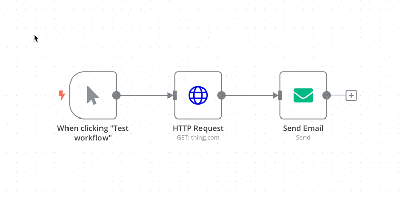

# Export and import

n8n saves workflows in JSON format. You can export your workflows as JSON files or import JSON files into your n8n library. You can export and import workflows in several ways.



## Copy-Paste 

You can copy and paste a workflow or parts of it by selecting the nodes you want to copy to the clipboard (`Ctrl + c` or `cmd +c`) and pasting it (`Ctrl + v` or `cmd + v`) into the Editor UI.

To select all nodes or a group of nodes, click and drag: 

## From the Editor UI menu 

From the top navigation bar, select the three dots in the upper right  to see the following options:

* **Download**: Downloads your current workflow as a JSON file to your computer.
* **Import from URL**: Imports workflow JSON from a URL, for example, [this workflow JSON file on GitHub](https://raw.githubusercontent.com/n8n-io/self-hosted-ai-starter-kit/refs/heads/main/n8n/demo-data/workflows/srOnR8PAY3u4RSwb.json).
* **Import from File**: Imports a workflow as a JSON file from your computer.

## From the command line 

* Export: See the [export commands](https://app.gitbook.com/s/jm0ZYRpZIPWge2ZSiDYO/host-n8n/configure-n8n/use-the-command-line#export-entities)for exporting workflows or credentials.
* Import: See the [import commands](https://app.gitbook.com/s/jm0ZYRpZIPWge2ZSiDYO/host-n8n/configure-n8n/use-the-command-line#import-entities)for importing workflows or credentials.
