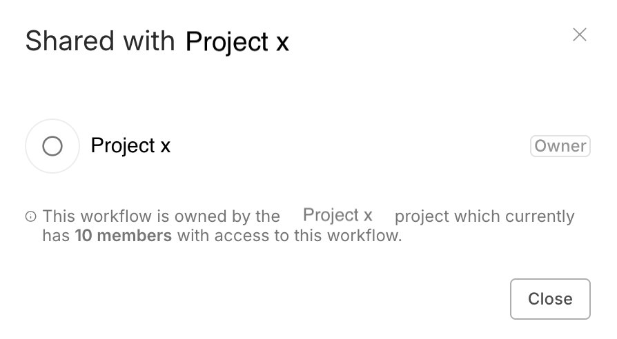

# Workflow sharing 


**Feature availability**

Available on Pro and Enterprise Cloud plans, and Enterprise self-hosted plans.


Workflow sharing allows you to share workflows between users of the same n8n instance.

Users can share workflows they created. Instance owners, and users with the admin role, can view and share all workflows in the instance. Refer to [Account types](https://app.gitbook.com/s/wMJrGrimpx3PxCJpUswm/manage-users-and-access/understand-account-types) for more information about owners and admins.

## Share a workflow 

1. Open the workflow you want to share.
2. Select **Share**.
3. In **Add users**, find and select the users you want to share with.
4. Select **Save**.

**Note:** This option is only available when sharing a workflow that is inside a **Personal** workspace. When trying to use the "Add users" option for a workflow that's **inside a project**, you'll get this pop-up instead:

This is intended behavior, and it means that the workflow is shared with everyone inside that specific project. Instead of adding the user directly to the workflow, you need to add the user to the project in which the workflow is located.

## View shared workflows 

You can browse and search workflows on the **Workflows** list. The workflows in the list depend on the project:

* **Overview** lists all workflows you can access. This includes:
	* Your own workflows.
	* Workflows shared with you.
	* Workflows in projects you're a member of.
	* If you log in as the instance owner or admin: all workflows in the instance.
* Other projects: all workflows in the project.

## Workflow roles and permissions 

There are two workflow roles: creator and editor. The creator is the user who created the workflow. Editors are other users with access to the workflow.

You can't change the workflow owner, except when deleting the user.


**Credentials**

Workflow sharing allows editors to use all credentials[^1] used in the workflow. This includes credentials that aren't explicitly shared with them using [credential sharing](https://app.gitbook.com/s/wMJrGrimpx3PxCJpUswm/manage-credentials/share-credentials-securely).

### Permissions 

| Permissions | Creator | Editor | 
| ----------- | ------- | ------ | 
| View workflow (read-only) | ✅ | ✅ |
| View executions | ✅ | ✅ |
| Update (including tags) | ✅ | ✅ |
| Run | ✅ | ✅ |
| Share | ✅ | ❌ |
| Export | ✅ | ✅ |
| Delete | ✅ | ❌ |

## Node editing restrictions with unshared credentials 

Sharing in n8n works on the principle of least privilege. This means that if a user shares a workflow with you, but they don't share their credentials, you can't edit the nodes within the workflow that use those credentials. You can view and run the workflow, and edit nodes that don't use unshared credentials.

Refer to [Credential sharing](https://app.gitbook.com/s/wMJrGrimpx3PxCJpUswm/manage-credentials/share-credentials-securely) for guidance on sharing credentials.

[^1]: In n8n, credentials store authentication information to connect with specific apps and services. After creating credentials with your authentication information (username and password, API key, OAuth secrets, etc.), you can use the associated app node to interact with the service.
