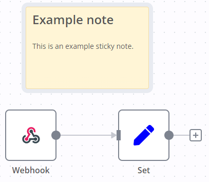
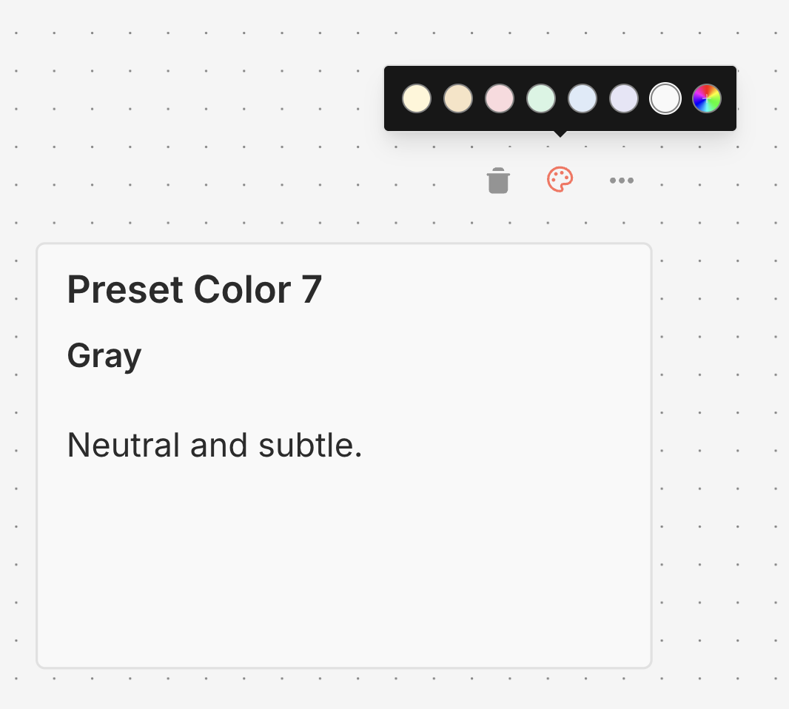

# Add notes and documentation

Sticky Notes allow you to annotate and comment on your workflows.

n8n recommends using Sticky Notes heavily, especially on [template workflows](https://app.gitbook.com/s/CxSeOtVxqqhfxMSac0AV/key-concept-glossary#template-n8n), to help other users understand your workflow.



## Create a Sticky Note <a href="#create-a-sticky-note" id="create-a-sticky-note"></a>

Sticky Notes are a core node. To add a new Sticky Note:

1. Open the nodes panel.
2. Search for `note`.
3. Click the **Sticky Note** node. n8n adds a new Sticky Note to the canvas.

## Edit a Sticky Note <a href="#edit-a-sticky-note" id="edit-a-sticky-note"></a>

1. Double click the Sticky Note you want to edit.
2. Write your note. [This guide](https://commonmark.org/help/) explains how to format your text with Markdown. n8n uses [markdown-it](https://github.com/markdown-it/markdown-it), which implements the CommonMark specification.
3. Click away from the note, or press `Esc`, to stop editing.

## Change the color <a href="#change-the-color" id="change-the-color"></a>

To change the Sticky Note color:

1. Hover over the Sticky Note
2. Select **Change color** 
3. Choose from seven preset colors, or click the rainbow gradient button to select a custom color



### Custom colors <a href="#custom-colors" id="custom-colors"></a>

In addition to the seven preset colors, you can select any custom color for your sticky notes:

1. Click the button with the rainbow gradient and plus icon
2. Use the color picker to select your desired color, or enter a hex color code (for example, `#FF5733`)
3. Click **Apply** to set the color

Your recently used custom colors (up to 8) are automatically saved and displayed in the color picker for quick access.

Custom colors feature theme-aware borders that automatically adjust for optimal visibility in both light and dark modes.

## Sticky Note positioning <a href="#sticky-note-positioning" id="sticky-note-positioning"></a>

You can:

* Drag a Sticky Note anywhere on the canvas.
* Drag Sticky Notes behind nodes. You can use this to visually group nodes.
* Resize Sticky Notes by hovering over the edge of the note and dragging to resize.
* Change the color: select **Options**  to open the color selector.

## Writing in Markdown <a href="#writing-in-markdown" id="writing-in-markdown"></a>

Sticky Notes support Markdown formatting. This section describes some common options.

```
The text in double asterisks will be **bold**

The text in single asterisks will be *italic*

Use # to indicate headings:
# This is a top-level heading <a href="#this-is-a-top-level-heading" id="this-is-a-top-level-heading"></a>
## This is a sub-heading <a href="#this-is-a-sub-heading" id="this-is-a-sub-heading"></a>
### This is a smaller sub-heading <a href="#this-is-a-smaller-sub-heading" id="this-is-a-smaller-sub-heading"></a>

You can add links:
[Example](https://example.com/)

Create lists with asterisks:

* Item one
* Item two

Or created ordered lists with numbers:

1. Item one
2. Item two
```

For a more detailed guide, refer to [CommonMark's help](https://commonmark.org/help/). n8n uses [markdown-it](https://github.com/markdown-it/markdown-it), which implements the CommonMark specification.

## Make images full width <a href="#make-images-full-width" id="make-images-full-width"></a>

You can force images to be 100% width of the sticky note by appending `#full-width` to the filename:

```markdown

```

## Embed a YouTube video <a href="#embed-a-youtube-video" id="embed-a-youtube-video"></a>

To display a YouTube video in a note, use the `@[youtube](<video-id>)` directive with the video's ID. For this to work, the video's creator must allow embedding.

For example:

```markdown
@[youtube](ZCuL2e4zC_4)
```

To embed your own video, copy the above syntax, replacing `ZCuL2e4zC_4` with your video ID. The YouTube video ID is the string that follows `v=` in the YouTube URL.
