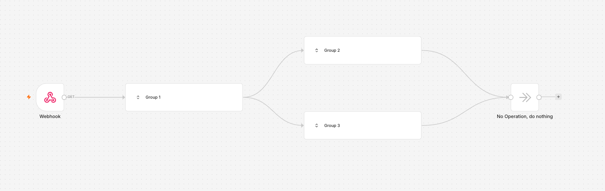

# Canvas Groups 


**Feature availability**

Canvas Groups are available from version `2.28.0`.


Canvas Groups let you organize related nodes into a single named group on the canvas. Group the nodes that handle one part of a workflow, name it, and collapse it when you want a cleaner view. A Canvas Group saves with the workflow, so anyone who opens it sees the same structure. You can also collapse a Canvas Group for a cleaner view, which is a personal preference saved in your browser.

## Create a Canvas Group 

1. Select the nodes you want to group. Drag a selection box around them, or hold `Ctrl/Cmd` and click each node.
2. Select the **Group nodes** icon  in the toolbar above the selection, or press `Ctrl/Cmd` + `G`.
3. n8n creates the Canvas Group and highlights the name field so you can type a name straight away.

You can only group a selection when it forms a valid Canvas Group. See [What you can group](#what-you-can-group) for the rules.

## Name a Canvas Group 

When you create a Canvas Group, n8n automatically assigns a default name (for example, "Group 1") and highlights it so you can immediately replace it with something more descriptive or keep the suggested name. To rename a group later, double-click its name, edit the text, then click anywhere outside the group to save. Group names cannot be left blank.

## Collapse and expand a Canvas Group 

Collapse a Canvas Group to hide its nodes and show only the name. This shrinks a large workflow down to a more readable view. When collapsed, it shows its name and nothing else.

Select the collapse or expand icon to switch between the two states. You collapse and expand one Canvas Group at a time.

n8n remembers which Canvas Groups you've expanded and keeps your view the same when you reopen the workflow. This preference lives in your browser, so it's specific to you and your device. It isn't saved with the workflow, and it doesn't sync to other browsers or other people.

## Ungroup 

To break a Canvas Group back into separate nodes, select the **Ungroup** icon  above it, or press `Ctrl/Cmd` + `Shift` + `G`. The nodes stay on the canvas.

## What you can group 

Not every selection can become a Canvas Group. When you select nodes, n8n checks a few rules and only displays the **Group nodes** icon  when they all pass. If the icon doesn't appear, check your selection against these rules:

- The nodes aren't already part of another Canvas Group.
- The selection doesn't include a trigger node. Triggers anchor the start of a workflow and stay outside Canvas Groups.
- The nodes form one connected chain. You can't add nodes to a Canvas Group that aren't next to each other.
- Nodes outside a Canvas Group can connect to it through its first node and its last node only. They cannot connect directly to a node in the middle.
- An AI node and its sub-nodes (its chat model, memory, and tools) must be in a Canvas Group together. A sub-node connection can't cross a Canvas Group's boundary.

## Canvas Groups in read-only workflows 

When a workflow is shown read-only, such as in workflow history or a shared view, Canvas Groups appear expanded by default so you can see the whole workflow.

## Keyboard shortcuts 

| Action | Shortcut |
| ------ | -------- |
| Group selected nodes | `Ctrl/Cmd` + `G` |
| Ungroup selected nodes | `Ctrl/Cmd` + `Shift` + `G` |
