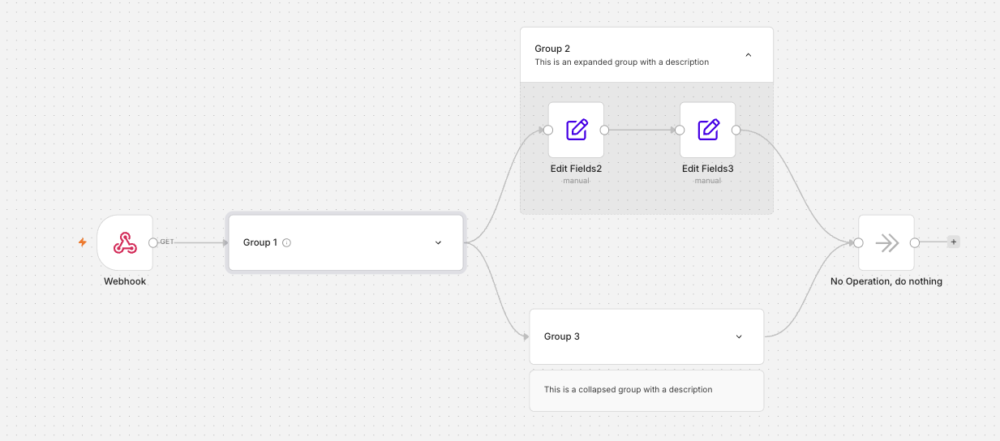

# Canvas Groups 


**Feature availability**

Canvas Groups rolled out gradually from n8n 2.28.0 and are available on all instances from n8n 2.31.0.


Canvas Groups let you organize related nodes into a single named group on the canvas. Group the nodes that handle one part of a workflow, name it, and collapse it when you want a cleaner view. A Canvas Group saves with the workflow, so anyone who opens it sees the same structure. You can collapse a Canvas Group for a cleaner view, which is a personal preference saved in your browser. And you can also give a Canvas Group a description, so anyone reading the workflow can see what that part does at a glance.

## Create a Canvas Group 

1. Select the nodes you want to group. Drag a selection box around them, or hold `Ctrl/Cmd` and click each node.
2. Select the **Group nodes** icon  in the toolbar above the selection, select **Group nodes** in the selection's right-click menu, or press `Ctrl/Cmd` + `G`.
3. n8n creates the Canvas Group and highlights the name field so you can type a name straight away.

You can only group a selection when it forms a valid Canvas Group. See [What you can group](#what-you-can-group) for the rules.

## Name a Canvas Group 

When you create a Canvas Group, n8n automatically assigns a default name (for example, "Group 1") and highlights it so you can immediately replace it with something more descriptive or keep the suggested name.

To rename a Canvas Group later, select it and press `Space`, or select **Rename group** in its right-click menu. On an expanded group, this highlights the name so you can edit it inline; on a collapsed group, it opens a dialog where you can edit the name. You can also click an expanded group's name directly to edit it. Click anywhere outside the group to save. Group names can't be blank.

## Add a description to a Canvas Group 

You can give a Canvas Group an optional description of up to 145 characters, so readers can see what that part of the workflow does without expanding it. Descriptions save with the workflow, and stay with the Canvas Group when you duplicate or copy and paste it.

On an expanded Canvas Group, the description appears under its name. Click **Add description** to write one, type your description and then press `Enter` to save.

On a collapsed Canvas Group, an info icon appears next to its name. Hover over it to read the description.

To keep a description visible without hovering, select the eye icon on the description card to lock it open, or right-click the Canvas Group and select **Show group description**. To show or hide every description at once, use **Show group descriptions** / **Hide group descriptions** in the canvas right-click menu. Description visibility is a personal preference saved in your browser, like collapse state.

Descriptions hide when you zoom out far enough (below roughly two-thirds zoom). If you import a workflow with descriptions longer than 145 characters, n8n shortens them and shows a warning.

## Collapse and expand a Canvas Group 

Collapse a Canvas Group to hide its nodes and show only the name, and the description if you have one (see [Add a description to a Canvas Group](#add-a-description-to-a-canvas-group)). This shrinks a large workflow down to a more readable view.

Click a Canvas Group's header to collapse or expand it. To act on more than one at a time, use **Expand all groups** / **Collapse all groups** from the canvas right-click menu, or press `Alt` + `G` to expand and `Shift` + `Alt` + `G` to collapse. With groups selected, or nodes inside groups, the shortcuts act on those groups; with nothing selected, they act on every Canvas Group.

n8n remembers which Canvas Groups you've expanded and keeps your view the same when you reopen the workflow. This preference lives in your browser, so it's specific to you and your device. It isn't saved with the workflow, and it doesn't sync to other browsers or other people.

## Ungroup 

To break a Canvas Group back into separate nodes, select the **Ungroup** icon  above it, select **Ungroup nodes** in its right-click menu, or press `Ctrl/Cmd` + `Shift` + `G`. The nodes stay on the canvas.

## Group actions from the context menu 

Right-click a Canvas Group to open its context menu. **Rename group** and **Ungroup nodes** sit at the top, followed by the same actions you get for a multi-node selection, worded for the group (**Copy group**, **Delete group**, and so on). The menu also works on collapsed groups, where actions apply to the hidden nodes inside.

Right-click an empty part of the canvas to use **Expand all groups** and **Collapse all groups**. When your selection includes groups, the context menu offers **Expand selected** and **Collapse selected** instead.

## What you can group 

Not every selection can become a Canvas Group. When you select nodes, n8n checks a few rules and only displays the **Group nodes** icon  when they all pass. If the icon doesn't appear, check your selection against these rules:

- The nodes aren't already part of another Canvas Group.
- The selection doesn't include a trigger node. Triggers anchor the start of a workflow and stay outside Canvas Groups.
- The nodes form one connected chain. You can't add nodes to a Canvas Group that aren't next to each other.
- Nodes outside a Canvas Group can only connect to its first or last node. They can't connect directly to a node in the middle.
- An AI node and its sub-nodes (its chat model, memory, and tools) must be in a Canvas Group together. A sub-node connection can't cross a Canvas Group's boundary.
- The selection includes at least two items. You can't create a single-node Canvas Group.
- Sticky notes can be part of a Canvas Group alongside nodes.

If a saved workflow contains Canvas Groups that break these rules (for example, after importing a workflow edited elsewhere), n8n automatically ungroups them when the workflow saves and shows a warning. The nodes stay on the canvas.

## Canvas Groups in read-only workflows 

When a workflow is shown read-only, such as in workflow history or a shared view, Canvas Groups appear expanded by default so you can see the whole workflow.

## Keyboard shortcuts 

| Action | Shortcut |
| ------ | -------- |
| Group selected nodes | `Ctrl/Cmd` + `G` |
| Ungroup selected nodes | `Ctrl/Cmd` + `Shift` + `G` |
| Expand Canvas Groups (selection, or all) | `Alt` + `G` |
| Collapse Canvas Groups (selection, or all) | `Shift` + `Alt` + `G` |
| Rename selected Canvas Group | `Space` |
