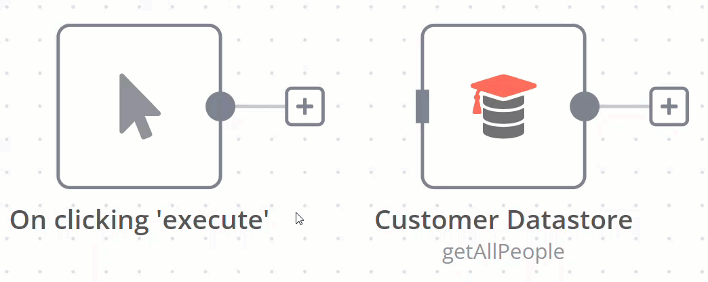

# Connections 

A connection establishes a link between nodes to route data through the workflow. A connection between two nodes passes data from one node's output to another node's input.

## Create a connection 

To create a connection between two nodes, select the grey dot or **Add node**  on the right side of a node and slide the arrow to the grey rectangle on the left side of the following node.

## Delete a connection 

Hover over the connection, then select **Delete** .

