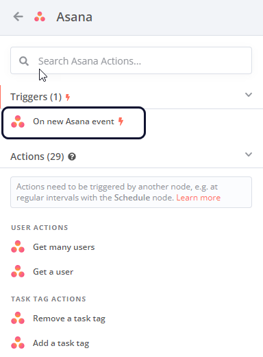

# Work with nodes

[Nodes](https://app.gitbook.com/s/CxSeOtVxqqhfxMSac0AV/key-concept-glossary#node-n8n) are the key building blocks of a [workflow](https://app.gitbook.com/s/CxSeOtVxqqhfxMSac0AV/key-concept-glossary#workflow-n8n). They perform a range of actions, including:

* Starting the workflow.
* Fetching and sending data.
* Processing and manipulating data.

n8n provides a collection of built-in nodes, as well as the ability to create your own nodes. Refer to:

* [Built-in integrations](https://app.gitbook.com/s/BKcbOzIWja8NfqKDcqHc/builtin/node-types) to browse the node library.
* [Community nodes](https://app.gitbook.com/s/BKcbOzIWja8NfqKDcqHc/community-nodes/installation-and-management) for guidance on finding and installing community-created nodes.
* [Creating nodes](https://app.gitbook.com/s/r7wKI4I1BgdBCuq5Cvcx/create-nodes/overview) to start building your own nodes.

## Add a node to your workflow 

### Add a node to an empty workflow 

1. Select **Add first step**. n8n opens the nodes panel, where you can search or browse [trigger nodes](https://app.gitbook.com/s/CxSeOtVxqqhfxMSac0AV/key-concept-glossary#trigger-node-n8n).
2.  Select the trigger you want to use. 

    

<strong>Choose the correct app event</strong>

If you select <strong>On App Event</strong>, n8n shows a list of all the supported services. Use this list to browse n8n's integrations and trigger a workflow in response to an event in your chosen service. Not all integrations have triggers. To see which ones you can use as a trigger, select the node. If a trigger is available, you'll see it at the top of the available operations list.

For example, this is the trigger for Asana:

### Add a node to an existing workflow 

Select the **Add node**  connector. n8n opens the nodes panel, where you can search or browse all nodes.



## Node controls 

To view node controls, hover over the node on the canvas:

* **Execute step** : Run the node.
* **Deactivate** : Deactivate the node.
* **Delete** : Delete the node.
* **Node context menu** : Select node actions. Available actions:
  * Open node
  * Execute step
  * Rename node
  * Deactivate node
  * Pin node
  * Copy node
  * Duplicate node
  * Tidy up workflow
  * Convert node to sub-workflow
  * Select all
  * Clear selection
  * Delete node

## Node settings 

The node settings under the **Settings** tab allow you to control node behaviors and add node notes.

When active or set, they do the following:

* **Always Output Data**: The node returns an empty item even if the node returns no data during execution. Be careful setting this on IF nodes, as it could cause an infinite loop.
* **Execute Once**: The node executes once, with data from the first item it receives. It doesn't process any extra items.
* **Retry On Fail**: When an execution fails, the node reruns until it succeeds.
* **On Error**:
  * **Stop Workflow**: Halts the entire workflow when an error occurs, preventing further node execution.
  * **Continue**: Proceeds to the next node despite the error, using the last valid data.
  * **Continue (using error output)**: Continues workflow execution, passing error information to the next node for potential handling.
* **Custom Span Attributes**: Add custom key-value attributes to a node's OpenTelemetry span. Keys are plain text, and values support expressions. This setting only appears if you enable OpenTelemetry tracing and have an Enterprise license. Refer to [Custom span attributes](https://app.gitbook.com/s/jm0ZYRpZIPWge2ZSiDYO/host-n8n/keep-n8n-running/trace-executions-with-opentelemetry#custom-span-attributes) for details.

You can document your workflow using node notes:

* **Notes**: Note to save with the node.
* **Display note in flow**: If active, n8n displays the note in the workflow as a subtitle.
