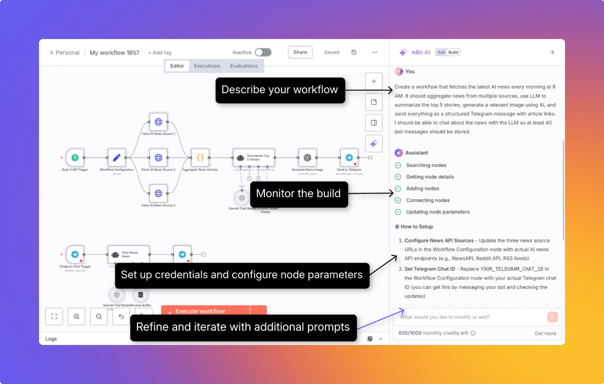

# AI Workflow Builder 

AI Workflow Builder enables you to create, refine, and debug workflows using natural language descriptions of your goals.

It handles the entire workflow construction process, including node selection, placement, and configuration, thereby reducing the time required to build functional workflows.

For details of pricing and availability of AI Workflow Builder, see [n8n Plans and Pricing](https://n8n.io/pricing/).

## Working with the builder 

1. **Describe your workflow:** Either select an example prompt or describe your requirements in natural language.
2. **Monitor the build:** The builder provides real-time feedback through several phases.
3. **Review and refine the generated workflow:** Review required credentials and other parameters. Refine the workflow using prompts.
    
    
    

### Commands you can run in the builder 

- `/clear`: Clears the context for the LLM and lets you start from scratch

## Understanding credits 

### How credits work 

Each time you send a message to the builder asking it to create or modify a workflow, that counts as one **interaction**, which is worth one **credit**.

✅ **Counts as an interaction**

- Sending a message to create a new workflow
- Asking the builder to modify an existing workflow
- Clicking the **Execute and refine** button in the builder window after a workflow is built

❌ **Does NOT count as an interaction**

- Messages that fail or produce generation errors
- Requests you manually stop by clicking the stop button

### Getting more credits 

If you've used your monthly limit, you can upgrade to a higher plan.

For details on plans and pricing, see [n8n Plans and Pricing](https://n8n.io/pricing/).

## AI model and data handling 

The following data are sent to the LLM:

- Text prompts that you provide to create, refine, or debug the workflow
- Node definitions, parameters, and connections and the current workflow definition.
- Any mock execution data that is loaded when using the builder

The following data are not sent:

- Details of any credentials you use
- Past executions of the workflow
