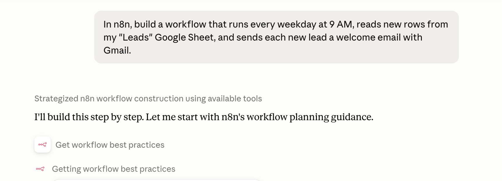

# Build with MCP

Model Context Protocol (MCP) is a standard way for AI tools to connect to other apps. n8n has a built-in MCP server, so you can describe the workflow you want in your favorite AI tool — like Claude, ChatGPT, or a coding agent — and it connects straight to your n8n instance to build and run that workflow for you.

This page gives an overview of what building with MCP looks like in n8n. For setup, authentication, and client configuration, follow the MCP guides in **Connect**.


**Ready to set it up?** The full how-to lives in Connect:

* [Connect to n8n MCP server](https://app.gitbook.com/s/r7wKI4I1BgdBCuq5Cvcx/connect-to-n8n-mcp-server) — enable the server, authenticate clients, and expose workflows.
* [MCP server tools reference](https://app.gitbook.com/s/r7wKI4I1BgdBCuq5Cvcx/connect-to-n8n-mcp-server/mcp-server-tools-reference) — every tool an MCP client can call.


## What is MCP?

Model Context Protocol (MCP) is an open standard for connecting AI applications to external systems. It defines two roles:

* An **MCP server** exposes a set of tools and resources. n8n provides a built-in MCP server to let AI apps interface with n8n workflows and resources.
* An **MCP client** — such as Claude Desktop, Claude Code, Codex, or a custom agent - connects to that server and calls those tools on your behalf.

## What building with MCP means in n8n

When you connect an AI tool to n8n's MCP server, your n8n instance becomes a place that tool can build in directly. Instead of you dragging nodes onto the canvas and wiring them together by hand, you describe the workflow you want in plain language to your favorite AI tool, which then builds it in n8n for you.

* **Create new workflows** from a description, and **edit existing ones** (n8n 2.13 onward).
* **Build and manage data tables** to store and reuse data across your workflows.
* **Iterate as you go:** run and test what you've built, review the results, and refine it — all from the same conversation, without switching back to the editor.
* **Search for and run workflows** you already have access to.

[Enable Instance-level MCP](https://app.gitbook.com/s/r7wKI4I1BgdBCuq5Cvcx/connect-to-n8n-mcp-server#enabling-mcp-access) to start building, testing, and running your n8n workflows from an AI application.

### Related MCP features

Instance-level MCP isn't the only way n8n works with MCP:

* **[MCP Server Trigger node](https://app.gitbook.com/s/BKcbOzIWja8NfqKDcqHc/builtin/core-nodes/n8n-nodes-langchain.mcptrigger):** build a single workflow that acts as its own MCP server, exposing only the tools you design inside it. Use this to hand-craft a custom MCP server for other AI apps to call.
* **[MCP Client Tool node](https://app.gitbook.com/s/BKcbOzIWja8NfqKDcqHc/builtin/cluster-nodes/sub-nodes/n8n-nodes-langchain.toolmcp):** go the other direction and let an n8n workflow act as an MCP client that calls external MCP servers.

## Learn more

* [Connect to n8n MCP server](https://app.gitbook.com/s/r7wKI4I1BgdBCuq5Cvcx/connect-to-n8n-mcp-server) — set up instance-level MCP access, authenticate clients (OAuth2 or access token), expose workflows, and see client examples.
* [MCP server tools reference](https://app.gitbook.com/s/r7wKI4I1BgdBCuq5Cvcx/connect-to-n8n-mcp-server/mcp-server-tools-reference) — full list of available tools and their parameters.
* [MCP Server Trigger node](https://app.gitbook.com/s/BKcbOzIWja8NfqKDcqHc/builtin/core-nodes/n8n-nodes-langchain.mcptrigger) — expose tools from a single workflow.
