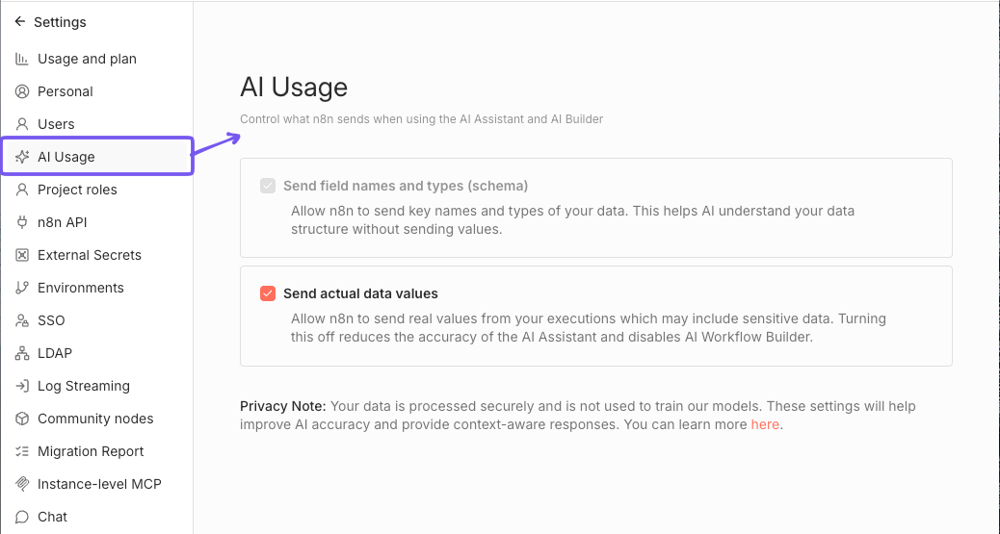

# AI Assistant 

The n8n AI Assistant helps you build, debug, and optimize your workflows seamlessly. From answering questions about n8n to providing help with coding and [expressions](https://app.gitbook.com/s/CxSeOtVxqqhfxMSac0AV/key-concept-glossary#expression-n8n), the AI Assistant can streamline your workflow-building process and support you as you navigate n8n's capabilities.

## Current capabilities 

The AI Assistant offers a range of tools to support you:

- **Debug helper**: Identify and troubleshoot node execution issues in your workflows to keep them running without issues.
- **Answer n8n questions**: Get instant answers to your n8n-related questions, whether they're about specific features or general functionality.
- **Coding support**: Receive guidance on coding, including SQL and JSON, to optimize your nodes and data processing.
- **Expression assistance**: Learn how to create and refine [expressions](../work-with-data/expressions-versus-data-nodes.md) to get the most out of your workflows.
- **Credential setup tips**: Find out how to set up and manage node [credentials](https://app.gitbook.com/s/BKcbOzIWja8NfqKDcqHc/builtin/credentials) securely and efficiently.

## Tips for getting the most out of the Assistant 

1. **Engage in a conversation**: The AI Assistant can collaborate with you step-by-step. If a suggestion isn't what you need, let it know! The more context you provide, the better the recommendations will be.

2. **Ask specific questions**: For the best results, ask focused questions (for example, "How do I set up credentials for Google Sheets?"). The assistant works best with clear queries.
3. **Iterate on suggestions**: Don't hesitate to build on the assistant's responses. Try different approaches and keep refining based on the assistant's feedback to get closer to your ideal solution.
4. **Things to try out**:
    - Debug any error you're seeing
    - Ask how to setup credentials
    - "Explain what this workflow does."
    - "I need your help to write code: [Explain your code here]"
    - "How can I build X in n8n?"

## AI usage settings 


Available in n8n v2.7.0 and above.


You can manage your AI usage settings by navigating to **Settings** > **AI Usage** in your n8n instance. Here, you can control what data is shared with the AI Assistant. 

These settings are only available to the instance owners and administrators, and will apply to all users on the instance.

Toggle whether to share actual workflow data (like node names, parameters, and structure) with the AI Assistant. Disabling this option will limit the assistant's ability to provide context-aware help based on your workflows.

Since access to workflow data is essential for the AI Workflow builder to function, **disabling this option will also disable the AI Workflow builder feature**.

### Disable sending data 

To stop sending actual data values to the AI Assistant, turn off the **Send actual data values** checkbox on the **AI Usage** settings page.

## FAQs 

### What context does the Assistant have? 

The AI Assistant has access to all elements displayed on your n8n screen, excluding actual input and output data values (like customer information). To learn more about what data n8n shares with the Assistant, refer to [AI in n8n](https://app.gitbook.com/s/ukPPOMQ6NId4gpAIkPXa/privacy#ai-in-n8n).

### Who can use the Assistant? 

Any user on a Cloud plan can use the assistant.

### How does the Assistant work? 

The underlying logic of the assistant is build with the advanced AI capabilities of n8n. It uses a combination of different [agents](https://app.gitbook.com/s/CxSeOtVxqqhfxMSac0AV/key-concept-glossary#ai-agent), specialized in different areas of n8n, RAG to gather knowledge from the docs and the community forum, and custom prompts, [memory](https://app.gitbook.com/s/CxSeOtVxqqhfxMSac0AV/key-concept-glossary#ai-memory) and context.

