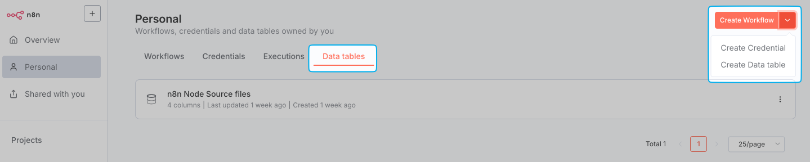

# Data tables 

## Overview 

Data tables integrate data storage within your n8n environment. Using data tables, you can save, manage, and interact with data directly in your workflows without relying on external database systems for scenarios such as:

- Persisting data across workflows in the same project
- Storing markers to prevent duplicate runs or control workflow triggers
- Reusing prompts or messages across workflows
- Storing evaluation data for AI workflows
- Storing data generated from workflow executions
- Combining data from different sources to enrich your datasets
- Creating lookup tables as quick reference points within workflows

## Working with data tables 

You can create, filter, and manage data tables and their data in three ways: using the **Data Table node**, the **DataTable API endpoint** , or the **Data tables tab**.

### Data Table node 

Use data tables inside workflows to store and manage data, enabling automated creation, retrieval, updates, and deletions as your workflow runs.

See the [Data Table node](https://app.gitbook.com/s/BKcbOzIWja8NfqKDcqHc/builtin/core-nodes/n8n-nodes-base.datatable) for full documentation.

### DataTable API endpoint 

Work with data tables programmatically using the `/datatables` endpoint in the n8n API.

See the [API reference](https://docs.n8n.io/api/api-reference/#tag/datatable) for full documentation.

### Data table tab 

View and work with data tables directly in the UI through a visual interface. This lets you browse and edit data, and manage tables without building a workflow.

1. In your n8n project, select the **Data tables** tab.
2. Click the split button located in the top right corner and select **Create Data table**.

    

3. Enter a descriptive name for your table.

4. Select how to create the table:
    - **From scratch**: Create a new table by manually defining columns and adding rows using the visual interface.
    - **Import CSV**: Upload a CSV file to automatically create the table structure and populate it with data from the file.
   
    In the table view that appears, you can:
    
    * Rename or delete the data table or its columns
    * Add and reorder columns to organize your data
    * Add, delete, and update rows
    * Edit existing data

## Exporting and importing data 

From the **Data tables** tab, you can: 

- Import CSV data directly into a data table, as described in the [previous section](#data-table-tab)
- Download a CSV of your data table. Click the three dot menu in the top left and select **Download CSV**.

## Considerations and limitations of data tables 

- Data tables are suitable for light to moderate data storage. By default, the total storage used by all data tables in an instance is limited to 50MB. In self-hosted environments, you can increase this default size limit using the environment variable `N8N_DATA_TABLES_MAX_SIZE_BYTES`.
- When your data tables approach 80% of your storage limit, n8n displays a warning. A final warning appears when you reach the storage limit. Exceeding this limit will disable manual additions to tables and cause workflow execution errors during attempts to insert or update data.
- By default, data tables created within a project are accessible to all team members in that project.
- Admins and Owner can see all Users' data tables.
- Direct programmatic access to data tables from a Code node isn't supported. You can't access data table values via built-in methods or variables.

## Data tables versus variables 

| Feature | Data tables | Variables |
|---------|-------------|-----------|
| Unified tabular view | ✓ | ✗ |
| Row-column relationships | ✓ | ✗ |
| Cross-project access | ✗ | ✓ |
| Individual value display | ✗ | ✓ |
| Optimized for short values | ✗ | ✓ |
| Structured data | ✓ | ✗ |
| Scoped to projects | ✓ | ✗ |
| Use values as expressions | ✗ | ✓ |
