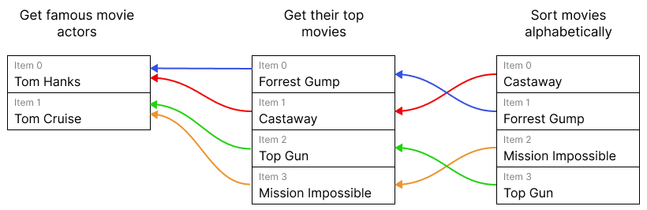

# Item linking errors 

In n8n you can reference data from any previous node. This doesn't have to be the node just before: it can be any previous node in the chain. When referencing nodes further back, you use the expression syntax `$(node_name).item`. 

<figure markdown>

<figcaption markdown>Diagram of threads for different items. Due to the item linking, you can get the actor for each movie using `$('Get famous movie actors').item`.</figcaption>
</figure>

Since the previous node can have multiple items in it, n8n needs to know which one to use. When using `.item`, n8n figures this out for you behind the scenes. Refer to [Item linking concepts](how-items-link-through-workflows.md) for detailed information on how this works.

`.item` fails if information is missing. To figure out which item to use, n8n maintains a thread back through the workflow's nodes for each item. For a given item, this thread tells n8n which items in previous nodes generated it. To find the matching item in a given previous node, n8n follows this thread back until it reaches the node in question.

When using `.item`, n8n displays an error when:

- The thread is broken
- The thread points to more than one item in the previous node (as it's unclear which one to use)

To solve these errors, you can either avoid using `.item`, or fix the root cause.

You can avoid `.item` by using `.first()`, `.last()` or `.all()[index]` instead. They require you to know the position of the item that you're targeting within the target node's output items. Refer to [Referencing previous nodes](../reference-previous-nodes.md) for more detail on these methods.

The fix for the root cause depends on the exact error.

### Fix for 'Info for expressions missing from previous node' 

If you see this error message:

> ERROR: Info for expression missing from previous node

There's a node in the chain that doesn't return pairing information. The solution here depends on the type of the previous node:

- Code nodes: make sure you return which input items the node used to produce each output item. Refer to [Preserving linking in the Code node](preserving-linking-in-the-code-node.md) for more information.
- Custom or community nodes: the node creator needs to update the node to return which input items it uses to produce each output item. Refer to [Item linking for node creators](item-linking-for-node-creators.md) for more information.

### Fix for 'Multiple matching items for expression' 

This is the error message:

> ERROR: Multiple matching items for expression

Sometimes n8n uses multiple items to create a single item. Examples include the Summarize, Aggregate, and Merge nodes. These nodes can combine information from multiple items.

When you use `.item` and there are multiple possible matches, n8n doesn't know which one to use. To solve this you can either:

- Use `.first()`, `.last()` or `.all()[index]` instead. Refer to [Referencing previous nodes](../reference-previous-nodes.md) for more detail on these methods.
- Reference a different node that contains the same information, but doesn't have multiple matching items.
