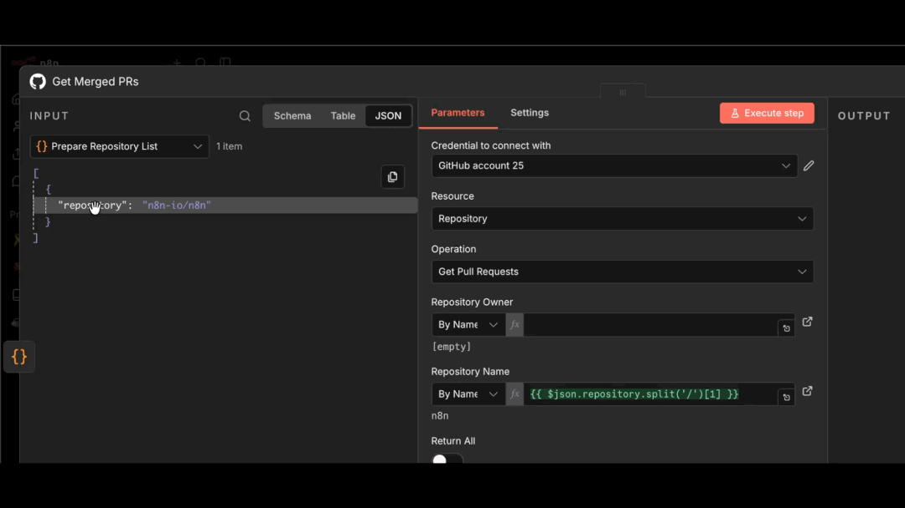

# Referencing data in the UI 

Data mapping means referencing data from previous nodes. It doesn't include changing (transforming) data, just referencing it.

When you need data from a particular node in your workflow, you can [reference nodes by name](reference-previous-nodes.md). This is useful when your workflow has multiple branches or when you need to access data from several steps back.

You can map data in the following ways:

* Using the expressions editor.
* By dragging and dropping data from the **INPUT** pane into node parameters. This generates the expression for you.

For information on errors with mapping and linking items, refer to [Item linking errors](link-data-items/item-linking-errors.md).

See [Common ways of referencing](reference-previous-nodes.md#common-ways-of-referencing).
