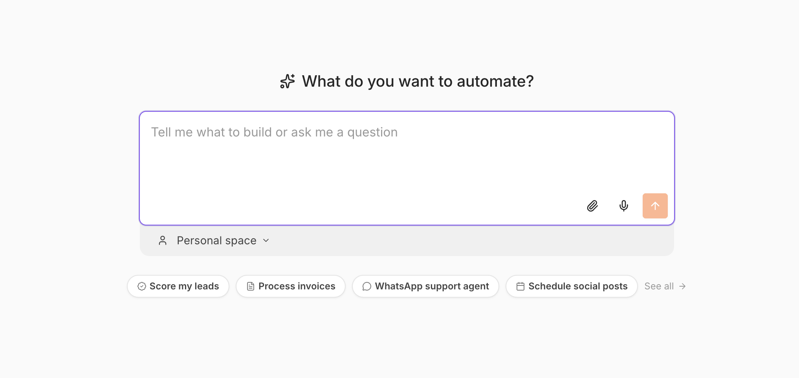
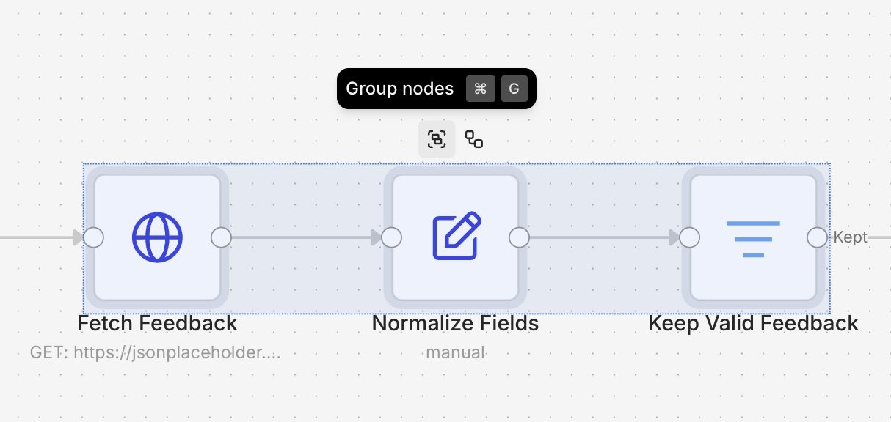
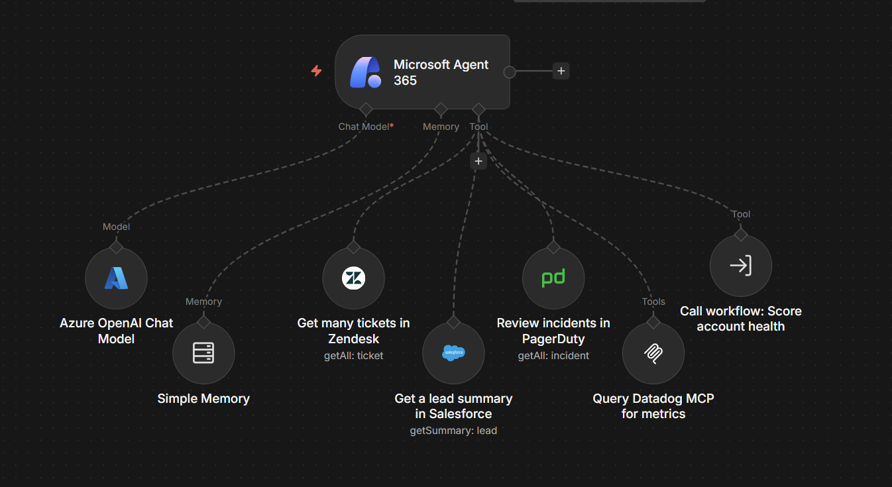
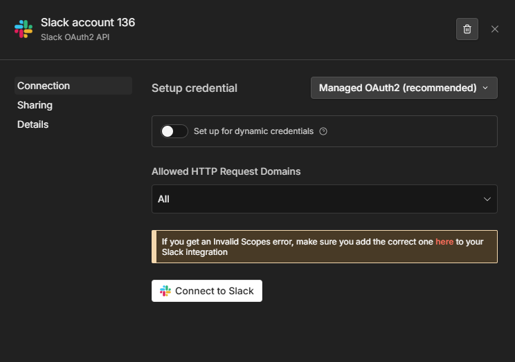
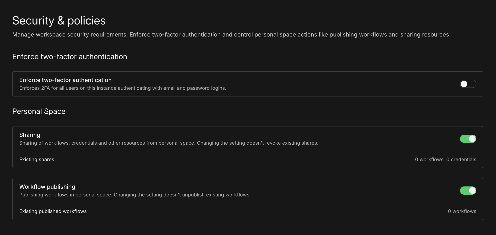
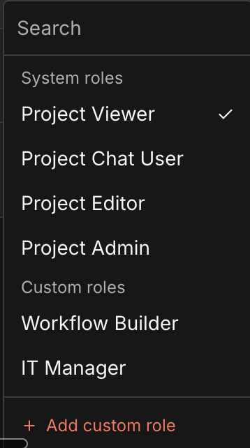
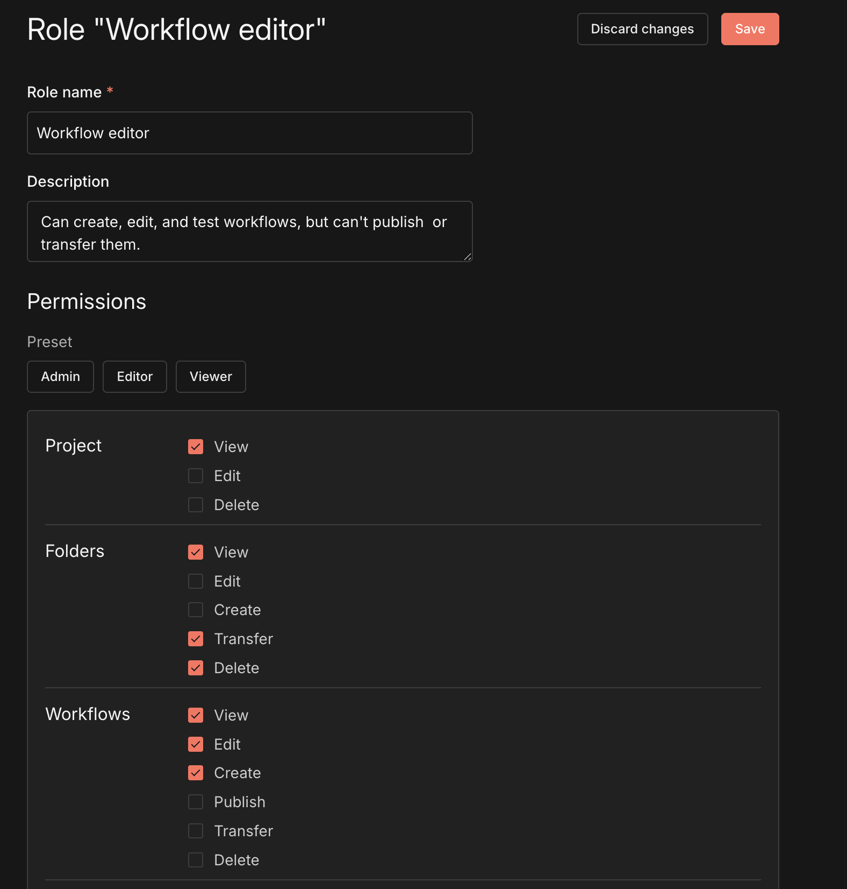
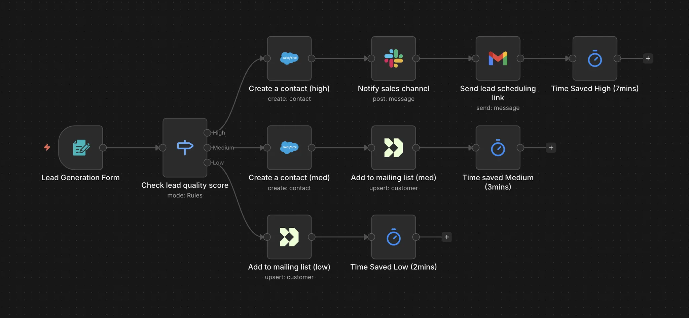
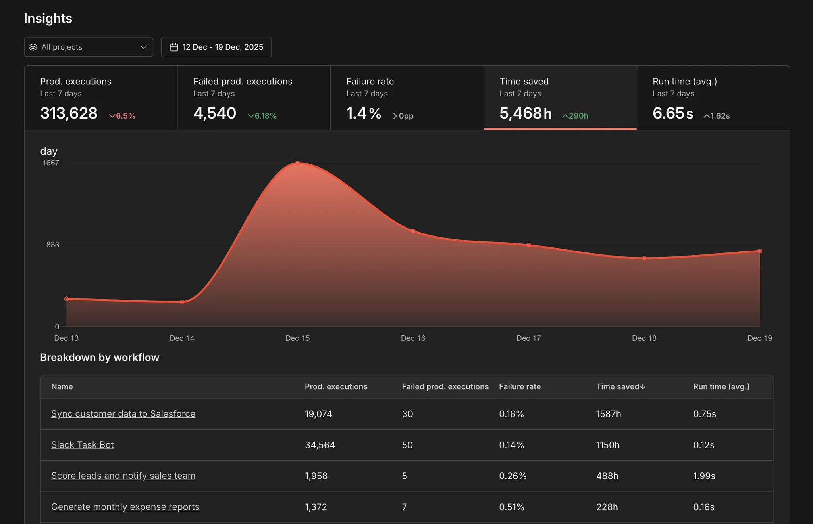

# Changelog

Every n8n release moves the platform forward. The changelog is where we call out the changes that matter most to the technical teams who build on n8n: new capabilities, more control over how your workflows run, and clearer visibility into what they're actually doing. Each entry is tied to the version it shipped in, newest first, and written to stand on its own, so it's easy to share the one update your team has been waiting for.


Use this page alongside n8n's other release resources depending on what you need:

* **Changelog** (this page): a curated, narrative summary of the most important new features as they're rolled out.
* [Release notes](release-notes.md): a listing of all feature-level updates in each release.
* [GitHub releases](https://github.com/n8n-io/n8n/releases): full change detail of each release, linked to commits, including bug fixes and minor changes.

Old-style release notes pages for [2.x](release-notes-2.x.md), [1.x](release-notes-1.x.md), and [0.x](release-notes-0.x.md) remain archived. Everything in the 2.x archive is covered by this changelog and the Release notes.

For guidance on major version upgrades, see [v3.0 breaking changes](v30-breaking-changes.md), [v2.0 breaking changes](v20-breaking-changes.md), [v2.0 migration tool](v20-migration-tool.md), and [v1.0 migration guide](v10-migration-guide.md).




## Use AI models and tool services without setting up provider accounts or credentials

**Released:** 2026-09-02 in [n8n 2.36](release-notes.md#n8n235)

You can now use supported AI models and services in n8n Cloud without first creating an account with each provider, setting up billing, or adding an API key. [Gateway credits](https://docs.n8n.io/deploy/use-n8n-cloud/gateway-credits) let you start building with a prepaid balance managed through n8n.

Supported AI providers include OpenAI, Anthropic, Google Gemini, Alibaba Cloud Qwen, MiniMax, and Moonshot Kimi. You can also use credits with Brave Search, Firecrawl, Browserbase, LlamaParse, and PDF.co.


On a supported node, select **Gateway credits** when setting up the credential and run your workflow. The choice is made per node, so the same workflow can use Gateway credits for one service and your own provider credentials for another.


Usage is deducted from a shared prepaid balance for the n8n instance. We align Gateway credit rates with publicly listed provider pricing wherever possible, and publish the rates for every supported service on our [service pricing page](https://app.n8n.cloud/service-pricing).

Instance owners can add funds manually or configure automatic top-ups based on a balance threshold, target balance, and optional monthly limit. You can track your remaining balance and spend from **Cloud Admin Panel>Manage > Gateway credits**, including breakdowns by model and workflow.

You can continue using your own provider credentials as before. Gateway credits give you another option when you want to get started without setting up and managing a separate provider account first.

For more details, see the [Forum post](https://community.n8n.io/t/310859).

## AI Assistant on self-hosted n8n: set up in minutes

**Released:** 2026-08-18 in [n8n 2.35](release-notes.md#n8n235)

The AI Assistant [arrived on n8n Cloud in July](./#ai-assistant-describe-a-goal-get-a-working-automation) and has worked on self-hosted n8n since then, but getting there meant enabling the `instance-ai` module and configuring a sandbox, a model, and web search through environment variables. n8n 2.35 enables the module by default, adds a one-line install that pre-configures the pieces you would otherwise assemble yourself, and allows you to choose your model provider, sandbox, and search directly in the UI.

Self-hosted setup needs two things, plus one worth adding:

* **A model provider.** Bring an API key for Anthropic, OpenAI, or OpenRouter, or point n8n at any OpenAI-compatible endpoint, including a local one. You pay the provider directly, and your prompts, workflow content, and the execution data the assistant reads go to that provider.
* **A sandbox.** The assistant runs code to build and test what you ask for, and that code executes in an isolated sandbox, never on your n8n server. n8n's bundled sandbox runs on your own Docker host and suits local development and testing. For production, we recommend you use Daytona's managed sandbox with an API key.
* **Web search, optional but worth adding.** With it the assistant reads current docs and APIs instead of relying on what its model remembers, through a bundled SearXNG instance or a Brave Search API key.

On a brand-new instance, one command sets up everything except the model key:

```bash
curl -fsSL https://get.n8n.io | sh
```

It installs n8n with Docker Compose and pre-configures the sandbox and SearXNG web search, both free. Open the editor, add your model API key in the instance's AI settings, and start building. On an existing Docker install, the [AI Assistant setup guide](https://app.gitbook.com/s/jm0ZYRpZIPWge2ZSiDYO/host-n8n/configure-n8n/set-up-ai-assistant) covers the sandbox and search options for each deployment shape, in environment variables or in the UI.

AI Assistant requires Docker. npm installs will stop working with n8n 3.0 in October, so new installs should use the [one-line setup](https://app.gitbook.com/s/jm0ZYRpZIPWge2ZSiDYO/host-n8n/install-options/one-line-setup) or [Docker Compose](https://app.gitbook.com/s/jm0ZYRpZIPWge2ZSiDYO/host-n8n/install-options/install-using-docker-compose).


**Preview status**

AI Assistant is in Preview. It can make mistakes, and its behavior may change while it's in development. Always review generated workflows before using them in production.


Learn more in the [AI Assistant documentation](https://app.gitbook.com/s/rPN1zU5jaYNvwH7RzxqA/ways-of-building-workflows/ai-assistant).


**Feature availability**

Self-hosted Enterprise support is coming. Enterprise customers who want to try AI Assistant before then can contact their Customer Success Manager about preview access.


## Return webhook responses of any size from your workers

**Released:** 2026-08-04 in [n8n 2.34](release-notes.md#n8n234)

Your queue mode workers can now return a webhook response however large the payload. In queue mode the worker runs the execution, but the client that made the request stays connected to the main or webhook instance, so a response from a [Respond to Webhook](https://app.gitbook.com/s/BKcbOzIWja8NfqKDcqHc/builtin/core-nodes/n8n-nodes-base.respondtowebhook) node has to travel back through the queue. Redis holds the whole response while that message is in flight, which is why n8n caps it at 64 MiB by default (`N8N_WEBHOOK_RESPONSE_RELAY_SIZE_MAX`). A response that serialized to more than that failed the node: a wide result set from a database query, a batch of aggregated API calls, or a CSV or XML document assembled in the workflow.

Set `N8N_WEBHOOK_RESPONSE_RELAY_OFFLOAD_ENABLED=true` on your workers and n8n stores a response body above that limit in [binary data storage](https://app.gitbook.com/s/jm0ZYRpZIPWge2ZSiDYO/host-n8n/configure-n8n/scaling/handle-binary-data) instead. The queue message then carries only a reference, the main instance streams the body from storage to the client, and n8n deletes the stored copy once it delivers the response, so nothing accumulates. Redis memory stays flat no matter how large the response gets.

Offloading needs a `N8N_DEFAULT_BINARY_DATA_MODE` that stores data (any mode except `default`) and storage that every instance can read. n8n recommends `s3` or `azure`, since both stream the body a chunk at a time. Only a main instance running n8n 2.34.0 or later can read an offloaded body, so the variable ships turned off: upgrade your main and webhook instances first, then enable it on your workers.

Refer to [Large webhook responses](https://app.gitbook.com/s/jm0ZYRpZIPWge2ZSiDYO/host-n8n/configure-n8n/scaling/enable-queue-mode#large-webhook-responses) for the full configuration, upgrade order, and troubleshooting.

## Read and write SharePoint Excel workbooks directly in n8n

**Released:** 2026-07-28 in [n8n 2.33](release-notes.md#n8n233)

You can now read and write Excel workbooks stored in SharePoint document libraries, including files shared through Microsoft Teams sites, using the new Microsoft Excel (SharePoint) node. This gives you direct access to workbook data without needing separate authentication or intermediate steps to retrieve file contents.

The node supports two authentication methods: sign in as a person using a Microsoft OAuth2 credential with the `Sites.ReadWrite.All` (or `Sites.Read.All`) scope, or sign in as an app using a Microsoft Entra Service Principal credential for unattended workflows that require no user interaction.

Learn more in the [Microsoft Excel (SharePoint) node documentation](https://app.gitbook.com/s/BKcbOzIWja8NfqKDcqHc/builtin/app-nodes/n8n-nodes-base.microsoftexcelsharepoint).

## Capture who approved and when in human-in-the-loop steps

**Released:** 2026-07-07 in [n8n 2.30](release-notes.md#n8n230)

You can now get a full audit trail for every human-in-the-loop step in your workflows. Every Send and Wait node across Slack, Telegram, Discord, WhatsApp, Google Chat, Gmail, Outlook, Email/SMTP, Microsoft Teams, and the Chat Trigger node now includes a `respondedAt` ISO-8601 timestamp in its output the moment n8n receives a response. No configuration is required: the field appears automatically alongside the existing `approved`, `text`, or `form` fields and does not change the output shape for existing workflows.

For Slack and Telegram, you can go further with the new Advanced Interactivity options on the Send and Wait for Response operation. Approvers respond with a single tap or click inside the app itself, and the node output records who responded: their ID, name, username, and (for Slack, when scopes allow) email, plus the channel and message ID. You can restrict which users are allowed to approve by listing their IDs in Restrict Who Can Approve. Anyone not on the list gets a private notice you can word yourself, and the workflow keeps waiting. You can also control what happens to the message after a decision with the After Decision setting: show the outcome and remove the buttons (the default), remove the buttons only, or leave the message unchanged.

To enable approvals in Slack, your n8n instance must be reachable from Slack over public HTTPS. You will need to turn on Interactivity in your Slack app, set the **Request URL** to `https://<your-n8n-instance>/webhook-waiting-slack`, and paste your app's signing secret into the **Signature Secret** field of your Slack credential. Then, in the Slack node, set **Response Type** to **Approval** and turn on **Capture Who Responded** under the **Advanced Interactivity** section. For Telegram, your instance must be reachable over public HTTPS on a port Telegram supports for webhooks (443, 80, 88, or 8443). Enable **Approve Within Chat** in the same section: n8n registers the webhook for you using your existing Telegram credential, with no additional setup on Telegram's side.

Learn more in the [Approvals in Slack documentation](https://app.gitbook.com/s/BKcbOzIWja8NfqKDcqHc/builtin/app-nodes/n8n-nodes-base.slack/approvals).

## App-only authentication for Microsoft nodes

**Released:** 2026-07-07 in [n8n 2.30](release-notes.md#n8n230)

You can now authenticate Microsoft nodes with a [Microsoft Entra Service Principal](https://app.gitbook.com/s/BKcbOzIWja8NfqKDcqHc/builtin/credentials/microsoftentraserviceprincipal), so workflows run as an application instead of a signed-in user. OneDrive and Outlook gained the option in n8n 2.29; Excel 365, Microsoft Teams, and Microsoft To Do follow in n8n 2.30, all sharing a single app-only credential.

Until now, Microsoft automations were tied to a person's OAuth session: when that person left the company or their token expired, the workflow broke. With app-only authentication, the workflow authenticates non-interactively with tenant-level permissions and targets the user, mailbox, drive, or site you specify: read a shared mailbox, process files in any user's drive, or post to Teams channels with nobody logged in. OAuth2 remains the default everywhere, so existing workflows are untouched, and operations that only make sense for a signed-in user are disabled per node with a clear error.

_OneDrive and Outlook support released in n8n 2.29 (2026-06-30)._

## mTLS authentication for Kafka

**Released:** 2026-07-07 in [n8n 2.30](release-notes.md#n8n230)

The [Kafka credential](https://app.gitbook.com/s/BKcbOzIWja8NfqKDcqHc/builtin/credentials/kafka) now supports mutual TLS: provide a CA certificate, client certificate, and private key (PEM) to connect to brokers that require client-certificate authentication. mTLS applies to the Kafka node, the Kafka Trigger, and the credential test, and n8n validates that certificate and key match before you save.

## AI Assistant: describe a goal, get a working automation

**Released:** 2026-07-09 in [n8n 2.29.9](release-notes.md#n8n229)

You can now describe an automation in plain language and have AI Assistant plan, build, test, and iterate on it until it actually runs. Open the chat from anywhere in your instance, or expand it into a side-by-side view with the workflow canvas, and tell it what you want to automate. It proposes a structured plan, asks clarifying questions, builds the workflow in your selected project, executes it as it goes, and fixes the errors it finds.

<figure><figcaption><p>Describe what you want to automate, or start from a suggestion.</p></figcaption></figure>

AI Assistant supersedes the AI Workflow Builder, and the difference is autonomy. The AI Workflow Builder generated a workflow and handed off, leaving you to run it and debug failures yourself. AI Assistant works toward your goal: it runs what it builds, detects failures, and retries until the automation works. Its scope is broader than building, too. It can manage executions, credentials, nodes, and Data Tables, run one-off tasks, and research the web when web access is enabled. Credential setup happens progressively as it builds: fill values in manually, let it fetch what it can, or mock and skip where needed, with secrets never exposed in the chat.

Every workflow it builds is a normal n8n workflow: a visible canvas you can open, inspect, edit, and publish, with step-by-step execution logs to audit, built on the 400+ integrations n8n already ships instead of rebuilt API connections. You stay in control throughout: high-impact actions such as publishing wait for your approval. This is an early first step, and we want your feedback on where to take it next.


**Preview status**

This feature is in Preview. It can make mistakes, and its behavior may change while it's in development. Always review generated workflows before using them in production.


Learn more in the [AI Assistant documentation](https://app.gitbook.com/s/rPN1zU5jaYNvwH7RzxqA/ways-of-building-workflows/ai-assistant).


**Availability:** n8n Cloud at release. Self-hosted setup followed in n8n 2.35: refer to [AI Assistant on self-hosted n8n](./#ai-assistant-on-self-hosted-n8n-set-up-in-minutes).


## MCP server updates

**Released:** 2026-06-30 in [n8n 2.29](release-notes.md#n8n229)

We've shipped a number of updates to the n8n MCP server over the past few weeks. Here's a roundup, with the version each change landed in.

* **Build with custom and community nodes.** You can now use your installed custom and community nodes in the workflows you build, not just the built-in ones (n8n 2.29).
* **Read and change workflow settings.** Workflow settings are now editable through the MCP server, so you can connect an error workflow, set the timezone, or adjust execution options (n8n 2.29).
* **View and restore workflow history.** You can now browse a workflow's version history and restore an earlier version (n8n 2.29).
* **More reliable credential assignment.** Fixed a bug where the server could assign a credential that wasn't valid for a node (n8n 2.28).
* **Look up real field values.** Dynamic fields like Slack channels or Google Sheets tabs now resolve to live values, so nodes are configured with valid selections instead of placeholder IDs (n8n 2.27).
* **Work with tags.** Tags are now supported, so you can filter a workflow search by tag and apply tags when creating or updating workflows (n8n 2.27).
* **Faster, targeted edits.** Workflow updates now change only the nodes that need to change instead of rewriting the whole thing (n8n 2.22).
* **List and choose credentials.** You can now list the credentials on your instance and pick the right one when several could apply, for example among five Gmail credentials (n8n 2.21).

Learn more in the [n8n MCP server documentation](https://app.gitbook.com/s/r7wKI4I1BgdBCuq5Cvcx/connect-to-n8n-mcp-server).

## GitHub App authentication

**Released:** 2026-06-30 in [n8n 2.29](release-notes.md#n8n229)

The [GitHub node](https://app.gitbook.com/s/BKcbOzIWja8NfqKDcqHc/builtin/app-nodes/n8n-nodes-base.github) and [GitHub Trigger](https://app.gitbook.com/s/BKcbOzIWja8NfqKDcqHc/builtin/trigger-nodes/n8n-nodes-base.githubtrigger) can now authenticate as a GitHub App, alongside the existing personal access token and OAuth2 options.

A personal access token belongs to a person. The workflow that triages issues or merges release PRs runs with one engineer's identity and access, so it stops working the day they change teams or leave. Until then, its actions appear in the audit log as that engineer working by hand.

A GitHub App belongs to the organization. You register it once and install it on the repositories it should reach. Grant only the permissions it needs (read pull requests, write issues) rather than the broad `repo` scope a classic token hands out. Nobody's departure breaks it, its activity is attributed to the app rather than a colleague, and it gets its own rate limit.

To set it up, create the App in your organization settings, install it, and generate a private key. In n8n, create a GitHub App credential and enter the App ID, the Installation ID, and that private key. n8n signs the JWT, exchanges it for an installation access token, and refreshes the token as it expires, so there is nothing to rotate on a schedule.

Existing credentials are untouched. Personal access token and OAuth2 stay available and stay selected on saved nodes, so this is an option to move to rather than a migration.

## Insights alerts you when date ranges exceed available data

**Released:** 2026-06-30 in [n8n 2.29](release-notes.md#n8n229)

When you select a date range in the Insights dashboard, you can now see at a glance whether your data retention policy covers that period. Instead of staring at an empty chart and wondering whether something is broken, an alert banner tells you exactly what is happening with your data coverage.

Three states guide you as you work with custom date ranges:

* **No data in range:** The entire selected period falls outside your retention window, so no executions are available to display.
* **Partial data:** Some executions exist within the range. The alert specifies the earliest available date so you know where your data begins.
* **Complete data:** All executions in the selected range are present. No alert appears.

To use this, open the Insights dashboard, choose a date range with the date range picker, and check the alert banner at the top of the dashboard. If you see a partial or no-data alert, adjust your range to align with the dates your retention policy covers. Note that the alerts reflect your current retention configuration and do not extend how long execution data is stored.

Learn more in the [insights retention documentation](https://app.gitbook.com/s/wMJrGrimpx3PxCJpUswm/observe-and-log/track-usage-with-insights#disable-or-configure-insights-metrics-collection).


**Availability:** Pro, Business, and Enterprise.


## Organize large workflows with Canvas Groups

**Released:** 2026-06-23 in [n8n 2.28](release-notes.md#n8n228)

You can now organize related nodes into a single named Canvas Group and collapse it for a cleaner view. Group the nodes that handle one part of a workflow, give the group a name, and collapse it to hide the detail until you need it. A large workflow that used to sprawl across the canvas shrinks to a handful of labeled blocks you can read at a glance, so it's faster to find your way around a workflow a teammate built or one you haven't opened in months.

<figure><figcaption><p>Select a connected run of nodes, then group them with the Group nodes button or Ctrl/Cmd + G.</p></figcaption></figure>

To create a group, select a connected run of nodes by dragging a box around them or holding `Ctrl/Cmd` and clicking each one, then press `Ctrl/Cmd` + `G` or select the **Group nodes** icon in the toolbar. n8n creates the group and highlights the name field so you can name it straight away. Collapse or expand a group with its toggle icon, and ungroup it at any time with `Ctrl/Cmd` + `Shift` + `G`, which leaves the nodes on the canvas.

A Canvas Group is saved with the workflow, so anyone who opens it sees the same structure. Whether a group is collapsed or expanded is a personal preference stored in your browser, so your view stays put when you come back without changing what teammates see. A few rules decide which nodes you can combine into one group: triggers stay outside them, the nodes have to form one connected chain, and an AI node keeps its sub-nodes (chat model, memory, and tools) inside the same group.

Learn more in the [Canvas Groups documentation](https://app.gitbook.com/s/rPN1zU5jaYNvwH7RzxqA/understand-workflows/workflow-components/canvas-groups).

## GitHub node: manage the full pull request lifecycle

**Released:** 2026-06-23 in [n8n 2.28](release-notes.md#n8n228)

The [GitHub node](https://app.gitbook.com/s/BKcbOzIWja8NfqKDcqHc/builtin/app-nodes/n8n-nodes-base.github) now has a dedicated Pull Request resource. The whole life of a pull request is available as node operations, instead of hand-rolled HTTP Request calls against the GitHub API.

Create a pull request from one branch into another, including drafts and PRs from a fork. Update its title, body, state, or base branch as it moves along, and close or reopen it. Fetch a single PR to read its current state, and create or edit comments on it. Merge with the method your repository is configured for: merge commit, squash, or rebase, with merge queues handled for you.

Two operations return the change itself rather than its metadata. Get Diff and Get Patch fetch the raw diff and patch, which is what makes a pull request usable as workflow input. Hand the diff to an AI agent for a first-pass review, scan it for files that need sign-off, or post a summary to the repository's channel.

All of this was possible with the HTTP Request node, but you had to know the REST paths, assemble the payload for each call, and interpret GitHub's responses yourself. The native operations take a repository and the fields each operation needs. Errors surface exactly as GitHub returns them, so a refused merge tells you why.

Refer to the [GitHub node documentation](https://app.gitbook.com/s/BKcbOzIWja8NfqKDcqHc/builtin/app-nodes/n8n-nodes-base.github#operations) for the full list of operations.

## Webhook node: Only Run If

**Released:** 2026-06-23 in [n8n 2.28](release-notes.md#n8n228)

The [Webhook node](https://app.gitbook.com/s/BKcbOzIWja8NfqKDcqHc/builtin/core-nodes/n8n-nodes-base.webhook) gains an expression-based Only run if option that rejects requests that don't match a condition before an execution starts. Filter out health checks, retries, or irrelevant events at the door instead of starting a run that immediately exits: fewer no-op executions, less noise in your execution list, and saved execution quota.

## One credential for multiple Microsoft nodes

**Released:** 2026-06-23 in [n8n 2.28](release-notes.md#n8n228)

The generic Microsoft OAuth2 API credential now works with Microsoft Excel 365, Outlook, Teams, To Do, and Graph Security, alongside OneDrive. Instead of registering a separate Microsoft Entra app for every Microsoft service you automate, you register one and grant it the delegated permissions your workflows need. To use it, open any supported node, set **Authentication** to **Microsoft OAuth2 (Graph)**, and select the credential. Your IT team approves and maintains a single app registration instead of one per service.

Set the credential's **Scope** field to the space-separated permissions the nodes you use require, for example `Files.ReadWrite.All` for OneDrive and Excel, or `Mail.ReadWrite` and `Mail.Send` for Outlook, always including `openid` and `offline_access`. Some permissions, such as `SecurityEvents.ReadWrite.All` for Graph Security, need admin consent. If your organization runs on a sovereign cloud (US Government, US Government DOD, or China), set the **Microsoft Graph API Base URL** on the credential and every node using it picks it up.

Nothing changes for existing workflows. On saved nodes the Authentication dropdown stays on the node-specific credential, so credentials like Microsoft Excel OAuth2 API keep working untouched. The generic credential is an additive option, not a replacement.

_Microsoft OneDrive support released in n8n 2.27 (2026-06-16)._

Learn more in the [Microsoft credentials documentation](https://app.gitbook.com/s/BKcbOzIWja8NfqKDcqHc/builtin/credentials/microsoft).

## Move workflows between instances as packages

**Released:** 2026-06-16 in [n8n 2.27](release-notes.md#n8n227)

You can now bundle workflows into a portable `.n8np` package and move them between n8n instances through the Public API or a matching set of CLI commands that wrap the same endpoints. Copying workflow JSON by hand always worked for one-off moves. Packages make it repeatable and automatable, carrying a set of workflows along with their credential stubs and a `manifest.json` describing their dependencies in a single file.

Imports are checked up front. If a conflict or an unresolved credential would block the import, n8n stops and lists the issues instead of leaving you half-migrated. For each import you choose whether to bring a workflow in as a new version, fail on the first conflict, or skip ones that already exist. Credentials are matched by ID and their secrets never travel in the package; n8n exports a stub you match on the target instance, or fills in empty placeholders for later.

This makes it easy to promote workflows from development to production, back up and restore an instance, hand a workflow to a teammate without sharing secrets, or migrate between instances.


**Preview status**

This feature is in Preview. The package format and APIs are still under development, and breaking changes may occur without a major version bump.


Learn more in the [n8n Packages documentation](https://app.gitbook.com/s/rPN1zU5jaYNvwH7RzxqA/manage-workflows/n8n-packages).

## Configure OpenTelemetry tracing from the UI

**Released:** 2026-06-16 in [n8n 2.27](release-notes.md#n8n227)

You can now configure OpenTelemetry tracing from **Settings > OpenTelemetry**. Until now, tracing meant setting environment variables on every n8n instance and restarting each one. That put it out of reach on n8n Cloud, where you don't control the environment. This brings workflow execution tracing to n8n Cloud for the first time.

Turn on **Enable OpenTelemetry**, enter your OTLP endpoint and any headers your collector needs, set your sampling and span options under **Tracing**, then select **Save settings**. To check the connection, select **Send test trace** under **Verify configuration**. n8n sends a single span and reports whether your collector accepted it. Changes apply without a restart, and in queue mode n8n reloads the configuration across your workers and webhook processors.

Each execution exports a `workflow.execute` span with the workflow ID, name, version, node count, execution mode, status, and error type. Nested inside it, a `node.execute` span per node records its input and output item counts. Both carry resource attributes identifying the instance and its role: main, worker, or webhook.

n8n also propagates W3C trace context in both directions. A `traceparent` header on an inbound webhook becomes the parent of the workflow span, and HTTP Request nodes inject one into outbound calls. Your executions then appear as part of a trace that crosses your whole stack, not as isolated spans.

On self-hosted instances, environment variables keep working and take precedence. Each field's tooltip names the variable it maps to, and n8n disables any field whose variable you've set. Leave a variable unset to manage that setting from the UI. You need to be an instance owner or admin to configure tracing.

Learn more in the [OpenTelemetry tracing documentation](https://app.gitbook.com/s/jm0ZYRpZIPWge2ZSiDYO/host-n8n/keep-n8n-running/trace-executions-with-opentelemetry).

## Web search for AI agents

**Released:** 2026-06-02 in [n8n 2.25.1](release-notes.md#n8n2251)

Your AI agents can now search the web out of the box. Enable web search from the agent's Advanced panel: where the model provider offers a native search tool, the agent uses it directly, and for providers without one, n8n falls back to Brave Search or a self-hosted SearXNG instance. Until now, giving an agent live web access meant wiring up a community node or an external API by hand; now it's built in, so agents can ground their answers in current information like prices, docs, and news, without extra setup.

## Form Trigger: restrict forms to logged-in users

**Released:** 2026-06-02 in [n8n 2.25.1](release-notes.md#n8n2251)

The [Form Trigger](https://app.gitbook.com/s/BKcbOzIWja8NfqKDcqHc/builtin/core-nodes/n8n-nodes-base.formtrigger) (node version 2.6 and later) adds an n8n User Auth authentication option. It limits a form to people signed in to your n8n instance. Select it from the node's **Authentication** dropdown and the form stops being public. Visitors who aren't signed in are redirected to the n8n login page, and a submission without a valid session is rejected with a 401.

This is about attribution as much as access. Every submission carries the authenticated user's ID, email, and first and last name alongside the form fields, taken from their n8n account rather than from anything they typed. Nobody can file a request under a colleague's name, and you don't need to ask for an email address at all. Downstream nodes can act on the submitter: open the ticket under their name, send the confirmation to their real address, or check them against an approver list. To keep those details out of your execution data, turn off **Include User in Output**.

That makes the Form Trigger a practical front door for internal requests: access requests, expense claims, IT tickets, anything where the submitter's identity matters. It works with every n8n login method, including SSO, so the form inherits the authentication your instance already enforces. It applies across every page of a multi-page form, not just the first.

## Rebuilt Odoo node and Oracle vector search

**Released:** 2026-05-27 in [n8n 2.23](release-notes.md#n8n223)

The [Odoo node](https://app.gitbook.com/s/BKcbOzIWja8NfqKDcqHc/builtin/app-nodes/n8n-nodes-base.odoo) has been rebuilt as v2, while existing v1 workflows keep working unchanged. The new version supports API-key authentication for Odoo 19+, searchable resource locators so you pick records from a list instead of pasting IDs, and dynamic field mapping on create and update that shows the actual fields of your Odoo instance, with read-only and computed fields hidden so you can't write to what can't be written. Contact, Opportunity, Activity, and Custom resources round out the coverage, and the node selects the right API transport for your Odoo version automatically.

### Oracle Database as a vector store

New [Oracle DB Vector Store](https://app.gitbook.com/s/BKcbOzIWja8NfqKDcqHc/builtin/cluster-nodes/root-nodes/n8n-nodes-langchain.vectorstoreoracledb) and [Oracle ONNX Embedding](https://app.gitbook.com/s/BKcbOzIWja8NfqKDcqHc/builtin/cluster-nodes/sub-nodes/n8n-nodes-langchain.embeddingsoracledb) nodes bring retrieval-augmented generation to data that lives in Oracle. Insert, load, and retrieve documents (including retrieve-as-tool for AI agents) with configurable distance strategies and metadata filtering that supports nested AND/OR conditions. Embeddings are generated by an ONNX model loaded in the database itself, so vectors and source data stay in one place. Requires an ONNX model in the database.

## Connect to MCP servers with less setup

**Released:** 2026-05-19 in [n8n 2.22](release-notes.md#n8n222)

Connect your agent to select MCP servers without setting up an [MCP Client node](https://app.gitbook.com/s/BKcbOzIWja8NfqKDcqHc/builtin/core-nodes/n8n-nodes-langchain.mcpclient) and credential by hand. Pick a server from the nodes panel, sign in, and it's available to your agent.

Initial coverage includes some of the most-used services in the official MCP registry (Apify, Linear, monday.com, Notion, and PostHog), and we'll expand the list to cover more services soon.

If you need to connect to an MCP server that isn't in the list, you can still use the [MCP Client node](https://app.gitbook.com/s/BKcbOzIWja8NfqKDcqHc/builtin/core-nodes/n8n-nodes-langchain.mcpclient) with manual configuration.


Connect to MCP servers with less setup


## OpenTelemetry custom telemetry tags

**Released:** 2026-05-19 in [n8n 2.22](release-notes.md#n8n222)

You can now attach custom span attributes to OpenTelemetry traces at the node, workflow, and project level, letting you filter and group execution spans by tenant, environment, customer ID, or any other dimension. Attribute values support expressions, so they can pull live data from webhook payloads or API responses at runtime rather than relying on hardcoded values. Configure tags in node or workflow settings when tracing is enabled (`N8N_OTEL_ENABLED=true`).

Learn more in the [custom span attributes documentation](https://app.gitbook.com/s/jm0ZYRpZIPWge2ZSiDYO/host-n8n/keep-n8n-running/trace-executions-with-opentelemetry#custom-span-attributes).


**Availability:** Enterprise.


## Verified webhooks across fourteen trigger nodes

**Released:** 2026-05-12 in [n8n 2.21](release-notes.md#n8n221)

Fourteen trigger nodes now verify the signatures of incoming webhooks, so forged or tampered requests are rejected with a 401 before they ever start an execution: Acuity Scheduling, Asana, Cal.com, Calendly, Customer.io, Figma, Formstack, GitLab, MailerLite, Mautic, Onfleet, Taiga, Trello, and Twilio.

Verification uses each service's own signing mechanism, typically an HMAC signature header, with constant-time comparison and, where the service supports it, replay protection. Signing secrets are generated and registered automatically when n8n creates the webhook and stored with the workflow. Existing webhooks without a stored secret keep working, so nothing breaks on upgrade; new webhooks simply come out more secure by default.

This is part of a broader hardening pass across releases: the Linear Trigger gained an optional signing secret in n8n 2.18, Netlify verification shipped in n8n 2.20, and AWS SNS, Box, and Microsoft Teams followed in n8n 2.22.

## Jira: OAuth2 authentication

**Released:** 2026-05-12 in [n8n 2.21](release-notes.md#n8n221)

The [Jira node](https://app.gitbook.com/s/BKcbOzIWja8NfqKDcqHc/builtin/app-nodes/n8n-nodes-base.jira) and [Jira Trigger](https://app.gitbook.com/s/BKcbOzIWja8NfqKDcqHc/builtin/trigger-nodes/n8n-nodes-base.jiratrigger) add a Cloud (OAuth2) authentication option using Atlassian's OAuth 2.0 authorization code flow (3LO). Connect through auth.atlassian.com with your Atlassian cloud ID resolved and cached automatically. No more creating and rotating API tokens by hand for Jira Cloud.

## Microsoft Agent 365 Trigger node

**Released:** 2026-05-05 in [n8n 2.20](release-notes.md#n8n220)

The [Microsoft Agent 365 Trigger node](https://app.gitbook.com/s/BKcbOzIWja8NfqKDcqHc/builtin/cluster-nodes/root-nodes/n8n-nodes-langchain.microsoftagent365trigger) lets you build n8n agents that show up as members of your team inside Microsoft 365 apps. Once deployed, your agent gets its own identity in your Microsoft tenant, with an email address you can @mention in Teams, send email to, or grant SharePoint permissions to, just like a teammate.

<figure><figcaption><p>A Microsoft Agent 365 Trigger node with a chat model, memory, and tools across<br>Zendesk, Salesforce, PagerDuty, Datadog, and a sub-workflow.</p></figcaption></figure>

You build the agent in n8n using the trigger node: add a system prompt and give it access to tools, MCP servers, and your existing workflows using [sub-workflows as tools](https://app.gitbook.com/s/rPN1zU5jaYNvwH7RzxqA/flow-logic/break-workflows-into-smaller-parts). You then set the agent up on the Microsoft side, which gives it an Entra ID identity with an email address. Microsoft handles identity, lifecycle, security, and compliance (via Entra ID, Purview, and Defender); n8n handles workflow-level governance like RBAC, credential management, and execution logs.

If you already use n8n with Microsoft services through individual nodes (Outlook, Teams, SharePoint, and so on), those workflows continue to work as before. Agent 365 is a new path for teams that want their agents to show up _inside_ Microsoft apps and interact like a member of the team. The node requires a Microsoft 365 tenant.

For the full launch story, see the [n8n blog post](https://blog.n8n.io/deploy-n8n-agents-that-show-up-as-members-of-the-team-inside-microsoft-apps/).

## Insights data duration

**Released:** 2026-05-05 in [n8n 2.20](release-notes.md#n8n220)

Self-hosted instances can now retain insights data for up to 365 days by default, with a configurable maximum of 730 days. Retention is controlled by the new `N8N_INSIGHTS_MAX_AGE_DAYS` environment variable and is no longer tied to license logic. See the [insights docs](https://app.gitbook.com/s/wMJrGrimpx3PxCJpUswm/observe-and-log/track-usage-with-insights).

## IdP role mapping inside n8n

**Released:** 2026-04-28 in [n8n 2.19](release-notes.md#n8n219)

Instance admins can now define group-to-role mappings inside n8n instead of encoding n8n-specific role logic in the IdP. With JIT provisioning enabled, admins write expressions against SAML attributes or OIDC claims to assign instance and project roles automatically at login. The IdP only needs to send standard group membership data: n8n handles the mapping, and role assignments are re-evaluated on every login, so access stays in sync without IdP changes.

Open **Settings > SSO**, pick **Instance roles via SSO** or **Instance and project roles via SSO** under User role provisioning, switch the mapping card from "Map rules on your IdP" to "Map rules inside n8n", and add expressions using the `$claims` object to match users for each role. Expression-based matching handles non-standard group structures that plain string matching can't reach.


**Availability:** Business and Enterprise.


## Instance bootstrapping

**Released:** 2026-04-28 in [n8n 2.19](release-notes.md#n8n219)

n8n can now be fully configured at startup through environment variables. Owner accounts, SSO (OIDC and SAML), security policies, and log streaming destinations are all applied on first boot, with no manual UI interaction required. Fields managed this way are locked in the UI and re-applied on every restart.

This makes deployment configuration the single source of truth, so you can stand up a fully configured instance from a single Helm chart or Docker Compose file, including SSO and security policy, before any user logs in.


**Availability:** Enterprise.


## Favorites

**Released:** 2026-04-21 in [n8n 2.18](release-notes.md#n8n218)

You can now mark projects, folders, workflows, and data tables as [favorites](https://app.gitbook.com/s/rPN1zU5jaYNvwH7RzxqA/manage-workflows/favorite-items), so the resources you work with every day are one click away instead of a search away.

## New model providers: Moonshot Kimi and Alibaba Cloud Model Studio

**Released:** 2026-04-13 in [n8n 2.17](release-notes.md#n8n217)

Two model providers join n8n's AI lineup natively. Moonshot Kimi arrives as both a [chat-model sub-node](https://app.gitbook.com/s/BKcbOzIWja8NfqKDcqHc/builtin/cluster-nodes/sub-nodes/n8n-nodes-langchain.lmchatmoonshot) for AI Agents (with a dynamic model list, defaulting to kimi-k2.5) and a [standalone node](https://app.gitbook.com/s/BKcbOzIWja8NfqKDcqHc/builtin/app-nodes/n8n-nodes-langchain.moonshot) with multi-turn chat, tool calling, built-in web search, thinking mode, JSON responses, and image analysis. [Alibaba Cloud Model Studio](https://app.gitbook.com/s/BKcbOzIWja8NfqKDcqHc/builtin/app-nodes/n8n-nodes-langchain.alibabacloud) brings the Qwen family: chat with web search and agent-tool support, vision-language image analysis, text-to-image, and text- and image-to-video generation with automatic download of results.

More providers followed in later releases:

### MiniMax

_Released in n8n 2.18 (2026-04-21)._

A [MiniMax chat-model sub-node](https://app.gitbook.com/s/BKcbOzIWja8NfqKDcqHc/builtin/cluster-nodes/sub-nodes/n8n-nodes-langchain.lmchatminimax) (OpenAI-compatible API, default MiniMax-M2.7, with a Hide Thinking option that strips reasoning traces for clean responses) plus a [standalone MiniMax node](https://app.gitbook.com/s/BKcbOzIWja8NfqKDcqHc/builtin/app-nodes/n8n-nodes-langchain.minimax) covering chat, image generation, asynchronous video generation, and text-to-speech with voice, emotion, speed, and pitch controls.

### NVIDIA Nemotron embeddings

_Released in n8n 2.26 (2026-06-09)._

The NVIDIA Nemotron Embeddings node generates embeddings from NeMo Retriever models via build.nvidia.com or a self-hosted NIM, reusing the existing NVIDIA credential. The node automatically sets the right input type per call ("passage" when indexing, "query" when searching), preventing the silent retrieval-quality degradation that mismatched input types cause.

## Token exchange authentication for embedded access

**Released:** 2026-04-07 in [n8n 2.16](release-notes.md#n8n216)

n8n now supports OAuth 2.0 Token Exchange (RFC 8693) as a second authentication mechanism alongside API keys. Two scenarios are covered: seamless iframe embedding, where users see n8n inside another product without a separate login screen, and delegated API access, where a system acts on behalf of a user with full audit attribution.

The embedding system holds an asymmetric private key and signs short-lived JWTs with user identity claims. n8n verifies the signature using the configured public key, just-in-time provisions the user on first encounter, and issues a session cookie or scoped API token depending on the flow. Both subject and actor are preserved in the audit trail, so every action shows both who requested it and who performed it.


**Availability:** Enterprise. Requires an asymmetric key pair configured via `N8N_TOKEN_EXCHANGE_TRUSTED_KEYS`. Uses role-based scoping.


## Execution data redaction

**Released:** 2026-04-07 in [n8n 2.16](release-notes.md#n8n216)

Instance and project admins can now redact execution data. When enabled, sensitive data from production runs is never displayed in the UI, and isn't fetched from the database until a user with the reveal permission explicitly requests it. Manual executions can be left fully visible so developers can keep building and debugging without interruption. Every reveal is logged as an audit event.

Redaction is configured per workflow under Workflow settings, and reveal access is granted via project or instance settings to specific users only. See the [execution data redaction docs](https://app.gitbook.com/s/jm0ZYRpZIPWge2ZSiDYO/host-n8n/configure-n8n/security/redact-execution-data).


**Availability:** Enterprise.


## OpenTelemetry support for workflows

**Released:** 2026-03-30 in [n8n 2.15](release-notes.md#n8n215)

n8n now emits OpenTelemetry traces for workflow executions. Runs become traces in your existing OpenTelemetry backend, with no sidecars, custom exporters, or timing hacks. Teams already using Jaeger, Datadog, Grafana Tempo, Honeycomb, New Relic, or Splunk see n8n alongside everything else they observe.

Each execution appears as a root trace span with workflow ID, name, execution ID, status, duration, node count, and project info as span attributes. Failed runs surface error details on the span, so you can search and alert on workflow failures from the same tools that watch the rest of your stack.

Enable by pointing n8n at any OTLP-compatible collector. Minimum config is two environment variables:

```
N8N_OTEL_ENABLED=true
N8N_OTEL_EXPORTER_OTLP_ENDPOINT=http://your-collector:4318
```

Standard OTel variables (`OTEL_EXPORTER_OTLP_ENDPOINT`, `OTEL_SERVICE_NAME`) are also respected.

This is the foundational T1 feature. It was extended across later releases: node-level spans (n8n 2.16), workflow version IDs in spans and distributed trace context propagation (n8n 2.18 to n8n 2.19), and AI Agent telemetry (n8n 2.20).


**Availability:** Self-hosted only.


## Databricks node

**Released:** 2026-03-24 in [n8n 2.14](release-notes.md#n8n214)

n8n now connects natively to Databricks. The new node runs SQL with asynchronous polling and chunked results (each row arrives as its own item), manages Unity Catalog objects (catalogs, schemas, tables, volumes, and functions), calls Model Serving endpoints with automatic input detection and validation, interacts with Genie AI, handles file operations up to 5 GiB, and manages Vector Search indexes. Lakehouse data can flow through the same workflows as the rest of your stack, without custom HTTP wiring. Learn more in the [Databricks node documentation](https://app.gitbook.com/s/BKcbOzIWja8NfqKDcqHc/builtin/app-nodes/n8n-nodes-base.databricks).

## Perplexity node v2

**Released:** 2026-03-24 in [n8n 2.14](release-notes.md#n8n214)

The [Perplexity node](https://app.gitbook.com/s/BKcbOzIWja8NfqKDcqHc/builtin/app-nodes/n8n-nodes-langchain.perplexity) moves to v2 with full API coverage, and existing v1 workflows keep working. Agent responses now handle third-party models, tool calls, and JSON-schema structured output, so results come back in a shape the next node can parse. Raw search gains advanced filters, and the node adds embeddings, including contextualized embeddings.

## See what depends on what

**Released:** 2026-03-24 in [n8n 2.14](release-notes.md#n8n214)

Before you delete or change a resource, you can now see what relies on it. Workflow, credential, and data table cards show dependency information, as does the data table detail view. Previously you had to open everything that might reference a credential or table and check by hand, or find out after the change broke something.

## Visual diff in version history

**Released:** 2026-03-16 in [n8n 2.13](release-notes.md#n8n213)

Open version history, click **Compare changes**, pick any two versions, and the canvas renders both side by side with changed nodes highlighted. A change count badge on each version helps you spot significant edits at a glance.


**Availability:** Pro, Business, and Enterprise.


## Project-scoped external secrets

**Released:** 2026-03-16 in [n8n 2.13](release-notes.md#n8n213)

Vault connections can now be scoped to a single project. Secrets from that connection appear only in that project's credentials, not across the instance, and instance-level connections are unaffected. This shipped in two halves: instance admins could create project-scoped connections first, and project teams got self-service access in the following release.

_Instance admin setup released in n8n 2.11 (2026-03-03)._ Instance admins create a project-scoped connection from **Settings > External Secrets**.

_Full team access released in n8n 2.13 (2026-03-16)._ Project admins now manage their own vault connections from **Project Settings > External Secrets**. Instance-level connections shared with them appear as read-only. Project editors can use project-scoped secrets in credentials once an instance admin enables access with the **System Roles** toggle under **Settings > External Secrets**, or through custom roles for finer control. [Custom roles](https://app.gitbook.com/s/wMJrGrimpx3PxCJpUswm/manage-users-and-access/set-permissions-and-roles-rbac/create-custom-roles) gained five secrets scopes: list, read, create, update, and delete. Instance admins and owners no longer need to be project members for secrets to resolve.

Refer to [External secrets](https://app.gitbook.com/s/wMJrGrimpx3PxCJpUswm/manage-credentials/use-external-secret-stores) for more information.


**Availability:** Enterprise.


## 1Password as an external secrets provider

**Released:** 2026-03-09 in [n8n 2.12](release-notes.md#n8n212)

n8n now supports 1Password Connect Server as an [external secrets](https://app.gitbook.com/s/wMJrGrimpx3PxCJpUswm/manage-credentials/use-external-secret-stores) provider, alongside HashiCorp Vault, AWS Secrets Manager, Azure Key Vault, and GCP Secret Manager.

Secrets are fetched at runtime and never stored in n8n: 1Password stays the single source of truth. Multi-field items are available as structured sub-paths: `$secrets.<vault>.<item>.<field>`.

To connect:

1. Deploy a 1Password Connect Server and create an access token scoped to the vaults n8n should read.
2. In n8n, go to **Settings > External Secrets**, select **1Password**, and enter your Connect Server URL and token.

Requires a self-hosted 1Password Connect Server with read-only access.


**Availability:** Enterprise.


## Easier credential setup on Cloud

**Released:** 2026-03-03 in [n8n 2.11](release-notes.md#n8n211)

Setting up credentials on n8n Cloud is now much simpler. For supported services, just click the **Connect** button, authenticate with the service, and you're ready to go. Skip the manual setup for Slack, Firecrawl, HubSpot, GitHub, Google Calendar, PagerDuty, Apify, and more.

<figure><figcaption><p>Setting up Slack credentials with managed OAuth</p></figcaption></figure>

Things to keep in mind:

* If you prefer to use your own OAuth configuration, you can still switch to manual setup from the auth mode dropdown at any time.
* n8n manages the OAuth apps on your behalf.


**Availability:** Cloud only.


## Personal space policies

**Released:** 2026-02-13 in [n8n 2.8.3](release-notes.md#n8n28)

A new Security & policies settings section provides a central place for enforcing security requirements on your instance. In addition to the existing two-factor authentication enforcement, admins can now control what users can do in their personal spaces.

Available policies include:

* **Sharing**: control whether users can share workflows and credentials from their personal space.
* **Workflow publishing**: control whether users can publish workflows from their personal space.

This release builds on recent updates to the permissions model, including [custom project roles](https://app.gitbook.com/s/wMJrGrimpx3PxCJpUswm/manage-users-and-access/set-permissions-and-roles-rbac/create-custom-roles), to better support policy-driven governance.

<figure><figcaption><p>The new Security &#x26; policies settings section</p></figcaption></figure>


**Availability:** Enterprise.


## Inspect a role's permissions before assigning it

**Released:** 2026-02-13 in [n8n 2.8.3](release-notes.md#n8n28)

The project role selector now splits built-in system roles and [custom roles](https://app.gitbook.com/s/wMJrGrimpx3PxCJpUswm/manage-users-and-access/set-permissions-and-roles-rbac/create-custom-roles) into separate sections, so a long list of custom roles no longer buries the defaults. Hovering over any role shows a summary of its configured permissions, with an option to open the full permission details. Previously you had to leave the assignment flow and open the role itself to check what you were about to grant.

<figure><figcaption><p>System roles and custom roles are now displayed in separate sections</p></figcaption></figure>


**Availability:** Enterprise.


## Human-in-the-loop for AI tool calls

**Released:** 2026-01-26 in [n8n 2.6](release-notes.md#n8n26)

You can now require explicit human approval before an AI Agent executes specific tools.

Human-in-the-loop (HITL) for AI tool calls enforces review directly at the tool level. A gated tool cannot execute unless a human explicitly approves the action, giving you deterministic control over high-impact operations like deleting records, writing to production systems, or sending high-impact emails. This removes the uncertainty of prompt-based safeguards and insulates you from probabilistic agent behavior.

Because the review step is implemented using standard n8n integrations, approvals are not limited to a single user or interface. Decisions can be routed across people and systems, enforcing approval from the right person using the channels they already work in.

What you can do:

* Require explicit human approval for any tool the agent can call, including the MCP Client tool or sub-workflows exposed as tools.
* Apply approval selectively, so some tools execute autonomously while others require review.
* Route approvals across users and channels (for example, send a Slack-initiated action for approval by another user via email).
* Add safety checks for high-impact or potentially destructive operations without complex workflow patterns or brittle prompt logic.

To gate a tool, click the **+** icon on its connection from the AI Agent and choose **Add human review step**. The Tools panel opens with nodes you can use to handle the review; select one and configure the approver, the message, and the available actions.

Get precise control over where human judgment is required, without limiting what your agent can do. Learn more in the [human-in-the-loop tools docs](https://app.gitbook.com/s/rPN1zU5jaYNvwH7RzxqA/integrate-ai/ai-examples/human-in-the-loop-for-tools).


Human in the loop for AI tool calls


## Chat node: human-in-the-loop actions

**Released:** 2026-01-20 in [n8n 2.5](release-notes.md#n8n25)

The Chat node now includes two new actions for human-in-the-loop interactions in agentic workflows:

* **Send a message**: send a message to the user and continue the workflow.
* **Send a message and wait for response**: send a message and pause execution until the user replies. Users can respond with free text in the Chat or by clicking inline approval buttons, as defined in the node's configuration.

These actions can be used as deterministic workflow steps or as tools for an AI Agent, enabling multi-turn human interaction within a single execution when using the Chat Trigger.

When used as an agent tool, the agent can ask for clarification before proceeding, helping it better interpret user intent and follow instructions. Agents can also send updates during long-running workflows using these actions.

To set this up:

1. Trigger your workflow with the **Chat Trigger** node. In the node parameters, add the **Response Mode** option and set it to **Using Response Nodes**.
2. Add a **Chat** node later in the workflow, or add it as a tool for an **AI Agent**. Select one of the operations: **Send a message** or **Send a message and wait for response**.

Keep in mind: if you want an AI Agent to choose between sending a message or waiting for input, add two Chat tool nodes, one for each action. For AI Agents triggered by the Chat Trigger node, adding Send a message and wait for response is recommended so the agent can request clarification when needed.

Learn more in the [Chat node documentation](https://app.gitbook.com/s/BKcbOzIWja8NfqKDcqHc/builtin/core-nodes/n8n-nodes-langchain.chat#operation).


Human in the loop for the Chat node


## TLS support for Syslog log streaming

**Released:** 2026-01-12 in [n8n 2.4](release-notes.md#n8n24)

The Syslog [log streaming](https://app.gitbook.com/s/wMJrGrimpx3PxCJpUswm/observe-and-log/stream-logs-to-external-systems) destination now supports TLS over TCP. Previously it sent log events over plain UDP or TCP, which ruled it out for SIEM and observability platforms that require encrypted transport. Set the destination's transport protocol to TLS instead of the default UDP, and supply the PEM-formatted CA certificate for the connection.


**Availability:** Enterprise.


## Update credentials via API

**Released:** 2026-01-12 in [n8n 2.4](release-notes.md#n8n24)

n8n's public API now supports updating existing credentials by ID via a new `PATCH /credentials/:id` endpoint. Previously, credentials could only be created through the API, so any changes required deleting and recreating the credential.

When updating, you can either replace all credential data at once (useful for bulk updates) or set `isPartialData: true` to merge changes with existing data. Ideal for automated secret rotation or fixing individual values without losing your configuration.

## More granular workflow permissions in custom project roles

**Released:** 2025-12-22 in [n8n 2.2](release-notes.md#n8n22)

Custom Project Roles allow you to define fine-grained permissions at the project level. With this release, workflow permissions have been further refined by separating workflow editing from workflow publishing.

This change makes it easier to align access controls with internal processes where building workflows and publishing them are handled by different users or teams.

<figure><figcaption><p>Custom Project Roles</p></figcaption></figure>


**Availability:** Enterprise.


## Log streaming: more audit events for improved observability

**Released:** 2025-12-22 in [n8n 2.2](release-notes.md#n8n22)

Log streaming now includes additional audit events to improve visibility into operational and security-relevant changes.

This update adds events for manual workflow cancellations and workflow activation/deactivation (publish/unpublish), variable lifecycle events (create/update/delete), and user management actions (including enabling/disabling 2FA).

Workflow settings updates are also logged with the specific parameters that changed (for example, selecting a new error workflow), instead of a generic "updated" event.


**Availability:** Enterprise.


## Time Saved node

**Released:** 2025-12-15 in [n8n 2.1](release-notes.md#n8n21)

Previously, teams could only track a single fixed time saved value for each workflow regardless of which path an execution takes. The new Time Saved node enables more precise time savings calculations where different execution paths save different amounts of time.

With this release you can now:

* **Choose fixed value or dynamic time tracking**: use a fixed time saved value for simple workflows, or use one or many Time Saved nodes to calculate savings dynamically based on the actual execution path taken.
* **Configure per-item calculations**: when using the Time Saved node, choose whether to calculate time saved once for all items or multiply by the number of items processed.

<figure><figcaption><p>Time saved node in a workflow</p></figcaption></figure>

n8n automatically totals the time from all Time Saved nodes executed during each workflow run and reports it within the insights dashboard.

<figure><figcaption><p>Total time saved calculation</p></figcaption></figure>
