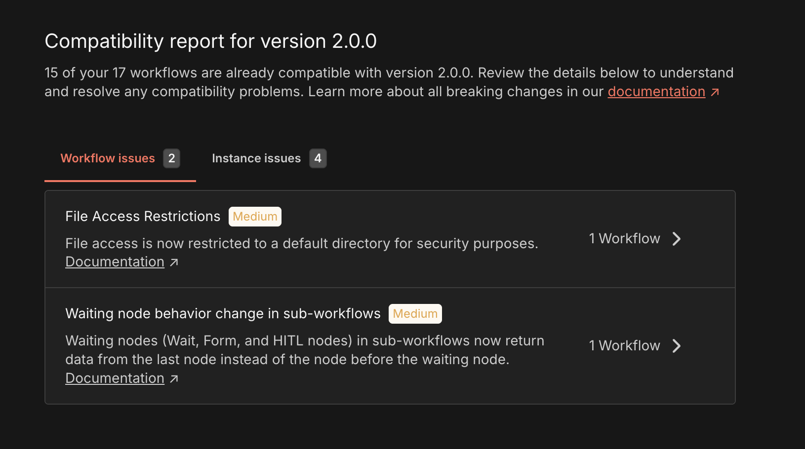

# n8n v2.0 migration tool 

The migration tool helps you prepare your n8n instance for upgrading to version 2.0 by identifying workflows and configurations that need attention before the upgrade.

You can see all breaking changes for v2 [on this page](v20-breaking-changes.md).

## Accessing the Tool 
Navigate to **Settings > Migration Report** to view your compatibility status.


**User role access**

The migration tool is available for global admins only.


## Understanding Your Migration Status 

At the top of the page, you'll see:

"X out of Y workflows are compatible with n8n 2.0"

This tells you how many workflows will continue working without changes after upgrading. Your goal is to address the issues preventing the remaining workflows from being compatible, as well as global instance issues.

## Viewing Issues 
The tool organizes potential problems into two categories:

### Workflow Issues Tab 

Shows breaking changes that affect specific workflows in your instance.
What you'll see for each issue:

* **Issue title:** A clear name for the problem
* **Severity badge (Critical/Medium/Low):** How urgent this is to fix
    * **Critical:** Fix before upgrading or workflows will fail
    * **Medium:** May cause unexpected behavior or require attention soon
    * **Low:** Minor changes or deprecations that won't break functionality
* **Description:** Explanation of what's changing and why it matters
* **Documentation link:** Click to read detailed migration explanations
* **Affected workflow count:** How many of your workflows have this issue

#### Workflow Issue Detail Page 

Click **X workflows affected** to see all affected workflows.
What you'll see for each workflow:

* **Name:** The workflow name. Click on the name to open the workflow editor.
* **State:** Whether workflow is published or not
* **Node affected:** The list of all the workflow nodes affected by the issue. You can click on each to open the workflow editor with the specific node view opened.
* **Number of executions:** The total number of executions of the workflow
* **Last executed:** The date the workflow was last executed
* **Last updated:** The date the workflow was last updated

### Instance Issues Tab 

Shows configuration changes that affect your entire n8n instance, not specific workflows.
What you'll see for each issue:

* Same information as workflow issues (title, severity, description, docs)
* **No workflow count:** These are global settings that apply instance-wide

The v2.0 migration tool scans your n8n instance to identify potential compatibility issues and configuration changes required for upgrading to v2.0. This reference details each check the tool performs, explains the impact of detected issues, and provides recommendations to prepare your instance for migration.

## Understanding Empty States 

### No Workflow Issues Found 
All your workflows are compatible with v2.0. Check the **Instance Issues** tab to ensure your server configuration is also ready.

### No Instance Issues Found 

Your instance configuration is compatible with v2.0. Check the **Workflow Issues** tab to ensure all workflows are also ready.

### Both Tabs Empty 
Your n8n instance is fully ready to upgrade to version 2.0.

## Recommended Workflow 

### Initial Assessment 
* Review the compatibility summary
* Browse all issues in both tabs to understand the scope

### Sort by Severity 
* Start with Critical issues (they'll break workflows)
* Move to Medium issues (may cause problems)
* Address Low issues last (deprecation warnings)

### Fix Workflow Issues 
* Click into each issue to see affected workflows
* Read the documentation for fix instructions
* Update each workflow as needed
* Test workflows in a development environment

### Address Instance Issues 
* Update environment variables or server configuration
* Follow documentation for each instance-level change

### Verify Your Work 
* Click **Refresh** to re-scan. If you don't see any **Refresh** button, just reload the page to re-scan.
* Confirm that unresolved issues don't remain
* Verify compatibility count matches total workflows

### Proceed with Upgrade 
After addressing all issues, you're ready to upgrade to n8n 2.0
