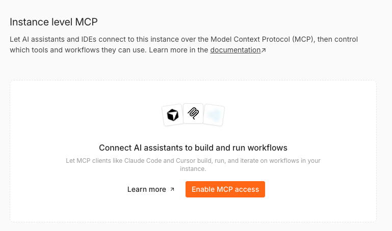
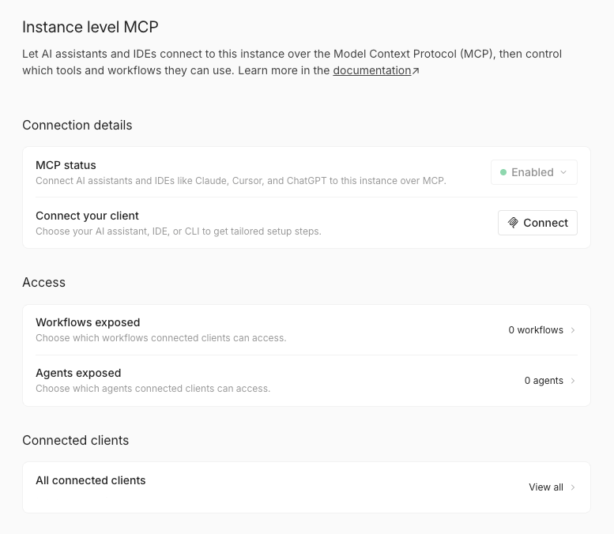

# Connect to n8n MCP server

n8n's built-in MCP server lets supported clients, such as Lovable or Claude Desktop, connect securely to your n8n instance. Once connected, these clients can:

* Search for your workflows
* Interact with workflows marked as available in MCP
* Trigger and test exposed workflows
* Create and edit workflows and data tables

## Difference between instance-level MCP access and MCP Server Trigger node <a href="#difference-between-instance-level-mcp-access-and-mcp-server-trigger-node" id="difference-between-instance-level-mcp-access-and-mcp-server-trigger-node"></a>

Instance-level MCP access lets you create one connection per n8n instance, use centralized authentication, and choose which workflows to enable for access. Enabled workflows are easy to find and run without extra setup for each workflow.

In comparison, you configure an MCP Server Trigger node inside a single workflow. This node exposes tools only from that workflow, a useful approach when you want to craft a specific MCP server behavior within one workflow.

### Key considerations when using instance-level MCP access <a href="#key-considerations-when-using-instance-level-mcp-access" id="key-considerations-when-using-instance-level-mcp-access"></a>

* MCP supports two types of workflow interactions: running existing workflows with the workflow execution tools, and building or editing workflows (n8n 2.13 onward).
* It doesn't provide blanket exposure to all workflows in your instance. You must enable MCP at the instance level and then enable each workflow individually. The only exception is `search_workflows`, which can access every workflow the current user has permission to view, but only returns previews, not full workflow data.
* It's not scoped to each MCP client. All clients you connect (for example, Claude Desktop and ChatGPT) can see all workflows you've enabled for MCP access. You can't restrict specific workflows to specific clients. On a user level, visibility remains user-scoped: users can only see MCP-enabled workflows they have access to.
* Most MCP tools work on unpublished workflows. The exception is `execute_workflow`, which defaults to production mode and runs the published version of a workflow. It also supports a `manual` execution mode to run the current (unpublished) version.

## Enabling MCP access <a href="#enabling-mcp-access" id="enabling-mcp-access"></a>


**Available from n8n 2.33.0**

The settings layout described below (**Connection details**, **Access**, **Connected clients**), the **Connect a client** dialog, and **Allowed callback URLs** replace the previous single-page MCP settings screen. On older versions, this page shows a simpler layout without per-client setup steps.


### For Cloud and self-hosted instances <a href="#for-cloud-and-self-hosted-instances" id="for-cloud-and-self-hosted-instances"></a>

1. Navigate to **Settings > Instance-level MCP**.
2. Select **Enable MCP access** (requires instance owner or admin permissions).



Once enabled, the page groups settings into three sections:

* **Connection details**: shows the **MCP status** and a **Connect** button that opens setup steps for your MCP client.
* **Access**: shows how many workflows (and, if your instance has the agents feature, agents) are exposed to MCP clients, see [Exposing workflows to MCP clients](#exposing-workflows-to-mcp-clients) and [Exposing agents to MCP clients](#exposing-agents-to-mcp-clients). Instance owners and admins also see **Allowed callback URLs** here, see [Restricting OAuth callback URLs](#restricting-oauth-callback-urls).
* **Connected clients**: shows how many clients currently have access, each with its own granted permissions. Select **View all** to review or revoke access for individual clients, see [Reviewing and revoking client access](#revoking-client-access).



**To disable:** In **Connection details**, select the **MCP status** control and choose **Disable**. n8n asks you to confirm, since disabling disconnects every connected client and revokes its access. You can turn MCP access back on later.


**Environment variables (self-hosted only)**

On self-hosted instances, you can also manage MCP settings using environment variables. See [Manage instance settings using environment variables](https://app.gitbook.com/s/jm0ZYRpZIPWge2ZSiDYO/host-n8n/configure-n8n/manage-settings-using-environment-variables#mcp).


### For self-hosted: Complete disablement <a href="#for-self-hosted-complete-disablement" id="for-self-hosted-complete-disablement"></a>

To remove the feature entirely, set the environment variable:

`N8N_DISABLED_MODULES=mcp`

This action removes MCP endpoints and hides all related UI elements.

## Connecting MCP clients <a href="#setting-up-mcp-authentication" id="setting-up-mcp-authentication"></a>

In **Connection details**, select **Connect** to open the **Connect a client** dialog, then choose an authentication method: [OAuth (recommended)](#using-oauth2) or [API key](#using-access-token).

### Using OAuth (recommended) <a href="#using-oauth2" id="using-oauth2"></a>

1. Navigate to **Settings > Instance-level MCP**.
2. In **Connection details**, select **Connect** to open the **Connect a client** dialog.
3. Make sure the **OAuth (recommended)** tab is selected.
4. In the **Your client** dropdown, pick your AI assistant, IDE, or CLI. n8n groups clients into **CLI** (Claude Code, Codex, Gemini CLI), **Web** (Claude.ai, ChatGPT), and **IDE** (Cursor, VS Code, Windsurf), and shows setup steps tailored to your choice.
5. Follow the steps shown for your client type:
   * **Web clients**: select **One-click setup** to add n8n to the client directly, or copy the **Server URL** and paste it into the client yourself.
   * **CLI clients**: run the install command shown, or add the manual configuration snippet to the client's configuration file instead. Either way, finish with the **Authenticate** step to complete the OAuth sign-in (see the [Claude Code](#connecting-claude-code-to-n8n-mcp-server) and [Codex](#connecting-codex-cli-to-n8n-mcp-server) examples below for the exact commands).
   * **IDE clients**: select the one-click install link (where the editor supports one), or copy the **Server URL** and add the manual configuration snippet to the editor yourself.
6. When the client redirects you to n8n, approve access to finish connecting it.

#### Reviewing and revoking client access <a href="#revoking-client-access" id="revoking-client-access"></a>

Each connected client only has the permissions you granted it when it connected, for example reading workflows without being able to create or run them. To review or revoke a client's access:

1. Navigate to **Settings > Instance-level MCP**.
2. In **Connected clients**, select **View all**. You should see a table of connected OAuth clients, their access level, and when they connected. Clients using an API key don't appear here, since they authenticate with a bearer token rather than an OAuth connection.
3. Select a client's row to open its details and see every permission you granted it, or select **Revoke access** directly on the row to skip straight to revoking.
4. Confirm the revocation. n8n disconnects the client at once; it must reconnect and sign in again to regain access.

### Using API key <a href="#using-access-token" id="using-access-token"></a>

1. Navigate to **Settings > Instance-level MCP**.
2. In **Connection details**, select **Connect** to open the **Connect a client** dialog.
3. Switch to the **API key** tab. n8n automatically generates a personal access token tied to your user account the first time you open it.
4. Copy what you need: the **Configuration JSON** block, already filled in with your server URL and an `Authorization: Bearer` header carrying your token, or the individual **Server URL** and access token values if your client doesn't use that JSON format (for example, Codex's TOML config). Once you leave this tab, n8n only shows a redacted token value, and you won't be able to copy it again unless you [rotate it](#rotating-your-token).
5. Paste what you copied into your MCP client's configuration: drop the **Configuration JSON** straight in for clients that accept an `mcpServers` JSON snippet, or use the individual **Server URL** and token for clients that need a different format. This tab isn't client-specific, so the same values work no matter which client you're setting up (see the [examples](#examples) below for client-specific formats).

#### Rotating your access token <a href="#rotating-your-token" id="rotating-your-token"></a>

If you lose your token or need to rotate it:

1. Navigate to **Settings > Instance-level MCP**.
2. In **Connection details**, select **Connect** to open the **Connect a client** dialog.
3. Switch to the **API key** tab.
4. Generate a new token using the button next to the redacted value.

    n8n revokes the previous token when you generate a new one.
5. Update all connected MCP clients with the new value.

## Exposing workflows to MCP clients <a href="#exposing-workflows-to-mcp-clients" id="exposing-workflows-to-mcp-clients"></a>

MCP clients can discover previews of all workflows the current user has access to using `search_workflows`. However, clients can't access full workflow data, nor execute or modify a workflow unless you explicitly enable MCP access for that workflow.


**Workflow eligibility** <a href="#workflow-eligibility" id="workflow-eligibility"></a>

Only workflows that are published, and that contain a webhook, form, schedule, or chat trigger node, can be enabled for MCP access.


### Enabling access for individual workflows <a href="#enabling-access-for-individual-workflows" id="enabling-access-for-individual-workflows"></a>

#### Option 1: From the Workflows exposed page (available from n8n 2.2.0) <a href="#option-1-from-mcp-settings-page-available-from-n8n-v220" id="option-1-from-mcp-settings-page-available-from-n8n-v220"></a>

1. Navigate to **Settings > Instance-level MCP**.
2. Select **Workflows exposed**.
3. Click the **Enable workflows** button (in the workflows table header or in the table's empty state).
4. Search for the desired workflow (by name or description) and select it from the list.
5. Click **Enable** to confirm.

#### Option 2: From the workflow editor <a href="#option-2-from-the-workflow-editor" id="option-2-from-the-workflow-editor"></a>

1. Open the workflow.
2. Click the main workflow menu (`...`) in the top-right corner.
3. Select **Settings**.
4. Toggle **Available in MCP**.

#### Option 3: From the workflows list <a href="#option-3-from-the-workflows-list" id="option-3-from-the-workflows-list"></a>

1. Go to **Workflows**.
2. Open the menu on a workflow card.
3. Select **Enable MCP access**.

### Enabling access for projects/folders <a href="#enabling-access-for-projectsfolders" id="enabling-access-for-projectsfolders"></a>


**Available from n8n 2.24.0**


You can use the **Options** menu  in the workflow list to toggle MCP access for all workflows in the current project or folder:

1. Navigate to the desired project and select **Workflows** from the top menu, then open a subfolder if required.
2. Select the **Options** menu  next to the name of the project or folder.
3. Select **Manage MCP access**, then either **Enable MCP** or **Disable MCP**.

.png>)


**Note**

This will toggle MCP access for all workflows that are **currently** in the selected project or folder (skipping ones that are already in the selected state). You will still need to toggle access for any workflows added in the future.


### Managing access <a href="#managing-access" id="managing-access"></a>

The **Workflows exposed** page (**Access > Workflows exposed**) shows all workflows enabled for MCP clients to access and operate on. From this list you can:

* Open a workflow, its home project or parent folder directly
* Revoke access using the action menu (or use **Disable MCP access** from the workflow card menu)
* Update workflow description using the action menu (or use the menu in the workflow editor)
* Enable access for more workflows using the **Enable workflows** button (available from n8n 2.2.0)

### Workflow descriptions <a href="#workflow-descriptions" id="workflow-descriptions"></a>

To help MCP clients identify workflows, you can add free-text descriptions as follows:

1. Option 1: From the **Workflows exposed** page
   1. Navigate to **Settings > Instance-level MCP**.
   2. Select **Workflows exposed**.
   3. Use the action menu in the desired workflow's row and select the **Edit description** action.
   4. Alternatively, click the description text directly to open the edit dialog.
2.  Option 2: From the workflow editor

    1. Open the workflow.
    2. Click the main workflow menu (`...`) in the top-right corner.
    3. Select **Edit description**.

    .png>)

## Exposing agents to MCP clients <a href="#exposing-agents-to-mcp-clients" id="exposing-agents-to-mcp-clients"></a>


**Available from n8n 2.34.0**

Agents are a separate feature from workflows, see [Build and manage agents](https://app.gitbook.com/s/rPN1zU5jaYNvwH7RzxqA/build-and-manage-agents). This section only applies if agents are available on your instance.


If your instance has the agents feature, the **Access** section also shows **Agents exposed**. As with workflows, MCP clients can't read or manage an agent unless you explicitly enable MCP access for it.

### Enabling access for individual agents <a href="#enabling-access-for-individual-agents" id="enabling-access-for-individual-agents"></a>

#### Option 1: From the MCP settings page <a href="#option-1-from-the-mcp-settings-page-agents" id="option-1-from-the-mcp-settings-page-agents"></a>

1. Navigate to **Settings > Instance-level MCP**.
2. Select **Agents exposed**.
3. Select **Enable agents**.
4. Search for the desired agent by name and select it from the list.
5. Select **Enable** to confirm.

#### Option 2: From the agent builder <a href="#option-2-from-the-agent-builder" id="option-2-from-the-agent-builder"></a>

1. Open the agent in the agent builder.
2. Open its MCP settings.
3. Toggle **Available in MCP**.

### Managing agent access <a href="#managing-agent-access" id="managing-agent-access"></a>

The **Agents exposed** page shows every agent enabled for MCP clients to access, with its name and its project or folder location. From this list you can:

* Open an agent or its project directly.
* Remove access for a single agent from its row, or select multiple agents and remove access for all of them at once.
* Enable access for more agents using the **Enable agents** button.

## Restricting OAuth callback URLs <a href="#restricting-oauth-callback-urls" id="restricting-oauth-callback-urls"></a>

Instance owners and admins can restrict which URLs an OAuth client can redirect to after it signs in. By default, n8n allows any callback URL, which is less secure.

1. Navigate to **Settings > Instance-level MCP**.
2. In **Access**, select **Allowed callback URLs**.
3. Choose a mode:
   * **All callback URLs**: any URL can complete an OAuth sign-in.
   * **Only trusted URLs**: only the URLs you list can complete an OAuth sign-in.
4. If you chose **Only trusted URLs**, add each URL you trust, then select **Save**.

## Tools and resources <a href="#tools-and-resources" id="tools-and-resources"></a>


Consider using coding agents (such as Claude Code or Google ADK agents) instead of chat clients as your MCP clients. Coding agents are optimized for generating and validating TypeScript code, making them ideal for building workflows programmatically.


The n8n MCP server exposes tools for workflow management, workflow building, and data tables. For a complete list of available tools and their parameters, refer to the [MCP server tools reference](connect-to-n8n-mcp-server/mcp-server-tools-reference.md).

## n8n Skills for coding agents

When you connect a coding agent to the n8n MCP server, the agent can build and edit workflows, but it doesn't automatically know n8n's conventions for expressions, node configuration, error handling, and other patterns. n8n Skills give the agent that knowledge so it gets workflows right the first time.

n8n Skills are a set of capability modules published in the [n8n-io/skills](https://github.com/n8n-io/skills) repository. They pair with the instance-level MCP server and include:

* **13 capability skills** covering workflow best practices, including sub-workflows, expressions, loops, AI agents, error handling, credentials, data tables, and debugging.
* **50+ reference documents and examples** with per-node guidance, decision trees, and copy-paste workflow snippets.
* **Hooks** that load the right guidance automatically, so the agent reads the relevant skill before it makes high-impact MCP calls.

A 14th meta-skill, `using-n8n-skills-official`, routes the agent to the matching capability skill for each task.

### Why use skills <a href="#why-use-skills" id="why-use-skills"></a>

Skills load guidance at the moment the agent needs it, rather than relying on the model's general knowledge. This helps the agent:

* Follow n8n best practices for the node or feature it's working with.
* Avoid common mistakes, such as incorrect expression syntax or missing error handling.
* Produce workflows that need less back-and-forth to fix.

The skills are plain Markdown, so you can read, fork, and modify them for your own conventions.

### Installing skills <a href="#installing-skills" id="installing-skills"></a>

The [n8n-io/skills](https://github.com/n8n-io/skills) repository has up-to-date install instructions for Claude Code, Codex, and other coding agents. Follow the steps in the repository README to add the skills to your agent.

## Examples <a href="#examples" id="examples"></a>


The **Connect a client** dialog available from n8n 2.33.0 generates ready-to-use setup steps for Claude Code, Codex, Gemini CLI, Claude.ai, ChatGPT, Cursor, VS Code, and Windsurf. The manual examples below remain useful for clients not covered by the dialog, such as Lovable and Google ADK agents, or if you prefer to configure a client by hand.


### Connecting Lovable to n8n MCP server <a href="#connecting-lovable-to-n8n-mcp-server" id="connecting-lovable-to-n8n-mcp-server"></a>

1. Configure MCP Server in Lovable (OAuth).
   * Navigate to your workspace  **Settings > Integrations**.
   * In the **MCP Servers** section, find **n8n** and click **Connect**.
   * Enter your n8n server URL: the **Server URL** value shown in the **Connect your client** dialog.
   * Save the connection. If successful, n8n redirects you to authorize Lovable.
2. Verify connectivity.
   * Once connected, Lovable can query for workflows with MCP access enabled.
   * **Example:** Asking Lovable to build a workflow UI that lists users and allows deleting them.

### Connecting Claude Desktop to n8n MCP server <a href="#connecting-claude-desktop-to-n8n-mcp-server" id="connecting-claude-desktop-to-n8n-mcp-server"></a>

**Using OAuth (recommended)**

1. Navigate to **Settings** > **Connectors** in Claude Desktop.
2. Click on **Add custom connector**.
3. Enter the following details:
   * **Name:** n8n MCP
   * **Remote MCP Server URL**: the **Server URL** value shown in the **Connect a client** dialog
4. Save the connector.
5. When prompted, authorize Claude Desktop to access your n8n instance.

**Using API key**

Add the following entry to your `claude_desktop_config.json` file:

```json
"mcpServers": {
  "n8n-mcp": {
    "command": "npx",
    "args": [
    "-y",
    "supergateway",
    "--streamableHttp",
    "https://<your-n8n-domain>/mcp-server/http",
    "--header",
    "Authorization:Bearer <YOUR_N8N_MCP_TOKEN>"
    ]
  }
}
```

Here, replace:

* `<your-n8n-domain>`: Your n8n domain, without a path — copy the **Server URL** shown in the **Connect a client** dialog, but drop the `/mcp-server/http` suffix

### Connecting Claude Code to n8n MCP server <a href="#connecting-claude-code-to-n8n-mcp-server" id="connecting-claude-code-to-n8n-mcp-server"></a>

**OPTION 1: Authenticate using OAuth (recommended)**

Use the following CLI command:

```bash
claude mcp add --transport http n8n https://<your-n8n-domain>/mcp-server/http
```

Alternatively, add the following entry to your `claude.json` file:

```json
{
    "mcpServers": {
        "n8n": {
            "type": "http",
            "url": "https://<your-n8n-domain>/mcp-server/http"
        }
    }
}
```

Here, replace:

* `<your-n8n-domain>`: Your n8n domain, without a path — copy the **Server URL** shown in the **Connect a client** dialog, but drop the `/mcp-server/http` suffix

Run `/mcp` in Claude Code and select **n8n** to complete the OAuth authorization.

**OPTION 2: Authenticate using API key**

Use the following CLI command:

```bash
claude mcp add --transport http n8n-mcp https://<your-n8n-domain>/mcp-server/http \
  --header "Authorization: Bearer <YOUR_N8N_MCP_TOKEN>"
```

Alternatively, add the following entry to your `claude.json` file:

```json
{
    "mcpServers": {
        "n8n-mcp": {
            "type": "http",
            "url": "https://<your-n8n-domain>/mcp-server/http",
            "headers": {
                "Authorization": "Bearer <YOUR_N8N_MCP_TOKEN>"
            }
        }
    }
}
```

Here, replace:

* `<your-n8n-domain>`: Your n8n domain, without a path — copy the **Server URL** shown in the **Connect a client** dialog, but drop the `/mcp-server/http` suffix
* `<YOUR_N8N_MCP_TOKEN>`: Your generated token

### Connecting Codex CLI to n8n MCP server <a href="#connecting-codex-cli-to-n8n-mcp-server" id="connecting-codex-cli-to-n8n-mcp-server"></a>

**OPTION 1: Authenticate using OAuth (recommended)**

Use the following CLI command:

```bash
codex mcp add n8n --url "https://<your-n8n-domain>/mcp-server/http"
```

Alternatively, add the following entry to your `~/.codex/config.toml` file:

```toml
[features]
experimental_use_rmcp_client = true

[mcp_servers.n8n]
url = "https://<your-n8n-domain>/mcp-server/http"
```


The `[features]` block enables Codex's HTTP MCP client. Older Codex builds require it; newer builds ignore it.


Here, replace:

* `<your-n8n-domain>`: Your n8n domain, without a path — copy the **Server URL** shown in the **Connect a client** dialog, but drop the `/mcp-server/http` suffix

Run `codex mcp login n8n` to complete the OAuth authorization.

**OPTION 2: Authenticate using API key**

Add the following entry to your `~/.codex/config.toml` file:

```toml
[features]
experimental_use_rmcp_client = true

[mcp_servers.n8n-mcp]
url = "https://<your-n8n-domain>/mcp-server/http"
http_headers = { "authorization" = "Bearer <YOUR_N8N_MCP_TOKEN>" }
```

Here, replace:

* `<your-n8n-domain>`: Your n8n domain, without a path — copy the **Server URL** shown in the **Connect a client** dialog, but drop the `/mcp-server/http` suffix
* `<YOUR_N8N_MCP_TOKEN>`: Your generated token

### Connecting Google ADK agent to n8n MCP server <a href="#connecting-google-adk-agent-to-n8n-mcp-server" id="connecting-google-adk-agent-to-n8n-mcp-server"></a>

Here's sample code to create an agent that connects to a remote n8n MCP server:

```python
from google.adk.agents import Agent
from google.adk.tools.mcp_tool import McpToolset
from google.adk.tools.mcp_tool.mcp_session_manager import StreamableHTTPServerParams

N8N_INSTANCE_URL = "https://localhost:5678"
N8N_MCP_TOKEN = "YOUR_N8N_MCP_TOKEN"

root_agent = Agent(
    model="gemini-2.5-pro",
    name="n8n_agent",
    instruction="Help users manage and execute workflows in n8n",
    tools=[
        McpToolset(
            connection_params=StreamableHTTPServerParams(
                url=f"{N8N_INSTANCE_URL}/mcp-server/http",
                headers={
                    "Authorization": f"Bearer {N8N_MCP_TOKEN}",
                },
            ),
        )
    ],
)
```

Here, replace:

* `N8N_INSTANCE_URL`: Your n8n domain, without a path — copy the **Server URL** shown in the **Connect a client** dialog, but drop the `/mcp-server/http` suffix
* `YOUR_N8N_MCP_TOKEN`: Your generated access token

For more details, see [Connect ADK agent to n8n](https://google.github.io/adk-docs/tools/third-party/n8n/).

## Troubleshooting <a href="#troubleshooting" id="troubleshooting"></a>

If you encounter issues connecting MCP clients to your n8n instance, consider the following:

* Ensure that your n8n instance is publicly accessible if you are using cloud-based MCP clients.
* Verify that the MCP access is enabled in n8n settings.
* Check that the workflows you want to execute or modify are marked as **Available in MCP**.
* Confirm that the authentication method (OAuth or API key) is configured correctly in your MCP client.
* Review n8n server logs for any error messages related to MCP connections.
