# Node user interface elements <a href="#node-user-interface-elements" id="node-user-interface-elements"></a>

n8n provides a set of predefined UI components (based on a JSON file) that allows users to input all sorts of data types. The following UI elements are available in n8n.

## String <a href="#string" id="string"></a>

Basic configuration:

```typescript
{
	displayName: Name, // The value the user sees in the UI
	name: name, // The name used to reference the element UI within the code
	type: string,
	required: true, // Whether the field is required or not
	default: 'n8n',
	description: 'The name of the user',
	displayOptions: { // the resources and operations to display this element with
		show: {
			resource: [
				// comma-separated list of resource names
			],
			operation: [
				// comma-separated list of operation names
			]
		}
	},
}
```


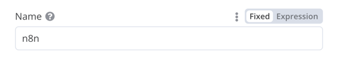


String field for inputting passwords:

```typescript
{
	displayName: 'Password',
	name: 'password',
	type: 'string',
	required: true,
	typeOptions: {
		password: true,
	},
	default: '',
	description: `User's password`,
	displayOptions: { // the resources and operations to display this element with
		show: {
			resource: [
				// comma-separated list of resource names
			],
			operation: [
				// comma-separated list of operation names
			]
		}
	},
}
```

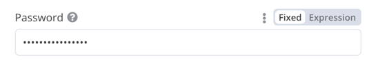


String field with more than one row:

```typescript
{
	displayName: 'Description',
	name: 'description',
	type: 'string',
	required: true,
	typeOptions: {
		rows: 4,
	},
	default: '',
	description: 'Description',
	displayOptions: { // the resources and operations to display this element with
		show: {
			resource: [
				// comma-separated list of resource names
			],
			operation: [
				// comma-separated list of operation names
			]
		}
	},
}
```

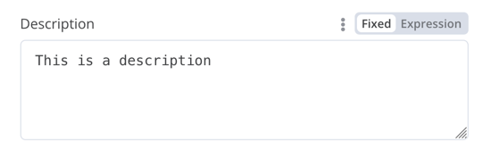

### Support drag and drop for data keys <a href="#support-drag-and-drop-for-data-keys" id="support-drag-and-drop-for-data-keys"></a>

Users can drag and drop data values to map them to fields. Dragging and dropping creates an [expression](https://app.gitbook.com/s/CxSeOtVxqqhfxMSac0AV/key-concept-glossary#expression-n8n) to load the data value. n8n supports this automatically.

You need to add an extra configuration option to support dragging and dropping data keys:

* `requiresDataPath: 'single'`: for fields that require a single string.
* `requiresDataPath: 'multiple'`: for fields that can accept a comma-separated list of string.

The [Compare Datasets node code](https://github.com/n8n-io/n8n/blob/master/packages/nodes-base/nodes/CompareDatasets/CompareDatasets.node.ts) has examples.

## Number <a href="#number" id="number"></a>

Number field with decimal points:

```typescript
{
	displayName: 'Amount',
	name: 'amount',
	type: 'number',
	required: true,
	typeOptions: {
		maxValue: 10,
		minValue: 0,
		numberPrecision: 2,
	},
	default: 10.00,
	description: 'Your current amount',
	displayOptions: { // the resources and operations to display this element with
		show: {
			resource: [
				// comma-separated list of resource names
			],
			operation: [
				// comma-separated list of operation names
			]
		}
	},
}
```

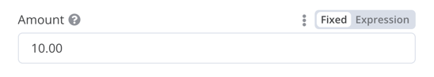

## Collection <a href="#collection" id="collection"></a>

Use the `collection` type when you need to display optional fields.

```typescript
{
	displayName: 'Filters',
	name: 'filters',
	type: 'collection',
	placeholder: 'Add Field',
	default: {},
	options: [
		{
			displayName: 'Type',
			name: 'type',
			type: 'options',
			options: [
				{
					name: 'Automated',
					value: 'automated',
				},
				{
					name: 'Past',
					value: 'past',
				},
				{
					name: 'Upcoming',
					value: 'upcoming',
				},
			],
			default: '',
		},
	],
	displayOptions: { // the resources and operations to display this element with
		show: {
			resource: [
				// comma-separated list of resource names
			],
			operation: [
				// comma-separated list of operation names
			]
		}
	},
}
```

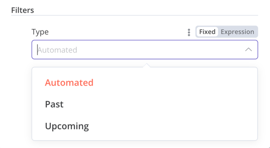


## DateTime <a href="#datetime" id="datetime"></a>

The `dateTime` type provides a date picker.

```typescript
{
	displayName: 'Modified Since',
	name: 'modified_since',
	type: 'dateTime',
	default: '',
	description: 'The date and time when the file was last modified',
	displayOptions: { // the resources and operations to display this element with
		show: {
			resource: [
				// comma-separated list of resource names
			],
			operation: [
				// comma-separated list of operation names
			]
		}
	},
}
```

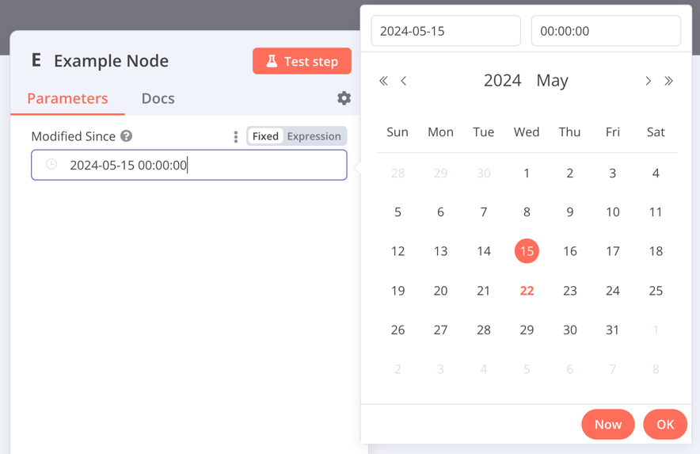


## Boolean <a href="#boolean" id="boolean"></a>

The `boolean` type adds a toggle for entering true or false.

```typescript
{
	displayName: 'Wait for Image',
	name: 'waitForImage',
	type: 'boolean',
	default: true, // Initial state of the toggle
	description: 'Whether to wait for the image or not',
	displayOptions: { // the resources and operations to display this element with
		show: {
			resource: [
				// comma-separated list of resource names
			],
			operation: [
				// comma-separated list of operation names
			]
		}
	},
}
```

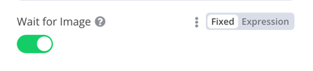

## Color <a href="#color" id="color"></a>

The `color` type provides a color selector.

```typescript
{
	displayName: 'Background Color',
	name: 'backgroundColor',
	type: 'color',
	default: '', // Initially selected color
	displayOptions: { // the resources and operations to display this element with
		show: {
			resource: [
				// comma-separated list of resource names
			],
			operation: [
				// comma-separated list of operation names
			]
		}
	},
}
```

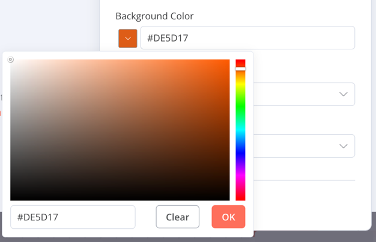

## Options <a href="#options" id="options"></a>

The `options` type adds an options list. Users can select a single value.

```typescript
{
	displayName: 'Resource',
	name: 'resource',
	type: 'options',
	options: [
		{
			name: 'Image',
			value: 'image',
		},
		{
			name: 'Template',
			value: 'template',
		},
	],
	default: 'image', // The initially selected option
	description: 'Resource to consume',
	displayOptions: { // the resources and operations to display this element with
		show: {
			resource: [
				// comma-separated list of resource names
			],
			operation: [
				// comma-separated list of operation names
			]
		}
	},
}
```

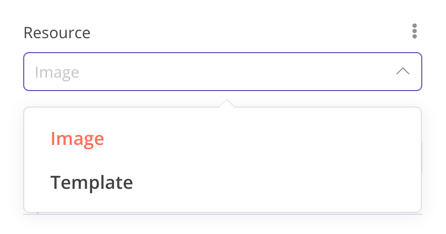

## Multi-options <a href="#multi-options" id="multi-options"></a>

The `multiOptions` type adds an options list. Users can select more than one value.

```typescript
{
	displayName: 'Events',
	name: 'events',
	type: 'multiOptions',
	options: [
		{
			name: 'Plan Created',
			value: 'planCreated',
		},
		{
			name: 'Plan Deleted',
			value: 'planDeleted',
		},
	],
	default: [], // Initially selected options
	description: 'The events to be monitored',
	displayOptions: { // the resources and operations to display this element with
		show: {
			resource: [
				// comma-separated list of resource names
			],
			operation: [
				// comma-separated list of operation names
			]
		}
	},
}
```

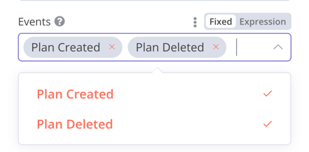


## Filter <a href="#filter" id="filter"></a>

Use this component to evaluate, match, or filter incoming data.

This is the code from n8n's own If node. It shows a filter component working with a [collection](#collection) component where users can configure the filter's behavior.

```typescript
{
	displayName: 'Conditions',
	name: 'conditions',
	placeholder: 'Add Condition',
	type: 'filter',
	default: {},
	typeOptions: {
		filter: {
			// Use the user options (below) to determine filter behavior
			caseSensitive: '={{!$parameter.options.ignoreCase}}',
			typeValidation: '={{$parameter.options.looseTypeValidation ? "loose" : "strict"}}',
		},
	},
},
{
displayName: 'Options',
name: 'options',
type: 'collection',
placeholder: 'Add option',
default: {},
options: [
	{
		displayName: 'Ignore Case',
		description: 'Whether to ignore letter case when evaluating conditions',
		name: 'ignoreCase',
		type: 'boolean',
		default: true,
	},
	{
		displayName: 'Less Strict Type Validation',
		description: 'Whether to try casting value types based on the selected operator',
		name: 'looseTypeValidation',
		type: 'boolean',
		default: true,
	},
],
},
```

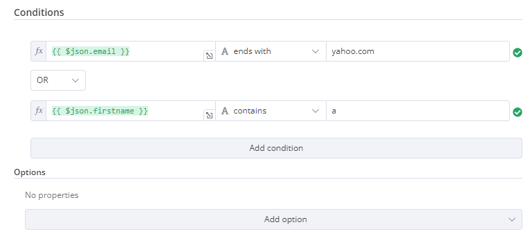


## Assignment collection (drag and drop) <a href="#assignment-collection-drag-and-drop" id="assignment-collection-drag-and-drop"></a>

Use the drag and drop component when you want users to pre-fill name and value parameters with a single drag interaction.

```typescript
{
	displayName: 'Fields to Set',
	name: 'assignments',
	type: 'assignmentCollection',
	default: {},
},
```

You can see an example in n8n's [Edit Fields (Set) node](https://github.com/n8n-io/n8n/tree/0faeab1228e26d69a2a93bdb2f89523cca1e4036/packages/nodes-base/nodes/Set/v2):

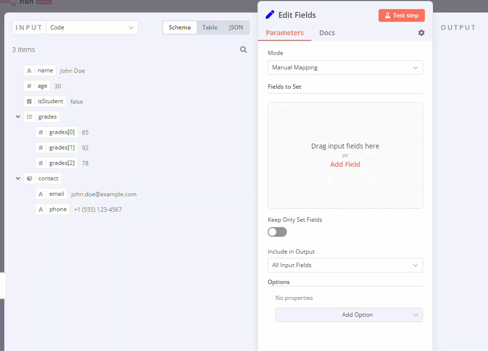

## Fixed collection <a href="#fixed-collection" id="fixed-collection"></a>

Use the `fixedCollection` type to group fields that are semantically related.

```typescript
{
	displayName: 'Metadata',
	name: 'metadataUi',
	placeholder: 'Add Metadata',
	type: 'fixedCollection',
	default: '',
	typeOptions: {
		multipleValues: true,
	},
	description: '',
	options: [
		{
			name: 'metadataValues',
			displayName: 'Metadata',
			values: [
				{
					displayName: 'Name',
					name: 'name',
					type: 'string',
					default: 'Name of the metadata key to add.',
				},
				{
					displayName: 'Value',
					name: 'value',
					type: 'string',
					default: '',
					description: 'Value to set for the metadata key.',
				},
			],
		},
	],
	displayOptions: { // the resources and operations to display this element with
		show: {
			resource: [
				// comma-separated list of resource names
			],
			operation: [
				// comma-separated list of operation names
			]
		}
	},
}
```

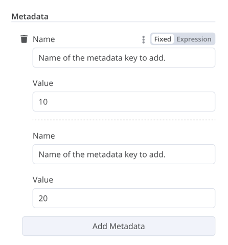


## Resource locator <a href="#resource-locator" id="resource-locator"></a>

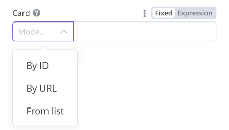

The resource locator element helps users find a specific resource in an external service, such as a card or label in Trello. 

The following options are available:

* ID
* URL
* List: allows users to select or search from a prepopulated list. This option requires more coding, as you must populate the list, and handle searching if you choose to support it.

You can choose which types to include.

Example:

```typescript
{
	displayName: 'Card',
	name: 'cardID',
	type: 'resourceLocator',
	default: '',
	description: 'Get a card',
	modes: [
		{
			displayName: 'ID',
			name: 'id',
			type: 'string',
			hint: 'Enter an ID',
			validation: [
				{
					type: 'regex',
					properties: {
						regex: '^[0-9]',
						errorMessage: 'The ID must start with a number',
					},
				},
			],
			placeholder: '12example',
			// How to use the ID in API call
			url: '=http://api-base-url.com/?id={{$value}}',
		},
		{
			displayName: 'URL',
			name: 'url',
			type: 'string',
			hint: 'Enter a URL',
			validation: [
				{
					type: 'regex',
					properties: {
						regex: '^http',
						errorMessage: 'Invalid URL',
					},
				},
			],
			placeholder: 'https://example.com/card/12example/',
			// How to get the ID from the URL
			extractValue: {
				type: 'regex',
				regex: 'example.com/card/([0-9]*.*)/',
			},
		},
		{
			displayName: 'List',
			name: 'list',
			type: 'list',
			typeOptions: {
				// You must always provide a search method
				// Write this method within the methods object in your base file
				// The method must populate the list, and handle searching if searchable: true
				searchListMethod: 'searchMethod',
				// If you want users to be able to search the list
				searchable: true,
				// Set to true if you want to force users to search
				// When true, users can't browse the list
				// Or false if users can browse a list
				searchFilterRequired: true,
			},
		},
	],
	displayOptions: {
		// the resources and operations to display this element with
		show: {
			resource: [
				// comma-separated list of resource names
			],
			operation: [
				// comma-separated list of operation names
			],
		},
	},
},
```

Refer to the following for live examples:

* Refer to [`CardDescription.ts`](https://github.com/n8n-io/n8n/blob/master/packages/nodes-base/nodes/Trello/CardDescription.ts) and [`Trello.node.ts`](https://github.com/n8n-io/n8n/blob/master/packages/nodes-base/nodes/Trello/Trello.node.ts)  in n8n's Trello node for an example of a list with search that includes `searchFilterRequired: true`.
* Refer to [`GoogleDrive.node.ts`](https://github.com/n8n-io/n8n/blob/master/packages/nodes-base/nodes/Google/Drive/GoogleDrive.node.ts) for an example where users can browse the list or search.

## Resource mapper <a href="#resource-mapper" id="resource-mapper"></a>

If your node performs insert, update, or upsert operations, you need to send data from the node in a format supported by the service you're integrating with. A common pattern is to use a Set node before the node that sends data, to convert the data to match the schema of the service you're connecting to. The resource mapper UI component provides a way to get data into the required format directly within the node, rather than using a Set node. The resource mapper component can also validate input data against the schema provided in the node, and cast input data into the expected type.


**Mapping and matching**

Mapping is the process of setting the input data to use as values when updating row(s). Matching is the process of using column names to identify the row(s) to update.


```js
{
	displayName: 'Columns',
	name: 'columns', // The name used to reference the element UI within the code
	type: 'resourceMapper', // The UI element type
	default: {
		// mappingMode can be defined in the component (mappingMode: 'defineBelow')
		// or you can attempt automatic mapping (mappingMode: 'autoMapInputData')
		mappingMode: 'defineBelow',
		// Important: always set default value to null
		value: null,
	},
	required: true,
	// See "Resource mapper type options interface" below for the full typeOptions specification
	typeOptions: {
		resourceMapper: {
			resourceMapperMethod: 'getMappingColumns',
			mode: 'update',
			fieldWords: {
				singular: 'column',
				plural: 'columns',
			},
			addAllFields: true, 
			multiKeyMatch: true,
			supportAutoMap: true,
			matchingFieldsLabels: {
				title: 'Custom matching columns title',
				description: 'Help text for custom matching columns',
				hint: 'Below-field hint for custom matching columns',
			},
		},
	},
},
```

Refer to the [Postgres node (version 2)](https://github.com/n8n-io/n8n/tree/master/packages/nodes-base/nodes/Postgres/v2) for a live example using a database schema.

Refer to the [Google Sheets node (version 2)](https://github.com/n8n-io/n8n/tree/master/packages/nodes-base/nodes/Google/Sheet/v2) for a live example using a schema-less service.

### Resource mapper type options interface <a href="#resource-mapper-type-options-interface" id="resource-mapper-type-options-interface"></a>

The `typeOptions` section must implement the following interface:

```js
export interface ResourceMapperTypeOptions {
	// The name of the method where you fetch the schema
	// Refer to the Resource mapper method section for more detail
	resourceMapperMethod: string;
	// Choose the mode for your operation
	// Supported modes: add, update, upsert
	mode: 'add' | 'update' | 'upsert';
	// Specify labels for fields in the UI
	fieldWords?: { singular: string; plural: string };
	// Whether n8n should display a UI input for every field when node first added to workflow
	// Default is true
	addAllFields?: boolean;
	// Specify a message to show if no fields are fetched from the service 
	// (the call is successful but the response is empty)
	noFieldsError?: string;
	// Whether to support multi-key column matching
	// multiKeyMatch is for update and upsert only
	// Default is false
	// If true, the node displays a multi-select dropdown for the matching column selector
	multiKeyMatch?: boolean;
	// Whether to support automatic mapping
	// If false, n8n hides the mapping mode selector field and sets mappingMode to defineBelow
	supportAutoMap?: boolean;
	// Custom labels for the matching columns selector
	matchingFieldsLabels?: {
		title?: string;
		description?: string;
		hint?: string;
	};
}
```

### Resource mapper method <a href="#resource-mapper-method" id="resource-mapper-method"></a>

This method contains your node-specific logic for fetching the data schema. Every node must implement its own logic for fetching the schema, and setting up each UI field according to the schema.

It must return a value that implements the `ResourceMapperFields` interface:

```js
interface ResourceMapperField {
	// Field ID as in the service
	id: string;
	// Field label
	displayName: string;
	// Whether n8n should pre-select the field as a matching field
	// A matching field is a column used to identify the rows to modify
	defaultMatch: boolean;
	// Whether the field can be used as a matching field
	canBeUsedToMatch?: boolean;
	// Whether the field is required by the schema
	required: boolean;
	// Whether to display the field in the UI
	// If false, can't be used for matching or mapping
	display: boolean;
	// The data type for the field
	// These correspond to UI element types
	// Supported types: string, number, dateTime, boolean, time, array, object, options
	type?: FieldType;
	// Added at runtime if the field is removed from mapping by the user
	removed?: boolean;
	// Specify options for enumerated types
	options?: INodePropertyOptions[];
}
```

Refer to the [Postgres resource mapping method](https://github.com/n8n-io/n8n/blob/master/packages/nodes-base/nodes/Postgres/v2/methods/resourceMapping.ts) and [Google Sheets resource mapping method](https://github.com/n8n-io/n8n/blob/master/packages/nodes-base/nodes/Google/Sheet/v2/methods/resourceMapping.ts) for live examples.

## JSON <a href="#json" id="json"></a>

```typescript
{
	displayName: 'Content (JSON)',
	name: 'content',
	type: 'json',
	default: '',
	description: '',
	displayOptions: { // the resources and operations to display this element with
		show: {
			resource: [
				// comma-separated list of resource names
			],
			operation: [
				// comma-separated list of operation names
			]
		}
	},
}
```

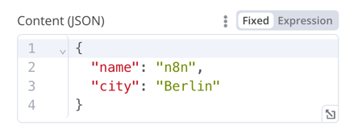


## HTML <a href="#html" id="html"></a>

The HTML editor allows users to create HTML templates in their workflows. The editor supports standard HTML, CSS in `<style>` tags, and expressions wrapped in `{{}}`. Users can add `<script>` tags to pull in additional JavaScript. n8n doesn't run this JavaScript during workflow execution.

```js
{
	displayName: 'HTML Template', // The value the user sees in the UI
	name: 'html', // The name used to reference the element UI within the code
	type: 'string',
	typeOptions: {
		editor: 'htmlEditor',
	},
	default: placeholder, // Loads n8n's placeholder HTML template
	noDataExpression: true, // Prevent using an expression for the field
	description: 'HTML template to render',
},
```

Refer to [`Html.node.ts`](https://github.com/n8n-io/n8n/blob/master/packages/nodes-base/nodes/Html/Html.node.ts) for a live example.


## Notice <a href="#notice" id="notice"></a>

Display a yellow box with a hint or extra info. Refer to [Node UI design](../../plan-your-node/node-ui-design.md) for guidance on writing good hints and info text.

```js
{
  displayName: 'Your text here',
  name: 'notice',
  type: 'notice',
  default: '',
},
```
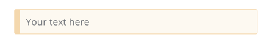

## Hints <a href="#hints" id="hints"></a>

There are two types of hints: parameter hints and node hints:

* Parameter hints are small lines of text below a user input field.
* Node hints are a more powerful and flexible option than [Notice](#notice). Use them to display longer hints, in the input panel, output panel, or node details view. 

### Add a parameter hint <a href="#add-a-parameter-hint" id="add-a-parameter-hint"></a>

Add the `hint` parameter to a UI element:

```ts
{
	displayName: 'URL',
	name: 'url',
	type: 'string',
	hint: 'Enter a URL',
	...
}
```

### Add a node hint <a href="#add-a-node-hint" id="add-a-node-hint"></a>

Define the node's hints in the `hints` property within the node `description`:

```ts
description: INodeTypeDescription = {
	...
	hints: [
		{
			// The hint message. You can use HTML.
			message: "This node has many input items. Consider enabling <b>Execute Once</b> in the node\'s settings.",
			// Choose from: info, warning, danger. The default is 'info'.
			// Changes the color. info (grey), warning (yellow), danger (red)
			type: 'info',
			// Choose from: inputPane, outputPane, ndv. By default n8n displays the hint in both the input and output panels.
			location: 'outputPane',
			// Choose from: always, beforeExecution, afterExecution. The default is 'always'
			whenToDisplay: 'beforeExecution',
			// Optional. An expression. If it resolves to true, n8n displays the message. Defaults to true.
			displayCondition: '={{ $parameter["operation"] === "select" && $input.all().length > 1 }}'
		}
	]
	...
}
```

### Add a dynamic hint to a programmatic-style node <a href="#add-a-dynamic-hint-to-a-programmatic-style-node" id="add-a-dynamic-hint-to-a-programmatic-style-node"></a>

In programmatic-style nodes you can create a dynamic message that includes information from the node execution. As it relies on the node output data, you can't display this type of hint until after execution.

```ts
if (operation === 'select' && items.length > 1 && !node.executeOnce) {
    // Expects two parameters: NodeExecutionData and an array of hints
	return new NodeExecutionOutput(
		[returnData],
		[
			{
				message: `This node ran ${items.length} times, once for each input item. To run for the first item only, enable <b>Execute once</b> in the node settings.`,
				location: 'outputPane',
			},
		],
	);
}
return [returnData];
```

For a live example of a dynamic hint in a programmatic-style node, view the [Split Out node code](https://github.com/n8n-io/n8n/blob/master/packages/nodes-base/nodes/Transform/SplitOut/SplitOut.node.ts#L266).
