# Navigating the Editor UI

[[toc]]

## Getting started

First of all, you need to set up n8n. There are different ways to [get started with n8n](https://docs.n8n.io/getting-started/quickstart.html#sign-up-on-n8n-cloud): you can [install it locally with npm](https://docs.n8n.io/getting-started/quickstart.html#install-with-npm), run it with Docker, or sign up on [n8n.cloud](http://n8n.cloud). The option you choose depends on your preference and technical requirements.

In this course, we will use an n8n.cloud instance with the n8n version 0.127.0.

Once you have n8n installed or set up, open the Editor UI in a browser window, which looks like this:

<figure>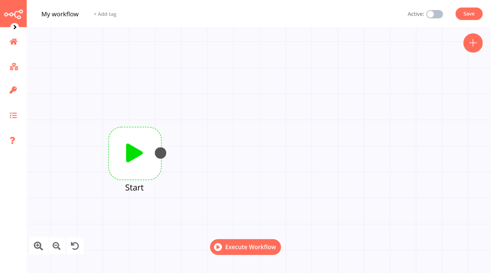<figcaption align = "center"><i>Editor UI</i></figcaption></figure>

Now that you have the Editor UI open, let’s learn how to navigate it. We will walk through the canvas and show you what each icon means and where to find things. Don’t worry if you don’t understand some of the concepts that are mentioned, we will explain them in detail as we build the workflow.

## Editor UI settings

The [Editor UI](http://docs.n8n.io/reference/glossary.html#editor-ui) represents the web interface used to create [workflows](http://docs.n8n.io/getting-started/key-components/workflow.html). Think of it as a canvas where the artist in you creates automations. From the Editor UI, you can access all your workflows and credentials, as well as the n8n documentation and forum.

Let’s start with the left side. Right under the n8n logo in the upper left corner, you will notice a round arrow icon. Click on it to open the sidebar menu, which contains the core functionalities and settings for managing workflows.

<figure>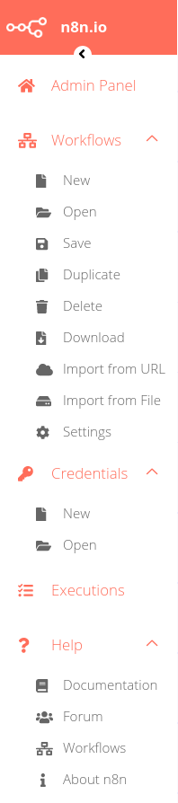<figcaption align = "center"><i>Editor UI left-side menu</i></figcaption></figure>

There are four main sections in the left menu:
1. (The Admin Panel, if you use n8n.cloud)
2. The Workflows section includes operations for creating and editing workflows.
3. The Credentials section includes operations for creating credentials.
4. The Executions section includes information about your workflow [executions](http://docs.n8n.io/reference/glossary.html#execution), which are complete runs of a workflow from the first to the last node.
5. The Help section includes resources around n8n product and community.

Now let’s have a look at the top bar of the Editor UI.

The text that appears in the top left is the name of the current workflow.

Next to it, you have the option to add a tag. Tags help you organize your workflows by use case, domain, or whatever is relevant for you.

In the top right corner of the Editor UI, there is an orange Save button that saves the current workflow.
Next to it, there is a toggle button, with which you can activate or deactivate the current workflow.

<figure>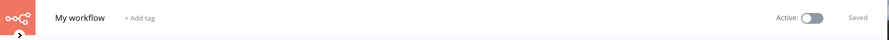<figcaption align = "center"><i>Editor UI top bar</i></figcaption></figure>

Now let’s move on to the canvas – the grey grid background.

In the left corner of the canvas, there are three small icons: two magnifying glasses with + and - signs, and a round arrow. By clicking on them, you can zoom in (+) or out (-) of the canvas and reset (←) the canvas to the original resolution.

At the bottom center of the canvas there is an orange button called “Execute Workflow”. When you click on it, it will execute all nodes on the canvas.

Finally, on the top right corner of the canvas there is an orange circle with a + sign inside. This button opens the nodes panel and you’ll learn more about nodes in the following chapter.

<figure>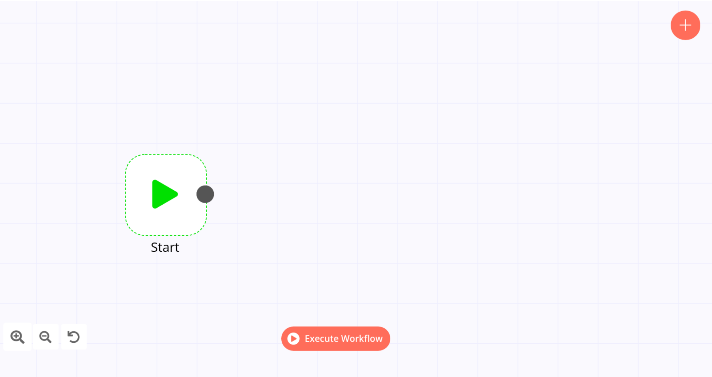<figcaption align = "center"><i>Workflow canvas</i></figcaption></figure>

Don’t worry about workflow execution and activation for now, we will explain these concepts in the lesson Running the workflow.

## Nodes

On the canvas, you’ll see a square with a green play icon. This is the [**Start node**](https://docs.n8n.io/nodes/n8n-nodes-base.start) – the default starting point in any workflow.

<figure>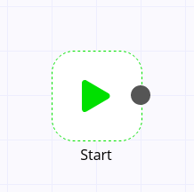<figcaption align = "center"><i>Start node</i></figcaption></figure>

You can think of nodes as building blocks that serve different functions but put together, they make up a functioning machinery – an automated workflow.

Technically, a [node](http://docs.n8n.io/reference/glossary.html#node) is an entry point for retrieving data, a function to process data, or an exit point for sending data. The functions can be pretty much anything, like data processing or conditional filtering.

Based on their function, nodes can be classified into three types:

- **Regular Nodes** add, remove, and edit data, as well as request and send external data.
- **Trigger Nodes** start a workflow and supply the initial data.
- **Core Nodes** are those that do not represent an app or a service, instead they serve general functions, like scheduling workflows or adding JavaScript functions. Core Nodes can function as regular nodes or as triggers.

You’ve probably figured out already that the **Start** node is a Core Trigger node. Apart from it, there are over 200 other Regular and Trigger nodes for various functions, apps, and services.

### Finding nodes

You can find all available nodes in the nodes panel on the right side of the Editor UI. There are three ways in which you can open the nodes panel:

- Click on the + icon in the top right corner of the canvas.
- Click on the grey dot on the right side of an existing node on the canvas (the node to which you want to add another one) and pull the connection line to the right.
- Click on the Tab key on your keyboard.

The nodes panel looks like this:

<figure>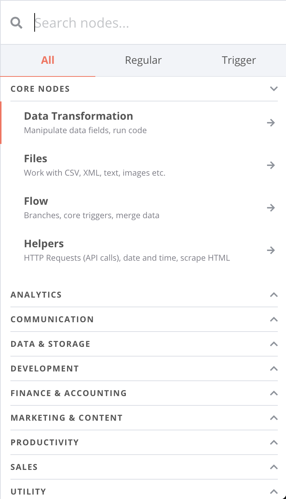<figcaption align = "center"><i>Nodes panel</i></figcaption></figure>

In the nodes panel, notice that the nodes are grouped in three tabs: All, Regular, and Trigger. This makes it easier to find the right nodes you need. If you want to get a specific node, type in the name of the node, app, or service in the search field and select the respective tab.

### Adding nodes

To add a new node to the Editor UI, simply click on the node you want in the nodes panel. The new node will automatically be connected to the last added node on the canvas.

So, to recapitulate here’s a walkthrough of the Editor UI touching on all the settings you’ve learned in this chapter:

<figure>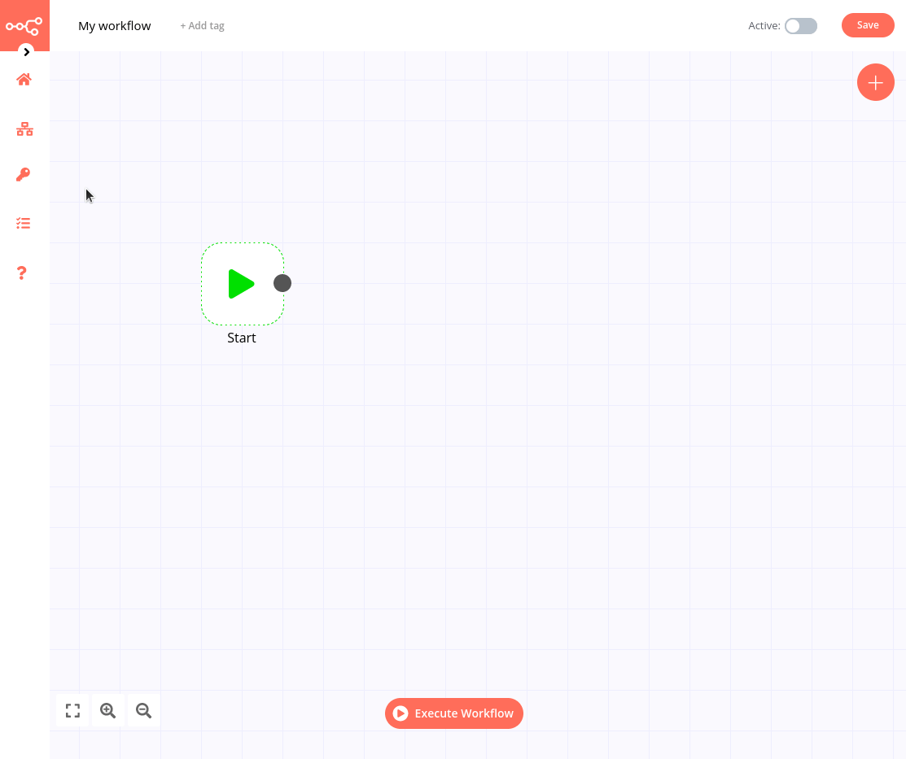<figcaption align = "center"><i>Editor UI walkthrough</i></figcaption></figure>

## Mini-workflow

Now it’s time to apply what you learned by building your first workflow!

A simple, yet useful automation is getting articles from Hacker News, so that you’re up to date with the tech world. More specifically, let’s say you want to get the latest 10 articles related to automation.

You can build a workflow for this use case in 4 steps:

### 1. Add the **Hacker News** node

Open the nodes panel, search for the **Hacker News** node, and click on it to add it to the Editor UI. The Hacker News node will automatically be connected to the Start node.

### 2. Configure the **Hacker News** node

When you add a new node to the Editor UI, the node will be automatically activated and open a window with two tabs on the left side: **Parameters** and **Settings**.

Parameters are different for each node, depending on its functionality. Settings are largely the same for all nodes.

#### Parameters

The HackerNew node has several parameters that need to be configured in order to make it work:

<figure>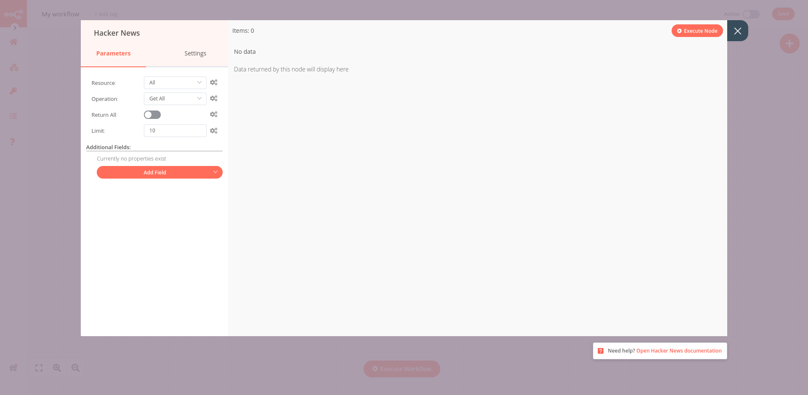<figcaption align = "center"><i>Hacker News node</i></figcaption></figure>

- Resource: All  
This resource selects all data records (articles).
- Operation: Get All  
This operation fetches all the selected articles.
- Limit: 10  
This parameter sets a limit to how many results are returned by the Get All  operation.
- Additional fields > Add Field > Keyword: automation  
Additional fields are options that you can add to certain nodes to make your request more specific or filter the results. In our case, we want to get only articles that include the keyword “automation”.  

The configuration of the parameters for the **Hacker News** node should now look like this:

<figure>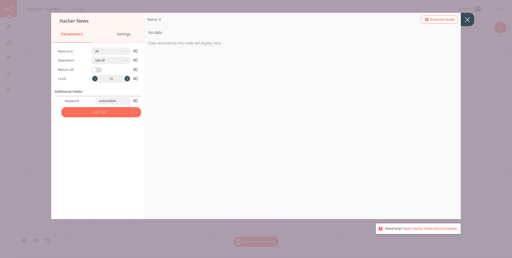<figcaption align = "center"><i>Hacker News node parameters</i></figcaption></figure>

#### Settings

The Settings part includes several options for node design and executions. In this case, we’ll configure only the first two settings, which are about the node’s appearance in the Editor UI.

It is often helpful, especially for complex workflows or if you share them with other users, to add a short description in the node about what it does. This description note can be displayed under the node in the Editor UI.

Here’s how to configure these settings in the **Hacker News** node:
- Notes: Get the 10 latest articles
- Display note in flow?: toggle to true

The configuration of the settings for the **Hacker News** node looks like this:

<figure>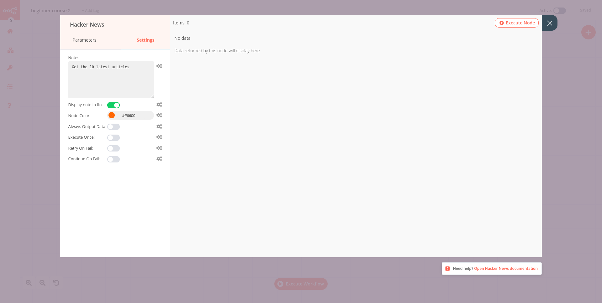<figcaption align = "center"><i>Hacker News node renaming</i></figcaption></figure>

::: tip 💡 You can rename the node with a name that’s more descriptive for your use case. There are two ways to do this:
- Double-click on the node you want to rename, which will open the node window. Click on the name of the node in the top left corner of the window, rename it as you like, then click on the ✔ symbol to save the node under the new name.

<figure>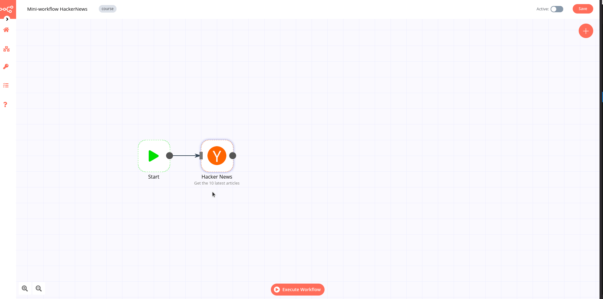<figcaption align = "center"><i>Renaming a node from the window</i></figcaption></figure>

- Select the node you want to rename and at the same time press the F2 key on your keyboard.

<figure>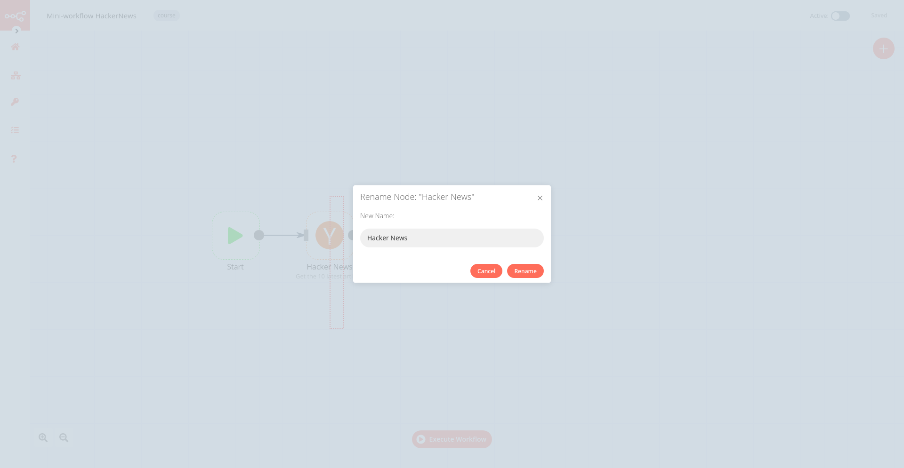<figcaption align = "center"><i>Renaming a node from the keyboard</i></figcaption></figure>
:::

### 3. Save the workflow

Save the workflow under the name “Hacker News workflow”
By default, your workflow is automatically saved as “My workflow”.

There are two ways in which you can save a workflow:
- Click **Ctrl + s** on your keyboard
- Click the **Save** button in the top right corner of the Editor UI

### 4. Execute the node

Now, click on the *Execute Node* button in the top right corner of the node window.

If the parameters are configured correctly and everything works fine, the requested data will be displayed in the node window, in two formats: Table and JSON. You can switch between these views by selecting the one you want from the JSON|Table button at the top of the node window.

The *Table* view is the default. It displays the requested data in a table, where the rows are the records (in our case, articles published on Hacker News) and the columns are the available attributes of those records (in this case, information like the author of each article).

<figure>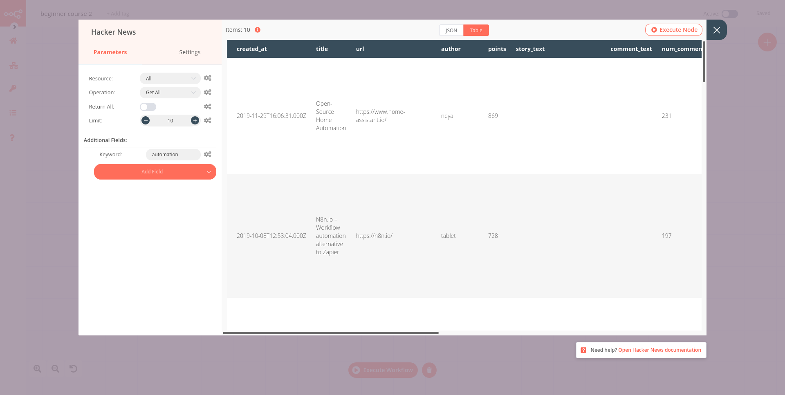<figcaption align = "center"><i>Results in Table view for the Hacker News node</i></figcaption></figure>

The **JSON** view displays the requested data in JSON format, where the keys are the attributes and the values are the individual records.

<figure>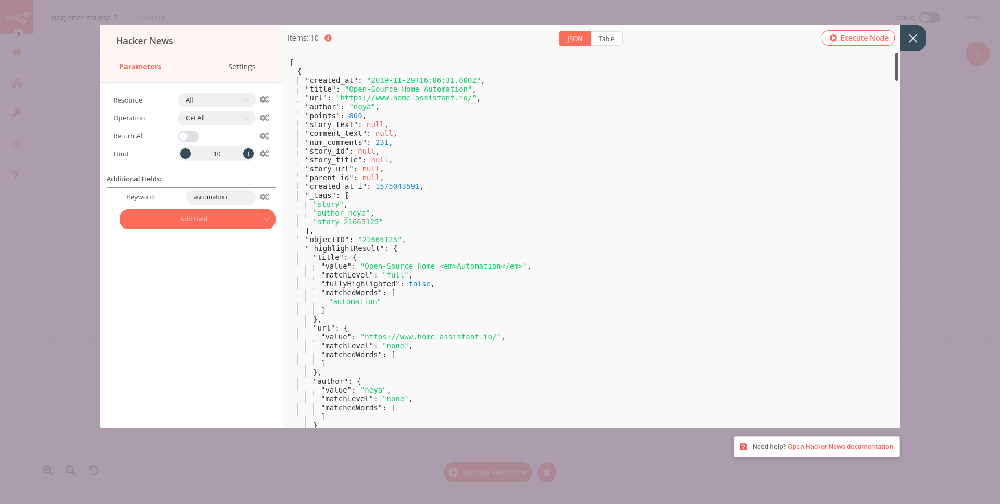<figcaption align = "center"><i>Results in JSON view for the Hacker News node</i></figcaption></figure>

In the top left corner of the results window, you’ll notice another piece of information: *Items: 10*.  This field displays the number of items (records) that are returned by the node request. In our case, it’s expected to be 10, since this is the limit we set in the node. But if you don’t set a limit, it’s useful to see how many records are actually returned.

Next to the *Items* information, notice a small orange *i* icon. If you hover on it, you’ll get two more pieces of information: **Start Time** (when the node execution started) and **Execution Time** (how long it took for the node to return the results from the moment it started executing).

*Start Time* and *Execution Time* can provide insights into the performance of each individual node.

And one last thing: In the bottom right corner right under the node window, there is a reference link to the node’s documentation. Check it out if you ever run into troubles or are not sure how to configure the node’s parameters.

Now you can close the node window and return to the Editor UI view.

Wait, something looks slightly different… Did you notice? On top of the **Start** node and the **Hacker News** node, there is a small green circle with a number inside. This shows that the nodes executed correctly. Yay!

<figure><figcaption align = "center"><i>Successfully executed workflow</i></figcaption></figure>

If you go ahead and hover on the node, you’ll notice that four other icons appear on top of it:

- Delete the node
- Deactivate/Activate the node
- Duplicate the node
- Execute the node

<figure><figcaption align = "center"><i>The four node buttons</i></figcaption></figure>

::: warning The **Start** node cannot be deleted or duplicated. If you have a workflow in which you don’t use the Start node, you can remove the connection, deactivate it, and move it away from the workflow. If you need more than one Start node, you probably need to use other Trigger nodes or create separate workflows.
:::

If you want to edit the parameters of a node, double-click on it and it will open the node window.

::: tip💡 You can move the workflow canvas around in two ways:
- Click **Ctrl + Left Mouse Button** on the canvas and move it around
- Place two fingers on your touchpad and slide

::: tip 💡 To move a workflow around the canvas, select all nodes (**Ctrl + a**), click on a node, and drag it at a point you want on the canvas.
:::

Congratulations, you just built your first workflow! Now that you know the basic concepts and components of n8n, you can start adding more nodes to the canvas and create more powerful workflows.

In the next chapter, you will be introduced to our friend Nathan, who works as an Analytics Manager at EvilCorp. His job is to crunch numbers from different sources and send reports to his team. As you might have guessed, his tasks involve a good deal of manual work that thankfully can be automated – that’s where he needs your help as an Automation Expert! You will build a more complex workflow for Nathan’s use case, helping him become more productive at work.
