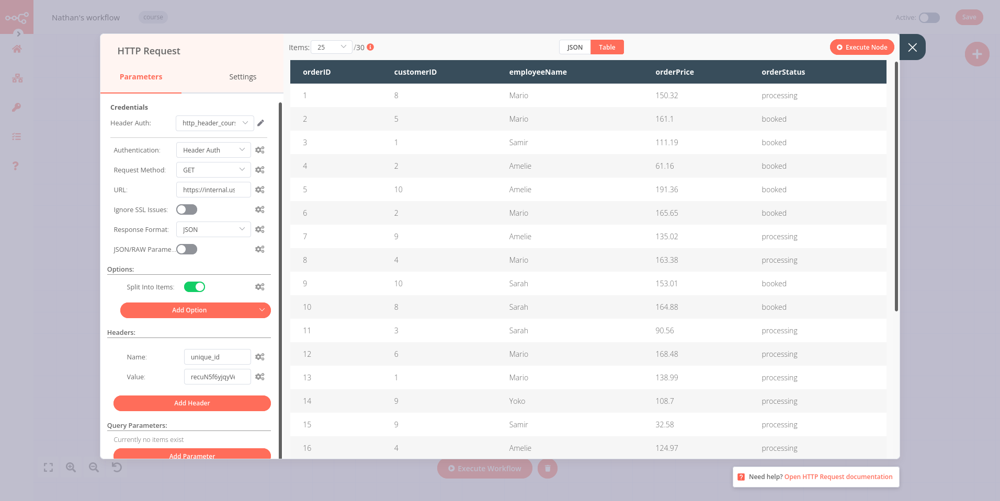
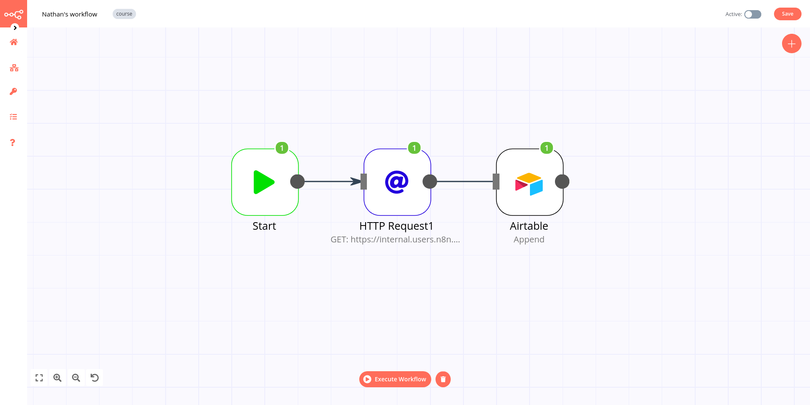
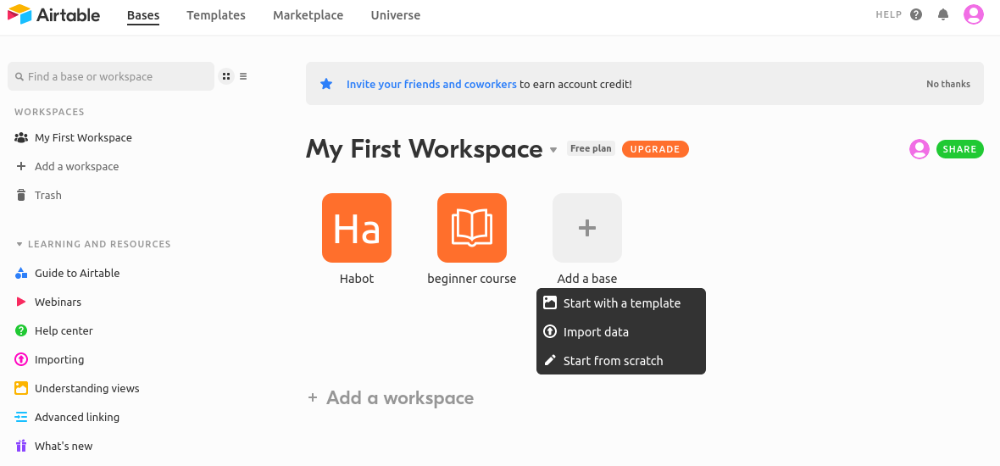
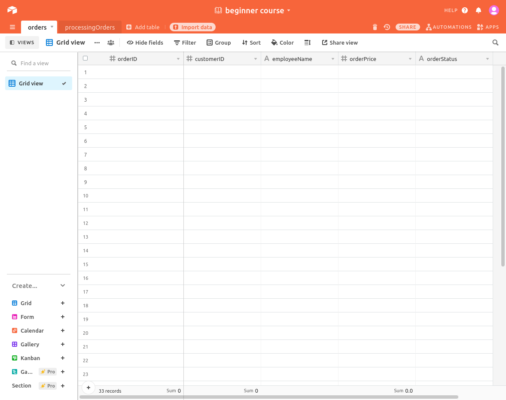
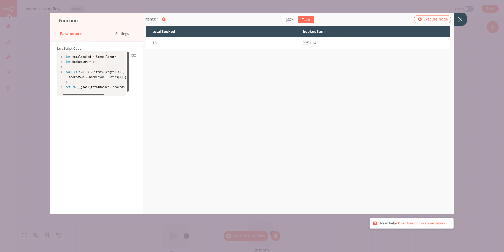

# Automating a (real-world) use case

[[toc]]

## Nathan's story

Meet Nathan 🙋. Nathan works as an Analytics Manager at EvilCorp. His job is to support the EvilCorp team with reporting and analytics. Being a true jack of all trades, he also handles several miscellaneous initiatives.

Some of the things that Nathan does are very repetitive and mind-numbing. He wants to automate some of these so that he doesn’t burn out. As an **Automation Expert**, you are meeting with Nathan today to help him understand how he can offload some of his responsibilities to n8n.

**You:** Nice to meet you, Nathan. Glad to be doing this! What’s a repetitive task that is error-prone and that you’d like to get off your plate first?

**Nathan:** Thanks for coming in! The most annoying one’s gotta be the weekly sales reporting.

I have to collect sales data from our legacy data warehouse, which manages data from the main business processes of an organisation, such as sales or production. Now, each sales order can have the status Processing or Booked. I have to calculate the sum of all the Booked orders and announce them in the company Discord every Monday. Then I have to create a spreadsheet of all the Processing sales, so that the Sales Managers can review them and check if they need to follow up with customers.

This manual work is tough and requires high attention to detail, to make sure that all the numbers are right. Inevitably, sometimes I lose my focus and mistype a number or don’t get to do it on time. I’ve been criticized once by my manager for miscalculating the data.

**You:** Oh no! Doesn’t the data warehouse have a way to export the data?

**Nathan:** The data warehouse was written in-house ages ago. It doesn’t have a CSV export but they recently added a couple of API endpoints that expose this data, if that helps.

**You:** Perfect! That’s a good start. If you have a generic API, we can add some custom code and a couple of services to make an automated workflow. This gig has n8n written all over it. Let’s get started!


## Designing the workflow

Now that we have an idea of what Nathan wants to automate, let’s enumerate the steps he needs to take to achieve this:

1. Get the relevant data (order id, order status, order value, employee name) from the data warehouse
2. Filter the orders by their status (processing or booked)
3. Calculate the total value of all the booked orders
4. Notify the team members about their individually assigned orders in the company’s Discord channel
5. Insert the details about the processing orders in Airtable for follow-up
6. Schedule this workflow to run every Monday morning

Nathan’s workflow involves sending data from the company’s data warehouse to two external services: Discord and Airtable. In between, the data has to be wrangled with general functions (conditional filtering, calculation, scheduling).

n8n provides integrations for all these steps, so Nathan’s workflow in n8n would look like this:

<figure><figcaption align = "center"><i>Nathan's workflow</i></figcaption></figure>


## Building the workflow

First of all, let’s set up the scene for building Nathan’s workflow. Open your Editor UI and create a new workflow with one of the two possible commands:

- Click **Ctrl + Alt + n** on your keyboard
- Open the left menu and click on **New** under the Workflow section

Name this new workflow “Nathan’s workflow”.

### Getting data from the data warehouse

The first step we need to take is to get data from Evil Corp’s old data warehouse. In the previous chapter, we used a regular node for a specific app (Hacker News). However, not all apps or services have dedicated nodes – like the legacy data warehouse from Nathan’s company. Nathan mentioned that it’s not possible to directly export the data, however the data warehouse has a couple of API endpoints.

That’s all we need to access the data via the [**HTTP Request**](https://docs.n8n.io/nodes/n8n-nodes-base.httpRequest/) node in n8n. The **HTTP Request** node is one of the most versatile nodes, allowing you to make HTTP requests which can be used to query data from apps and services.

::: tip 💡 No node for that service?
You can use the **HTTP Request** node to access data from apps or services that don’t have a dedicated node in n8n.
:::

Now, in your Editor UI, add an **HTTP Request** node, like you learned in Chapter 1. The node window will open, where you need to configure some parameters.

<figure><figcaption align = "center"><i>HTTP Request node</i></figcaption></figure>


In the left panel, select:

- *Authentication*: Header Auth
- *URL*: https://internal.users.n8n.cloud/webhook-test/custom-erp
- *Options > Add Option > Split Into Items*: toggle to true.
  This option will output each element of an array as its own item.
- *Headers > Add Header*:
  - *Name*: email
  - *Value*: test@mail.de

Since you selected Header Authentication, now you need to enter your [credentials](https://docs.n8n.io/reference/glossary.html%23credentials), in order to be able to access the data.

::: tip 📖 Credentials
Credentials are unique pieces of information that identify a user or a service and enable them to access apps or services (in our case, represented as n8n nodes). A common form of credentials is a pair of a username and a password, but they can take other forms depending on the service.
:::

Go to the top parameter *Credentials* and click on the pencil icon on the right of the field. This will open the Credentials window, where you need to add information to three fields:

- *Credentials Name*: beginner_course
  You can name your credentials however you want. It’s good practice to give them descriptive names for the app/service, type, and purpose of the credential. A naming convention will make it easier for you to keep track of and identify your credentials.
- *Name*: `api_key`
- *Value*: `"j[vKYdY68H(:WFb`

Your Credentials window should look like this:

<figure><figcaption align = "center"><i>HTTP Request node credentials</i></figcaption></figure>


Now click the *Save* button in the bottom right corner of the window.

In the **HTTP Request** node window, click the *Execute Node* button. The result of the HTTP request should look like this:

<figure><figcaption align = "center"><i>HTTP Request node window</i></figcaption></figure>

This view should be familiar to you from the Hacker News mini-workflow. This is the data from Nathan’s data warehouse that he needs to work with. His data set includes sales information of 30 customers with 5 features:

- *orderID*: the unique id of each order.
- *customerID*: the unique id of each customer.
- *employeeName*: the name of Nathan’s colleagues who are responsible for each client.
- *orderPrice*: the total price of the customer’s order.
- *orderStatus*: whether the customer’s order is booked or still in processing.

----

**Nathan 🙋**: This is great! You already automated an important part of my job with only a couple of clicks. Now instead of manually accessing the data every time he needs it, I can use this workflow to automatically get the information.

**You 👩‍🔧**: Nice! In the next chapter, I’ll help you one step further and insert the received data into Airtable, as you need it.

### Inserting data into Airtable

Before starting to manipulate data from Evil Corp’s data warehouse, it’s helpful to understand how data is structured and why moving it from one source to another is not always straightforward.



If we are going to insert data into Airtable, we first need to set up a table there. To do this:
1. [Create an Airtable account](https://airtable.com/signup).
2. In your Airtable workspace, add a new base from scratch and name it, for example, *beginner course*.



3. In the beginner course base, you have by default a *Table 1* with four fields: *Name, Notes, Attachment, and Status*.

These fields are not relevant for us, since they are not in our orders data set. This brings us to the next point: the names of the fields in Airtable have to match the names of the columns in the node result.

Replace the four default table fields with the five column names from the data set. Also, rename the table from *Table 1* to *orders*, to make it easier to identify. Now your table should look like this:



Now that the table is prepared, let’s return to the workflow in the Editor UI. Add an **Airtable node** connected to the HTTP Request node. In the **Airtable node** window, configure the following parameters:
- *Airtable API*: the name of your credentials (e.g. airtable_api) and your API key.
Adding credentials for Airtable is similar to the HTTP Request node you configured in the previous chapter. However, the process of obtaining an API key for Airtable (and other apps/services) is different.
:bulb:
- *Operation*: Append
This operation will append the new data to the table.
- *Base ID*: the ID of the beginner_course base. To get the base Base ID, go to [Airtable's API page](https://airtable.com/api) and click on the base you want to use. The Base ID will be listed in the introduction.
- *Table*: orders

Now execute the Airtable node and you should get the following result:


All 30 data records will now appear in the orders table:


### Filtering orders

The workflow created in the previous step inserts all collected data into Airtable. But remember that Nathan wants to insert only processing orders in the table and calculate only the price of booked orders.

This means we need to filter our data by *orderStatus*. Basically, we want to tell the program that _if_ the *orderStatus* is processing, _then_ insert all records with this status into Airtable; _else_, i.e. if the *orderStatus* is not *processing*, calculate the sum of all orders with the other *orderStatus (booked)*.

This if-then-else command is conditional logic. In n8n workflows, conditional logic can be implemented with the [IF node](../../nodes/nodes-library/core-nodes/If/README.md), which splits a workflow conditionally based on comparison operations.

::: tip 💡
If you need to filter data on more than two conditional routes that are possible with the IF node (true and false), use the [Switch node](../../nodes/nodes-library/core-nodes/Switch/README.md). The Switch node is similar to the IF node, but supports up to four conditional routes.
:::

Back to your workflow, remove the connection between the **HTTP Request node** and the **Airtable node**. Add an **IF node** connected to the **HTTP Request node**.

In the **IF node** window, click on *Add Condition* > *string* and configure the parameters:
::: v-pre
- *Value 1*: Current Node > Input Data > JSON > orderStatus → `{{$json["orderStatus"]}}`
To select this value, click on the wheel icon “Add Expression” on the right side of the Value 1 field. An [expression](../../reference/glossary.md#Expression) is a string of characters and symbols in a programming language that represents a value depending upon its input. In n8n workflows, you can use expressions in a node to refer to another node for input data. In our example, the IF node references the data output by the HTTP Request node.
:::


- *Operation*: equal
- *Value 2*: processing

:::warning
Make sure to select the correct data type (boolean, data & time, number, or string) of the referenced data in Add Condition.
:::

Now execute the IF node and have a look at the resulted data, which should look like this:


Next, we want to insert this data into Airtable. You already know how to do this from the previous chapter, where we inserted all data into the *orders* table.

At this stage, your workflow would look like this:


But Nathan doesn’t need all the information about the processing orders in Airtable. Sure, he could insert all the five fields “just in case”, but this is not good practice. Inserting more data requires more computational power, the data transfer is slower / takes longer, and takes up more storage resources in your table.

In this particular case, 14 records with 5 features might not seem like a lot to make a significant difference, but if you consider a business with thousands of records and tens of features, things add up and even one extra column can affect performance.

Nathan’s interest in storing processing orders is to have an overview of what employee is responsible for each open order, identified by their id. This means that he needs only the records for employeeName and orderId in Airtable. You’ll learn how to do this in the next lesson.

### Setting values for processing orders
The next step in Nathan’s workflow is to insert the *employeeName* and orderId of all *processing* orders into Airtable.

For this, you need to use the [Set node](../../nodes/nodes-library/core-nodes/Set/README.md), which allows you to select and set the data you want to be transferred from one app/service to another. This node can set completely new data as well as overwrite data that already exists. This node is crucial in workflows which expect incoming data from previous nodes, such as when inserting values into spreadsheets or databases.

In your workflow, add a new **Set node** between the **IF node** and the **Airtable node**. In the Set node window, you need to add two values, similarly to the **IF node**. Select:

::: v-pre
- Add Value > Number:
  - Name: orderId
  - Value: `{{$json["orderId"]}}`
    Current Node > Input Data > JSON > orderID
- Add Value > String:
  - Name: employeeName
  - Value: `{{$json["employeeName"]}}`
    Current Node > Input Data > JSON > orderID
:::

After setting the two values, click on Execute Node and you should the following results:


Next, we need to insert these values into Airtable. Go to your Airtable and add a new table called *processingOrders* with two columns named *orderId* and *employeeName*, just like you learned in the lesson [Inserting data into Airtable](#inserting-data-into-airtable).

Once that’s done, execute the **Airtable node** in the workflow and you should see the records inserted in the table.

We are getting closer and closer to fulfilling Nathan’s workflow! At this stage, it looks like this:


In the next lesson, we’ll continue on the false branch and calculate the value of booked orders.

### Calculating booked orders

The next step in Nathan’s workflow is to calculate two values from the booked orders:
- The total number of booked orders
- The total price of all booked order

To calculate data and add more functionality to your workflows, you can use the Function node, which lets you write custom JavaScript code.

::: warning 💡
n8n also provides a **Function Item node**, which should not be confused with the Function node. The Function Item node is used to add custom snippets to JavaScript code that should be executed once for every item that it receives as the input. Learn more about the difference between the Function and Function Item nodes [here](../../reference/function-nodes.md).
:::

Before going into the setup of the Function node, you should first learn the [data structure](../../reference/data/data-structure.md) of n8n. This is important if you want to:
- create your own node
- write custom expressions
- use the Function or Function Item node
- you want to get the most out of n8n

In n8n, the data that is passed between nodes is an array of objects, with the following structure:
```json
[
    {
   	 // Each item has to contain a "json" property. But it can be an empty object like {}.
   	 // Any kind of JSON data is allowed. So arrays and the data being deeply nested is fine.
   	 json: { // The actual data n8n operates on (required)
   		 // This data is only an example it could be any kind of JSON data
   		 jsonKeyName: 'keyValue',
   		 anotherJsonKey: {
   			 lowerLevelJsonKey: 1
   		 }
   	 },
   	 // Binary data of item. The most items in n8n do not contain any (optional)
   	 binary: {
   		 // The key-name "binaryKeyName" is only an example. Any kind of key-name is possible.
   		 binaryKeyName: {
   			 data: '....', // Base64 encoded binary data (required)
   			 mimeType: 'image/png', // Optional but should be set if possible (optional)
   			 fileExtension: 'png', // Optional but should be set if possible (optional)
   			 fileName: 'example.png', // Optional but should be set if possible (optional)
   		 }
   	 }
    },
    ...
]
```
Now let’s see how to implement this.

In your workflow, add a **Function node** connected to the false branch of the **IF node**. In the **Function node** window, paste the following code in the JavaScript Code box:

```javascript
let totalBooked = items.length;
let bookedSum = 0;

for(let i=0; i < items.length; i++) {
  bookedSum = bookedSum + items[i].json.orderPrice;
}
return [{json:{totalBooked, bookedSum}}]

```

Notice the format in which we return the results of the calculation:
`return [{json:{totalBooked, bookedSum}}]`

If you don’t use the correct data structure, you will get an error message: Error: Always an Array of items has to be returned!

Now execute the node and you should see the following results:


