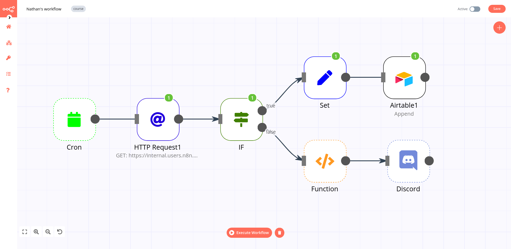
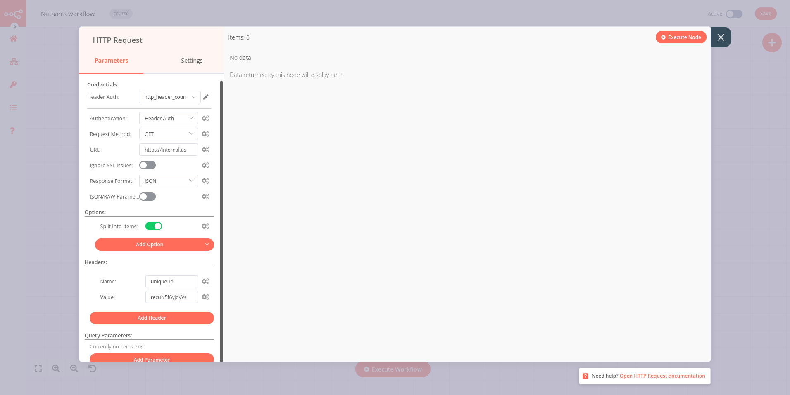
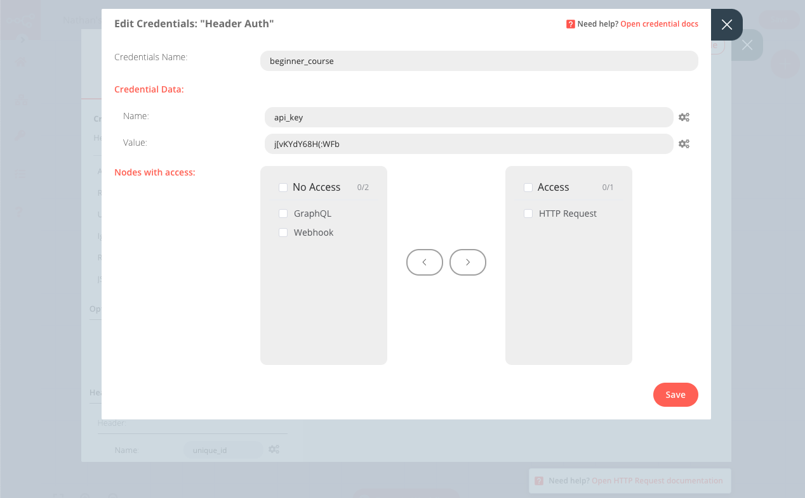

# Automating a (real-world) use case

[[toc]]

## Nathan's story

Meet Nathan 🙋. Nathan works as an Analytics Manager at EvilCorp. His job is to support the EvilCorp team with reporting and analytics. Being a true jack of all trades, he also handles several miscellaneous initiatives.

Some of the things that Nathan does are very repetitive and mind-numbing. He wants to automate some of these so that he doesn’t burn out. As an **Automation Expert**, you are meeting with Nathan today to help him understand how he can offload some of his responsibilities to n8n.

**You:** Nice to meet you, Nathan. Glad to be doing this! What’s a repetitive task that is error-prone and that you’d like to get off your plate first?

**Nathan:** Thanks for coming in! The most annoying one’s gotta be the weekly sales reporting.

I have to collect sales data from our legacy data warehouse, which manages data from the main business processes of an organisation, such as sales or production. Now, each sales order can have the status Processing or Booked. I have to calculate the sum of all the Booked orders and announce them in the company Discord every Monday. Then I have to create a spreadsheet of all the Processing sales, so that the Sales Managers can review them and check if they need to follow up with customers.

This manual work is tough and requires high attention to detail, to make sure that all the numbers are right. Inevitably, sometimes I lose my focus and mistype a number or don’t get to do it on time. I’ve been criticized once by my manager for miscalculating the data.

**You:** Oh no! Doesn’t the data warehouse have a way to export the data?

**Nathan:** The data warehouse was written in-house ages ago. It doesn’t have a CSV export but they recently added a couple of API endpoints that expose this data, if that helps.

**You:** Perfect! That’s a good start. If you have a generic API, we can add some custom code and a couple of services to make an automated workflow. This gig has n8n written all over it. Let’s get started!

## Designing the workflow

Now that we have an idea of what Nathan wants to automate, let’s enumerate the steps he needs to take to achieve this:

1. Get the relevant data (order id, order status, order value, employee name) from the data warehouse
2. Filter the orders by their status (processing or booked)
3. Calculate the total value of all the booked orders
4. Notify the team members about their individually assigned orders in the company’s Discord channel
5. Insert the details about the processing orders in Airtable for follow-up
6. Schedule this workflow to run every Monday morning

Nathan’s workflow involves sending data from the company’s data warehouse to two external services: Discord and Airtable. In between, the data has to be wrangled with general functions (conditional filtering, calculation, scheduling).

n8n provides integrations for all these steps, so Nathan’s workflow in n8n would look like this:

## Building the workflow

First of all, let’s set up the scene for building Nathan’s workflow. Open your Editor UI and create a new workflow with one of the two possible commands:

- Click **Ctrl + Alt + n** on your keyboard
- Open the left menu and click on **New** under the Workflow section

Name this new workflow “Nathan’s workflow”.

### Getting data from the data warehouse

The first step we need to take is to get data from Evil Corp’s old data warehouse. In the previous chapter, we used a regular node for a specific app (Hacker News). However, not all apps or services have dedicated nodes – like the legacy data warehouse from Nathan’s company. Nathan mentioned that it’s not possible to directly export the data, however the data warehouse has a couple of API endpoints.

That’s all we need to access the data via the [HTTP Request](https://docs.n8n.io/nodes/n8n-nodes-base.httpRequest/) node in n8n. The HTTP Request node is one of the most versatile nodes, allowing you to make HTTP requests which can be used to query data from apps and services.

::: tip 💡 No node for that service?
You can use the HTTP Request node to access data from apps or services that don’t have a dedicated node in n8n.
:::

Now, in your Editor UI, add an HTTP Request node, like you learned in Chapter 1. The node window will open, where you need to configure some parameters.

In the left panel, select:

- Authentication: Header Auth
- URL: https://internal.users.n8n.cloud/webhook-test/custom-erp
- Options > Add Option > Split Into Items: toggle to true.
- This option will output each element of an array as its own item.
- Headers > Add Header:
  Name: email
  Value: test@mail.de

Since you selected Header Authentication, now you need to enter your [credentials](https://docs.n8n.io/reference/glossary.html%23credentials), in order to be able to access the data.

::: tip 📖 Credentials
Credentials are unique pieces of information that identify a user or a service and enable them to access apps or services (in our case, represented as n8n nodes). A common form of credentials is a pair of a username and a password, but they can take other forms depending on the service.
:::

Go to the top parameter Credentials and click on the pencil icon on the right of the field. This will open the Credentials window, where you need to add information to three fields:

- Credentials Name: beginner_course
    You can name your credentials however you want. It’s good practice to give them descriptive names for the app/service, type, and purpose of the credential. A naming convention will make it easier for you to keep track of and identify your credentials.
- Name: `api_key`
- Value: `"j[vKYdY68H(:WFb`

Your Credentials window should look like this:

Now click the **Save** button in the bottom right corner of the window.

In the HTTP Request node window, click the **Execute Node** button. The result of the HTTP request should look like this:

THIS IMAGE SHOULD BE UPDATED

This view should be familiar to you from the Hacker News mini-workflow. This is the data from Nathan’s data warehouse that he needs to work with. His data set includes sales information of 30 customers with 5 features:

- orderID: the unique id of each order.
- customerID: the unique id of each customer.
- employeeName: the name of Nathan’s colleagues who are responsible for each client.
- orderPrice: the total price of the customer’s order.
- orderStatus: whether the customer’s order is booked or still in processing.

Nathan 🙋: This is great! You already automated an important part of my job with only a couple of clicks. Now instead of manually accessing the data every time he needs it, I can use this workflow to automatically get the information.

You 👩‍🔧: Nice! In the next chapter, I’ll help you one step further and insert the received data into Airtable, as you need it.
