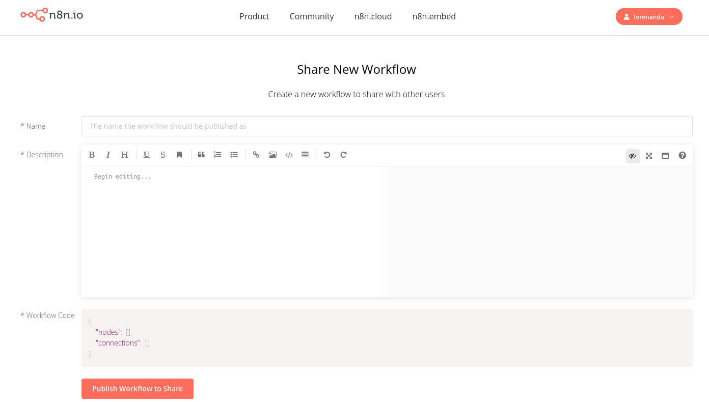

# Exporting, importing, and sharing workflows

[[toc]]

## Exporting and importing workflows

Workflows can be saved locally as JSON files. This is useful if you want to share your workflow with someone else or import a workflow from someone else.

::: warning
Note that the exported JSON file of your workflow will contain your credentials as well. If you don’t want to share your credentials (recommended), delete them from the JSON file.
:::

You can export and import workflows in two ways:

* From the Editor UI:
    * Export: In the left panel, click on _Download _under the _Workflow_ section. This will download your current workflow as a JSON file on your computer.
    * Import: In the left pane, click on _Import from URL_ (to import a published workflow) or _Import from File_ (to import a workflow as a JSON file).
* From the command line:
    * Export: See the [full list of commands ](https://docs.n8n.io/reference/start-workflows-via-cli.html#export-workflows-and-credentials)for exporting workflows or credentials.
    * Import: See the [full list of commands ](https://docs.n8n.io/reference/start-workflows-via-cli.html#import-workflows-and-credentials)for importing workflows or credentials.

## Sharing workflows

We love to see what users build with n8n and discover inspiring workflows, while also sharing our ideas with them! On the [n8n workflows page](https://n8n.io/workflows), you can find hundreds of workflows contributed by our team or users. Feel free to share your workflows too!

Of course, since many users take this course and build the same workflow, there is no point in sharing Nathan’s workflow on the workflows page. However, we encourage you to build other helpful and original workflows and share them with the community.

To share a workflow, follow these steps:

1. Sign in to[ n8n.io](https://n8n.io/login)
2. Click on the **_+ Share New Workflow_** button.
3. Enter the name of your workflow in the **_Name_** field.
The name should be descriptive for the purpose of the workflow and easy for other users to understand.

4. In the **_Description_** field, add a screenshot of your workflow and write a description below it.
	* The screenshot should capture the entire Editor UI.
	* The description should list all the nodes used in the workflow and the function they serve. You should also mention any prerequisites for building the workflow.

[This is an example](https://n8n.io/workflows/1110) of a well-written description that you can use as a template for your own workflows.

5. In the Editor UI, select all the nodes in your workflow (Ctrl + A) and copy them (Ctrl + C).
6. In the **_Workflow Code_** field, delete the existing code and paste your workflow in it (Ctrl + V).
7. Click on the **_Publish Workflow to Share_** button to share your workflow.

Now your workflow will be reviewed by our team and if all is well, it will appear on the n8n workflows page for everyone to see and use!
