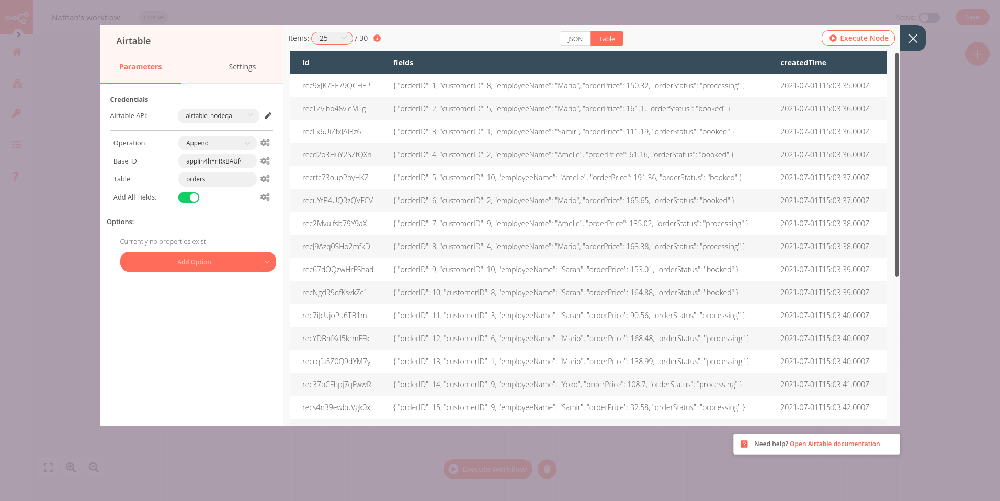
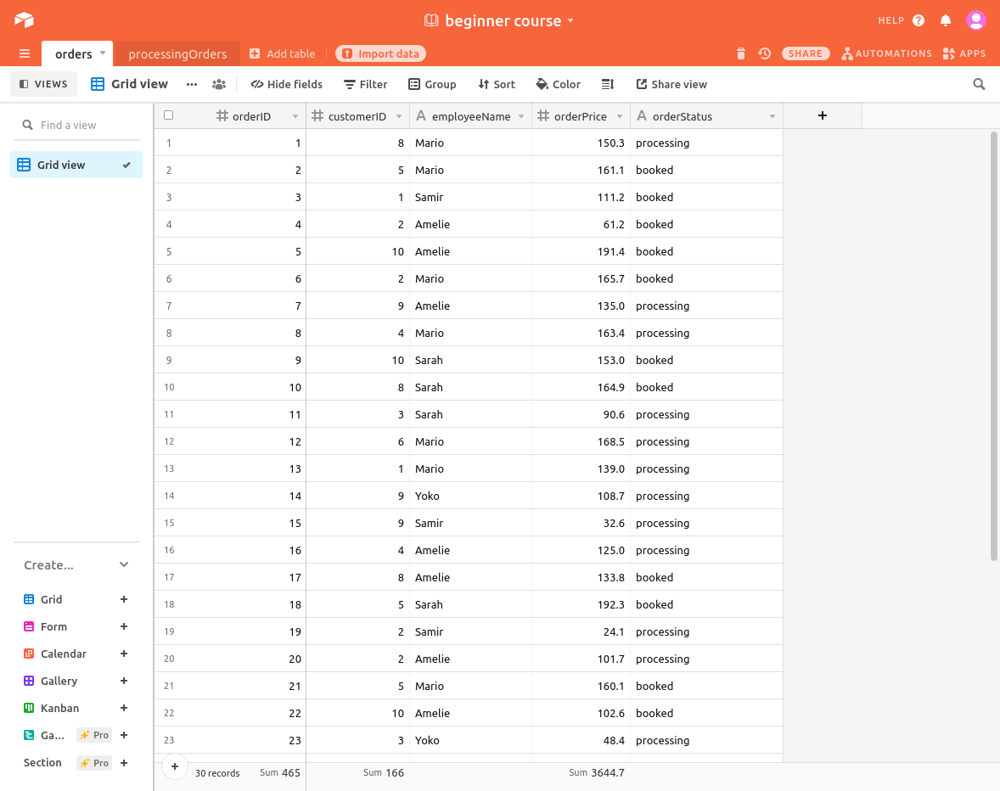

# Inserting data into Airtable

[[toc]]

Before starting to manipulate data from Evil Corp’s data warehouse, it’s helpful to understand how data is structured and why moving it from one source to another is not always straightforward.

If we are going to insert data into Airtable, we first need to set up a table there. To do this:
1. [Create an Airtable account](https://airtable.com/signup).
2. In your Airtable workspace, add a new base from scratch and name it, for example, *beginner course*.

3. In the beginner course base, you have by default a *Table 1* with four fields: *Name, Notes, Attachment, and Status*.

These fields are not relevant for us, since they are not in our orders data set. This brings us to the next point: the names of the fields in Airtable have to match the names of the columns in the node result.

Replace the four default table fields with the five column names from the data set. Also, rename the table from *Table 1* to *orders*, to make it easier to identify. Now your table should look like this:

Now that the table is prepared, let’s return to the workflow in the Editor UI. Add an **Airtable node** connected to the HTTP Request node. In the **Airtable node** window, configure the following parameters:
- *Airtable API*: the name of your credentials (e.g. airtable_api) and your API key.
Adding credentials for Airtable is similar to the HTTP Request node you configured in the previous chapter. However, the process of obtaining an API key for Airtable (and other apps/services) is different.
:bulb:
- *Operation*: Append
This operation will append the new data to the table.
- *Base ID*: the ID of the beginner_course base. To get the base Base ID, go to [Airtable's API page](https://airtable.com/api) and click on the base you want to use. The Base ID will be listed in the introduction.
- *Table*: orders

Now execute the Airtable node and you should get the following result:

All 30 data records will now appear in the orders table:

