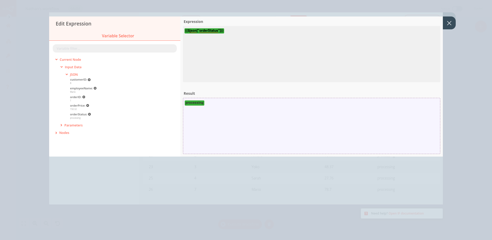
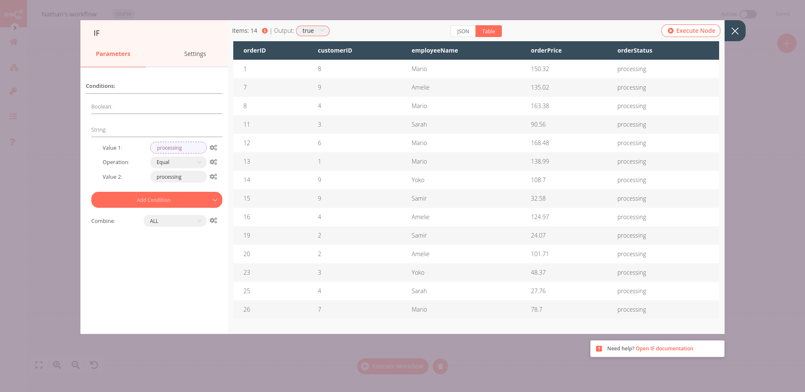
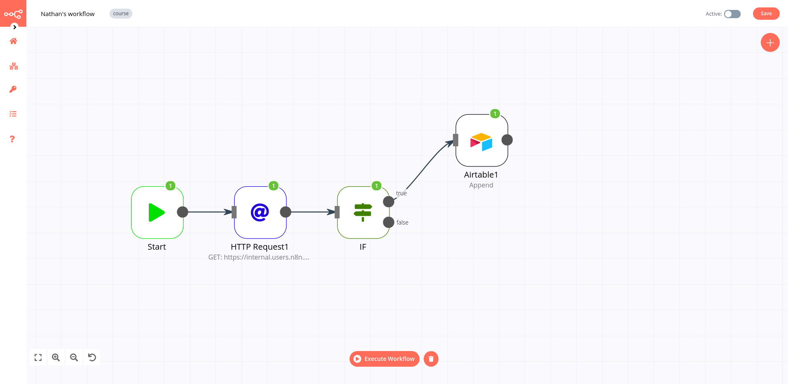

# 3. Filtering orders

In this step of the workflow, you will learn how to filter data using conditional logic and how to use expressions in nodes using the *IF node*.

To insert only processing orders into Airtable, we need to filter our data by *orderStatus*. Basically, we want to tell the program that _if_ the *orderStatus* is processing, _then_ insert all records with this status into Airtable; _else_, i.e. if the *orderStatus* is not *processing*, calculate the sum of all orders with the other *orderStatus (booked)*.

This if-then-else command is conditional logic. In n8n workflows, conditional logic can be implemented with the [***IF node***](../../../nodes/nodes-library/core-nodes/If/README.md), which splits a workflow conditionally based on comparison operations.

::: tip 💡 IF vs Switch
If you need to filter data on more than two conditional routes that are possible with the *IF node* (true and false), use the [*Switch node*](../../../nodes/nodes-library/core-nodes/Switch/README.md). The *Switch node* is similar to the *IF node*, but supports up to four conditional routes.
:::

Back to your workflow, remove the connection between the *HTTP Request node* and the *Airtable node*. Add an *IF node* connected to the *HTTP Request node*.

In the *IF node* window, click on *Add Condition* > *string* and configure the parameters:
::: v-pre
- *Value 1*: Current Node > Input Data > JSON > orderStatus → `{{$json["orderStatus"]}}`  
To select this value, click on the wheel icon “Add Expression” on the right side of the Value 1 field.

::: tip 📖 Expressions
An [expression](../../../reference/glossary.md#Expression) is a string of characters and symbols in a programming language that represents a value depending upon its input. In n8n workflows, you can use expressions in a node to refer to another node for input data. In our example, the IF node references the data output by the HTTP Request node.
:::

<figure><figcaption align = "center"><i>Expression Editor in the IF node</i></figcaption></figure>

- *Operation:* equal
- *Value 2:* processing

:::warning ⚠️ Data Type
Make sure to select the correct data type (boolean, data & time, number, or string) of the referenced data in *Add Condition*.
:::

Now execute the IF node and have a look at the resulted data, which should look like this:

<figure><figcaption align = "center"><i>IF node</i></figcaption></figure>

Next, we want to insert this data into Airtable. You already know how to do this from the previous chapter, where we inserted all data into the *orders* table.

At this stage, your workflow would look like this:

<figure><figcaption align = "center"><i>Workflow with the IF node</i></figcaption></figure>

## What's next?

**Nathan 🙋**: This IF node is really useful for filtering data! Now I have all the information about processing orders. I actually only need the employeeName and orderId, but I guess I can keep all the other fields just in case.

**You 👩‍🔧**: Actually, I wouldn't recommend doing that. Inserting more data requires more computational power, the data transfer is slower / takes longer, and takes up more storage resources in your table. In this particular case, 14 records with 5 features might not seem like a lot to make a significant difference, but if your business grows to thousands of records and tens of features, things add up and even one extra column can affect performance.

**Nathan 🙋**: Oh, that's good to know. So, can you select only two fields from the processing orders?

**You 👩‍🔧**: Sure, I'll do that in the next step.
