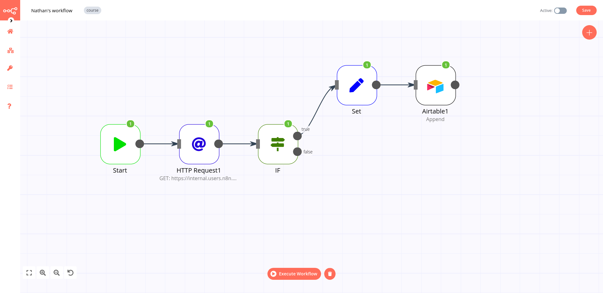

# 4. Setting Values for Processing Orders

In this step of the workflow you will learn how to select and set data before transferring it to Airtable using the *Set* node.

The next step in Nathan’s workflow is to insert the *employeeName* and *orderId* of all *processing* orders into Airtable.

For this, you need to use the [**Set node**](../../../nodes/nodes-library/core-nodes/Set/README.md), which allows you to select and set the data you want to be transferred from one app/service to another.

::: tip 📖 Set node
The *Set* node can set completely new data as well as overwrite data that already exists. This node is crucial in workflows which expect incoming data from previous nodes, such as when inserting values into spreadsheets or databases.
:::

In your workflow, add a new *Set* node between the *IF* node and the *Airtable* node. In the Set node window you need to toggle *Keep Only Set* to true and then add two values:

::: v-pre
- *Add Value > Number:*
  - *Name:* orderId
  - *Value:* `{{$json["orderID"]}}`
    *Current Node > Input Data > JSON > orderID*
- *Add Value > String:*
  - *Name:* employeeName
  - *Value:* `{{$json["employeeName"]}}`
    *Current Node > Input Data > JSON > employeeName*
:::

After setting the two values click on *Execute Node* and you should see the following results:

<figure><figcaption align = "center"><i>Set node</i></figcaption></figure>

Next, we need to insert these values into Airtable. Go to your Airtable account and add a new table called *processingOrders* with two columns, *orderId* and *employeeName*, just like you learned in the lesson [Inserting data into Airtable](chapter-5.2.md).

Remember to update the Airtable node configuration to point to this new table.

Once that’s done, execute the *Airtable* node in the workflow and you should see the records inserted in the table.

At this stage, it looks like this:

<figure><figcaption align = "center"><i>Workflow with the Set node</i></figcaption></figure>

## What's next?

**Nathan 🙋**: You've already automated half of my work! Now I still need to calculate the booked orders for my colleagues. Can that be automated as well?

**You 👩‍🔧**: Of course! In the next step, I'll use some JavaScript code in a node to calculate the booked orders.
