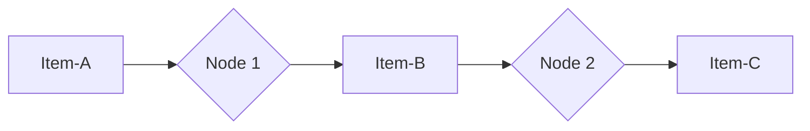
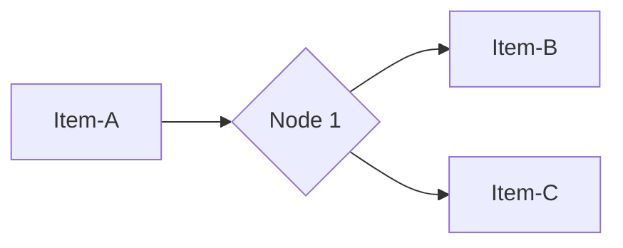
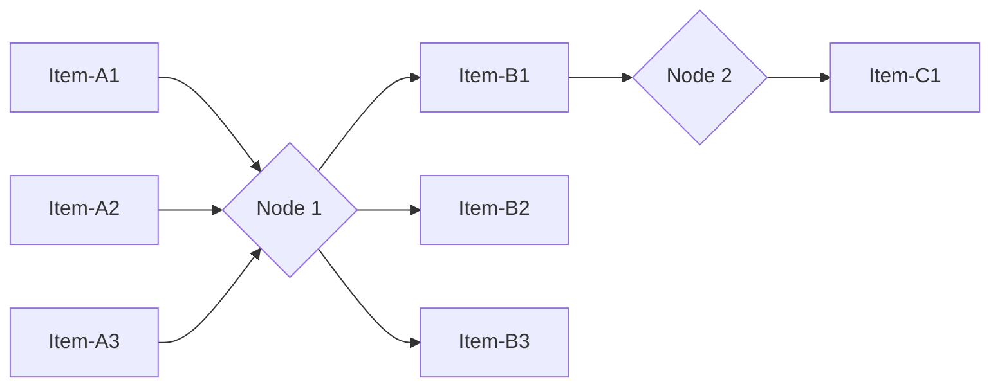

# Item linking scenarios

Each new item created by a node includes metadata that links them to the previous item (or items) that the node used to generate them. This can be complicated to understand, especially if the node splits or merges data. The following examples show how this behavior works in different scenarios.

This document provides a conceptual overview of this feature. For usage details, refer to:

* [Item linking for node creators](/data/data-item-linking/item-linking-node-building/), for details on how to handle item linking when building a node.
* [Following the data path](/data/data-item-linking/item-linking-users/), to learn how to reference items in previous nodes.
* [Item linking errors](/data/data-item-linking/item-linking-errors/), to understand the errors you may encounter in the editor UI.

## Single input, single output

This is the simplest example. Item-C links back to Item-B, and Item-B links back to Item-A. This makes it possible to refer back to Item-A from Item-C. 

## Single input, multiple outputs

This is when a node receives a single item and splits it. Every new item links back to the original item. Both Item-B and Item-C link back to Item-A.

## Multiple inputs, multiple outputs

This is when a node receives more than one item, operates on each item in turn, and outputs a new item for each input item that it processes. In this case:

* B1 links back to A1, B2 to A2, and so on.
* It's possible to refer back from A3 to A1.
* It's not possible to refer back from C1 to A3.

## Multiple inputs, combined outputs

This scenario is theoretically possible, but shouldn't occur in practice.
