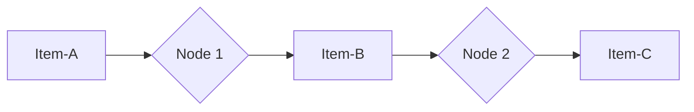
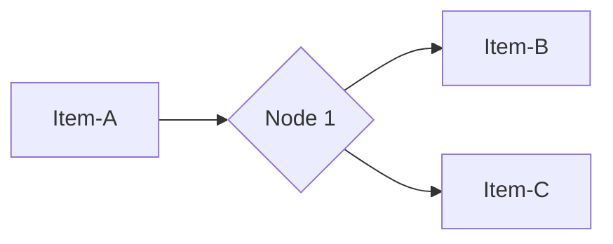
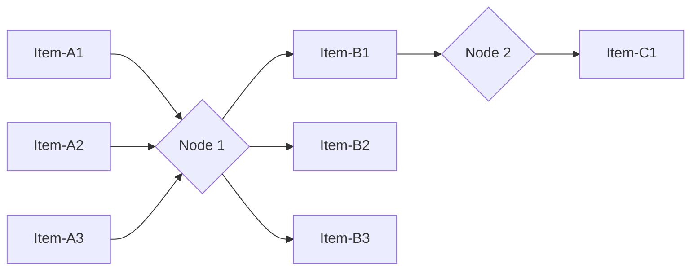

# Item linking scenarios

Each output item created by a node includes metadata that links them to the input item (or items) that the node used to generate them. This creates a chain of items that you can work back along to access previous items. This can be complicated to understand, especially if the node splits or merges data. The following examples show how this behavior works in different scenarios.

This document provides a conceptual overview of this feature. For usage details, refer to:

* [Item linking for node creators](/data/data-item-linking/item-linking-node-building/), for details on how to handle item linking when building a node.
* [Working with the data path](/data/data-item-linking/item-linking-users/), to learn how to reference items in previous nodes, and handle item linking in the Function node.
* [Item linking errors](/data/data-item-linking/item-linking-errors/), to understand the errors you may encounter in the editor UI.

## n8n's automatic item linking

If a node doesn't control how to link input items to output items, n8n tries to guess how to link the items automatically:

* Single input, single output: the output links to the input.
* Single input, multiple outputs: all outputs link to that input.
* Multiple inputs and outputs:
	* If you keep the input items, but change the order (or remove some but keep others), n8n can automatically add the correct linked item information.
	* If the number of inputs and outputs is equal, n8n links the items in order. This means that output-1 links to input-1, output-2 to input-2, and so on.
	* If the number isn't equal, or you create completely new items, n8n can't automatically link items.

If n8n can't link items automatically, and the node doesn't handle the item linking, n8n displays an error. Refer to [Item linking errors](/data/data-item-linking/item-linking-errors/) for more information.

## Default scenarios

These are the item linking scenarios that match the expected behavior of n8n's automatic item linking.

### Single input, single output

This is the simplest example. Item-C links back to Item-B, and Item-B links back to Item-A. This makes it possible to refer back to Item-A from Item-C. 

### Single input, multiple outputs

This is when a node receives a single item and splits it. Every new item links back to the original item. Both Item-B and Item-C link back to Item-A.

### Multiple inputs, multiple outputs

This is when a node receives more than one item, operates on each item in turn, and outputs a new item for each input item that it processes. 

Assuming the node preserves the item order:

* B1 links back to A1, B2 to A2, and so on.
* It's possible to refer back from A3 to A1.
* It's not possible to refer back from C1 to A3.

### Multiple inputs, combined outputs

This scenario is theoretically possible, but shouldn't occur in practice. Node builders should ensure that `pairedItem` (which contains the item linking information) is null in this scenario.
