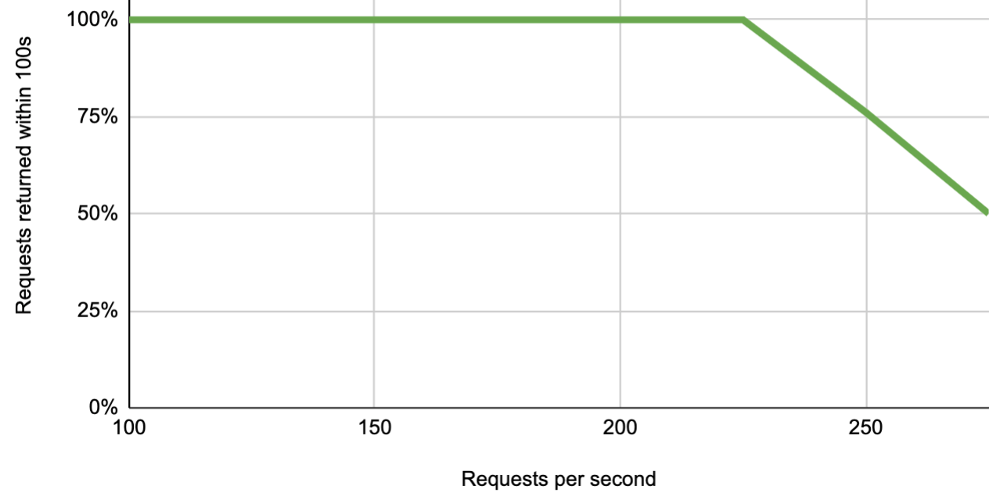
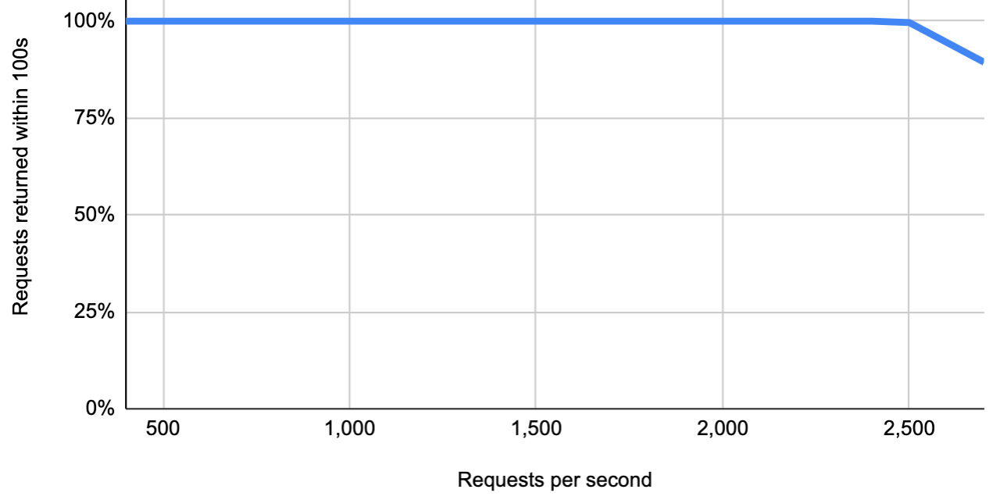

# Performance and benchmarking 

n8n can handle up to 220 workflow executions per second on a single instance, with the ability to scale up further by adding more instances.

This document outlines n8n's performance benchmarking. It describes the factors that affect performance, and includes two example benchmarks.

## Performance factors 

The performance of n8n depends on factors including: 

* The workflow type
* The resources available to n8n
* How you configure n8n's scaling options

## Run your own benchmarking 

To get an accurate estimate for your use case, run n8n's [benchmarking framework](https://github.com/n8n-io/n8n/tree/master/packages/%40n8n/benchmark). The repository contains more information about the benchmarking.

## Example: Single instance performance 

This test measures how response time increases as requests per second increase. It looks at the response time when calling the Webhook Trigger node.

Setup:

- Hardware: ECS c5a.large instance (4GB RAM)
- n8n setup: Single n8n instance (running in main mode, with Postgres database)
- Workflow: Webhook Trigger node, Edit Fields node

<figure markdown>
  
  <figcaption>This graph shows the percentage of requests to the Webhook Trigger node getting a response within 100 seconds, and how that varies with load. Under higher loads n8n usually still processes the data, but takes over 100s to respond.</figcaption>
</figure>

## Example: Multi-instance performance 

This test measures how response time increases as requests per second increase. It looks at the response time when calling the Webhook Trigger node.

Setup:

- Hardware: seven ECS c5a.4xlarge instances (8GB RAM each)
- n8n setup: two webhook instances, four worker instances, one database instance (MySQL), one main instance running n8n and Redis
- Workflow: Webhook Trigger node, Edit Fields node
- Multi-instance setups use [Queue mode](enable-queue-mode.md)

<figure markdown>
  
  <figcaption>This graph shows the percentage of requests to the Webhook Trigger node getting a response within 100 seconds, and how that varies with load. Under higher loads n8n usually still processes the data, but takes over 100s to respond.</figcaption>
</figure>

