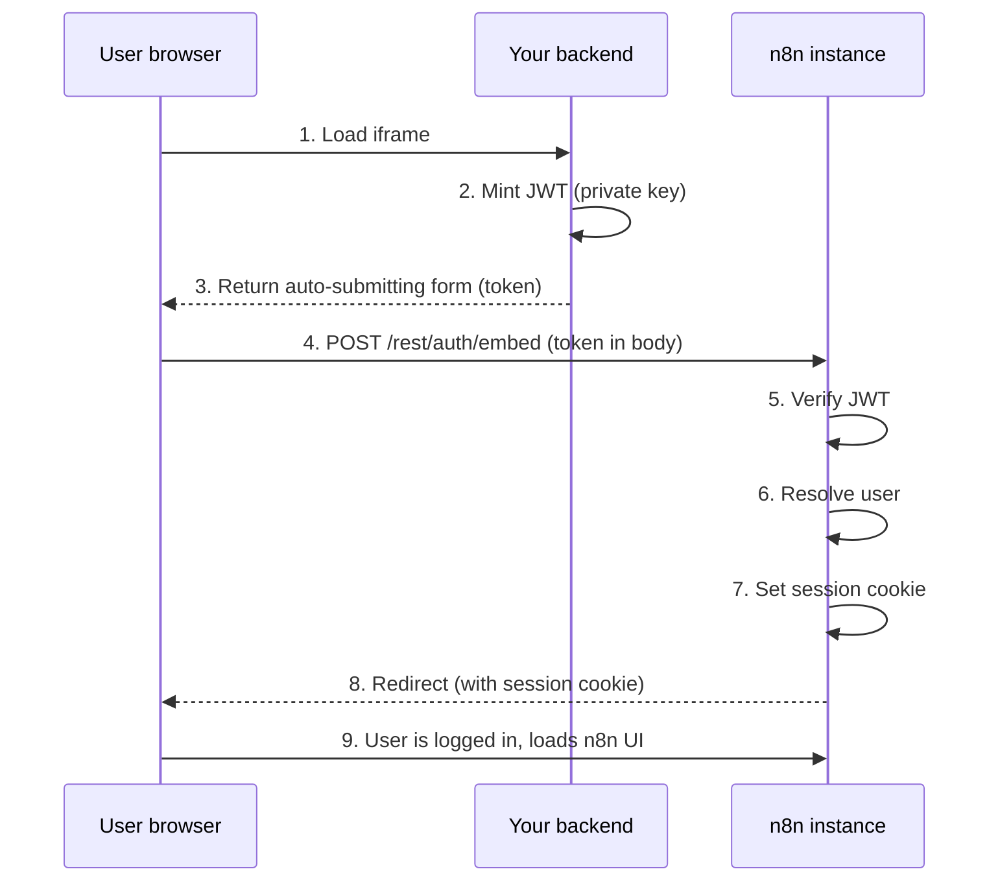
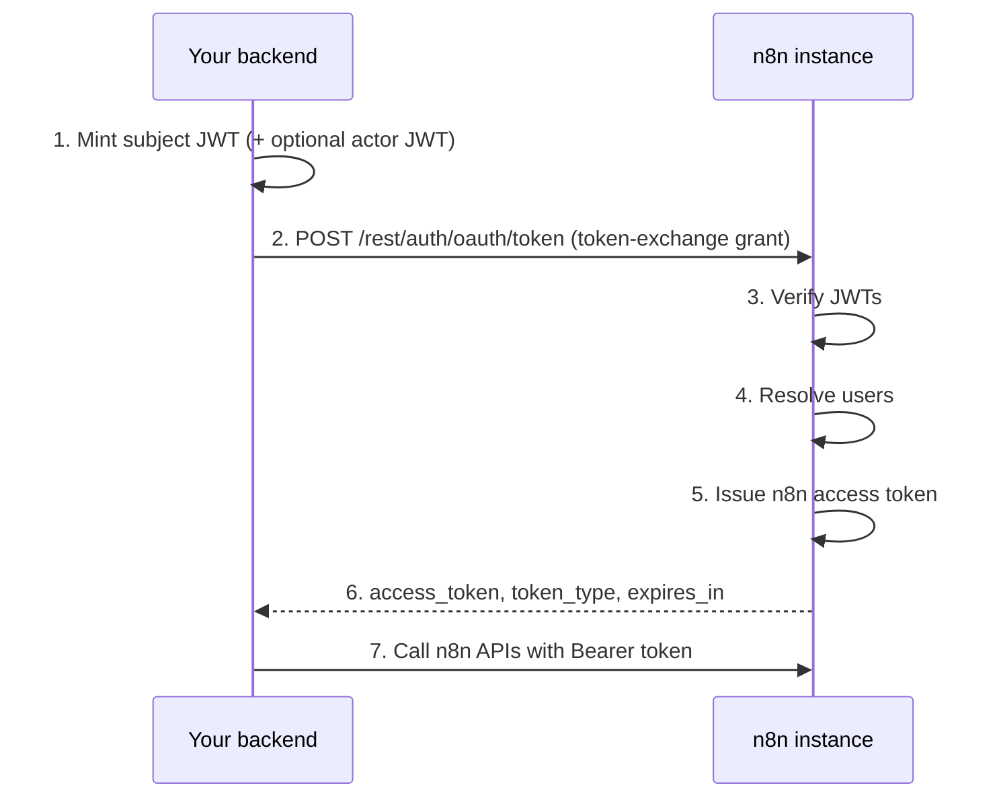

# Token exchange for embedding partners


**Feature availability**

* Available on Enterprise plans.
* Enabled with the `N8N_ENV_FEAT_TOKEN_EXCHANGE` environment variable set to `true`. Self-hosted instances can set it directly. On Cloud, contact n8n support to request it.
* Intended for embedding partners who run an external identity provider (IdP) or backend that mints signed JWTs.



**Preview feature**

Token exchange is a preview feature behind an environment flag. The environment variables, endpoint paths, and JWT claim contract can change before the feature reaches general availability. Pin your n8n version and retest your integration after each upgrade.


OAuth 2.0 Token Exchange ([RFC 8693](https://datatracker.ietf.org/doc/html/rfc8693)) lets embedding partners authenticate users and act on their behalf within an embedded n8n instance. Token exchange supports two use cases:

* **Iframe SSO**: Exchange an external JWT for an n8n session cookie, so users log in seamlessly when you embed n8n in an iframe.
* **Delegated API access**: Exchange an external JWT for an n8n access token to call n8n APIs on behalf of a user, for example to trigger workflows or manage credentials.

Both flows start the same way. Your backend mints a short-lived JWT signed with your private key. n8n verifies it using the registered public key, resolves the user, and returns either a session cookie or an access token.

## Before you begin

You need:

* An Enterprise license with the token exchange feature enabled.
* The preview feature flag set on your instance: `N8N_ENV_FEAT_TOKEN_EXCHANGE=true`.
* An RSA or EC key pair, or a JWKS endpoint that your IdP already publishes. See [Generate a key pair](#generate-a-key-pair).
* An n8n instance served over HTTPS. Browsers reject the `SameSite=None; Secure` session cookie over plain HTTP, so the iframe SSO flow silently fails without it. If you run n8n behind a TLS-terminating proxy, make sure the proxy sets the `X-Forwarded-Proto` header.

## Generate a key pair

You need an asymmetric key pair. Your backend signs JWTs with the **private key**, and n8n verifies them with the **public key**.



```bash
# Generate a 2048-bit RSA private key
openssl genrsa -out private.pem 2048

# Extract the public key
openssl rsa -in private.pem -pubout -out public.pem
```



```bash
# Generate an EC private key using P-256
openssl ecparam -name prime256v1 -genkey -noout -out private.pem

# Extract the public key
openssl ec -in private.pem -pubout -out public.pem
```



Keep `private.pem` secret in your backend. You register the contents of `public.pem` in n8n's trusted keys configuration.

If your IdP already publishes a JWKS endpoint, as most OAuth 2.0 and OIDC providers do, you can skip key generation and point n8n at the JWKS URL instead. See [JWKS key source](#jwks-key-source).

## Environment variables

### Required for all setups

```bash
# Enable the preview module
N8N_ENV_FEAT_TOKEN_EXCHANGE=true

# Register your public key(s) - see Configure trusted keys
N8N_TOKEN_EXCHANGE_TRUSTED_KEYS='[{ ... }]'
```

### Per-flow toggles

The two flows are independent. Enable only the endpoint you use:

```bash
# Iframe SSO: enable the embed login endpoint (POST or GET /rest/auth/embed)
N8N_EMBED_LOGIN_ENABLED=true

# Delegated API access: enable the token exchange endpoint (POST /rest/auth/oauth/token)
N8N_TOKEN_EXCHANGE_ENABLED=true
```

The embed login endpoint doesn't require `N8N_TOKEN_EXCHANGE_ENABLED`, and the token exchange endpoint doesn't require `N8N_EMBED_LOGIN_ENABLED`.


**File-based configuration**

You can add `_FILE` to individual variables to provide their configuration in a separate file. Refer to [Keeping sensitive data in separate files](https://app.gitbook.com/s/jm0ZYRpZIPWge2ZSiDYO/host-n8n/configure-n8n/basic-configuration#keeping-sensitive-data-in-separate-files) for more details.


For example, for large or multi-line JSON, store the trusted keys in a file and set `N8N_TOKEN_EXCHANGE_TRUSTED_KEYS_FILE=/path/to/trusted-keys.json`.

### Optional tuning settings

These have sensible defaults. You don't usually need to change them:

| Variable | Default | Description |
| :------- | :------ | :---------- |
| `N8N_TOKEN_EXCHANGE_MAX_TOKEN_TTL` | `900` (15 minutes) | Maximum lifetime in seconds for issued n8n tokens. The actual expiry is the minimum of this value, the subject token's remaining lifetime, and the actor token's remaining lifetime (if present). |
| `N8N_TOKEN_EXCHANGE_KEY_REFRESH_INTERVAL_SECONDS` | `300` (5 minutes) | Fallback interval for refreshing JWKS keys when the endpoint doesn't provide a cache lifetime. Every instance refreshes keys at startup; in multi-main deployments, only the leader instance refreshes them periodically. |
| `N8N_TOKEN_EXCHANGE_JTI_CLEANUP_INTERVAL_SECONDS` | `60` (1 minute) | How often n8n cleans up expired replay-protection records. |
| `N8N_TOKEN_EXCHANGE_JTI_CLEANUP_BATCH_SIZE` | `1000` | Maximum expired records deleted per cleanup run. |
| `N8N_TOKEN_EXCHANGE_EMBED_LOGIN_PER_MINUTE` | `20` | Rate limit for the embed login endpoint (requests per IP per minute). |
| `N8N_TOKEN_EXCHANGE_TOKEN_EXCHANGE_PER_MINUTE` | `20` | Rate limit for the token exchange endpoint (requests per IP per minute). |

## Configure trusted keys

The `N8N_TOKEN_EXCHANGE_TRUSTED_KEYS` environment variable accepts a JSON array of trusted key sources. Each entry tells n8n how to verify JWTs from your IdP.

There are two source types: `static` (an inline public key) and `jwks` (a remote JWKS endpoint). You can mix both types in the same array.

### Static key source

Use this when you generated your own key pair and want to embed the public key directly.

```json
{
	"type": "static",
	"kid": "my-key-1",
	"algorithms": ["RS256"],
	"key": "-----BEGIN PUBLIC KEY-----\nMIIBIjAN...contents-of-public.pem...\n-----END PUBLIC KEY-----",
	"issuer": "https://your-backend.example.com",
	"expectedAudience": "https://your-n8n.example.com",
	"allowedRoles": ["global:member"]
}
```

| Field | Required | Description |
| :---- | :------- | :---------- |
| `type` | Yes | Must be `"static"`. |
| `kid` | Yes | Key ID. Must match the `kid` header in incoming JWTs. |
| `algorithms` | Yes | Array of allowed signing algorithms, for example `["RS256"]`. See [Supported algorithms](#supported-algorithms). |
| `key` | Yes | PEM-encoded public key. Use `\n` for line breaks in JSON. |
| `issuer` | Yes | Expected `iss` claim in incoming JWTs. |
| `expectedAudience` | No | If set, the JWT `aud` claim must match this value. If unset, n8n skips audience verification entirely. Always set it in production, using an instance-specific value such as your n8n base URL. |
| `allowedRoles` | No | If set, only these roles can be assigned through the `role` claim. Only include `global:admin` if you deliberately want the integration to manage admin users. See [Role handling](#role-handling). |

### JWKS key source

Use this when your IdP publishes a JWKS endpoint.

```json
{
	"type": "jwks",
	"url": "https://idp.example.com/.well-known/jwks.json",
	"issuer": "https://idp.example.com",
	"expectedAudience": "https://your-n8n.example.com",
	"allowedRoles": ["global:member"]
}
```

| Field | Required | Description |
| :---- | :------- | :---------- |
| `type` | Yes | Must be `"jwks"`. |
| `url` | Yes | URL of the JWKS endpoint. |
| `issuer` | Yes | Expected `iss` claim in incoming JWTs. |
| `expectedAudience` | No | If set, the JWT `aud` claim must match this value. If unset, n8n skips audience verification entirely. Always set it in production, using an instance-specific value such as your n8n base URL. |
| `allowedRoles` | No | If set, only these roles can be assigned through the `role` claim. See [Role handling](#role-handling). |
| `cacheTtlSeconds` | No | Fallback cache duration when the JWKS endpoint doesn't send a `Cache-Control: max-age` header. When the header is present, it takes precedence. Defaults to 3600 seconds. The effective value is bounded between 60 and 86400 seconds. |

### Full example

```json
[
	{
		"type": "static",
		"kid": "my-static-key-1",
		"algorithms": ["RS256"],
		"key": "-----BEGIN PUBLIC KEY-----\nMIIBIjAN...your-key-here...\n-----END PUBLIC KEY-----",
		"issuer": "https://your-backend.example.com",
		"expectedAudience": "https://your-n8n.example.com",
		"allowedRoles": ["global:member"]
	},
	{
		"type": "jwks",
		"url": "https://idp.example.com/.well-known/jwks.json",
		"issuer": "https://idp.example.com",
		"expectedAudience": "https://your-n8n.example.com"
	}
]
```

### Supported algorithms

n8n accepts only asymmetric algorithms. It excludes HMAC and `none`.

| Family | Algorithms |
| :----- | :--------- |
| RSA | `RS256`, `RS384`, `RS512` |
| RSA-PSS | `PS256`, `PS384`, `PS512` |
| Elliptic Curve | `ES256`, `ES384`, `ES512` |
| Edwards Curve | `EdDSA` |

For static keys, the algorithms in the config must all belong to the same family and match the key type. For JWKS keys, n8n infers the algorithms from the JWK `alg` and `kty` or `crv` fields automatically.

## Required and optional JWT claims

### Required claims

Your IdP tokens must include these claims for n8n to accept them:

| Claim | Type | Description |
| :---- | :--- | :---------- |
| `sub` | string | Subject identifier. The unique user ID at the IdP. |
| `iss` | string (URL) | Issuer. Must match the `issuer` in your trusted key config. |
| `aud` | string or string array | Audience. Must be present. n8n validates the value only when `expectedAudience` is configured on the trusted key source. |
| `iat` | number | Issued-at timestamp (Unix epoch seconds). |
| `exp` | number | Expiration timestamp (Unix epoch seconds). |
| `jti` | string | Unique token ID. n8n accepts each value only once (replay protection). |

### Optional claims

| Claim | Type | Description |
| :---- | :--- | :---------- |
| `email` | string (valid email) | The user's email, used to match existing n8n users. Required for JIT provisioning, the first login of a user n8n doesn't know yet. Always send it unless you're certain every user already exists. |
| `given_name` | string | First name, synced to the n8n user profile. |
| `family_name` | string | Last name, synced to the n8n user profile. |
| `role` | string | n8n role to assign, for example `global:member` or `global:admin`. See [User provisioning](#user-provisioning). |
| `nbf` | number | Not-before timestamp. |

## Iframe SSO flow

Use this flow when embedding n8n in an iframe. n8n logs the user in transparently with a session cookie.



### Step 1: Mint a JWT in your backend

Your backend creates a short-lived JWT signed with your private key.

```javascript
const fs = require('fs');
const jwt = require('jsonwebtoken');
const { randomUUID } = require('crypto');

const privateKey = fs.readFileSync('private.pem', 'utf8');
const now = Math.floor(Date.now() / 1000);

const token = jwt.sign(
	{
		sub: 'user-id-in-your-system',           // unique user identifier
		iss: 'https://your-backend.example.com', // must match trusted key config
		aud: 'https://your-n8n.example.com',     // must match expectedAudience (if set)
		iat: now,
		exp: now + 30,                           // short-lived: 30 seconds
		jti: randomUUID(),                       // unique per request
		email: 'user@example.com',               // required for first-time users
		given_name: 'Jane',                      // optional
		family_name: 'Doe',                      // optional
		role: 'global:member',                   // optional
	},
	privateKey,
	{ algorithm: 'RS256', header: { kid: 'my-key-1' } }
);
```


**Maximum 60-second lifetime**

For the embed login flow, the JWT lifetime (`exp - iat`) must not exceed 60 seconds. n8n enforces this server-side.


### Step 2: Send the token to the embed endpoint

Send the token to `POST /rest/auth/embed` as a form submission. Point the iframe `src` at a page on your backend that returns an auto-submitting form:

```html
<form method="POST" action="https://your-n8n.example.com/rest/auth/embed">
	<input type="hidden" name="token" value="<jwt>">
	<input type="hidden" name="redirectTo" value="/workflow/abc123">
</form>
<script>document.forms[0].submit();</script>
```

The optional `redirectTo` field accepts only relative paths starting with `/`. n8n falls back to `/` for absolute URLs or anything else.

There's also a `GET /rest/auth/embed?token=<jwt>&redirectTo=/workflow/abc123` variant. Prefer the POST form: with GET, the token appears in server and proxy logs, browser history, and possibly `Referer` headers. If you must use GET, make sure your infrastructure scrubs query strings from logs.

### Step 3: n8n verifies and issues a session

n8n verifies the JWT signature, resolves or provisions the user (see [User provisioning](#user-provisioning)), sets a secure session cookie (`SameSite=None; Secure`), and redirects to the specified path.

### Third-party cookie restrictions

The session cookie is a third-party cookie when n8n runs on a different registrable domain than your product. Browser privacy features, such as Safari's Intelligent Tracking Prevention and Chrome's third-party cookie restrictions, can block or partition it, which breaks the iframe login. Host n8n on a subdomain of your product's site, for example `automation.your-product.example.com`, to avoid this.

## Delegated API access flow

Use this flow when your backend needs to call n8n APIs on behalf of a user, for example to trigger a workflow or manage credentials programmatically.

This flow supports an optional **actor token** for delegation. An actor, such as a service account or admin, acts on behalf of a subject, the end user. This enables audit attribution, so n8n records both who performed the action and on whose behalf.

When you supply an actor token, n8n authorizes API calls with the **actor's** identity and permissions. n8n records the subject for audit attribution only, and the subject doesn't limit what the token can do. This differs from RFC 8693, where the subject usually remains the effective principal. Use an actor whose n8n role grants only the permissions your integration needs.



### Step 1: Mint JWTs in your backend

Create a subject token representing the end user. The 60-second limit from the embed flow doesn't apply here. The issued n8n access token expires after the minimum of the subject token's remaining lifetime, the actor token's remaining lifetime (if present), and `N8N_TOKEN_EXCHANGE_MAX_TOKEN_TTL` (default 15 minutes).

```javascript
const now = Math.floor(Date.now() / 1000);

const subjectToken = jwt.sign(
	{
		sub: 'end-user-id',
		iss: 'https://your-backend.example.com',
		aud: 'https://your-n8n.example.com',
		iat: now,
		exp: now + 900,                         // bounds the issued token's lifetime
		jti: randomUUID(),
		email: 'user@example.com',
		role: 'global:member',
	},
	privateKey,
	{ algorithm: 'RS256', header: { kid: 'my-key-1' } }
);
```

For delegation, also mint an actor token representing the service or admin performing the action. The actor's n8n role determines the issued token's permissions, so keep it as low-privileged as possible:

```javascript
const actorToken = jwt.sign(
	{
		sub: 'service-account-id',
		iss: 'https://your-backend.example.com',
		aud: 'https://your-n8n.example.com',
		iat: now,
		exp: now + 900,
		jti: randomUUID(),
		email: 'service@example.com',
	},
	privateKey,
	{ algorithm: 'RS256', header: { kid: 'my-key-1' } }
);
```

### Step 2: Exchange for an n8n access token

```bash
curl -X POST https://your-n8n.example.com/rest/auth/oauth/token \
	-H "Content-Type: application/x-www-form-urlencoded" \
	-d "grant_type=urn:ietf:params:oauth:grant-type:token-exchange" \
	-d "subject_token=<subject-jwt>" \
	-d "actor_token=<actor-jwt>"
```

Request fields (`application/x-www-form-urlencoded`):

| Field | Required | Description |
| :---- | :------- | :---------- |
| `grant_type` | Yes | Must be `urn:ietf:params:oauth:grant-type:token-exchange`. |
| `subject_token` | Yes | JWT representing the end user. |
| `subject_token_type` | No | Token type identifier. n8n accepts and ignores this field. RFC 8693 requires it, so send `urn:ietf:params:oauth:token-type:jwt` if you use a spec-compliant client library. |
| `actor_token` | No | JWT representing the actor (for delegation). |
| `actor_token_type` | No | Actor token type identifier. Accepted and ignored, like `subject_token_type`. |
| `requested_token_type` | No | Requested token type identifier. Accepted and ignored. n8n always issues an access token. |
| `scope` | No | Requested scope (maximum 1024 characters). Recorded in the issued token and audit events, but not enforced. |
| `audience` | No | Intended audience (maximum 1024 characters). Accepted and ignored. |
| `resource` | No | Target resource URIs, space-separated (maximum 2048 characters). Recorded in the issued token and audit events, but not enforced. |


**Scopes aren't enforced**

The issued access token carries the acting user's full permissions: the actor's when you send an actor token, otherwise the subject's. n8n records `scope` and `resource` for auditing only and doesn't restrict the token to them. To limit what an integration can do, use a low-privileged actor and the `allowedRoles` setting instead.


Success response (`200 OK`):

```json
{
	"access_token": "<n8n-jwt>",
	"token_type": "Bearer",
	"expires_in": 900,
	"issued_token_type": "urn:ietf:params:oauth:token-type:access_token"
}
```

### Step 3: Use the access token

Include the token in subsequent n8n API calls:

```bash
curl https://your-n8n.example.com/api/v1/workflows \
	-H "Authorization: Bearer <access-token>"
```

The token expires after `expires_in` seconds. Request a new one when it expires. Don't reuse the original external JWT, since each `jti` is single-use.

## User provisioning

When you exchange a token, n8n resolves the external identity to an n8n user in this order:

1. **Known identity**: n8n looks up the `sub` claim in its identity store. If a previous exchange already linked this `sub` to an n8n user, n8n returns that user.
2. **Email fallback**: If the `sub` is unknown but the JWT contains an `email` claim, n8n searches for an existing user with that email. If found, n8n links the external identity to that user going forward.
3. **Just-in-time (JIT) provisioning**: If neither matches, n8n creates a new user automatically. The JWT must include an `email` claim for this to work. n8n creates the new user with password login disabled, so they can only authenticate through token exchange.

### Role handling

If you include the `role` claim, your IdP becomes the source of truth for that user's global role: n8n applies it on every exchange, overwriting roles assigned in the n8n UI. Omit the claim unless you manage roles in your IdP.

| Scenario | Behavior |
| :------- | :------- |
| New user, no `role` claim | Assigned `global:member`. |
| New user, `role` claim present | Assigned the claimed role. The exchange fails if the role is unrecognized, is `global:owner`, or isn't in `allowedRoles`. |
| Existing user, no `role` claim | Role unchanged. |
| Existing user, valid `role` claim | Role updated if different. The exchange fails if the role isn't in `allowedRoles`. |
| Existing user, unrecognized or `global:owner` role claim | Claim ignored with a server-side warning. The login proceeds with the role unchanged. |
| Existing user who is `global:owner` | Role sync skipped entirely. The owner role can't be changed through token exchange. |

### Profile sync

n8n syncs the `given_name` and `family_name` claims to the user profile on each login. It applies changes only when the values differ from what's stored, and truncates values longer than 32 characters.

## Security considerations

### Short-lived tokens

* External JWTs for the embed flow must have a lifetime of at most 60 seconds (`exp - iat <= 60`).
* For the token exchange flow, the issued n8n token expiry is the minimum of the subject token's remaining lifetime, the actor token's remaining lifetime (if present), and `N8N_TOKEN_EXCHANGE_MAX_TOKEN_TTL` (default 900 seconds).
* In the token exchange flow, n8n rejects the request when the computed expiry of the issued token is fewer than five seconds away.

### Replay protection

Every external JWT must include a unique `jti` (JWT ID) claim. n8n records each `jti` and rejects any token whose `jti` has already been consumed. n8n cleans up expired `jti` records automatically.

### Asymmetric signatures only

n8n accepts only asymmetric algorithms (RSA, EC, EdDSA). It rejects HMAC algorithms such as `HS256` and `none` by design. This ensures that n8n never needs access to your signing secret.

### Audience restriction

Always set `expectedAudience` on every trusted key source. Without it, n8n skips audience verification, and any valid token from the configured issuer can be exchanged, including tokens your IdP mints for other services or other n8n instances. Use an instance-specific value such as your n8n base URL.

### Role constraints

The `allowedRoles` field on trusted key sources restricts which roles can be assigned through token exchange. Use it to enforce least privilege, for example to restrict an embedding integration to provisioning only `global:member` users. The OAuth `scope` and `resource` request fields don't restrict permissions. See [Step 2: Exchange for an n8n access token](#step-2-exchange-for-an-n8n-access-token).

### Restrict framing

The embed session cookie uses `SameSite=None`, so the browser sends it in any third-party iframe context. Restrict which sites can frame your n8n instance: configure your reverse proxy to send a `Content-Security-Policy: frame-ancestors` header listing only your product's origins. Never disable framing protection wholesale.

### Key rotation and compromise

To rotate keys without downtime, add a new entry with a new `kid` to `N8N_TOKEN_EXCHANGE_TRUSTED_KEYS`, switch your backend to sign with the new key, then remove the old entry. If a private key is compromised, remove its entry immediately. This stops new exchanges, but already-issued n8n tokens and sessions stay valid until they expire, bounded by the short token lifetimes.

### Audit attribution

n8n emits audit events for all token exchange activity:

| Event | When |
| :---- | :--- |
| `n8n.audit.token-exchange.succeeded` | Successful token exchange. |
| `n8n.audit.token-exchange.failed` | Failed token exchange (with failure reason). |
| `n8n.audit.token-exchange.embed-login` | Successful embed login. |
| `n8n.audit.token-exchange.embed-login-failed` | Failed embed login (with failure reason). |
| `n8n.audit.token-exchange.user-provisioned` | New user created through JIT provisioning. |
| `n8n.audit.token-exchange.identity-linked` | Existing user linked to a new external identity. |
| `n8n.audit.token-exchange.role-updated` | User role changed through token exchange. |

When you use the actor token flow, n8n records both the subject (on whose behalf) and the actor (who performed the action), enabling full attribution in audit logs.

## Verify your setup

Mint a one-off JWT and exchange it. Save the [Step 1 example](#step-1-mint-a-jwt-in-your-backend) as `mint-token.js`, add `console.log(token);` at the end, and run it:

```bash
node mint-token.js
```

Then call the token exchange endpoint:

```bash
curl -X POST https://your-n8n.example.com/rest/auth/oauth/token \
	-H "Content-Type: application/x-www-form-urlencoded" \
	-d "grant_type=urn:ietf:params:oauth:grant-type:token-exchange" \
	-d "subject_token=<jwt>"
```

A `200` response with an `access_token` confirms your keys, claims, and configuration work. For the embed flow, submit a fresh token to `POST /rest/auth/embed` in a browser and expect the n8n UI to load.

## Troubleshooting

| Symptom | Likely cause |
| :------ | :----------- |
| `404` on both endpoints | The preview flag `N8N_ENV_FEAT_TOKEN_EXCHANGE` isn't `true`, or your license doesn't include the token exchange feature. n8n doesn't load the module at all. |
| `501 - Token exchange is not enabled on this instance` | `N8N_TOKEN_EXCHANGE_ENABLED` isn't `true`. |
| `501 - Embed login is not enabled on this instance` | `N8N_EMBED_LOGIN_ENABLED` isn't `true`. |
| `400 - unsupported_grant_type` | The `grant_type` field is missing or not exactly `urn:ietf:params:oauth:grant-type:token-exchange`. |
| `400 - invalid_grant` with description `Token exchange failed` | Any token verification failure on the token exchange endpoint: invalid signature, unknown `kid`, missing `kid` header, replayed `jti`, expired or near-expiry token, audience mismatch, or disallowed role. n8n returns a generic description by design. Check the n8n server logs for the specific reason. |
| `400 - invalid_request` with description `Token claims validation failed` | On the token exchange endpoint: the JWT is missing a required claim (`sub`, `iss`, `aud`, `iat`, `exp`, `jti`), or a claim has the wrong type. |
| `401` from the embed endpoint | The response includes the specific failure message, for example `Token has already been used` (replayed `jti`), `Token lifetime exceeds maximum allowed` (embed tokens must have `exp - iat <= 60` seconds), or `Token header missing kid`. |
| `500` from the embed endpoint | The JWT is missing a required claim or a claim has the wrong type. |
| Raw JSON error shows in the iframe | Embed login failures return a JSON response without an error redirect. Check the message against the rows above. |
| Session cookie isn't set after embed login | The instance isn't served over HTTPS, or a TLS-terminating proxy doesn't forward `X-Forwarded-Proto`. Browsers reject `SameSite=None; Secure` cookies over plain HTTP. Third-party cookie restrictions can also block the cookie, see [Third-party cookie restrictions](#third-party-cookie-restrictions). |
| User not created on first login | The JWT is missing the `email` claim, which is required for JIT provisioning. |
| Role not applied | For existing users, n8n ignores unrecognized and `global:owner` role claims with a server-side warning. A valid role that's missing from `allowedRoles` rejects the exchange instead. See [Role handling](#role-handling). |

## Related resources

* [OEM deployment overview](./): embed and surface n8n's interface inside your product.
* [Set up SSO](../configure-n8n/security/configure-sso.md): organization-wide single sign-on through SAML or OIDC.
* [HTTP Request credentials: Using OAuth2](https://app.gitbook.com/s/BKcbOzIWja8NfqKDcqHc/builtin/credentials/httprequest#using-oauth2): set up a generic OAuth 2.0 credential.
* [OAuth 2.0 Token Exchange (RFC 8693)](https://datatracker.ietf.org/doc/html/rfc8693): the token exchange specification.