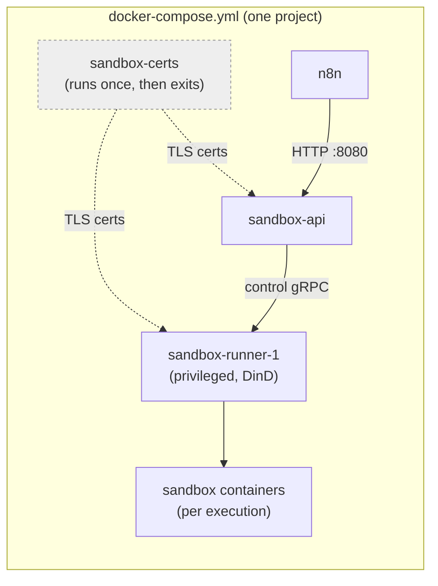

# Install using Docker Compose

## Who this is for

This guide walks through building your own Docker Compose setup by hand, including the sandbox stack that powers the AI Assistant. Use it if you want full control over your configuration, or need to fold n8n into an existing Compose project.

If you just want n8n (and the AI Assistant) running quickly without writing any files yourself, use the [one-line setup](one-line-setup.md) instead. It sets up everything below automatically.

## What you need before you start

* Docker Engine and Docker Compose v2. Run `docker compose version` to check.
* At least 4 GB of RAM and 2 vCPUs. The sandbox that runs AI-generated code (`sandbox-runner-1`) uses Docker-in-Docker, which needs more headroom than a typical container.


**Windows users:** Use WSL, with either Docker Desktop (WSL2 backend) or Docker Engine installed directly in your Linux distribution. Keep your project folder inside the WSL filesystem (for example, `~/n8n`), not under `/mnt/c/...`. Bind mounts across that boundary are slow and can cause permission issues.


## Step 1: Create a project folder

```bash
mkdir n8n && cd n8n
```

## Step 2: Create `.env`

This file holds the secrets the sandbox services use to talk to each other. Create a file named `.env` with your own values in place of the placeholders and keep this file out of version control.

```
# Sandbox service secrets — pick your own values
SANDBOX_API_KEYS=change-me-api-key
SANDBOX_API_RUNNER_REGISTRATION_TOKEN=change-me-registration-token
SANDBOX_API_RUNNER_API_KEY=change-me-runner-key

# Must match a value in SANDBOX_API_KEYS above — this is how n8n authenticates to the sandbox
N8N_SANDBOX_SERVICE_API_KEY=change-me-api-key

# Web search: secret for the bundled SearXNG instance — pick your own value
SEARXNG_SECRET=change-me-searxng-secret
N8N_INSTANCE_AI_SEARXNG_URL=http://searxng:8080
```

You don't need an AI provider key yet; see [Turn on the AI Assistant](install-using-docker-compose.md#optional-turn-on-the-ai-assistant) below once everything's running.

## Step 3: Create `searxng-settings.yml`

The stock SearXNG image only serves HTML; n8n's web search needs its JSON API, which this file turns on.

```yaml
use_default_settings: true
search:
  formats:
    - html
    - json
```

## Step 4: Create `compose.yml`

This defines every service you're setting up: n8n itself, the sandbox stack that lets the AI Assistant safely run code, and SearXNG for web search.



## What you've just set up

| Component            | What it's for                                                                                      |
| -------------------- | -------------------------------------------------------------------------------------------------- |
| **n8n**              | The workflow editor itself, available at `http://localhost:5678`.                                  |
| **sandbox-certs**    | Runs once to generate the TLS certificates the other sandbox services need, then exits.            |
| **sandbox-api**      | The control plane n8n talks to when the AI Assistant needs to run code.                            |
| **sandbox-runner-1** | Does the actual work; a privileged Docker-in-Docker container that creates and runs the sandboxes. |
| **searxng**          | Bundled web search backend for the AI Assistant.                                                   |

This bundles n8n's own sandbox (`n8n-sandbox`), which is a good fit for local development and testing. For a production instance, n8n currently recommends Daytona as the sandbox provider instead. See [Set up the AI Assistant](../configure-n8n/set-up-ai-assistant.md) for how to configure a Daytona sandbox.

There's no database service defined here. n8n falls back to its built-in SQLite database, stored inside the container unless you mount a volume for it. For a production instance, swap in Postgres. See [Use PostgreSQL instead of SQLite](install-using-docker-compose.md#optional-use-postgresql-instead-of-sqlite) below.

## Step 5: Start everything

```bash
docker compose up -d
docker compose ps
```

Wait until `sandbox-api` shows `healthy`; `sandbox-runner-1` and `n8n` will then start automatically.

## Step 6: Verify it's working

```bash
# sandbox-api is reachable from n8n
docker compose exec n8n wget -qO- http://sandbox-api:8080/healthz

# the runner registered itself with the API
docker compose logs sandbox-api | grep -i runner

# n8n is up
curl -sf http://localhost:5678/healthz
```

Launch n8n by pointing your web browser to `http://localhost:5678`

## Optional: Turn on the AI Assistant

Everything above runs the full sandbox stack, but the AI Assistant itself stays off until you give it a model to use. You can do this from the n8n UI (in the instance's AI settings) once n8n is running, or using `.env` if you'd rather configure it before first login:

1.  Add your AI provider key to `.env`:

    ```
    N8N_INSTANCE_AI_MODEL_API_KEY=sk-ant-xxx
    ```
2.  Restart n8n so it picks up the change:

    ```bash
    docker compose up -d n8n
    ```

Web search runs through the bundled SearXNG service by default. If you'd rather use Brave Search instead, you can set it from the UI or add your Brave API key to `.env`; it takes priority over SearXNG once set:

```
INSTANCE_AI_BRAVE_SEARCH_API_KEY=BSA-xxx
```

Full setup steps, including the supported model providers, are in [Set up the AI Assistant](../configure-n8n/set-up-ai-assistant.md).

## Optional: Use PostgreSQL instead of SQLite

SQLite is fine for trying things out, but for a production instance that must handle more than a handful of users or workflows running around the clock use Postgres instead.

1.  Add the Postgres credentials to `.env`, alongside the sandbox secrets:

    ```
    POSTGRES_USER=change-me-user
    POSTGRES_PASSWORD=change-me-password
    POSTGRES_DB=n8n
    ```
2.  Add a `postgres` service to `compose.yml`, and a volume for its data:

    ```yaml
    volumes:
      db-storage:

    services:
      postgres:
        image: postgres:18
        restart: always
        environment:
          POSTGRES_USER: ${POSTGRES_USER}
          POSTGRES_PASSWORD: ${POSTGRES_PASSWORD}
          POSTGRES_DB: ${POSTGRES_DB}
          PGDATA: /var/lib/postgresql/data
        volumes:
          - db-storage:/var/lib/postgresql/data
        healthcheck:
          test: ["CMD-SHELL", "pg_isready -h localhost -U ${POSTGRES_USER} -d ${POSTGRES_DB}"]
          interval: 5s
          timeout: 5s
          retries: 10
    ```

    <div data-gb-custom-block data-tag="hint" data-style="warning" class="hint hint-warning"><p>Postgres 18 changed where it stores data by default. Setting `PGDATA` keeps it in the same folder as earlier versions, so the volume mount stays the same. Don't remove that line: without it, Postgres 18 writes somewhere the volume doesn't cover and your database starts empty.</p></div>

    <div data-gb-custom-block data-tag="hint" data-style="warning" class="hint hint-warning"><p>Already running an older Postgres? Moving straight to 18 is a major version upgrade, and Postgres can't open a data directory written by an older major. Bumping the image tag on an existing setup fails with `database files are incompatible with server`. Your data stays intact. Back up first with `pg_dumpall`, then follow the official [PostgreSQL upgrade guide](https://www.postgresql.org/docs/18/upgrading.html).</p></div>
3.  Point n8n at it by adding these to the n8n service's environment block, and making it wait on Postgres too:

    ```yaml
    environment:
          # ...your existing N8N_ENABLED_MODULES, N8N_INSTANCE_AI_* settings stay as they are
          DB_TYPE: postgresdb
          DB_POSTGRESDB_HOST: postgres
          DB_POSTGRESDB_PORT: '5432'
          DB_POSTGRESDB_DATABASE: ${POSTGRES_DB}
          DB_POSTGRESDB_USER: ${POSTGRES_USER}
          DB_POSTGRESDB_PASSWORD: ${POSTGRES_PASSWORD}
      depends_on:
        sandbox-api:
          condition: service_healthy
        postgres:
          condition: service_healthy
    ```
4.  Restart everything:

    ```bash
    docker compose up -d
    ```

    n8n migrates itself to the new Postgres database on startup. Existing SQLite data doesn't carry over automatically. This setup is for a fresh instance, not an in-place migration.

    <div data-gb-custom-block data-tag="hint" data-style="info" class="hint hint-info"><p>For a more hardened setup, such as a dedicated non-root Postgres user and an external task runner, see the [`withPostgres` example](https://github.com/n8n-io/n8n-hosting/tree/main/docker-compose/withPostgres) in the n8n hosting repository.</p></div>

## Troubleshooting

| Symptom                                                                 | Likely cause                                                                                                                                                                                                                                                                                                    |
| ----------------------------------------------------------------------- | --------------------------------------------------------------------------------------------------------------------------------------------------------------------------------------------------------------------------------------------------------------------------------------------------------------- |
| `sandbox-api` or `sandbox-runner-1` fail to start, cert errors          | `sandbox-certs` didn't complete. Check `docker compose logs sandbox-certs`.                                                                                                                                                                                                                                     |
| `sandbox-api` never becomes `healthy`                                   | Check its logs; also confirm `wget` actually exists in that image.                                                                                                                                                                                                                                              |
| `sandbox-runner-1` crash-loops on startup with `... must be set` errors | It's missing required environment variables, most commonly `SANDBOX_RUNNER_API_KEYS` or `SANDBOX_RUNNER_REGISTRATION_TOKEN`. For the full list of environment variables the runner requires, run `strings /usr/local/bin/sandbox-runner \| grep -oE 'SANDBOX_[A-Z_]+ must be set'` inside the runner container. |
| Runner never registers with the API                                     | `SANDBOX_RUNNER_REGISTRATION_TOKEN` mismatch, or `SANDBOX_RUNNER_API_GRPC_ADDR` wrong.                                                                                                                                                                                                                          |
| n8n's sandbox calls fail                                                | Sandbox URL/key in `.env` doesn't match `sandbox-api`'s address or `SANDBOX_API_KEYS`.                                                                                                                                                                                                                          |
| Works on Linux, fails on WSL                                            | Usually a bind-mount path issue. Keep the project inside the WSL filesystem, not `/mnt/c/...`.                                                                                                                                                                                                                  |

## Security checklist

* `sandbox-runner-1` (`privileged: true`, Docker-in-Docker) is never exposed to the public internet. Treat it as equivalent to root on the host.
* Only n8n's port is open on your cloud firewall.
* `SANDBOX_API_KEYS`, the registration token, and the runner key are unique, not left as `change-me-...`, and rotated periodically.
* `sandbox-api` and `sandbox-runner-1` do **not** use `env_file: .env`. Each only receives the specific variables it needs, explicitly, in its `environment` block. The model API key, Brave key, Postgres password, and n8n encryption key never reach the sandbox containers.
* The mTLS keys under the `sandbox-tls` volume, including the root CA key, are locked down to `0600` and owned only by the service that needs them (`sandbox-api` for its own key; root for the runner's key and the CA key). None of them are world-readable.
* You have a plan to regenerate the `sandbox-tls` volume. The certs `sandbox-certs` generates don't autorenew.

## Service architecture



n8n sends code execution requests to `sandbox-api`, which hands them to `sandbox-runner-1`, which creates and runs the actual sandbox containers. `sandbox-certs` runs once at startup to generate the TLS certificates the other two need and then exits; everything else waits on it.
