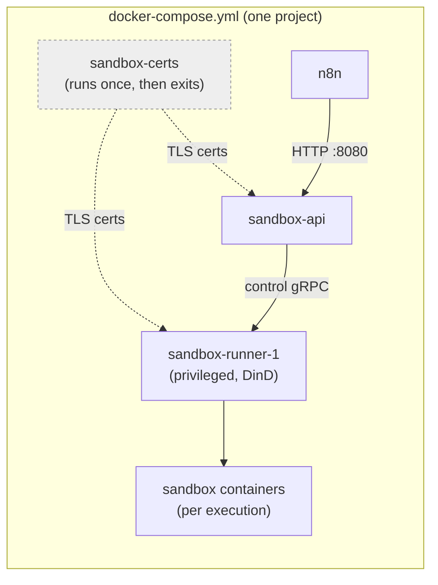

## Who this is for

This guide walks through building your own Docker Compose setup by hand, including the sandbox stack that powers the AI Assistant. Use it if you want full control over your configuration, or need to fold n8n into an existing Compose project.

If you just want n8n (and the AI Assistant) running quickly without writing any files yourself, use the [one-script install](/deploy/host-n8n/install-options/install-from-command-line) instead; it sets up everything below automatically.

## What you need before you start

- Docker Engine and Docker Compose v2. Run `docker compose version` to check.
- At least 4 GB of RAM and 2 vCPUs. The sandbox that runs AI-generated code (`sandbox-runner-1`) uses Docker-in-Docker, which needs more headroom than a typical container.


**Windows users:** Use WSL, with either Docker Desktop (WSL2 backend) or Docker Engine installed directly in your Linux distro. Keep your project folder inside the WSL filesystem (for example, `~/n8n`), not under `/mnt/c/...`. Bind mounts across that boundary are slow and can cause permission issues.


## Step 1: Create a project folder

```bash
mkdir n8n && cd n8n
```

## Step 2: Create `.env`

This file holds the secrets the sandbox services use to talk to each other. Create a file named `.env` with your own values in place of the placeholders and keep this file out of version control.

```
# Sandbox service secrets — pick your own values
SANDBOX_API_KEYS=change-me-api-key
SANDBOX_API_RUNNER_REGISTRATION_TOKEN=change-me-registration-token
SANDBOX_API_RUNNER_API_KEY=change-me-runner-key

# Must match a value in SANDBOX_API_KEYS above — this is how n8n authenticates to the sandbox
N8N_INSTANCE_AI_SANDBOX_API_KEY=change-me-api-key
```

You don't need an AI provider key yet; see [Turn on the AI Assistant](#optional-turn-on-the-ai-assistant) below once everything's running.

## Step 3: Create `compose.yml`

This defines every service you're setting up: n8n itself, plus the sandbox stack that lets the AI Assistant safely run code.

```yaml
volumes:
  sandbox-tls:

services:
  sandbox-certs:
    image: n8nio/n8n-sandbox-service-api:latest
    user: '0:0'
    entrypoint: ['sh', '-c']
    command:
      - >
        bootstrap-mtls.sh --out-dir /tls --api-san sandbox-api
        --control-san-prefix sandbox-runner &&
        chown -R sandbox-api:sandbox-api /tls/api
    environment:
      NUM_RUNNERS: '1'
    volumes:
      - sandbox-tls:/tls

  sandbox-api:
    image: n8nio/n8n-sandbox-service-api:latest
    depends_on:
      sandbox-certs:
        condition: service_completed_successfully
    environment:
      SANDBOX_API_KEYS: ${SANDBOX_API_KEYS}
      SANDBOX_API_RUNNER_REGISTRATION_TOKEN: ${SANDBOX_API_RUNNER_REGISTRATION_TOKEN}
      SANDBOX_API_RUNNER_API_KEY: ${SANDBOX_API_RUNNER_API_KEY}
      SANDBOX_API_GRPC_TLS_CERT_FILE: /tls/api/grpc-server.crt
      SANDBOX_API_GRPC_TLS_KEY_FILE: /tls/api/grpc-server.key
      SANDBOX_API_GRPC_TLS_CLIENT_CA_FILE: /tls/api/ca.crt
      SANDBOX_API_RUNNER_CONTROL_GRPC_TLS_CA_FILE: /tls/api/ca.crt
      SANDBOX_API_RUNNER_CONTROL_GRPC_TLS_CERT_FILE: /tls/api/control-grpc-api-client.crt
      SANDBOX_API_RUNNER_CONTROL_GRPC_TLS_KEY_FILE: /tls/api/control-grpc-api-client.key
      SANDBOX_API_RUNNER_CONTROL_GRPC_TLS_SERVER_NAME: sandbox-runner-1
    volumes:
      - sandbox-tls:/tls:ro
    healthcheck:
      test: ["CMD", "wget", "-qO-", "http://localhost:8080/healthz"]
      interval: 5s
      timeout: 3s
      retries: 5
      start_period: 10s
    # Never publish 8080/9090 to the host on an internet-facing server.
    # n8n reaches this container by service name over the default Compose network.

  sandbox-runner-1:
    image: n8nio/n8n-sandbox-service-runner-dind:latest
    privileged: true
    depends_on:
      sandbox-api:
        condition: service_healthy
    environment:
      SANDBOX_RUNNER_API_KEYS: ${SANDBOX_API_RUNNER_API_KEY}
      SANDBOX_RUNNER_REGISTRATION_TOKEN: ${SANDBOX_API_RUNNER_REGISTRATION_TOKEN}
      SANDBOX_RUNNER_API_GRPC_ADDR: sandbox-api:9090
      SANDBOX_RUNNER_HTTP_BASE_URL: http://sandbox-runner-1:8080
      SANDBOX_RUNNER_CONTROL_GRPC_LISTEN_ADDR: ':9091'
      SANDBOX_RUNNER_CONTROL_GRPC_ADVERTISE_ADDR: sandbox-runner-1:9091
      SANDBOX_RUNNER_ID: runner-1
      SANDBOX_RUNNER_DOCKER_SANDBOX_IMAGE: n8nio/n8n-sandbox-service-sandbox:latest
      SANDBOX_RUNNER_REGISTRATION_GRPC_CA_FILE: /tls/runner/ca.crt
      SANDBOX_RUNNER_REGISTRATION_GRPC_CERT_FILE: /tls/runner/grpc-client.crt
      SANDBOX_RUNNER_REGISTRATION_GRPC_KEY_FILE: /tls/runner/grpc-client.key
      SANDBOX_RUNNER_REGISTRATION_GRPC_SERVER_NAME: sandbox-api
      SANDBOX_RUNNER_CONTROL_GRPC_TLS_CERT_FILE: /tls/runner/control-grpc-server.crt
      SANDBOX_RUNNER_CONTROL_GRPC_TLS_KEY_FILE: /tls/runner/control-grpc-server.key
      SANDBOX_RUNNER_CONTROL_GRPC_TLS_CLIENT_CA_FILE: /tls/runner/ca.crt
    volumes:
      - sandbox-tls:/tls:ro
    # Never expose this container's ports publicly — it runs privileged Docker-in-Docker.

  n8n:
    image: docker.n8n.io/n8nio/n8n
    depends_on:
      sandbox-api:
        condition: service_healthy
    ports:
      - "5678:5678"     # The only port that should be internet-facing
    env_file: .env
    environment:
      N8N_ENABLED_MODULES: instance-ai
      N8N_INSTANCE_AI_MODEL: anthropic/claude-opus-4-8
      N8N_INSTANCE_AI_SANDBOX_ENABLED: 'true'
      N8N_INSTANCE_AI_SANDBOX_IMAGE: n8nio/n8n-sandbox-service-sandbox:latest
      N8N_INSTANCE_AI_SANDBOX_API_URL: http://sandbox-api:8080
```

## What you've just set up

| Component | What it's for |
|---|---|
| **n8n** | The workflow editor itself, available at `http://localhost:5678`. |
| **sandbox-certs** | Runs once to generate the TLS certificates the other sandbox services need, then exits. |
| **sandbox-api** | The control plane n8n talks to when the AI Assistant needs to run code. |
| **sandbox-runner-1** | Does the actual work — a privileged Docker-in-Docker container that creates and runs the sandboxes. |

There's no database service defined here — n8n falls back to its built-in SQLite database, stored inside the container unless you mount a volume for it. For a production setup with Postgres, queue mode, and persistent storage, see the [Docker Compose deployment guide](https://docs.n8n.io/hosting/).

## Step 4: Start everything

```bash
docker compose up -d
docker compose ps
```

Wait until `sandbox-api` shows `healthy`; `sandbox-runner-1` and `n8n` will then start automatically.

## Step 5: Verify it's working

```bash
# sandbox-api is reachable from n8n
docker compose exec n8n wget -qO- http://sandbox-api:8080/healthz

# the runner registered itself with the API
docker compose logs sandbox-api | grep -i runner

# n8n is up
curl -sf http://localhost:5678/healthz
```

Launch n8n by pointing your web browser to `https://localhost:5678`

## Optional: Turn on the AI Assistant

Everything above runs the full sandbox stack, but the AI Assistant itself stays off until you give it a model to use:

1. Add your AI provider key to `.env`:

   ```
   N8N_INSTANCE_AI_MODEL_API_KEY=sk-ant-xxx
   ```

2. Restart n8n so it picks up the change:

   ```bash
   docker compose up -d n8n
   ```

By default, the assistant has no web search configured in this setup (there's no bundled search service in the compose file above). To enable it, add your Brave Search key to `.env` as well:

```
INSTANCE_AI_BRAVE_SEARCH_API_KEY=BSA-xxx
```

Full setup steps, including which model providers are supported, are in [setting up the AI Assistant](https://docs.n8n.io/deploy/host-n8n/configure-n8n/set-up-ai-assistant).

## Troubleshooting

| Symptom | Likely cause |
|---|---|
| `sandbox-api` or `sandbox-runner-1` fail to start, cert errors | `sandbox-certs` didn't complete. Check `docker compose logs sandbox-certs`. |
| `sandbox-api` never becomes `healthy` | Check its logs; also confirm `wget` actually exists in that image (see note in Step 3). |
| `sandbox-runner-1` crash-loops on startup with `... must be set` errors | It's missing required environment variables, most commonly `SANDBOX_RUNNER_API_KEYS` or `SANDBOX_RUNNER_REGISTRATION_TOKEN`. For the full list of environment variables the runner requires, run `strings /usr/local/bin/sandbox-runner \| grep -oE 'SANDBOX_[A-Z_]+ must be set'` inside the runner container. |
| Runner never registers with the API | `SANDBOX_RUNNER_REGISTRATION_TOKEN` mismatch, or `SANDBOX_RUNNER_API_GRPC_ADDR` wrong. |
| n8n's sandbox calls fail | Sandbox URL/key in `.env` doesn't match `sandbox-api`'s address or `SANDBOX_API_KEYS`. |
| Works on Linux, fails on WSL | Usually a bind-mount path issue; keep the project inside the WSL filesystem, not `/mnt/c/...`. |

## Security checklist

- `sandbox-runner-1` (`privileged: true`, Docker-in-Docker) is never exposed to the public internet. Treat it as equivalent to root on the host.
- Only n8n's port is open on your cloud firewall.
- `SANDBOX_API_KEYS`, the registration token, and the runner key are unique, not left as `change-me-...`, and rotated periodically.
- `sandbox-api` and `sandbox-runner-1` do **not** use `env_file: .env`. Each only receives the specific variables it needs, explicitly, in its `environment` block. The model API key, Brave key, Postgres password, and n8n encryption key never reach the sandbox containers.
- The mTLS keys under the `sandbox-tls` volume, including the root CA key, are locked down to `0600` and owned only by the service that needs them (`sandbox-api` for its own key; root for the runner's key and the CA key). None of them are world-readable.
- You have a plan to regenerate the `sandbox-tls` volume. The certs `sandbox-certs` generates don't auto-renew.

## Service architecture



n8n sends code execution requests to `sandbox-api`, which hands them to `sandbox-runner-1`, which creates and runs the actual sandbox containers. `sandbox-certs` runs once at startup to generate the TLS certificates the other two need and then exits; everything else waits on it.