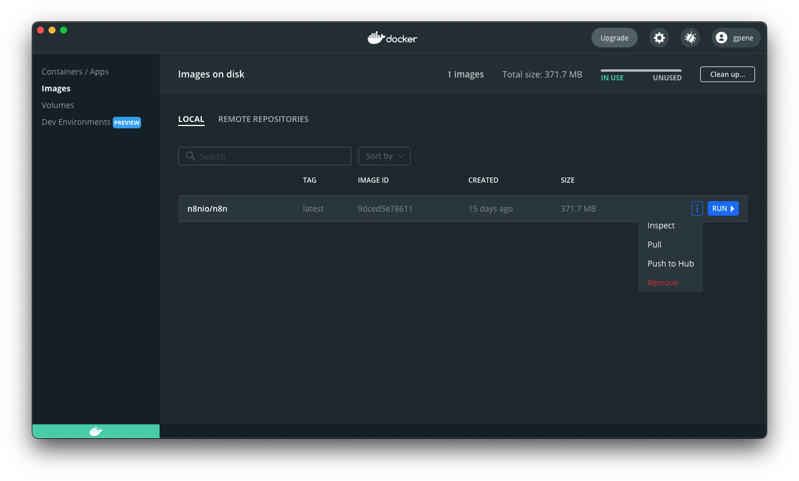

# Docker Installation <a href="#docker-installation" id="docker-installation"></a>

n8n recommends using [Docker](https://www.docker.com/) for most self-hosting needs. It provides a clean, isolated environment, avoids operating system and tooling incompatibilities, and makes database and environment management simpler.

You can also use n8n in Docker with [Docker Compose](use-a-cloud-provider/use-docker-compose.md). You can find Docker Compose configurations for various architectures in the [n8n-hosting repository](https://github.com/n8n-io/n8n-hosting).



You can also follow along with our video guide here:



## Prerequisites <a href="#prerequisites" id="prerequisites"></a>

Before proceeding, install Docker:

* [Docker Desktop](https://docs.docker.com/get-docker/) is available for Mac, Windows, and Linux. Docker Desktop includes the Docker Engine and Docker Compose.
* [Docker Engine](https://docs.docker.com/engine/install/) and [Docker Compose](https://docs.docker.com/compose/install/linux/) are also available as separate packages for Linux. Use this for Linux machines without a graphical environment or when you don't want the Docker Desktop UI.



## Starting n8n <a href="#starting-n8n" id="starting-n8n"></a>

From your terminal, run the following commands, replacing the `<YOUR_TIMEZONE>` placeholders with [your timezone](https://en.wikipedia.org/wiki/List_of_tz_database_time_zones#List):

```shell
docker volume create n8n_data

docker run -it --rm \
 --name n8n \
 -p 5678:5678 \
 -e GENERIC_TIMEZONE="<YOUR_TIMEZONE>" \
 -e TZ="<YOUR_TIMEZONE>" \
 -e N8N_ENFORCE_SETTINGS_FILE_PERMISSIONS=true \
 -e N8N_RUNNERS_ENABLED=true \
 -v n8n_data:/home/node/.n8n \
 docker.n8n.io/n8nio/n8n
```

This command creates a volume to store persistent data, downloads the required n8n image, and starts the container with the following settings:

* Maps and exposes port `5678` on the host.
* Sets the timezone for the container:
	* the `TZ` environment variable sets the system timezone to control what scripts and commands like `date` return.
	* the [`GENERIC_TIMEZONE` environment variable](../configure-n8n/basic-configuration/use-environment-variables/timezone-and-localization.md) sets the correct timezone for schedule-oriented nodes like the [Schedule Trigger node](https://app.gitbook.com/s/BKcbOzIWja8NfqKDcqHc/builtin/core-nodes/n8n-nodes-base.scheduletrigger).
* Enforces secure file permissions for the n8n configuration file.
* Enables [task runners](../configure-n8n/set-up-task-runners.md), the recommended way of executing tasks in n8n.
* Mounts the `n8n_data` volume to the `/home/node/.n8n` directory to persist your data across container restarts.

Once running, you can access n8n by opening:
[http://localhost:5678](http://localhost:5678)

## Using with PostgreSQL <a href="#using-with-postgresql" id="using-with-postgresql"></a>

By default, n8n uses SQLite to save credentials[^1], past executions, and workflows. n8n also supports PostgreSQL, configurable using environment variables as detailed below.


**Persisting the `.n8n` directory still recommended**

When using PostgreSQL, n8n doesn't need to use the `.n8n` directory for the SQLite database file. However, the directory still contains other important data like encryption keys, instance logs, and source control feature assets. While you can work around some of these requirements, (for example, by setting the [`N8N_ENCRYPTION_KEY` environment variable](../configure-n8n/basic-configuration/use-environment-variables/deployment.md)), it's best to continue mapping a persistent volume for the directory to avoid potential issues.


To use n8n with PostgreSQL, execute the following commands, replacing the placeholders (depicted within angled brackets, for example `<POSTGRES_USER>`) with your actual values:

```shell
docker volume create n8n_data

docker run -it --rm \
 --name n8n \
 -p 5678:5678 \
 -e GENERIC_TIMEZONE="<YOUR_TIMEZONE>" \
 -e TZ="<YOUR_TIMEZONE>" \
 -e N8N_ENFORCE_SETTINGS_FILE_PERMISSIONS=true \
 -e N8N_RUNNERS_ENABLED=true \
 -e DB_TYPE=postgresdb \
 -e DB_POSTGRESDB_DATABASE=<POSTGRES_DATABASE> \
 -e DB_POSTGRESDB_HOST=<POSTGRES_HOST> \
 -e DB_POSTGRESDB_PORT=<POSTGRES_PORT> \
 -e DB_POSTGRESDB_USER=<POSTGRES_USER> \
 -e DB_POSTGRESDB_SCHEMA=<POSTGRES_SCHEMA> \
 -e DB_POSTGRESDB_PASSWORD=<POSTGRES_PASSWORD> \
 -v n8n_data:/home/node/.n8n \
 docker.n8n.io/n8nio/n8n
```

You can find a complete `docker-compose` file for PostgreSQL in the [n8n hosting repository](https://github.com/n8n-io/n8n-hosting/tree/main/docker-compose/withPostgres).

## Updating <a href="#updating" id="updating"></a>

To update n8n, in Docker Desktop, navigate to the **Images** tab and select **Pull** from the context menu to download the latest n8n image:



You can also use the command line to pull the latest, or a specific version:

```shell
# Pull latest (stable) version <a href="#pull-latest-stable-version" id="pull-latest-stable-version"></a>
docker pull docker.n8n.io/n8nio/n8n

# Pull specific version <a href="#pull-specific-version" id="pull-specific-version"></a>
docker pull docker.n8n.io/n8nio/n8n:1.81.0

# Pull next (unstable) version <a href="#pull-next-unstable-version" id="pull-next-unstable-version"></a>
docker pull docker.n8n.io/n8nio/n8n:next
```

After pulling the updated image, stop your n8n container and start it again. You can also use the command line. Replace `<container_id>` in the commands below with the container ID you find in the first command:

```shell
# Find your container ID <a href="#find-your-container-id" id="find-your-container-id"></a>
docker ps -a

# Stop the container with the `<container_id>` <a href="#stop-the-container-with-the-lesscontaineridgreater" id="stop-the-container-with-the-lesscontaineridgreater"></a>
docker stop <container_id>

# Remove the container with the `<container_id>` <a href="#remove-the-container-with-the-lesscontaineridgreater" id="remove-the-container-with-the-lesscontaineridgreater"></a>
docker rm <container_id>

# Start the container <a href="#start-the-container" id="start-the-container"></a>
docker run --name=<container_name> [options] -d docker.n8n.io/n8nio/n8n
```

### Updating Docker Compose <a href="#updating-docker-compose" id="updating-docker-compose"></a>





### Full stack <a href="#full-stack" id="full-stack"></a>

This runs n8n and cloudflared together in containers. The tunnel URL prints on startup and everything is wired automatically:

```shell
pnpm stack --tunnel
```

### Services only <a href="#services-only" id="services-only"></a>

If you prefer to run n8n locally with `pnpm dev` or `pnpm start`, you can start cloudflared as a standalone service:

```shell
# Terminal 1: Start the cloudflared tunnel service <a href="#terminal-1-start-the-cloudflared-tunnel-service" id="terminal-1-start-the-cloudflared-tunnel-service"></a>
pnpm --filter n8n-containers services --services cloudflared

# Terminal 2: Start n8n locally <a href="#terminal-2-start-n8n-locally" id="terminal-2-start-n8n-locally"></a>
pnpm dev
```

The `services` command:

1. Starts cloudflared pointing at `host.docker.internal:5678` (your local n8n).
2. Fetches the public tunnel URL from cloudflared's metrics endpoint.
3. Writes a `.env` file to `packages/cli/bin/.env` with `WEBHOOK_URL` and `N8N_PROXY_HOPS=1`.
4. `pnpm dev` and `pnpm start` pick up that `.env` automatically via dotenv.

Clean up when done:

```shell
pnpm --filter n8n-containers services:clean
```

## Next steps <a href="#next-steps" id="next-steps"></a>

* Find more information about Docker setup in the README file for the [Docker image](https://github.com/n8n-io/n8n/tree/master/docker/images/n8n).


[^1]: In n8n, credentials store authentication information to connect with specific apps and services. After creating credentials with your authentication information (username and password, API key, OAuth secrets, etc.), you can use the associated app node to interact with the service.
