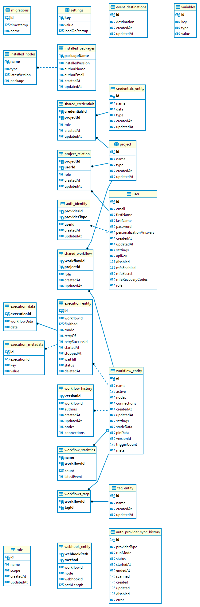

# Database structure 

This page describes the purpose of each table in the n8n database.

## Database and query technology 

By default, n8n uses SQLite as the database. If you are using another database the structure will be similar, but the data-types may be different depending on the database.

n8n uses [TypeORM](https://github.com/typeorm/typeorm) for queries and migrations.

To inspect the n8n database, you can use [DBeaver](https://dbeaver.io), which is an open-source universal database tool.

## Tables 

These are the tables n8n creates during setup.

### auth_identity 

Stores details of external authentication providers when using [SAML](https://app.gitbook.com/s/wMJrGrimpx3PxCJpUswm/manage-users-and-access/verify-user-identity/use-saml).

### auth_provider_sync_history 

Stores the history of a SAML connection.

### credentials_entity 

Stores the [credentials](https://app.gitbook.com/s/CxSeOtVxqqhfxMSac0AV/key-concept-glossary#credential-n8n) used to authenticate with integrations.

### event_destinations 

Contains the destination configurations for [Log streaming](https://app.gitbook.com/s/wMJrGrimpx3PxCJpUswm/observe-and-log/stream-logs-to-external-systems).

### execution_data 

Contains the workflow at time of running, and the execution data.

### execution_entity 

Stores all saved workflow executions. Workflow settings can affect which executions n8n saves.

### execution_metadata 

Stores [Custom executions data](https://app.gitbook.com/s/rPN1zU5jaYNvwH7RzxqA/understand-workflows/understand-executions/customize-executions-data).

### installed_nodes 

Lists the [community nodes](https://app.gitbook.com/s/BKcbOzIWja8NfqKDcqHc/community-nodes/installation-and-management) installed in your n8n instance.

### installed_packages 

Details of npm community nodes packages installed in your n8n instance. [installed_nodes](#installed_nodes) lists each individual node. `installed_packages` lists npm packages, which may contain more than one node.

### migrations 

A log of all database migrations. Read more about [Migrations](https://typeorm.io/docs/advanced-topics/migrations/) in TypeORM's documentation.

### project 

Lists the [projects](https://app.gitbook.com/s/wMJrGrimpx3PxCJpUswm/manage-users-and-access/set-permissions-and-roles-rbac/organize-work-in-projects) in your instance.

### project_relation 

Describes the relationship between a user and a [project](https://app.gitbook.com/s/wMJrGrimpx3PxCJpUswm/manage-users-and-access/set-permissions-and-roles-rbac/organize-work-in-projects), including the user's [role type](https://app.gitbook.com/s/wMJrGrimpx3PxCJpUswm/manage-users-and-access/set-permissions-and-roles-rbac/see-available-roles).

### role 

Not currently used. For use in future work on custom roles. 

### settings 

Records custom instance settings. These are settings that you can't control using environment variables. They include:

* Whether the instance owner is set up
* Whether the user chose to skip owner and user management setup
* Whether certain types of authentication, including SAML and LDAP, are on
* License key

### shared_credentials 

Maps credentials to users.

### shared_workflow 

Maps workflows to users.

### tag_entity 

All workflow tags created in the n8n instance. This table lists the tags. [workflows_tags](#workflows_tags) records which workflows have which tags.

### user 

Contains user data.

### variables 

Store [variables](https://app.gitbook.com/s/rPN1zU5jaYNvwH7RzxqA/code-in-n8n/define-custom-variables).

### webhook_entity 

Records the active webhooks in your n8n instance's workflows. This isn't just webhooks uses in the Webhook node. It includes all active webhooks used by any trigger node.

### workflow_entity 

Your n8n instance's saved workflows.

### workflow_history 

Store previous versions of workflows.

### workflow_statistics 

Counts workflow IDs and their status.

### workflows_tags 

Maps tags to workflows. [tag_entity](#tag_entity) contains tag details.

## Entity Relationship Diagram (ERD) 

