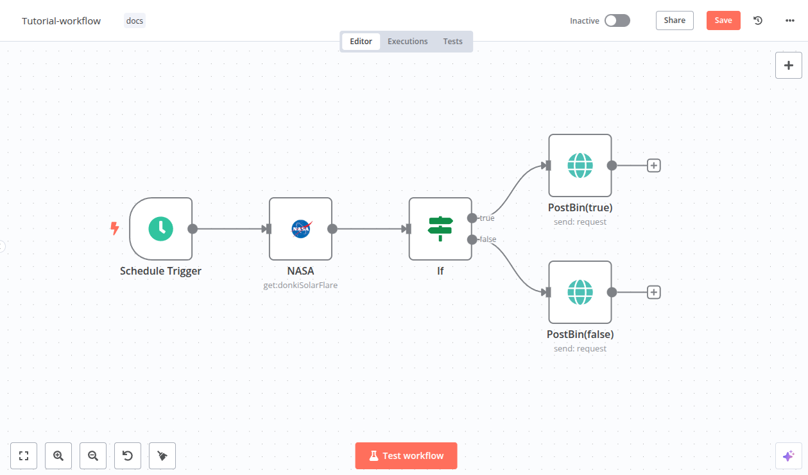
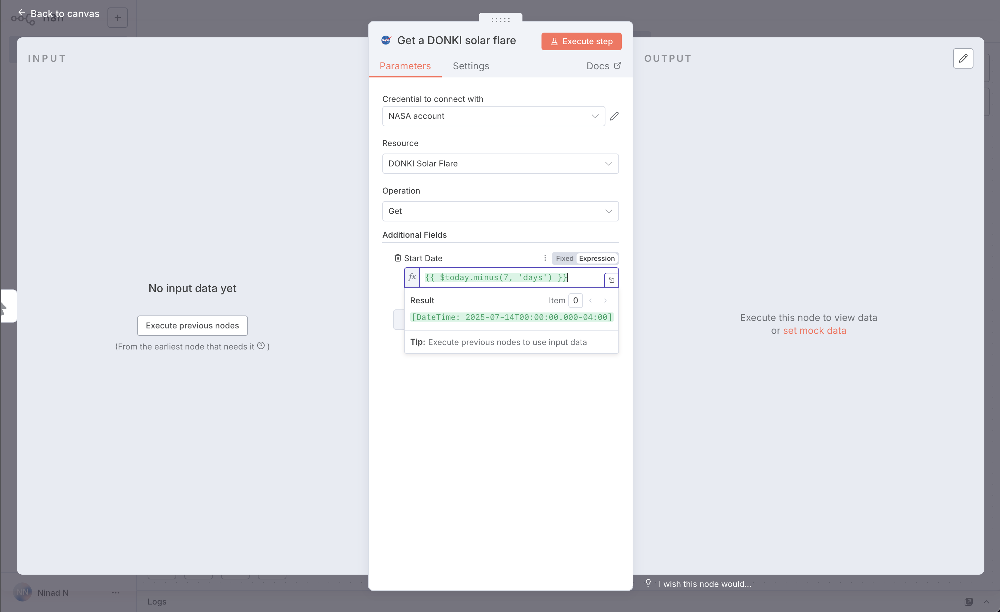
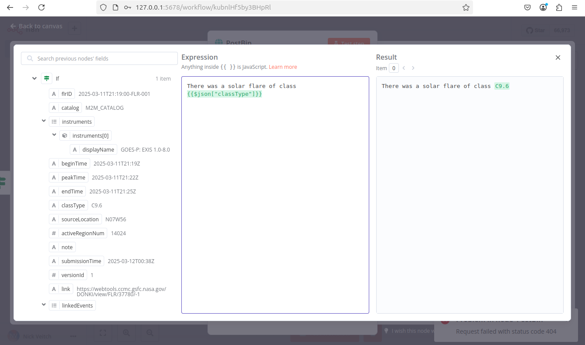

# Build your first workflow

This guide will show you how to construct a workflow[^1] in n8n, explaining key concepts along the way. You will:

* Create a workflow from scratch.
* Understand key concepts and skills, including:
  * Starting workflows with trigger nodes
  * Configuring credentials[^2]
  * Processing data
  * Representing logic in an n8n workflow
  * Using expressions[^3]



This quickstart uses [n8n Cloud](../../manage-cloud/overview.md), which is recommended for new users. A free trial is available - if you haven't already done so, [sign up](https://app.n8n.cloud/register) for an account now.

## Step one: Create a new workflow <a href="#step-one-create-a-new-workflow" id="step-one-create-a-new-workflow"></a>

When you open n8n, you'll see either:

* A window with a welcome message and two large buttons: Choose **Start from Scratch** to create a new workflow.
* The **Workflows** list on the **Overview** page. Select the **Create Workflow** to create a new workflow.

## Step two: Add a trigger node <a href="#step-two-add-a-trigger-node" id="step-two-add-a-trigger-node"></a>

n8n provides two ways to start a workflow:

* Manually, by selecting **Execute Workflow**.
* Automatically, using a trigger node as the first node. The trigger node runs the workflow in response to an external event, or based on your settings.

For this tutorial, we'll use the [Schedule trigger](https://app.gitbook.com/s/BKcbOzIWja8NfqKDcqHc/builtin/core-nodes/n8n-nodes-base.scheduletrigger). This allows you to run the workflow on a schedule:

1. Select **Add first step**.
2. Search for **Schedule**. n8n shows a list of nodes that match the search.
3. Select **Schedule Trigger** to add the node to the canvas. n8n opens the node.
4. For **Trigger Interval**, select **Weeks**.
5. For **Weeks Between Triggers**, enter `1`.
6. Enter a time and day. For this example, select **Monday** in **Trigger on Weekdays**, select **9am** in **Trigger at Hour**, and enter `0` in **Trigger at Minute**.
7. Close the node details view to return to the canvas.

## Step three: Add the NASA node and set up credentials <a href="#step-three-add-the-nasa-node-and-set-up-credentials" id="step-three-add-the-nasa-node-and-set-up-credentials"></a>

The [NASA node](https://app.gitbook.com/s/BKcbOzIWja8NfqKDcqHc/builtin/app-nodes/n8n-nodes-base.nasa) interacts with NASA's [public APIs](https://api.nasa.gov/) to fetch useful data. We will use the real-time data from the API to find solar events.

<details>

<summary>Credentials</summary>

Credentials are private pieces of information issued by apps and services to authenticate you as a user and allow you to connect and share information between the app or service and the n8n node. The type of information required varies depending on the app/service concerned. You should be careful about sharing or revealing the credentials outside of n8n.

</details>

1. Select the **Add node**  connector on the Schedule Trigger node.
2. Search for **NASA**. n8n shows a list of nodes that match the search.
3. Select **NASA** to view a list of operations.
4. Search for and select **Get a DONKI solar flare**. This operation returns a report about recent solar flares. When you select the operation, n8n adds the node to the canvas and opens it.
5. To access the NASA APIs, you need to set up credentials:
   1. Select the **Credential for NASA API** dropdown.
   2. Select **Create new credential**. n8n opens the credentials view.
   3. Go to [NASA APIs](https://api.nasa.gov/) and fill out the form from the **Generate API Key** link. The NASA site generates the key and emails it to the address you entered.
   4. Check your email account for the API key. If you don’t see it, check your junk or spam folder. Copy the key, and paste it into **API Key** in n8n.
   5. Select **Save**.
   6. Close the credentials screen. n8n returns to the node. The new credentials should be automatically selected in **Credential for NASA API**.
6.  By default, DONKI Solar Flare provides data for the past 30 days. To limit it to just the last week, use **Additional Fields**:<br>

    1. Select **Add field**.
    2. Select **Start date**.
    3. To get a report starting from a week ago, you can use an expression: next to **Start date**, select the **Expression** tab, then select the expand button  to open the full expressions editor.
    4. In the **Expression** field, enter the following expression:

    ```js
    {{ $today.minus(7, 'days') }}
    ```

    This generates a date in the correct format, seven days before the current date.

    
7. Close the **Edit Expression** modal to return to the NASA node.
8. You can now check that the node is working and returning the expected date: select **Execute step** to run the node manually. n8n calls the NASA API and displays details of solar flares in the past seven days in the **OUTPUT** section.
9. Close the NASA node to return to the workflow canvas.

## Step four: Add logic with the If node <a href="#step-four-add-logic-with-the-if-node" id="step-four-add-logic-with-the-if-node"></a>

n8n supports complex logic in workflows. In this tutorial we will use the [If node](https://app.gitbook.com/s/BKcbOzIWja8NfqKDcqHc/builtin/core-nodes/n8n-nodes-base.if) to create two branches that each generate a report from the NASA data. Solar flares have five possible classifications; we will add logic that sends a report with the lower classifications to one output, and the higher classifications to another.

Add the If node:

1. Select the **Add node**  connector on the NASA node.
2. Search for **If**. n8n shows a list of nodes that match the search.
3. Select **If** to add the node to the canvas. n8n opens the node.
4. You need to check the value of the `classType` property in the NASA data. To do this:
   1.  Drag **classType** into **Value 1**.<br>

       <div data-gb-custom-block data-tag="hint" data-style="info" class="hint hint-info"><p><strong>Make sure you ran the NASA node in the previous section</strong></p><p>If you didn't follow the step in the previous section to run the NASA node, you won't see any data to work with in this step.</p></div>
   2. Change the comparison operation to **String > Contains**.
   3. In **Value 2**, enter **X**. This is the highest classification of solar flare. In the next step, you will create two reports: one for X class solar flares, and one for all the smaller solar flares.
5.  You can now check that the node is working and returning the expected date: select **Execute step** to run the node manually. n8n tests the data against the condition, and shows which results match true or false in the **OUTPUT** panel.<br>

    <div data-gb-custom-block data-tag="hint" data-style="info" class="hint hint-info"><p><strong>Weeks without large solar flares</strong></p><p>In this tutorial, you are working with live data. If you find there aren't any X class solar flares when you run the workflow, try replacing <strong>X</strong> in <strong>Value 2</strong> with either <strong>A</strong>, <strong>B</strong>, <strong>C</strong>, or <strong>M</strong>.</p></div>
6. Once you are happy the node will return some events, you can close the node to return to the canvas.

## Step five: Output data from your workflow <a href="#step-five-output-data-from-your-workflow" id="step-five-output-data-from-your-workflow"></a>

The last step of the workflow is to send the two reports about solar flares. For this example, you'll send data to [Postbin](https://www.toptal.com/developers/postbin/). Postbin is a service that receives data and displays it on a temporary web page.

1. On the If node, select the **Add node**  connector labeled **true**.
2. Search for **PostBin**. n8n shows a list of nodes that match the search.
3. Select **PostBin**.
4. Select **Send a request**. n8n adds the node to the canvas and opens it.
5. Go to [Postbin](https://www.toptal.com/developers/postbin/) and select **Create Bin**. Leave the tab open so you can come back to it when testing the workflow.
6. Copy the bin ID. It looks similar to `1651063625300-2016451240051`.
7. In n8n, paste your Postbin ID into **Bin ID**.
8. Now, configure the data to send to Postbin. Next to **Bin Content**, select the **Expression** tab (you will need to mouse-over the **Bin Content** for the tab to appear), then select the expand button  to open the full expressions editor.
9. You can now click and drag the correct field from the If Node output into the expressions editor to automatically create a reference for this label. In this case the input we want is 'classType'.
10. Once dropped into the expressions editor it will transform into this reference: `{{$json["classType"]}}`. Add a message to it, so that the full expression is:

    ```js
    There was a solar flare of class {{$json["classType"]}}
    ```

    
11. Close the expressions editor to return to the node.
12. Close the Postbin node to return to the canvas.
13. Add another Postbin node, to handle the **false** output path from the If node:
    1. Hover over the Postbin node, then select **Node context menu**  > **Duplicate node** to duplicate the first Postbin node.
    2. Drag the **false** connector from the If node to the left side of the new Postbin node.

## Step six: Test the workflow <a href="#step-six-test-the-workflow" id="step-six-test-the-workflow"></a>

1. You can now test the entire workflow. Select **Execute Workflow**. n8n runs the workflow, showing each stage in progress.
2. Go back to your Postbin bin. Refresh the page to see the output.
3. If you want to use this workflow (in other words, if you want it to run once a week automatically), you need to publish it by clicking **Publish**.


**Time limit**

Postbin's bins exist for 30 minutes after creation. You may need to create a new bin and update the ID in the Postbin nodes, if you exceed this time limit.


## Congratulations <a href="#congratulations" id="congratulations"></a>

You now have a fully functioning workflow that does something useful! It should look something like this:

{% @n8n-blocks/n8n-workflow-demo content="%7B%0A%20%20%22name%22%3A%20%22Tutorial-workflow%22%2C%0A%20%20%22nodes%22%3A%20%5B%0A%20%20%20%20%7B%0A%20%20%20%20%20%20%22parameters%22%3A%20%7B%0A%20%20%20%20%20%20%20%20%22rule%22%3A%20%7B%0A%20%20%20%20%20%20%20%20%20%20%22interval%22%3A%20%5B%0A%20%20%20%20%20%20%20%20%20%20%20%20%7B%0A%20%20%20%20%20%20%20%20%20%20%20%20%20%20%22field%22%3A%20%22weeks%22%2C%0A%20%20%20%20%20%20%20%20%20%20%20%20%20%20%22triggerAtDay%22%3A%20%5B%0A%20%20%20%20%20%20%20%20%20%20%20%20%20%20%20%201%0A%20%20%20%20%20%20%20%20%20%20%20%20%20%20%5D%2C%0A%20%20%20%20%20%20%20%20%20%20%20%20%20%20%22triggerAtHour%22%3A%209%0A%20%20%20%20%20%20%20%20%20%20%20%20%7D%0A%20%20%20%20%20%20%20%20%20%20%5D%0A%20%20%20%20%20%20%20%20%7D%0A%20%20%20%20%20%20%7D%2C%0A%20%20%20%20%20%20%22type%22%3A%20%22n8n-nodes-base.scheduleTrigger%22%2C%0A%20%20%20%20%20%20%22typeVersion%22%3A%201.2%2C%0A%20%20%20%20%20%20%22position%22%3A%20%5B%0A%20%20%20%20%20%20%20%20-680%2C%0A%20%20%20%20%20%20%20%20100%0A%20%20%20%20%20%20%5D%2C%0A%20%20%20%20%20%20%22id%22%3A%20%22ef14445c-2f5f-4c78-96c8-66732feb7a8f%22%2C%0A%20%20%20%20%20%20%22name%22%3A%20%22Schedule%20Trigger%22%0A%20%20%20%20%7D%2C%0A%20%20%20%20%7B%0A%20%20%20%20%20%20%22parameters%22%3A%20%7B%0A%20%20%20%20%20%20%20%20%22resource%22%3A%20%22donkiSolarFlare%22%2C%0A%20%20%20%20%20%20%20%20%22additionalFields%22%3A%20%7B%0A%20%20%20%20%20%20%20%20%20%20%22startDate%22%3A%20%22%3D%7B%7B%20%24today.minus%287%2C%20%27days%27%29%20%7D%7D%22%0A%20%20%20%20%20%20%20%20%7D%0A%20%20%20%20%20%20%7D%2C%0A%20%20%20%20%20%20%22type%22%3A%20%22n8n-nodes-base.nasa%22%2C%0A%20%20%20%20%20%20%22typeVersion%22%3A%201%2C%0A%20%20%20%20%20%20%22position%22%3A%20%5B%0A%20%20%20%20%20%20%20%20-460%2C%0A%20%20%20%20%20%20%20%20100%0A%20%20%20%20%20%20%5D%2C%0A%20%20%20%20%20%20%22id%22%3A%20%2252c58b93-c780-4aff-a216-d67b28195a45%22%2C%0A%20%20%20%20%20%20%22name%22%3A%20%22NASA%22%2C%0A%20%20%20%20%20%20%22credentials%22%3A%20%7B%0A%20%20%20%20%20%20%20%20%22nasaApi%22%3A%20%7B%0A%20%20%20%20%20%20%20%20%20%20%22id%22%3A%20%22sSVnxV9AcBmBOYn8%22%2C%0A%20%20%20%20%20%20%20%20%20%20%22name%22%3A%20%22NASA%20account%22%0A%20%20%20%20%20%20%20%20%7D%0A%20%20%20%20%20%20%7D%0A%20%20%20%20%7D%2C%0A%20%20%20%20%7B%0A%20%20%20%20%20%20%22parameters%22%3A%20%7B%0A%20%20%20%20%20%20%20%20%22conditions%22%3A%20%7B%0A%20%20%20%20%20%20%20%20%20%20%22options%22%3A%20%7B%0A%20%20%20%20%20%20%20%20%20%20%20%20%22caseSensitive%22%3A%20true%2C%0A%20%20%20%20%20%20%20%20%20%20%20%20%22leftValue%22%3A%20%22%22%2C%0A%20%20%20%20%20%20%20%20%20%20%20%20%22typeValidation%22%3A%20%22strict%22%2C%0A%20%20%20%20%20%20%20%20%20%20%20%20%22version%22%3A%202%0A%20%20%20%20%20%20%20%20%20%20%7D%2C%0A%20%20%20%20%20%20%20%20%20%20%22conditions%22%3A%20%5B%0A%20%20%20%20%20%20%20%20%20%20%20%20%7B%0A%20%20%20%20%20%20%20%20%20%20%20%20%20%20%22id%22%3A%20%222f469c8e-12b3-4ee5-95fc-ff81508d0b43%22%2C%0A%20%20%20%20%20%20%20%20%20%20%20%20%20%20%22leftValue%22%3A%20%22%3D%7B%7B%20%24json.classType%20%7D%7D%22%2C%0A%20%20%20%20%20%20%20%20%20%20%20%20%20%20%22rightValue%22%3A%20%22C%22%2C%0A%20%20%20%20%20%20%20%20%20%20%20%20%20%20%22operator%22%3A%20%7B%0A%20%20%20%20%20%20%20%20%20%20%20%20%20%20%20%20%22type%22%3A%20%22string%22%2C%0A%20%20%20%20%20%20%20%20%20%20%20%20%20%20%20%20%22operation%22%3A%20%22contains%22%0A%20%20%20%20%20%20%20%20%20%20%20%20%20%20%7D%0A%20%20%20%20%20%20%20%20%20%20%20%20%7D%0A%20%20%20%20%20%20%20%20%20%20%5D%2C%0A%20%20%20%20%20%20%20%20%20%20%22combinator%22%3A%20%22and%22%0A%20%20%20%20%20%20%20%20%7D%2C%0A%20%20%20%20%20%20%20%20%22options%22%3A%20%7B%7D%0A%20%20%20%20%20%20%7D%2C%0A%20%20%20%20%20%20%22type%22%3A%20%22n8n-nodes-base.if%22%2C%0A%20%20%20%20%20%20%22typeVersion%22%3A%202.2%2C%0A%20%20%20%20%20%20%22position%22%3A%20%5B%0A%20%20%20%20%20%20%20%20-240%2C%0A%20%20%20%20%20%20%20%20100%0A%20%20%20%20%20%20%5D%2C%0A%20%20%20%20%20%20%22id%22%3A%20%22b54e3289-9ebb-451f-8bac-87edeeeced13%22%2C%0A%20%20%20%20%20%20%22name%22%3A%20%22If%22%0A%20%20%20%20%7D%2C%0A%20%20%20%20%7B%0A%20%20%20%20%20%20%22parameters%22%3A%20%7B%0A%20%20%20%20%20%20%20%20%22resource%22%3A%20%22request%22%2C%0A%20%20%20%20%20%20%20%20%22operation%22%3A%20%22send%22%2C%0A%20%20%20%20%20%20%20%20%22binId%22%3A%20%221741914338605-0907339996192%22%2C%0A%20%20%20%20%20%20%20%20%22binContent%22%3A%20%22%3DThere%20was%20a%20solar%20flare%20of%20class%20%7B%7B%24json%5B%5C%22classType%5C%22%5D%7D%7D%22%2C%0A%20%20%20%20%20%20%20%20%22requestOptions%22%3A%20%7B%7D%0A%20%20%20%20%20%20%7D%2C%0A%20%20%20%20%20%20%22type%22%3A%20%22n8n-nodes-base.postBin%22%2C%0A%20%20%20%20%20%20%22typeVersion%22%3A%201%2C%0A%20%20%20%20%20%20%22position%22%3A%20%5B%0A%20%20%20%20%20%20%20%20-20%2C%0A%20%20%20%20%20%20%20%200%0A%20%20%20%20%20%20%5D%2C%0A%20%20%20%20%20%20%22id%22%3A%20%22a8b602b6-17b1-4274-8d33-73344b6bb8fb%22%2C%0A%20%20%20%20%20%20%22name%22%3A%20%22PostBin%28true%29%22%0A%20%20%20%20%7D%2C%0A%20%20%20%20%7B%0A%20%20%20%20%20%20%22parameters%22%3A%20%7B%0A%20%20%20%20%20%20%20%20%22resource%22%3A%20%22request%22%2C%0A%20%20%20%20%20%20%20%20%22operation%22%3A%20%22send%22%2C%0A%20%20%20%20%20%20%20%20%22binId%22%3A%20%221741914338605-0907339996192%22%2C%0A%20%20%20%20%20%20%20%20%22binContent%22%3A%20%22%3DThere%20was%20a%20solar%20flare%20of%20class%20%7B%7B%24json%5B%5C%22classType%5C%22%5D%7D%7D%22%2C%0A%20%20%20%20%20%20%20%20%22requestOptions%22%3A%20%7B%7D%0A%20%20%20%20%20%20%7D%2C%0A%20%20%20%20%20%20%22type%22%3A%20%22n8n-nodes-base.postBin%22%2C%0A%20%20%20%20%20%20%22typeVersion%22%3A%201%2C%0A%20%20%20%20%20%20%22position%22%3A%20%5B%0A%20%20%20%20%20%20%20%20-20%2C%0A%20%20%20%20%20%20%20%20200%0A%20%20%20%20%20%20%5D%2C%0A%20%20%20%20%20%20%22id%22%3A%20%2209c2c7a4-c229-430d-a5b0-8d7491515d9f%22%2C%0A%20%20%20%20%20%20%22name%22%3A%20%22PostBin%28false%29%22%0A%20%20%20%20%7D%2C%0A%20%20%20%20%7B%0A%20%20%20%20%20%20%22parameters%22%3A%20%7B%0A%20%20%20%20%20%20%20%20%22content%22%3A%20%22%23%23%20Setup%20required%5Cn%5CnYou%20need%20to%20create%20a%20NASA%20account%20and%20create%20credentials%2C%20and%20create%20a%20bin%20with%20Postbin%20and%20enter%20the%20ID%20-%20see%20%5Bthe%20documentation%5D%28https%3A%2F%2Fdocs.n8n.io%2Ftry-it-out%2Flonger-introduction%2F%29%22%2C%0A%20%20%20%20%20%20%20%20%22height%22%3A%20120%2C%0A%20%20%20%20%20%20%20%20%22width%22%3A%20600%0A%20%20%20%20%20%20%7D%2C%0A%20%20%20%20%20%20%22type%22%3A%20%22n8n-nodes-base.stickyNote%22%2C%0A%20%20%20%20%20%20%22typeVersion%22%3A%201%2C%0A%20%20%20%20%20%20%22position%22%3A%20%5B%0A%20%20%20%20%20%20%20%20-720%2C%0A%20%20%20%20%20%20%20%20-60%0A%20%20%20%20%20%20%5D%2C%0A%20%20%20%20%20%20%22id%22%3A%20%2208e0b8f9-c90e-4c9c-a663-01aca805b9be%22%2C%0A%20%20%20%20%20%20%22name%22%3A%20%22Sticky%20Note%22%0A%20%20%20%20%7D%0A%20%20%5D%2C%0A%20%20%22pinData%22%3A%20%7B%7D%2C%0A%20%20%22connections%22%3A%20%7B%0A%20%20%20%20%22Schedule%20Trigger%22%3A%20%7B%0A%20%20%20%20%20%20%22main%22%3A%20%5B%0A%20%20%20%20%20%20%20%20%5B%0A%20%20%20%20%20%20%20%20%20%20%7B%0A%20%20%20%20%20%20%20%20%20%20%20%20%22node%22%3A%20%22NASA%22%2C%0A%20%20%20%20%20%20%20%20%20%20%20%20%22type%22%3A%20%22main%22%2C%0A%20%20%20%20%20%20%20%20%20%20%20%20%22index%22%3A%200%0A%20%20%20%20%20%20%20%20%20%20%7D%0A%20%20%20%20%20%20%20%20%5D%0A%20%20%20%20%20%20%5D%0A%20%20%20%20%7D%2C%0A%20%20%20%20%22NASA%22%3A%20%7B%0A%20%20%20%20%20%20%22main%22%3A%20%5B%0A%20%20%20%20%20%20%20%20%5B%0A%20%20%20%20%20%20%20%20%20%20%7B%0A%20%20%20%20%20%20%20%20%20%20%20%20%22node%22%3A%20%22If%22%2C%0A%20%20%20%20%20%20%20%20%20%20%20%20%22type%22%3A%20%22main%22%2C%0A%20%20%20%20%20%20%20%20%20%20%20%20%22index%22%3A%200%0A%20%20%20%20%20%20%20%20%20%20%7D%0A%20%20%20%20%20%20%20%20%5D%0A%20%20%20%20%20%20%5D%0A%20%20%20%20%7D%2C%0A%20%20%20%20%22If%22%3A%20%7B%0A%20%20%20%20%20%20%22main%22%3A%20%5B%0A%20%20%20%20%20%20%20%20%5B%0A%20%20%20%20%20%20%20%20%20%20%7B%0A%20%20%20%20%20%20%20%20%20%20%20%20%22node%22%3A%20%22PostBin%28true%29%22%2C%0A%20%20%20%20%20%20%20%20%20%20%20%20%22type%22%3A%20%22main%22%2C%0A%20%20%20%20%20%20%20%20%20%20%20%20%22index%22%3A%200%0A%20%20%20%20%20%20%20%20%20%20%7D%0A%20%20%20%20%20%20%20%20%5D%2C%0A%20%20%20%20%20%20%20%20%5B%0A%20%20%20%20%20%20%20%20%20%20%7B%0A%20%20%20%20%20%20%20%20%20%20%20%20%22node%22%3A%20%22PostBin%28false%29%22%2C%0A%20%20%20%20%20%20%20%20%20%20%20%20%22type%22%3A%20%22main%22%2C%0A%20%20%20%20%20%20%20%20%20%20%20%20%22index%22%3A%200%0A%20%20%20%20%20%20%20%20%20%20%7D%0A%20%20%20%20%20%20%20%20%5D%0A%20%20%20%20%20%20%5D%0A%20%20%20%20%7D%0A%20%20%7D%2C%0A%20%20%22active%22%3A%20false%2C%0A%20%20%22settings%22%3A%20%7B%0A%20%20%20%20%22executionOrder%22%3A%20%22v1%22%0A%20%20%7D%2C%0A%20%20%22versionId%22%3A%20%2237de4877-e4f6-4b9a-b6f0-9b7e7aea0163%22%2C%0A%20%20%22meta%22%3A%20%7B%0A%20%20%20%20%22templateCredsSetupCompleted%22%3A%20true%2C%0A%20%20%20%20%22instanceId%22%3A%20%22cb484ba7b742928a2048bf8829668bed5b5ad9787579adea888f05980292a4a7%22%0A%20%20%7D%2C%0A%20%20%22id%22%3A%20%22DPzMzTIyDrYohiw4%22%2C%0A%20%20%22tags%22%3A%20%5B%0A%20%20%20%20%7B%0A%20%20%20%20%20%20%22createdAt%22%3A%20%222021-06-25T07%3A47%3A07.640Z%22%2C%0A%20%20%20%20%20%20%22updatedAt%22%3A%20%222021-06-25T07%3A47%3A07.640Z%22%2C%0A%20%20%20%20%20%20%22id%22%3A%20%221%22%2C%0A%20%20%20%20%20%20%22name%22%3A%20%22docs%22%0A%20%20%20%20%7D%0A%20%20%5D%0A%7D" url="https://raw.githubusercontent.com/n8n-io/n8n-docs/refs/heads/main/docs/_workflows/try-it-out/quickstart/tutorial.json" %}

Along the way you have discovered:

* How to find the nodes you want and join them together
* How to use expressions to manipulate data
* How to create credentials and attach them to nodes
* How to use logic in your workflows

There are plenty of things you could add to this (perhaps add some more credentials and a node to send you an email of the results), or maybe you have a specific project in mind. Whatever your next steps, the resources linked below should help.

## Next steps <a href="#next-steps" id="next-steps"></a>

* Interested in what you could do with AI? Find out [how to build an AI chat agent with n8n](../../advanced-ai/intro-tutorial.md).
* Take [courses at n8n Academy](https://learn.n8n.io).
* Explore more examples in [workflow templates](https://n8n.io/workflows/).

[^1]: An n8n workflow is a collection of nodes that automate a process. Workflows begin execution when a trigger condition occurs and execute sequentially to achieve complex tasks.

[^2]: In n8n, credentials store authentication information to connect with specific apps and services. After creating credentials with your authentication information (username and password, API key, OAuth secrets, etc.), you can use the associated app node to interact with the service.

[^3]: In n8n, expressions allow you to populate node parameters dynamically by executing JavaScript code. Instead of providing a static value, you can use the n8n expression syntax to define the value using data from previous nodes, other workflows, or your n8n environment.
