# Build your first workflow

In this quick start, you’ll build a workflow that fetches the weather for Berlin every morning and turns it into a short report anyone can read at a glance. The workflow saves each report to a data table, so you build up a weather log over time.

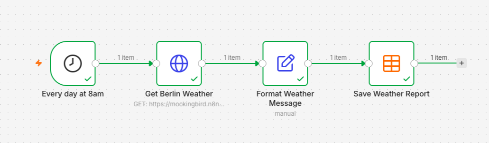

When it runs, your workflow produces a report like this:

```
The temperature in berlin is 7.4°C. It's currently overcast.
```

The build takes about 15 minutes. Apart from n8n, you don’t need any accounts, API keys, or coding experience. The weather data comes from Mockingbird, a sample-data service n8n provides for tutorials, so you’ll get similar results to this guide.

## Before you start

You need an n8n instance. Either:

- **n8n Cloud**: [sign up for a free trial](https://go.n8n.io/ekXKXJ), or
- **Self-hosted**: follow the [host n8n](https://go.n8n.io/caqo7e) guide

## 1. Create the workflow

Log in to your n8n instance, then:

1. Select **Personal** in the left menu. This is where your workflows live.

    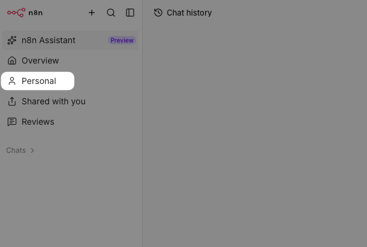

2. Select **Create workflow** at the top right. This opens the canvas, where you’ll build your workflow and spend most of this tutorial.

    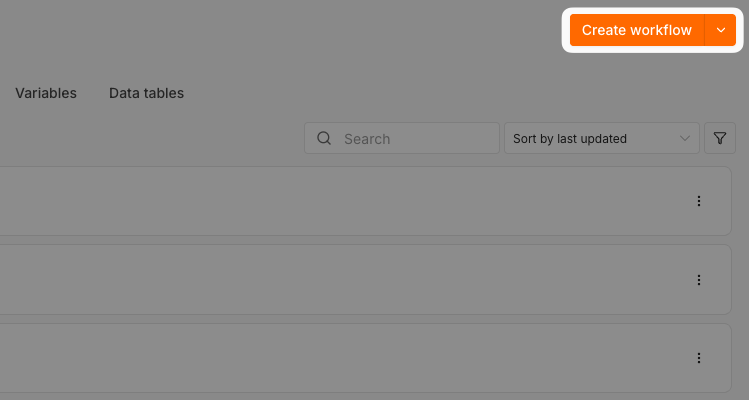

3. Select the workflow’s name and change it to `Weather Log`. Select anywhere on the canvas to save the name.

    
    Rename the workflow to Weather Log
    

## 2. Run it at 8 AM every day

You’ll use: **Schedule Trigger**

When building a workflow, the first question to answer is: “How do I want my workflow to start?” On a schedule, for example 8 AM every day? When a user submits a form? When an application like Telegram sends a message?

For this first build, you’ll set it to run at 8 AM every day. While you build, you’ll run the workflow yourself to test it. Once you publish it at the end, the schedule runs it for you:

1. Select **Add first step**, then select **On a schedule**.

    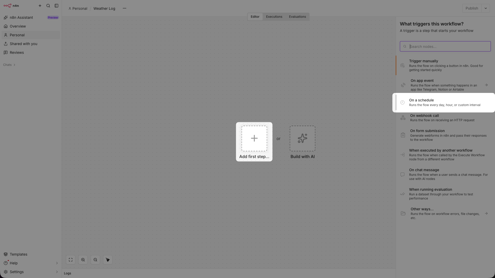

2. In the Node details view, select `8am` from the **Trigger at Hour** field.

    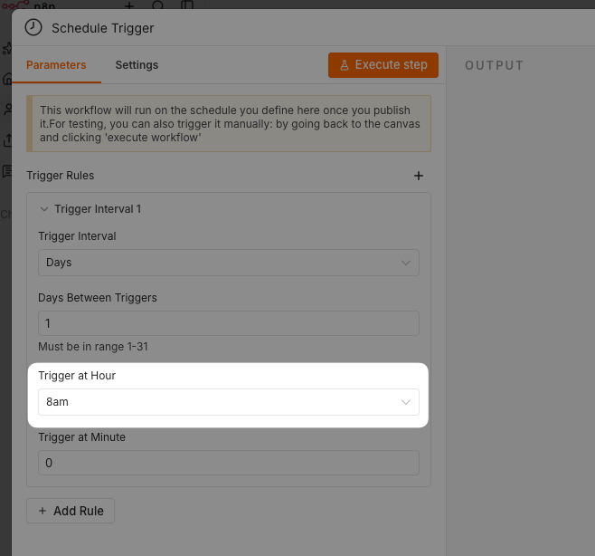

3. Select **Schedule Trigger** at the top left and rename it to `Every day at 8am`. Then select the **x** at the top right to close the Node details view and return to the canvas.

    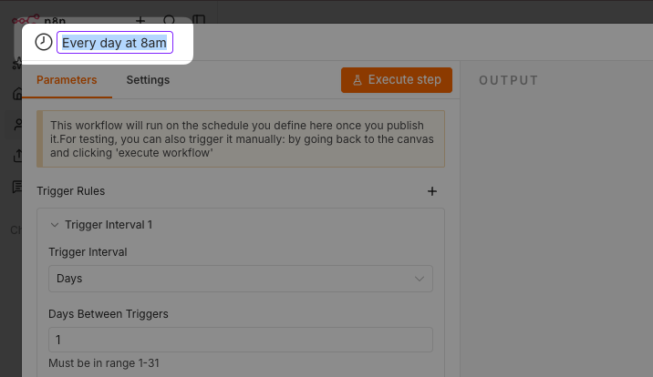

## 3. Get the weather for Berlin

You’ll use: **HTTP Request**

You’ve got your trigger, so it’s time to fetch the weather. The **HTTP Request** node sends a request to a web address, called an endpoint, and returns the data that address provides. A service that shares data this way is called an API.

1. Select **+** after the trigger, type `http` in the **Search nodes** box, and select **HTTP Request**.

    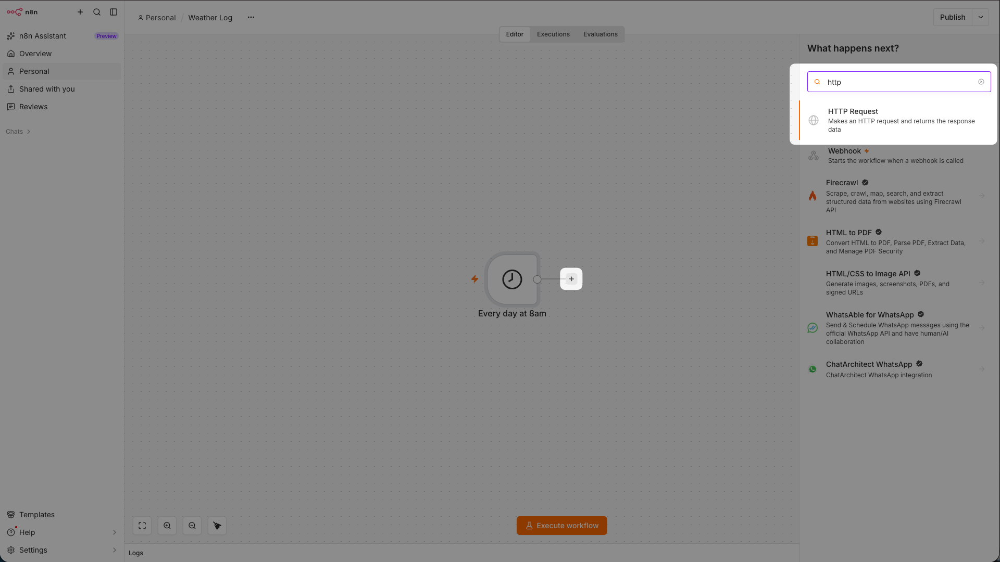

2. In the Node details view, paste `https://mockingbird.n8n.io/v1/weather/berlin` into the **URL** field.

    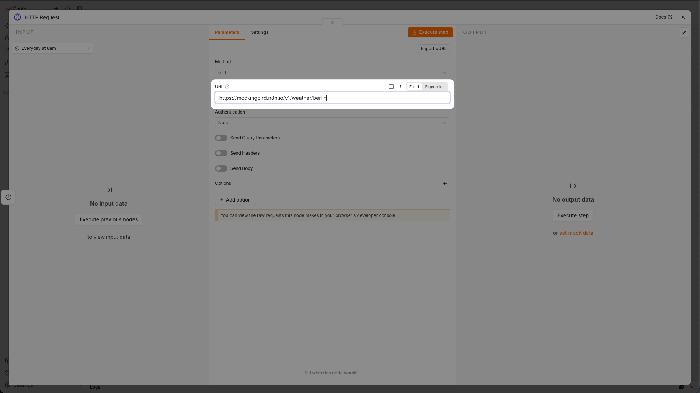

3. Select the node’s name at the top left and rename it to `Get Berlin Weather`, then select **Execute step**. You should see the weather for Berlin in the output, including the `city`, `temp_c`, and `condition` fields you’ll use in the next step.

    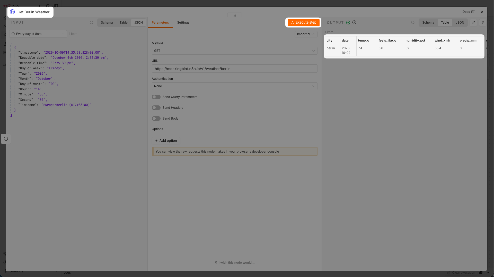

## 4. Turn the weather into a report

You’ll use: **Edit Fields (Set)**

Next, you’ll turn the weather data into a short report that anyone can read at a glance.

1. Select **+** after **Get Berlin Weather**, select **Data transformation**, then select **Edit Fields (Set)**.

    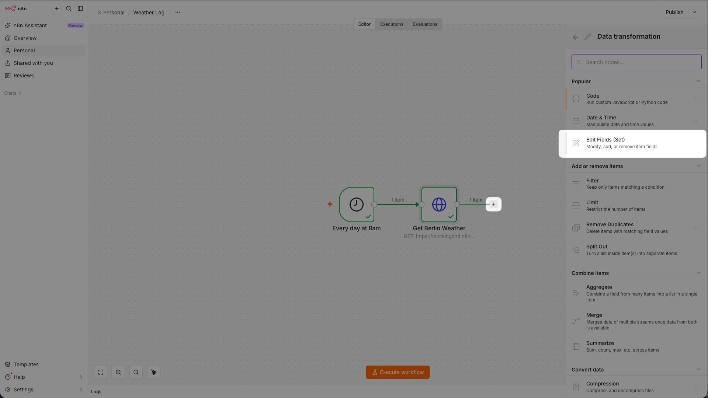

2. Select **Add Field** in the middle of the Node details view. For **Name**, enter `report`.
3. For **Value**, enter `The temperature in`, then drag `city` from the input panel on the left. When you drop a field in, n8n switches **Value** to **Expression** mode, and you see:

    ```
    The temperature in {{ $json.city }}
    ```

    
    Drag the city field into the report Value field
    

    
    **What's an expression?**

    `{{ $json.city }}` is a placeholder, called an expression. When the workflow runs, n8n swaps it for the real value. The input panel shows the output from **Get Berlin Weather**, which becomes the input to this node. You drag fields in rather than typing them, and the preview under the field shows you the finished sentence. To learn more, see [Expressions](https://app.gitbook.com/s/rPN1zU5jaYNvwH7RzxqA/work-with-data/expressions-versus-data-nodes#expressions).
    

4. Drag `temp_c` in and update the wording to:

    ```
    The temperature in {{ $json.city }} is {{ $json.temp_c }}°C.
    ```

    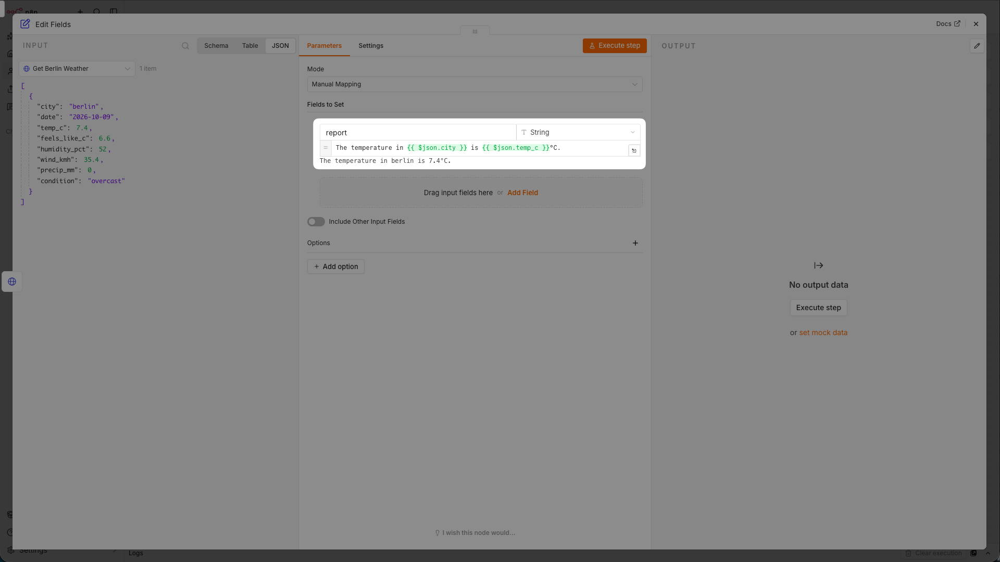

    Add `It's currently` to the end, then drag `condition` in:

    ```
    The temperature in {{ $json.city }} is {{ $json.temp_c }}°C. It's currently {{ $json.condition }}.
    ```

    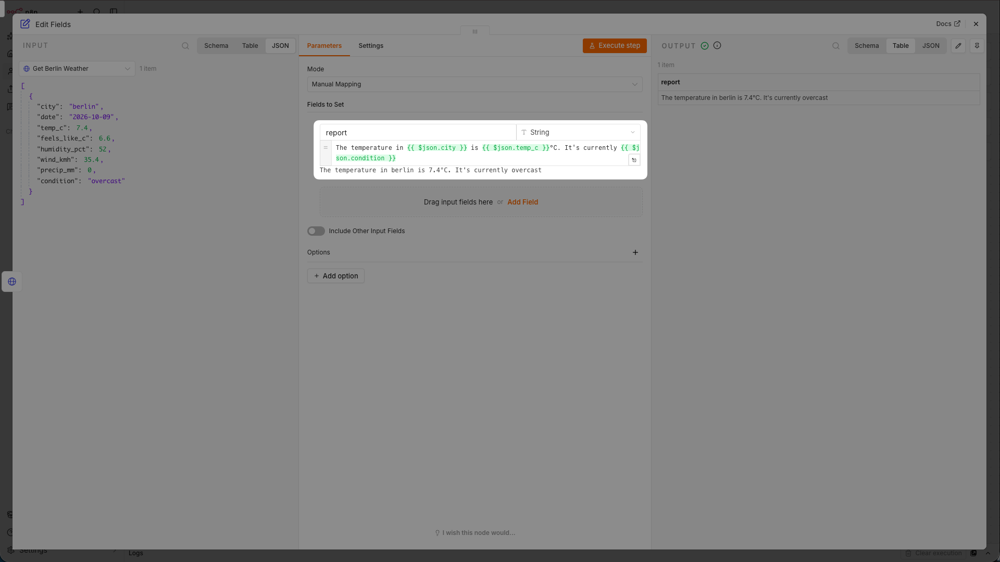

5. Rename the node to `Format Weather Message` and select **Execute step**. You should see output similar to:

    ```
    The temperature in berlin is 7.4°C. It's currently overcast.
    ```

    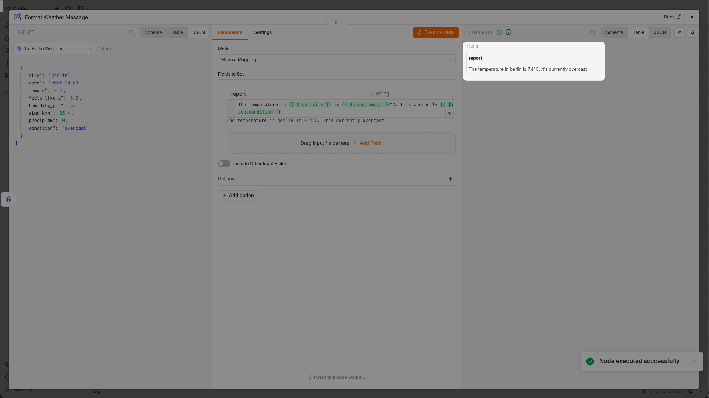

## 5. Save the data

You’ll use: **Data table**

You’ve fetched the data and formatted it, so now it’s time to store it. For this, you’ll use n8n’s [data tables](https://app.gitbook.com/s/rPN1zU5jaYNvwH7RzxqA/work-with-data/data-tables).

1. Select **Personal** in the left menu, then select **Data tables**.

    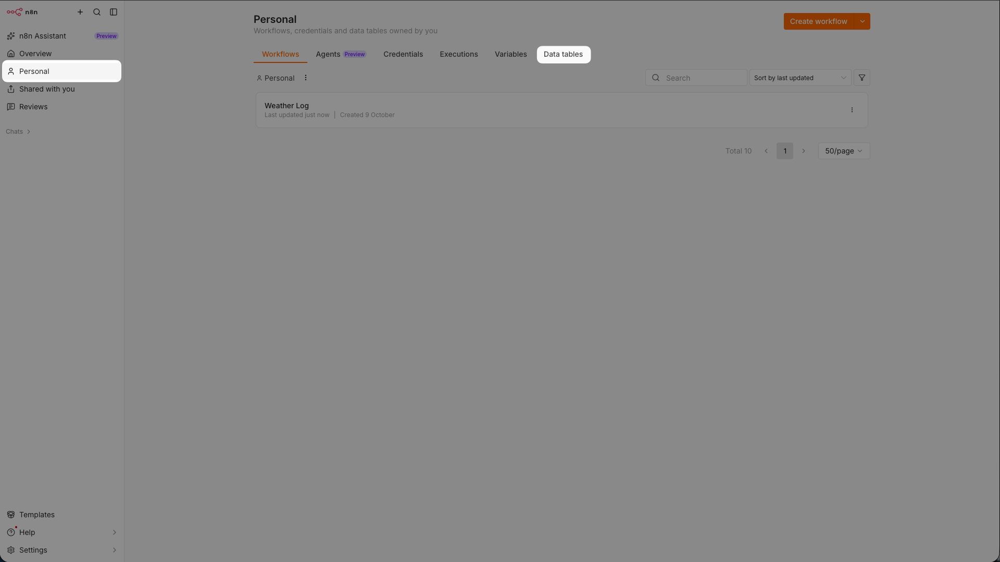

2. Select **Create data table**, name it `weather_data`, and select **Create**.

    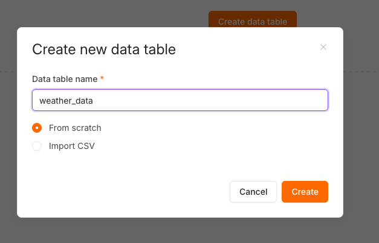

3. Select **Add Column**, enter `report` for **Name**, then select **Add Column** again. This gives you a column to store the weather report in.

    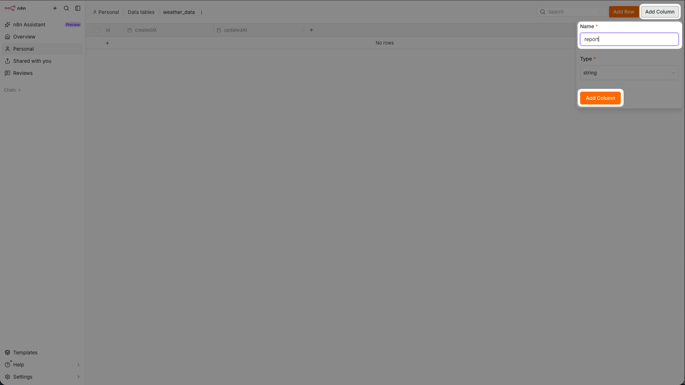

4. Open your **Weather Log** workflow (**Personal** > **Weather Log**). Add a **Data table** node after **Format Weather Message** and select **Insert row** as the action.

    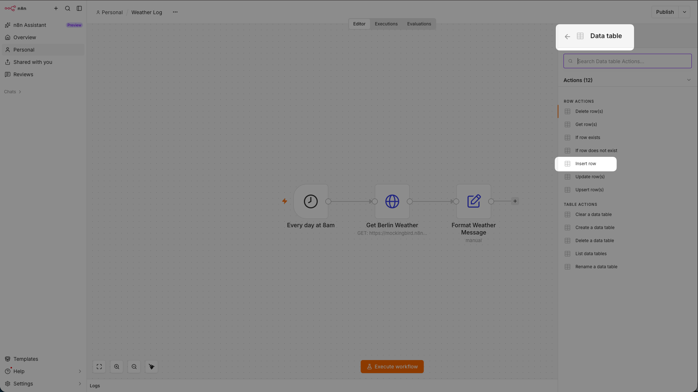

5. Rename the node to `Save Weather Report`.
6. Select `weather_data` from the **Data table** list and change **Mapping Column Mode** to **Map Automatically**. The `report` field from **Format Weather Message** has the same name as the column in the data table, so n8n maps them for you.

    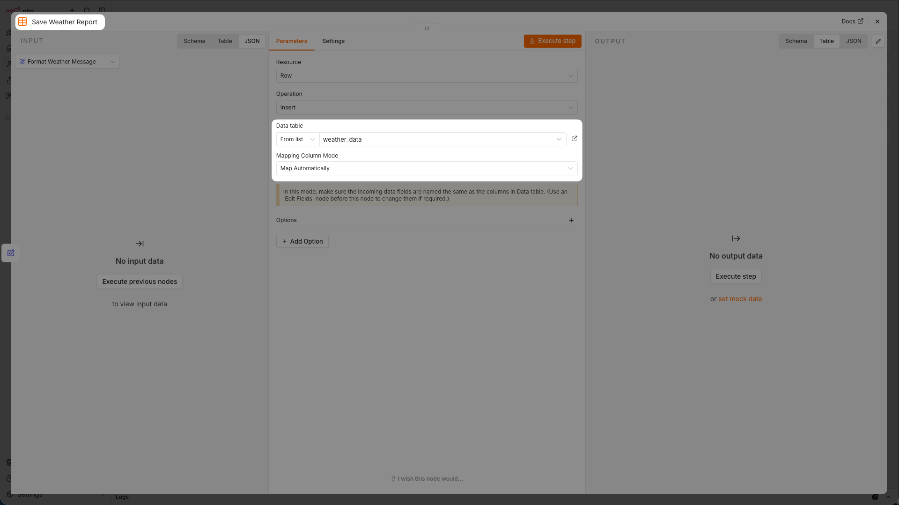

## 6. Test and publish the workflow

Your workflow is built. Test it, then publish it so it runs every day at 8 AM.

1. Select **Execute workflow** to test it, then open the `weather_data` table to check that n8n inserted a row.

    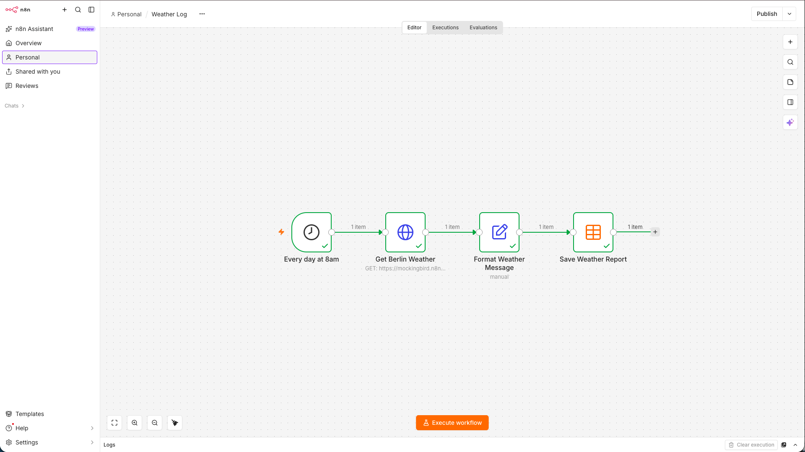

    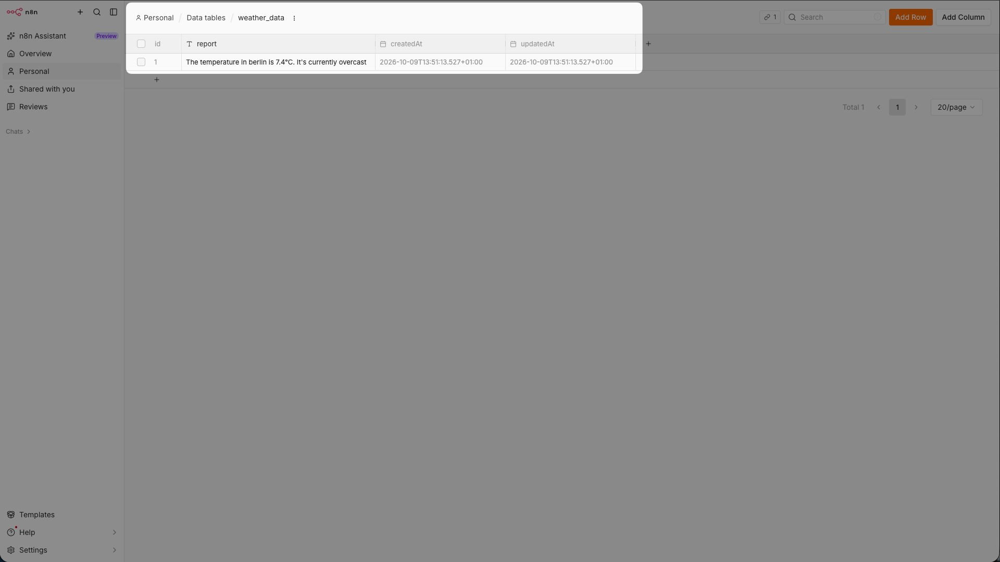

2. Select **Publish** in the canvas header and follow the prompts to publish the workflow.

    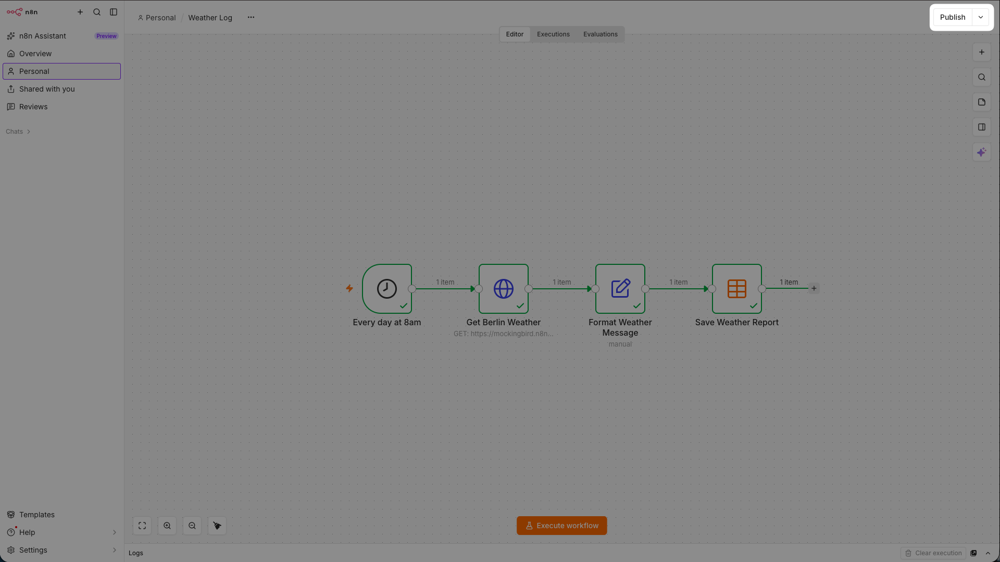

## What you learned

Congratulations, your workflow now runs at 8 AM every day. Along the way, you’ve learned how to:

- **Start a workflow with a trigger.** Yours runs on a schedule. [Schedule Trigger](https://app.gitbook.com/s/BKcbOzIWja8NfqKDcqHc/builtin/core-nodes/n8n-nodes-base.scheduletrigger)
- **Add and connect nodes.** Each node does one job and passes its result to the next. [Work with nodes](https://app.gitbook.com/s/rPN1zU5jaYNvwH7RzxqA/understand-workflows/workflow-components/work-with-nodes)
- **Fetch data from an API.** You used the HTTP Request node to get weather data from a web address. [HTTP Request](https://app.gitbook.com/s/BKcbOzIWja8NfqKDcqHc/builtin/core-nodes/n8n-nodes-base.httprequest)
- **Work with data between nodes.** The output of one node becomes the input of the next. [Understand n8n's data structure](https://app.gitbook.com/s/rPN1zU5jaYNvwH7RzxqA/work-with-data/understand-n8ns-data-structure)
- **Use expressions.** Dragging fields in builds an expression for you, so you can use live data without writing code. [Expressions for data transformation](https://app.gitbook.com/s/rPN1zU5jaYNvwH7RzxqA/work-with-data/transform-data/expressions-for-data-transformation)
- **Store data.** Each run saves a new row to your data table, so your reports are kept after the workflow finishes. [Data tables](https://app.gitbook.com/s/rPN1zU5jaYNvwH7RzxqA/work-with-data/data-tables)

## Optional: Build with n8n Assistant


**Preview status**

n8n Assistant is in Preview and may change in future releases. Check the [Use n8n Assistant](https://go.n8n.io/ZzxXro) page for availability.


n8n Assistant is another way to build workflows, using prompts. Now that you’ve built **Weather Log** yourself, you’ll understand what n8n Assistant creates.

1. Open your **Weather Log** workflow, select **Published** at the top right, and select **Unpublish**. Otherwise your workflow and the one n8n Assistant creates both run at 8 AM.

    

2. Select **n8n Assistant** in the left menu.

    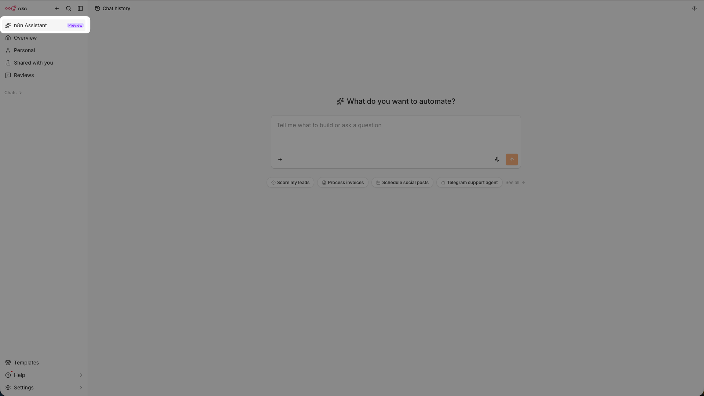

3. Enter this prompt:

    ```
    Every day at 8am:
    - Get the weather for Berlin from https://mockingbird.n8n.io/v1/weather/berlin
    - Add a report field that contains the city, temperature, and conditions
    - Save the report to a data table called weather_data
    ```

    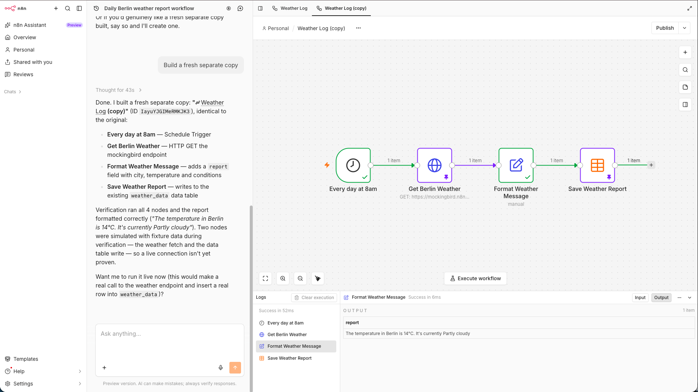

    
    n8n Assistant may detect your existing **Weather Log** workflow. Ask it to “build a fresh, separate copy”.
    

4. Approve each step when n8n Assistant asks. When it finishes, you should see output similar to:

    

5. Select **Execute workflow**, then check the data table for a new row:

    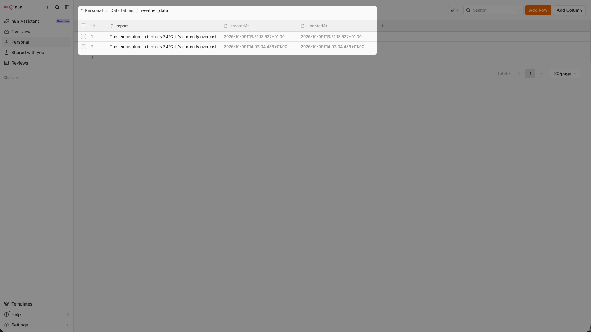

    

## Next steps

- Interested in what you could do with AI? Find out [how to build an AI chat agent with n8n](https://app.gitbook.com/s/rPN1zU5jaYNvwH7RzxqA/integrate-ai).
- Take [courses at n8n Academy](https://go.n8n.io/gfzWgF).
- Explore more examples in [workflow templates](https://n8n.io/workflows/).

## Related resources

* [n8n Docs](./)
* [Choose how to use n8n](choose-how-to-use-n8n.md)
* [Learning paths](learning-paths.md)
* [Key concept glossary](key-concept-glossary.md)
