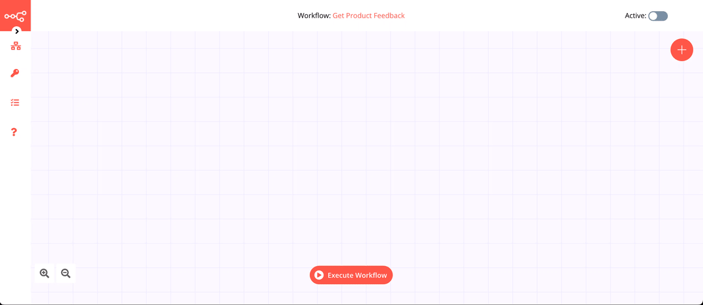
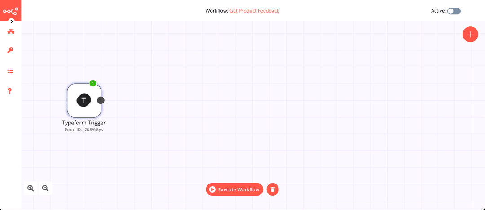
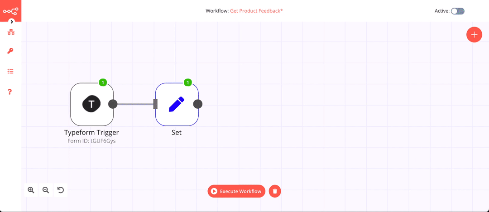
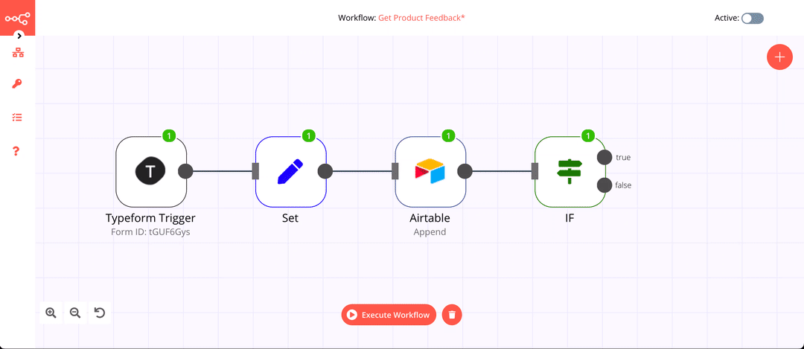

# Automate Product Feedback with Typeform, Airtable, and Trello 📈

Let's create your first workflow in n8n. We'll create a workflow that will add a new card to a  Trello board whenever a user submits a feedback score that is less than seven. You can also find the [workflow](https://n8n.io/workflows/791) on n8n.io.

## Prerequisites

You’ll need the following tools and resources to complete the tutorial:

- **n8n** — You can find details on how to install n8n on the [Quickstart](../../quickstart.md) page. Make sure that you start [n8n with tunnel](../../quickstart.md#starting-n8n-with-tunnel).
- **Typeform account** - You'll need to obtain the credentials for the Typeform Trigger node. You can find instructions on how to obtain them [here](../../../nodes/credentials/typeform/README.md). You will also need to create a form to collect feedback with the following questions:
	- What is your name? *(Short Text)*
	- What is your email address? *(Email)*
	- Anything else you want to share? *(Long Text)*
	- What score would you like to give? *(Rating)*
- **Airtable account** - You'll need to obtain the API Key for the Airtable node. You can find instructions on how to obtain that [here](../../../nodes/credentials/Airtable/README.md). You will also need a table with the name 'Feedback' and the following fields:
	- Name *(Single line text)*
	- Email *(Email)*
	- Description *(Long text)*
	- Score *(Number)*

Alternatively, you can copy [this base](https://airtable.com/shrW5dABzpdEMLohU). Click on the ***Copy base*** button on the top right corner to copy the base in your account.
- **Trello account** - You'll need to obtain the API Key, API Token, and the OAuth Secret for the Trello node. You can find instructions on how to obtain them [here](../../../nodes/credentials/Trello/README.md). You will also need to create a new board in Trello.

## Building the Workflow

This workflow would use the following nodes.
- [Typeform Trigger](../../../nodes/nodes-library/trigger-nodes/TypeformTrigger/README.md) - Start the workflow when a form receives a respose
- [Set](../../../nodes/nodes-library/core-nodes/Set/README.md) - Set the workflow data
- [Airtable](../../../nodes/nodes-library/nodes/Airtable/README.md) - Store the data
- [IF](../../../nodes/nodes-library/core-nodes/IF/README.md) - Conditional logic to decide the flow of the workflow
- [Trello](../../../nodes/nodes-library/nodes/Trello/README.md) - Create a card
- [NoOp](../../../nodes/nodes-library/core-nodes/NoOperationDoNothing/README.md) - Do nothing (optional)

The final workflow should look like the following image.


### 1. Typeform Trigger node

We'll use the *Typeform Trigger* node for starting the workflow. Add a *Typeform Trigger* node by clicking on the + button on the top right of the Editor UI. Click on the *Typeform Trigger* node under the section marked ***Trigger***.

Double click on the node to enter the Node Editor. Create credentials for the node by clicking on the ***Select Credentials*** dropdown list and selecting ***Create New***. Enter the credentials that you obtained [earlier](#prerequisites).

Select the form that you created from the ***Form*** dropdown list.  We'll let the other fields stay as they are.

Now save your workflow so that the webhook in the *Typeform Trigger* node can be activated. Since you’ll be using the test webhooks while building the workflow, the node only stays active for 120 seconds after you click the ***Execute Node*** button.

After clicking on the ***Execute Node*** button, submit a response to your form in Typeform. Here's a GIF of me following the steps mentioned above.



### 2. Set node

We'll use the Set node to ensure that only the data that we set in this node gets passed on to the next nodes in the workflow.

Add the *Set* node by clicking on the + button and selecting the *Set* node. Click on ***Add Value*** and select ***String*** from the dropdown list. Enter `Name` in the ***Name*** field. Since the ***Value*** (name) would be a dynamic piece of information, click on the gears icon next to the field, and select ***Add Expression***.

This will open up the ***Variable Selector***. From the left panel, select the following variable:

`Nodes > Typeform Trigger > Output Data > JSON > What is your name?`

Close the ***Edit Expression*** window. Click on ***Add Value*** and select ***String*** from the dropdown list. Enter `Email` in the ***Name*** field. Since the ***Value*** (email) would be a dynamic piece of information, click on the gears icon next to the field, and select ***Add Expression***.

This will open up the ***Variable Selector***. From the left panel, select the following variable:

`Nodes > Typeform Trigger > Output Data > JSON > What is your email address?`

Close the ***Edit Expression*** window. Click on ***Add Value*** and select ***String*** from the dropdown list. Enter `Description` in the ***Name*** field. Since the ***Value*** (description) would be a dynamic piece of information, click on the gears icon next to the field, and select ***Add Expression***.

This will open up the ***Variable Selector***. From the left panel, select the following variable:

`Nodes > Typeform Trigger > Output Data > JSON > Anything else you want to share?`

Close the ***Edit Expression*** window. Click on ***Add Value*** and select ***Number*** from the dropdown list. Enter `Score` in the ***Name*** field. Since the ***Value*** (score) would be a dynamic piece of information, click on the gears icon next to the field, and select ***Add Expression***.

This will open up the ***Variable Selector***. Delete the `0` in the ***Expression*** field on the right. From the left panel, select the following variable:

`Nodes > Typeform Trigger > Output Data > JSON > What score would you like to give?`

Toggle ***Keep Only Set*** to true. We set this option to true to ensure that only the data that we have set in this node get passed on to the next nodes in the workflow. Click on the ***Execute Node*** button on the top right to set the data for the workflow.

Here's a GIF of me following the steps mentioned above.



### 3. Airtable node

Add the *Airtable* node by clicking on the + button and selecting the *Airtable* node. Double click on the node and create credentials for the node by clicking on the ***Select Credentials*** dropdown list and selecting ***Create New***. Enter the ***API Key*** that you obtained [earlier](#prerequisites).

Select 'Append' from the ***Operation*** dropdown list. To get the Base ID, go to `https://airtable.com/api` and select the base. Copy and paste the ID in the ***Base ID*** field in n8n.

Enter the table name in the ***Table*** field. We'll let the other fields stay as they are. Click on the ***Execute Node*** button on the top right to append the data to your Airtable base.

Here's a GIF of me following the steps mentioned above.



### 4. IF node

Add the *IF* node by clicking on the + button and selecting the *IF* node. This is a conditional logic node that allows us to alter the flow of the workflow depending on the data that we get from the previous node(s).

Double click on the node, click on the ***Add Condition*** button and select ***Number*** from the menu. Since the ***Value 1*** (score) would be a dynamic piece of information, click on the gears icon next to the field, and select ***Add Expression***.

This will open up the ***Variable Selector***. Delete the `0` in the ***Expression*** field on the right. From the left panel, select the following variable:

`Nodes > Set > Output Data > JSON > Score`

For the ***Operation*** field, we'll let it be set to 'Smaller'. For ***Value 2***, I entered `7`. This will ensure that the *IF* node returns true only if the score is lower than 7. Feel free to change this to some other value. Click on the ***Execute Node*** button on the top right to check if the score is smaller than 7 or not.

Here's a GIF of me following the steps mentioned above.


### 5. Trello node

Add the *Trello* node by clicking on the + button and selecting the *Trello* node. Connect this node with the ***true*** output of the *IF* node.

Double click on the node and create credentials for the node by clicking on the ***Select Credentials*** dropdown list and selecting ***Create New***. Enter the ***API Key***, ***API Token***, and ***OAuth Secret*** that you obtained [earlier](#prerequisites).

To get the List ID, refer to the [FAQs](../../../nodes/nodes-library/nodes/Trello/README.md#how-do-i-find-the-list-id) section of the Trello node documentation. Copy and paste the ID of the list in which you want to create new cards in the ***List ID*** field in n8n.

This is what I added in the ***Title*** field (you can click on ***Add Expression*** and paste this):

```
[{{$node["IF"].json["fields"]["Score"]}}] {{$node["IF"].json["fields"]["Name"]}}
```

Similarly, you can add the description for the card. This is what I added in the ***Description*** field (you can click on ***Add Expression*** and paste this):

```
Name: {{$node["IF"].json["fields"]["Name"]}}
Email: {{$node["IF"].json["fields"]["Email"]}}
Score: {{$node["IF"].json["fields"]["Score"]}}
Description: {{$node["IF"].json["fields"]["Description"]}}
```
Click on the ***Execute Node*** button on the top right to create a new ticket in Trello.

Here's a GIF of me following the steps mentioned above.




### 6. NoOp node

If the score is greater than 7, we don't want the workflow to do anything. We'll use the *NoOp* node for that. Adding this node here is optional, as the absence of this node won't make a difference to the functioning of the workflow. Add the *NoOp* node by clicking on the + button and selecting the *NoOp* node. Connect this node with the ***false*** output of the *IF* node.

To test the workflow, click on the ***Execute Workflow*** button at the bottom of the Editor UI.

Don't forget to save the workflow and then click on the ***Activate*** toggle on the top right of the screen to set it to true and activate the workflow. Here's a GIF of me following the steps mentioned above.


## Conclusion

Congratulations on creating your first workflow with n8n 🥳

Did you run into any troubles while working on your first workflow? Don't be shy to ask questions or share the challenges you are facing in the community [forum](https://community.n8n.io/), we are all learners here 🙌

::: tip 🤝 Next Steps
Check out our tutorial on [Tracking Time Spent in Meetings With Google Calendar, Twilio, and n8n 🗓](https://medium.com/n8n-io/tracking-time-spent-in-meetings-with-google-calendar-twilio-and-n8n-a5d00f77da8c) to learn about automating the process of calculating your meeting time every week to give you a better idea of how your week is spent.
:::
