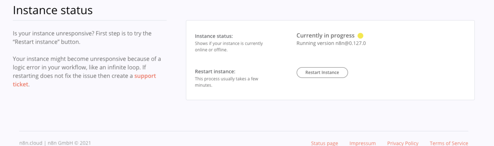
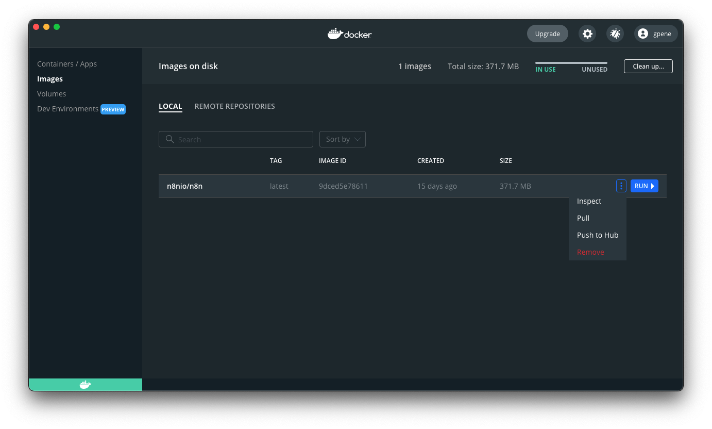

# Updating n8n

In order to take advantage of the newest features and functionality added to n8n (detailed in our [Changelog](../../reference/changelog.md)) you must update to the latest [released version](https://github.com/n8n-io/n8n/releases).

## n8n.cloud

To updated your n8n.cloud instance navigate to your Dashboard:


1. Click the **Settings** button or switch to the **Manage** tab.
2. From **Instance Settings**, use the **n8n version** dropdown to select your desired release version: Latest Stable, Beta, or Latest Beta.


3. Click **Save Changes** to restart your n8n instance and perform the update. A confirmation modal will appear and the **Instance Status** will reflect the update in progress.



## npm

To update your n8n instance to the latest released version, run:

```bash
npm update -g n8n
```

To install/update to a specific version of n8n use the `@` syntax to specify the desired version. For example:

```bash
npm install n8n@0.126.1
```

## Docker

From your Docker Desktop, navigate to the **Images** tab and select **Pull** from the context menu to download the latest n8n image:



You can also use the command line to pull the latest, or a specific version:

```sh
// Pull latest version
docker pull n8nio/n8n

// Pull specific version
docker pull n8nio/n8n:0.126.1
```

Stop the container and start it again. You can also use the command line:

```sh
// Get the container ID
docker ps -a

// Stop the container with ID container_id
docker stop [container_id]

// Remove the container with ID container_id
docker rm [container_id]

// Start the container
docker run --name=[container_name] [options] -d n8nio/n8n
```

## Docker Compose

If you've running n8n using a docker-compose file, follow the below mentioned steps to update n8n.

```sh
// Pull latest version
docker-compose pull

// Stop and remove older version
docker-compose down

// Start the container
docker-compose up -d
```

## N8n Desktop

If you've running n8n using the desktop distribution, updates are not currently available but should be coming soon. Keep an eye here for updates.
