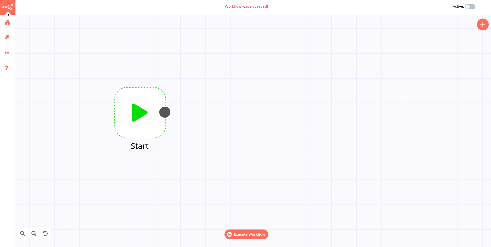
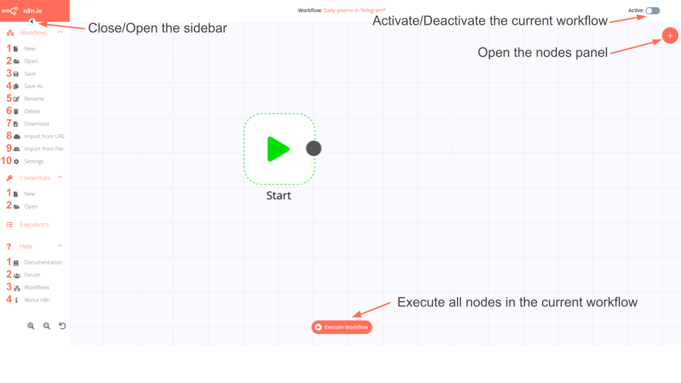
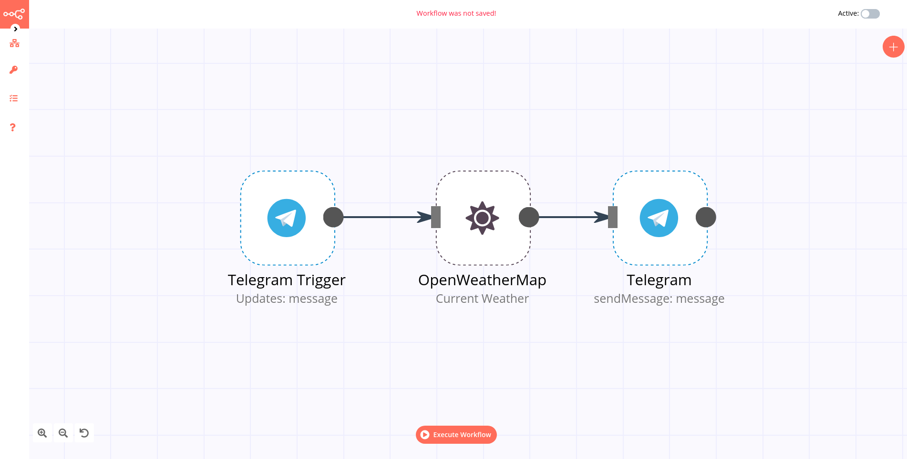

# Key Components

Before you start automating workflows with n8n, it's important to understand its key components.

## Editor UI

The [Editor UI](../reference/glossary.md#editor-ui) is the web interface used to create [workflows](#Workflow). It is accessed through a web browser at a designated website address.

From the Editor UI, you can access all your workflows and credentials, as well as the n8n documentation and forum.

The Editor UI sidebar menu contains the following operations:

### Workflows
1. **New**: Create a new workflow
2. **Open**: Open the list of saved workflows
3. **Save**: Save changes to the current workflow
4. **Save As**: Save the current workflow under a new name
5. **Rename**: Rename the current workflow
6. **Delete**: Delete the current workflow
7. **Download**: Download the current workflow as a JSON file
8. **Import from URL**: Import a workflow from a URL
9. **Import from File**: Import a workflow from a local file
10. **Settings**: View and change the settings of the current workflow

### Credentials
1. **New**: Create new credentials
2. **Open**: Open the list of saved credentials

### Executions
Open the workflow executions log.

### Help
1. **Documentation**: Open the n8n documentation page
2. **Forum**: Open the n8n community forum
3. **Workflows**: Open the n8n public workflows page
4. **About n8n**: View information about n8n (version, source code, license)

## Connection

A [connection](../reference/glossary.md#connection) establishes a link between nodes to route data through the workflow. A connection between two nodes passed data from one node's output to another node's input. Each node can have one or multiple connections. To create a connection between two nodes, click on the grey dot on the right side of the node and slide the arrow to the grey rectangle on the left side of the following node.  

*Example:* An [IF node](../nodes/nodes-library/core-nodes/If/README.md) has two connections to different nodes: one for the case when the statement is true and one for the case when the statement is false.

## Node

A [node](../reference/glossary.md#node) is an entry point for retrieving data, a function to process data, or an exit for sending data. The data process includes filtering, recomposing, and changing data. There can be one or several nodes for your API, service, or app. By connecting multiple nodes, you can create simple and complex workflows. When you add a node to the Editor UI, the node is automatically activated an requires you to configure it (i.e., add credentials, expressions, etc.).

There are three types of nodes:

* Core Nodes
* Regular Nodes
* Trigger Nodes

### Core nodes

Core nodes are functions or services that can be used to control how workflows are run or to provide generic API support. If an application you need does not have a dedicated Node yet, you can access the data by using the [HTTP Request node](../nodes/nodes-library/core-nodes/HTTPRequest/README.md) or the [Webhook node](../nodes/nodes-library/core-nodes/Webhook/README.md).

Use the Start node when you want to manually trigger the workflow with the `Execute Workflow` button at the bottom of the Editor UI. This way of starting the workflow with the Start node is useful for creating and testing workflows.

### Regular nodes

Regular nodes perform an action, like fetching data or creating an entry in a calendar. Regular nodes are named like the application they represent and are listed under Regular Nodes in the Editor UI.

*Example:* A [Google Sheets node](../nodes/nodes-library/nodes/GoogleSheets/README.md) can be used to retrieve or write data to a Google Sheet.

### Trigger nodes

[Trigger nodes](../reference/glossary.md#trigger) start workflows and supply the initial data. 

Trigger nodes can be app or core nodes.

* **App Trigger nodes** start the workflow when an event happens in an app. App Trigger nodes are named like the application they represent followed by "Trigger" and are listed under Trigger Nodes in the Editor.

*Example:* A [Telegram trigger node](../nodes/nodes-library/nodes/Trello/README.md) can be used to trigger a workflow when a message is sent in a Telegram chat.

* **Core Trigger nodes** start the workflow at a specific time, at a time interval, or on a webhook call.

*Example:* To get all users from a Postgres database every 10 minutes, use the Interval Trigger node with the Postgres node.

### Node settings

In the Editor UI, each node has four operations illustrated with icons that appear on top of the node when you hover on it:
* **Delete**: Remove the selected node from the workflow
* **Pause**: Deactive the selected node
* **Copy**: Duplicate the selected node
* **Play**: Run the selected node

Each node also comes with various app-specific parameters that you can configure to perform one or more actions. Double-click on the node to open the parameter configuration. 

If a node is not correctly configured or is missing some required information, a **warning sign** is displayed on the top right corner of the node. To see what parameters are incorrect, double-click on the node and have a look at fields marked with red and the error message displayed in the respective warning symbol.

## Workflow

A [workflow](../reference/glossary.md#workflow) is a collection of nodes connected together to automate a process. A workflow can be started manually (with the Start node) or by Trigger nodes. When a workflow is started, it executes all the active and connected nodes. The workflow execution ends when all the nodes have processed their data. You can view all the executions of your workflow in the **Execution log**, which can be helpful for debugging.

### Activating a workflow

Workflows that start with a Trigger node or a Webhook node need to be activated in order to be executed. Active workflows enable the Trigger and Webhook nodes to receive data whenever a condition is met (e.g., Monday at 10:00, an update in a Trello board) and in turn trigger the workflow execution.

All the newly created workflows are deactivated by default. 

### Sharing a workflow

Workflows are saved in JSON format. You can export your workflows as JSON files or import JSON files into your n8n library. Feel free to share your  workflows on the [n8n page](https://n8n.io/workflows) and contribute to the workflow library.

You can export a workflow as a JSON file in two ways:

  * **Download**: Click the "Download" button under the Workflow menu in the sidebar on the left. This will download the workflow as a JSON file.
  * **Copy-Paste**: Select all the workflow nodes in the Editor UI, copy them (Ctrl + c), then paste them (Ctrl + v) in your desired file.

You can import JSON files as workflows in two ways:

  * **Import**: Click "Import from File" or "Import from URL" under the Workflow menu in the sidebar on the left and select the JSON file or paste the link to a workflow.
  * **Copy-Paste**: Copy the JSON workflow to the clipboard (Ctrl + c) and paste it (Ctrl + v) into the Editor UI.

### Workflow settings

On each workflow, it is possible to set some custom settings and overwrite some of the global default settings. Currently, the following settings can be set:

* **Timezone**: sets the timezone to be used in the workflow. The default timezone is EDT (New York). The Timezone setting is particularly important for the Cron Trigger node.
* **Save Data Error Execution**: If the execution data of the workflow should be saved when the workflow fails.
* **Save Data Success Execution**: If the execution data of the workflow should be saved when the workflow succeeds.
* **Save Manual Executions**: If executions started from the Editor UI should be saved.
* **Save Execution Progress**: If the execution data of each node should be saved. If set to "Yes", the workflow resumes from where it stopped in case of an error. However, this might increase latency.

### Failed workflows

If your workflow execution fails, you can retry the execution. To retry a failed workflow execution:
1. Click on Executions in the left sidebar.
2. For the workflow execution you want to retry, click on the refresh icon under the Status column.
3. Select either of the following options to retry the execution:
    * **Retry with currently saved workflow**: Once you make changes to your workflow, you can select this option to execute the workflow with the previous execution data.
    * **Retry with original workflow**: If you want to retry the execution without making changes to your workflow, you can select this option to retry the execution with the previous execution data.