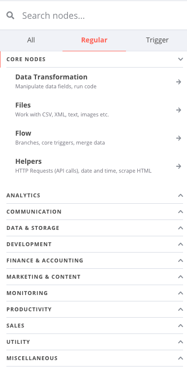
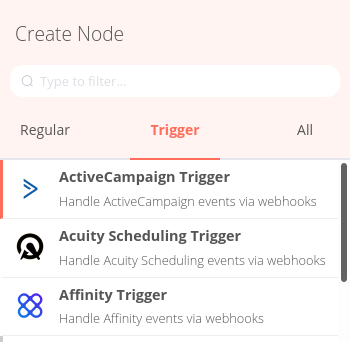
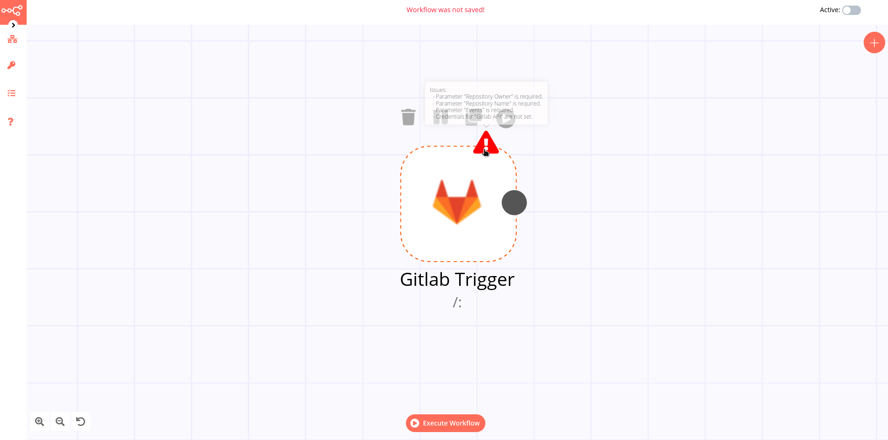

# Node

A [node](../../reference/glossary.md#node) is an entry point for retrieving data, a function to process data, or an exit for sending data. The data process performed by nodes can include filtering, recomposing, and changing data.

There may be one or several nodes for your API, service, or app. By connecting multiple nodes, you can create simple and complex workflows. When you add a node to the Editor UI, the node is automatically activated and requires you to configure it (by adding credentials, selecting operations, writing expressions, etc.).

There are three types of nodes:

* Core Nodes
* Regular Nodes
* Trigger Nodes

## Core nodes

Core nodes are functions or services that can be used to control how workflows are run or to provide generic API support.

Use the Start node when you want to manually trigger the workflow with the `Execute Workflow` button at the bottom of the Editor UI. This way of starting the workflow is useful when creating and testing new workflows.

If an application you need does not have a dedicated Node yet, you can access the data by using the [HTTP Request node](../../nodes/nodes-library/core-nodes/HTTPRequest/README.md) or the [Webhook node](../../nodes/nodes-library/core-nodes/Webhook/README.md). You can also read about [creating nodes](../../nodes/creating-nodes/create-node.md) and make a node for your desired application.

## Regular nodes

Regular nodes perform an action, like fetching data or creating an entry in a calendar. Regular nodes are named for the application they represent and are listed under Regular Nodes in the Editor UI.

### Example

A [Google Sheets node](../../nodes/nodes-library/nodes/GoogleSheets/README.md) can be used to retrieve or write data to a Google Sheet.

## Trigger nodes

[Trigger nodes](../../reference/glossary.md#trigger) start workflows and supply the initial data.

Trigger nodes can be app or core nodes.

* **Core Trigger nodes** start the workflow at a specific time, at a time interval, or on a webhook call. For example, to get all users from a Postgres database every 10 minutes, use the Interval Trigger node with the Postgres node.

* **App Trigger nodes** start the workflow when an event happens in an app. App Trigger nodes are named like the application they represent followed by "Trigger" and are listed under Trigger Nodes in the Editor. For example, a [Telegram trigger node](../../nodes/nodes-library/trigger-nodes/TelegramTrigger/README.md) can be used to trigger a workflow when a message is sent in a Telegram chat.

## Node settings

Nodes come with global **operations** and **settings**, as well as app-specific **parameters** that can be configured.

### Operations

The node operations are illustrated with icons that appear on top of the node when you hover on it:
* **Delete**: Remove the selected node from the workflow
* **Pause**: Deactivate the selected node
* **Copy**: Duplicate the selected node
* **Play**: Run the selected node

To access the node parameters and settings, double-click on the node.

### Parameters

The node parameters allow you to define the operations the node should perform. Find the available parameters of each node in the [node reference](../../nodes/nodes-library/nodes/).

### Settings

The node settings allow you to configure the look and execution of the node. The following options are available:

* **Notes**: Optional note to save with the node
* **Display note in flow**: If active, the note above will be displayed in the workflow as a subtitle
* **Node Color**: The color of the node in the workflow
* **Always Output Data**: If active, the node will return an empty item even if the node returns no data during an initial execution. Be careful setting this on IF nodes, as it could cause an infinite loop.
* **Execute Once**: If active, the node executes only once, with data from the first item it receives.
* **Retry On Fail**: If active, the node tries to execute a failed attempt multiple times until it succeeds
* **Continue On Fail**: If active, the workflow continues even if the execution of the node fails. When this happens, the node passes along input data from previous nodes, so the workflow should account for unexpected output data.

If a node is not correctly configured or is missing some required information, a **warning sign** is displayed on the top right corner of the node. To see what parameters are incorrect, double-click on the node and have a look at fields marked with red and the error message displayed in the respective warning symbol.

