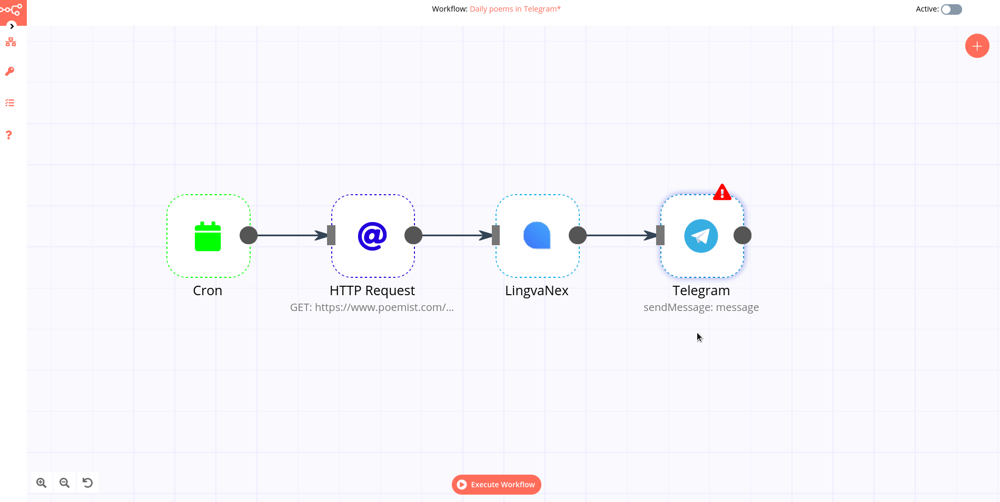
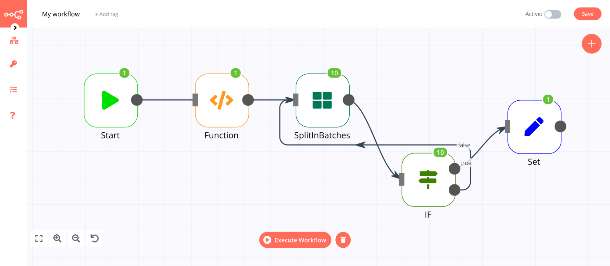

# Key Concepts

To get the most out of n8n's functionalities and build powerful workflows, it's important to understand some basic concepts.

## Expression

An expression is a string of characters and symbols in a programming language that represents a value depending upon its input.
n8n uses [expressions](../nodes/expressions.md) extensively when a node refers to another node for input.



## Item

Data sent from one node to another is sent as an array of JSON objects. Each element in this collection is called an **Item**. A node performs its action on each item of incoming data.

## Function

A function is a block of code designed to perform a certain task. In n8n, you can write custom [JavaScript code snippets](../reference/javascript-code-snippets.md) to add, remove, and update the data you receive from a node.

The [Function](../nodes/nodes-library/core-nodes/Function/README.md) and [Function Item](../nodes/nodes-library/core-nodes/FunctionItem/README.md) nodes are the most powerful in n8n. Both nodes work very similarly, they give you access to the incoming data and you can manipulate it. With these nodes you can implement any function you want using JavaScript code. 

The code of the **Function node** gets executed only once. The node receives the full items (JSON and binary data) as an array and expects an array of items as a return value. The items returned can be totally different from the incoming ones. So it is not only possible to remove and edit existing items, but also to add or return totally new ones.

The code of the **Function Item node** gets executed once for every item. The node receives one item (just the JSON data) at a time as input. As a return value, it expects the JSON data of one single item. That makes it possible to add, remove, and edit JSON properties of items, but it is not possible to add new or remove existing items. Accessing and changing binary data is only possible via the methods `getBinaryData` and `setBinaryData`.

Both the Function node and Function Item node support promises. So instead of returning the item or items directly, it is also possible to return a promise which resolves accordingly.

Here is a comparative overview of the Function and Function Item nodes:

| Data to access          | Function               | FunctionItem     |
| :-------------------------- | :--------------------- | :--------------- |
| JSON data                   | items\[_index_\].json    | item             |
| Binary data                 | items\[_index_\].binary  | getBinaryData()  |


## Data

Data represents units of information that are collected by and transmitted through nodes. For "basic usage" it is not necessarily needed to understand how the data that gets passed from one node to another is structured. However, it becomes important if you want to:

 - Create your own node
 - Write custom expressions
 - Use the Function or Function Item node

### Data Structure

In n8n, all the data that is passed between nodes is an array of objects. It has the following structure:

```json
[
	{
		// Each item has to contain a "json" property. But it can be an empty object like {}.
		// Any kind of JSON data is allowed. So arrays and the data being deeply nested is fine.
		json: { // The actual data n8n operates on (required)
			// This data is only an example it could be any kind of JSON data
			jsonKeyName: 'keyValue',
			anotherJsonKey: {
				lowerLevelJsonKey: 1
			}
		},
		// Binary data of item. The most items in n8n do not contain any (optional)
		binary: {
			// The key-name "binaryKeyName" is only an example. Any kind of key-name is possible.
			binaryKeyName: {
				data: '....', // Base64 encoded binary data (required)
				mimeType: 'image/png', // Optional but should be set if possible (optional)
				fileExtension: 'png', // Optional but should be set if possible (optional)
				fileName: 'example.png', // Optional but should be set if possible (optional)
			}
		}
	},
	...
]
```

### Data Flow

Nodes do not only process one "item", they process multiple ones. 
For example, if the Trello node is set to `Create-Card` and it has an expression set for `Name` to be set depending on `name` property, it will create a card for each item, always choosing the `name-property-value` of the current one.

This data would, for example, create two boards. One named `test1` the other one named `test2`:

```json
[
	{
		name: "test1"
	},
	{
		name: "test2"
	}
]
```

## Loops

[Looping](https://en.wikipedia.org/wiki/Control_flow#Loops) is useful when you need to perform the same action repeatedly over the same, or similar, items.

In n8n this is handled automatically, with nodes processing each input item (data point) independently. For example, if you pass 100 items to an [Airtable](../nodes/nodes-library/nodes/Airtable/README.md) node all 100 will be added to your table, no loop required.

Actions where you would typically use loops, such as [modifying data structure](../reference/javascript-code-snippets.md#modify-data-structure) or [merging data](../nodes/nodes-library/core-nodes/Merge/README.md), do not require explicit loops in n8n.

There are a limited number of nodes and operations where you need to design a loop into your workflow:

* [**Airtable**](../nodes/nodes-library/nodes/Airtable/README.md) node:
	* **List**: This operation executes only once, not for each incoming item.
* [**Coda**](../nodes/nodes-library/nodes/Coda/README.md) node:
	* **Get All**: For the Table and View resources, this operation executes only once.
* [**CrateDB**](../nodes/nodes-library/nodes/crateDb/README.md) node will execute and iterate over all incoming items only for Postgres related functions (e.g. `pgInsert`, `pgUpdate`, `pqQuery`).
* [**Execute Workflow**](../nodes/nodes-library/core-nodes/ExecuteWorkflow/README.md) node executes only once by default.
* [**Function**](../nodes/nodes-library/core-nodes/Function/README.md) node processes all the items based on the entered code snippet, but it gets executed only once. If you need to execute the Function node multiple times you have to create a loop using the [Split In Batches](../nodes/nodes-library/core-nodes/SplitInBatches/README.md) node.
* [**Google Cloud Firestore**](../nodes/nodes-library/nodes/GoogleCloudFirestore/README.md) node:
	* **Get All**: For the Collection and Document resources, this operation executes only once.
* [**HTTP Request**](../nodes/nodes-library/core-nodes/httpRequest/README.md) node: You must handle pagination yourself. If your API call returns paginated results you must create a loop to fetch one page at a time.
* [**Microsoft SQL**](../nodes/nodes-library/nodes/microsoftSql/README.md) node does not natively handle looping, so if you want the node to process all incoming items you must create a loop.
* [**Postgres**](../nodes/nodes-library/nodes/postgres/README.md) node will execute and iterate over all incoming items only for Postgres related functions (e.g. `pgInsert`, `pgUpdate`, `pqQuery`).
* [**QuestDB**](../nodes/nodes-library/nodes/QuestDb/README.md) node will execute and iterate over all incoming items only for Postgres related functions (e.g. `pgInsert`, `pgUpdate`, `pqQuery`).
* [**Read Binary Files**](../nodes/nodes-library/core-nodes/readBinaryFiles/README.md) node will fetch the files from the specified path only once. This node doesn’t execute multiple times based on the incoming data. However, if the path is referenced from the incoming data, the node will fetch the files for all the valid paths.
* [**Redis**](../nodes/nodes-library/nodes/redis/README.md) node:
	* **Info**: This operation executes only once, regardless of the number of items in the incoming data.
* [**Spreadsheet**](../nodes/nodes-library/core-nodes/SpreadsheetFile/README.md) node processes all the incoming data and creates a single file with all the incoming data. If you want to create individual files for each incoming item, you have to create a loop.
* [**TimescaleDB**](../nodes/nodes-library/nodes/TimescaleDb/README.md) node will execute and iterate over all incoming items only for Postgres related functions (e.g. `pgInsert`, `pgUpdate`, `pqQuery`).

::: tip 💡 Keep in mind
Most APIs will have a limit on the number of requests you can make, using loops helps can ensure you don't exceed this limit. See also [Split In Batches](../nodes/nodes-library/core-nodes/SplitInBatches/README.md) node.
:::

### Creating Loops

To add a loop to your n8n workflow, connect the output of one node to the input of a previous node.



**Make sure to include an [IF](../nodes/nodes-library/core-nodes/if/README.md)  node to check for a condition and stop the loop.**

## Error Workflow

For each workflow, an optional Error Workflow can be set in the Workflow Settings. It gets executed if the original execution fails. That makes it possible to, for instance, inform the user via Email or Slack if something goes wrong. The same Error Workflow can be set on multiple workflows.

The only difference between a regular workflow and an Error Workflow is that it contains an Error Trigger node, so it is important to make sure that this node gets created before setting a workflow as Error Workflow.

The Error Trigger node will trigger in case the execution fails and receives information about it. The data looks like this:

```json
[
	{
		"execution": {
			"id": "231",
			"url": "https://n8n.example.com/execution/231",
			"retryOf": "34",
			"error": {
				"message": "Example Error Message",
				"stack": "Stacktrace"
			},
			"lastNodeExecuted": "Node With Error",
			"mode": "manual"
		},
		"workflow": {
			"id": "1",
			"name": "Example Workflow"
		}
	}
]

```

All information is always present except:

- **execution.id**: Only present when the execution gets saved in the database
- **execution.url**: Only present when the execution gets saved in the database
- **execution.retryOf**: Only present when the execution is a retry of a previously failed execution

## Security

By default, n8n can be accessed by everybody. This is okay if you only have it running
locally but if you deploy it on a server which is accessible from the web, you have
to make sure that n8n is protected.

### Basic Auth

Right now we have very basic protection in place using basic-auth. It can be activated
by setting the following environment variables:

```bash
export N8N_BASIC_AUTH_ACTIVE=true
export N8N_BASIC_AUTH_USER=<USER>
export N8N_BASIC_AUTH_PASSWORD=<PASSWORD>
```

### JWT

There is also limited support for JWT based authentication. If enabled, n8n will verify the token with the provided JSON Web Key Set URI. It can be configured through the following environment variables:

```bash
export N8N_JWT_AUTH_ACTIVE=true
export N8N_JWT_AUTH_HEADER=<HEADER>
export N8N_JWKS_URI=<URI>
```
Keep in mind that there is currently no built-in way of passing down the Token in the request, so to use JWT you have to have the token in the request manually.
