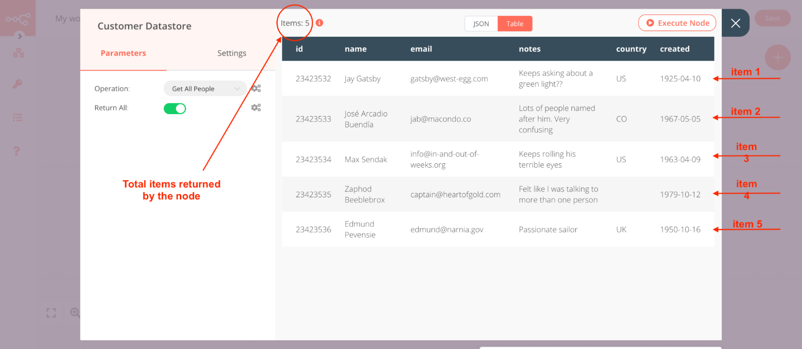
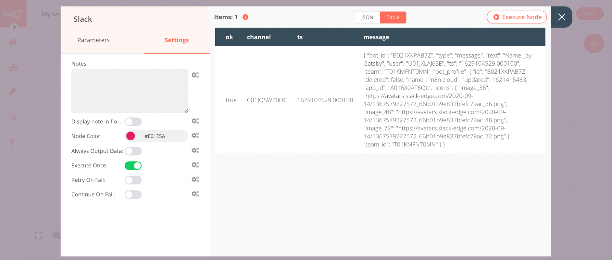
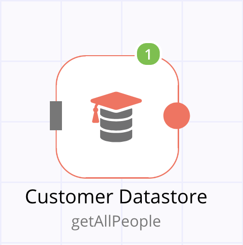
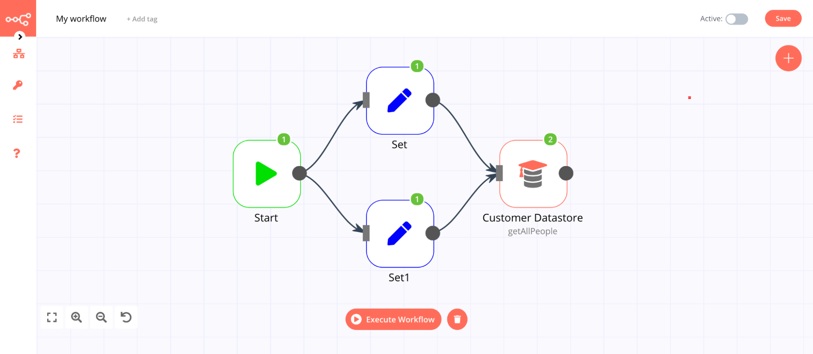
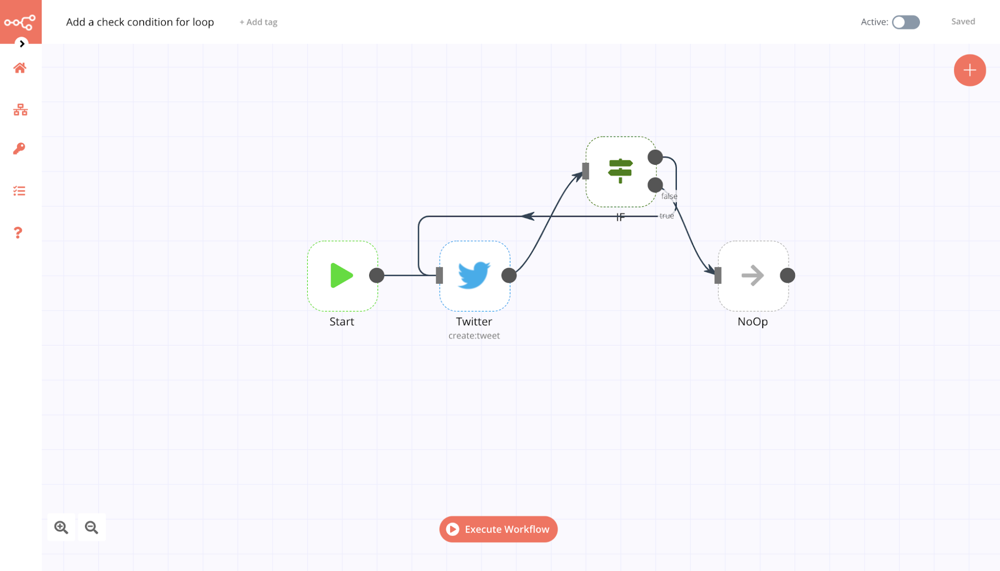

# Looping in n8n

Looping enables you to repeatedly perform the same actions, stopping only after a set number of repetitions (e.g. fetch the 10 most recent items) or when a specific condition is met (e.g. no new items exist).

Looping is useful when you want to process multiple similar items, for example sending a message to every contact in your address book. In n8n this repetitive processing is handled automatically, meaning you do not need to specifically build loops into your workflows. There are some [special cases](#node-exceptions) where this isn’t true.

## Using loops in n8n

n8n nodes take any number of items as input, process these items, and output the results. You can think of each item as a single data point (or a single row in the output table of a node).

The following image shows the output from the [Customer Datastore](../../nodes/nodes-library/nodes/N8nTrainingCustomerDatastore/README.md) node, where each row is an individual item.

**Nodes usually run once for each item**. For example, if you want to send the name and notes of the customers as a message on [Slack](../../nodes/nodes-library/nodes/Slack/README.md), connect the Slack node to the Customer Datastore node, configure the parameters, and execute the node. You will receive 5 messages — one for each item.

This is how you can process multiple items without having to explicitly connect nodes in a loop.

::: tip 💡 Keep in mind
Your data must be in the proper structure for n8n to process it as described here. See [Transforming Data](./transforming-data.md) to learn more.
:::

### Executing nodes once

For situations where you do not want a node to process all received items, for example sending a Slack message only to the first customer, you can do so by toggling the **Execute Once** parameter in the *Settings* tab of that node.

This setting is helpful when the incoming data contains multiple items and you want to only process the first one. Using the [Customer Datastore](../../nodes/nodes-library/nodes/N8nTrainingCustomerDatastore/README.md) and [Slack](../../nodes/nodes-library/nodes/Slack/README.md) example from above, it would look like the following:

You can see a message was sent only for the first customer - Jay Gatsby.

### Executions indicator

When you execute a node a green number gets displayed on its icon. This number represents the number of times the node has executed, it **doesn't** represent the number of items returned by the node. Each execution may return multiple items.

If a node receives input from multiple nodes, it will execute separately for each set of input data. For example, if the above node has two input nodes, it will execute twice, once for each input as pictured below.

**Note**: The only exception to this is the [Merge](../../nodes/nodes-library/core-nodes/Merge/README.md) node.

In the above image, notice that the Customer Datastore node gets executed twice, once for each input. To view the output for each input node, select the execution from the **Data of Execution** dropdown list:

When you have a loop in a workflow, the node gets executed multiple times. The number on the node will represent the total number of executions:

## Creating loops

As discussed above, n8n typically handles the iteration for all incoming items. However, there are certain scenarios where you will have to create a loop to iterate through all items. You can learn more about these [here](#node-exceptions).

To create a loop in an n8n workflow, connect the output of one node to the input of a previous node. Make sure you add an [IF](../../nodes/nodes-library/core-nodes/If/README.md) node to check when to stop the loop. You now have a loop that iterates over each item.

Here is an [example workflow](https://n8n.io/workflows/1130) that implements a loop with an `IF` node:

You should use the [Split In Batches](../../nodes/nodes-library/core-nodes/SplitInBatches/README.md) node when you want to batch the data in groups and process these batches. This approach is useful for avoiding API rate limits when processing large incoming data or when you only want to process a specific group of returned items.

**Note**: The Split In Batches node stops executing after all the incoming items get divided into batches and passed on to the next node in the workflow so it is not necessary to add an IF node to stop the loop.

## Node exceptions

There are a limited number of nodes and operations where you need to design a loop into your workflow:

* [**Airtable**](../../nodes/nodes-library/nodes/Airtable/README.md) node:
	* **List**: This operation executes only once, not for each incoming item.
* [**Coda**](../../nodes/nodes-library/nodes/Coda/README.md) node:
	* **Get All**: For the Table and View resources, this operation executes only once.
* [**CrateDB**](../../nodes/nodes-library/nodes/crateDb/README.md) node will execute and iterate over all incoming items only for Postgres related functions (e.g. `pgInsert`, `pgUpdate`, `pqQuery`).
* [**Execute Workflow**](../../nodes/nodes-library/core-nodes/ExecuteWorkflow/README.md) node executes only once by default.
* [**Function**](../../nodes/nodes-library/core-nodes/Function/README.md) node processes all the items based on the entered code snippet, but it gets executed only once. If you need to execute the Function node multiple times you have to create a loop using the [Split In Batches](../../nodes/nodes-library/core-nodes/SplitInBatches/README.md) node.
* [**Google Cloud Firestore**](../../nodes/nodes-library/nodes/GoogleCloudFirestore/README.md) node:
	* **Get All**: For the Collection and Document resources, this operation executes only once.
* [**Google Drive**](../../nodes/nodes-library/nodes/GoogleDrive/README.md) node:
	* **List**: This operation executes only once, not for each incoming item.
* [**Google Sheets**](../../nodes/nodes-library/nodes/GoogleSheets/README.md) node:
	* **Read**: This operation executes only once for the `Sheet` resource.
	* **Update**: This operation updates multiple rows if they are in the same range. It does not iterate through additional ranges.
* [**HTTP Request**](../../nodes/nodes-library/core-nodes/httpRequest/README.md) node: You must handle pagination yourself. If your API call returns paginated results you must create a loop to fetch one page at a time.
* [**Microsoft SQL**](../../nodes/nodes-library/nodes/microsoftSql/README.md) node does not natively handle looping, so if you want the node to process all incoming items you must create a loop.
* [**Postgres**](../../nodes/nodes-library/nodes/postgres/README.md) node will execute and iterate over all incoming items only for Postgres related functions (e.g. `pgInsert`, `pgUpdate`, `pqQuery`).
* [**QuestDB**](../../nodes/nodes-library/nodes/QuestDb/README.md) node will execute and iterate over all incoming items only for Postgres related functions (e.g. `pgInsert`, `pgUpdate`, `pqQuery`).
* [**Read Binary Files**](../../nodes/nodes-library/core-nodes/readBinaryFiles/README.md) node will fetch the files from the specified path only once. This node doesn’t execute multiple times based on the incoming data. However, if the path is referenced from the incoming data, the node will fetch the files for all the valid paths.
* [**Redis**](../../nodes/nodes-library/nodes/redis/README.md) node:
	* **Info**: This operation executes only once, regardless of the number of items in the incoming data.
* [**RSS**](../../nodes/nodes-library/core-nodes/RSSREAD/README.md) nodes executes only once regardless of the number of items in the incoming data.
* [**Spreadsheet**](../../nodes/nodes-library/core-nodes/SpreadsheetFile/README.md) node processes all the incoming data and creates a single file with all the incoming data. If you want to create individual files for each incoming item, you have to create a loop.
* [**TimescaleDB**](../../nodes/nodes-library/nodes/TimescaleDb/README.md) node will execute and iterate over all incoming items only for Postgres related functions (e.g. `pgInsert`, `pgUpdate`, `pqQuery`).
